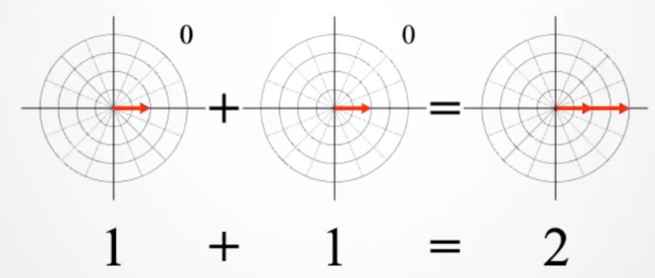
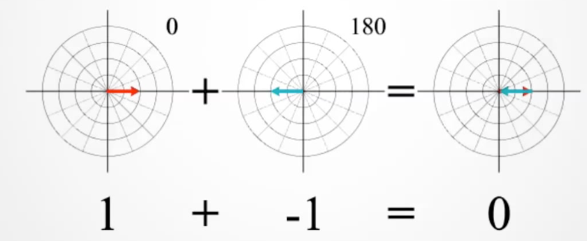
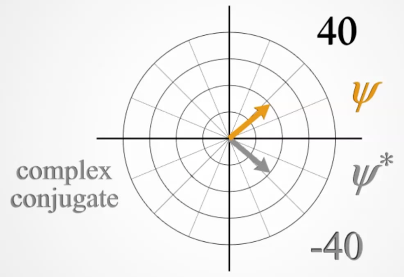
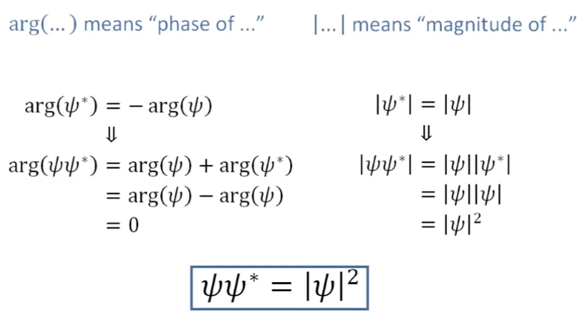
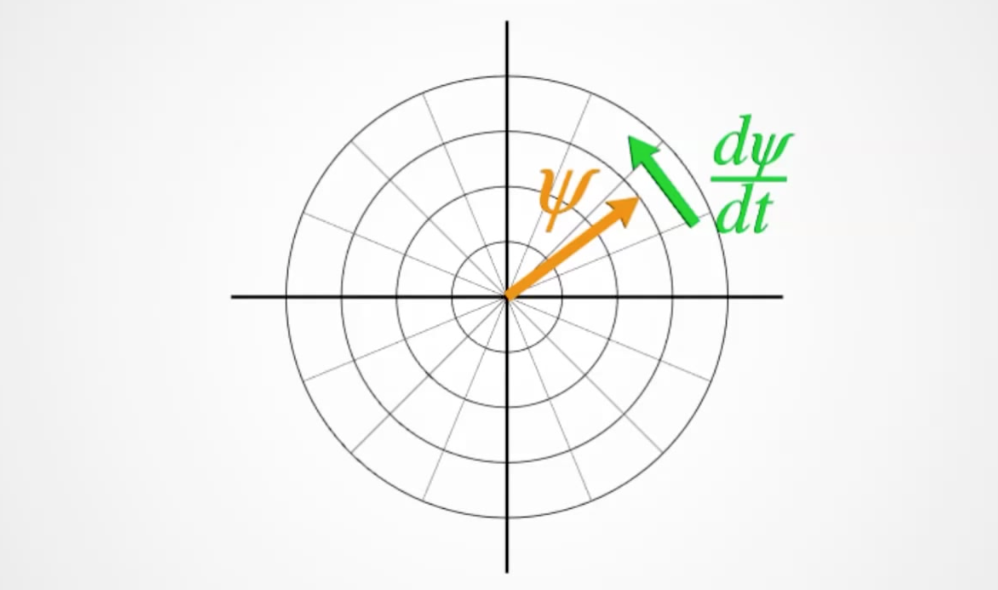
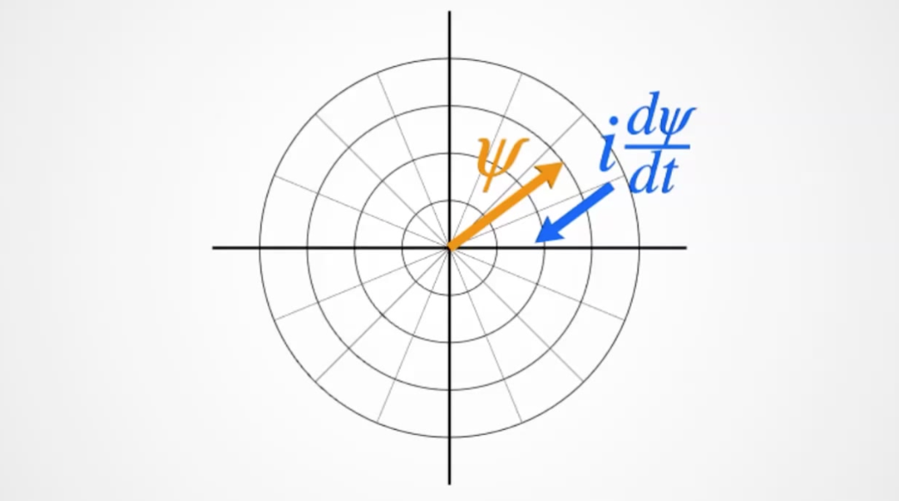
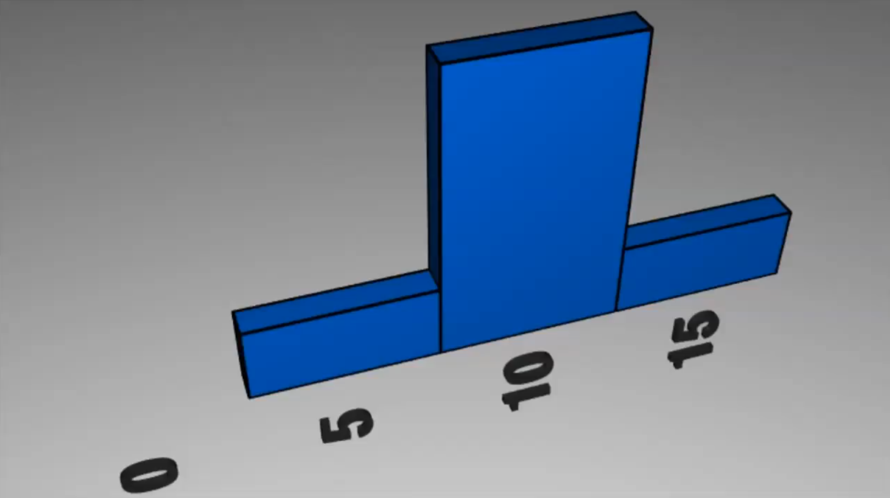
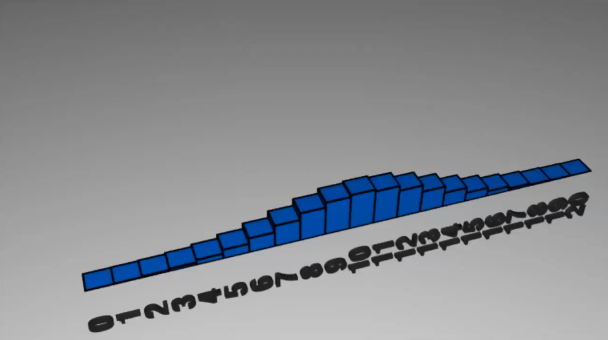
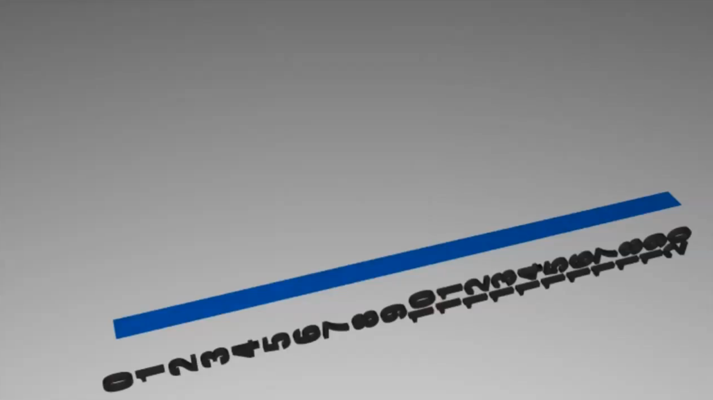

## 1. You can solve the Schrödinger equation

??? abstract
	
	

	<iframe width="560" height="315" src="https://www.youtube.com/embed/Q8XgqV9ReX8" frameborder="0" allow="accelerometer; autoplay; encrypted-media; gyroscope; picture-in-picture" allowfullscreen></iframe>
	

### The basic structure of the equation

$$
\begin{align} i\hbar\frac{d}{dt}\psi&=\frac{\hbar^2}{2m}\nabla^2\psi+V\psi \\ E_{total}&=E_{kinetic}+E_{potential} \end{align}
$$

## 2. Wave functions, Magnitude, and Phase

??? abstract
	
	

	<iframe width="560" height="315" src="https://www.youtube.com/embed/-0UlLSoZh5o" frameborder="0" allow="accelerometer; autoplay; encrypted-media; gyroscope; picture-in-picture" allowfullscreen></iframe>
	

#### Wavefunction

We use $\psi$ to represent the wavefunction which contains both the magnitude of probability and the phase of the wavefunction. 

When we combine wavefunctions, if the phases are aligned, the magnitudes combine constructively

{: style="width: 50%; "class="center"}

If they have opposite phase, the magnitudes combine destructively

{: style="width: 50%; "class="center"}

Since there is no way to represent a $90^\circ$ rotation with real numbers[^1] we need to represent the phase with an imaginary component ($i^2=-1$). Here we set $i=90^\circ$
[^1]:we would need a number that when multiplied by itself would give $-1$

## 3.Complex conjugate, Phase rotation, and Energy

??? abstract
	
	

	<iframe width="560" height="315" src="https://www.youtube.com/embed/N9uPE0kVG10" frameborder="0" allow="accelerometer; autoplay; encrypted-media; gyroscope; picture-in-picture" allowfullscreen></iframe>
	

The **complex conjugate** of an imaginary number has the same real component, but the inverse sign of the imaginary component. e.g. the complex conjugate of $z=x-iy$ is $z=x+iy$.

{: style="width: 50%; "class="center"}

Since $\Psi$ is a complex function, we can extract the real component from it by multiplying it by its conjugate form, which will have the same real component, but the opposite phase, causing the imaginary component to disappear. This is how we can get $\Psi\Psi^*=|\Psi|^2$
If we look a the image above, we are effectively summing the negative and positive phases of the wavefunction together to collapse it into something that we can compute.

{: style="width: 50%; "class="center"}

In $i\hbar\frac{d}{dt}\Psi=\frac{\hbar^2}{2m}\nabla^2\Psi+V\Psi$  we now know that $\frac{d}{dt}\Psi$ refers to the rate of rotation of the phase.

{: style="width: 50%; "class="center"}

And that $i$ rotates the phase of $\Psi$ by $90^\circ$. By multiplying by $\Psi$ we will get a rotation in $rad\cdot s^{-1}$. This is the frequency of the photon.

{: style="width: 50%; "class="center"}

And $\hbar$ is a conversion factor  from $rad\cdot s^{-1}$ (frequency) to  $j$ (energy) using the equation:

* where the derivative of $\psi$ is multiplied by $\psi^*$ to return the real value $Re$
$$
E \sim \hbar\:Re\big(\psi^*i\frac{d\psi}{dt}\big)
$$

## 4. Probability density, Integration, and Units

??? abstract
	
	

	<iframe width="560" height="315" src="https://www.youtube.com/embed/MTSHT5qG8Jw" frameborder="0" allow="accelerometer; autoplay; encrypted-media; gyroscope; picture-in-picture" allowfullscreen></iframe>
	

When dealing with probability, if we simply look at the probability of an event happening, as we increase the precision of our results, we would gradually get to such small probabilities that the values would be meaninglessly small ($\lim\limits_{x\to\infty}$) would result in infinitely small probabilities)

To reconcile this, we can divide the probability at that point by the smallest distance (the width of the bin). scaling the probability by the area that it's in is called the probability density $\frac{\text{probability}}{\text{unit volume}}$ 

| 3 Bins | 20 Bins | >20 Bins|
|:------:|:-------:|:-------:|
| {: style="height:80px;max-width:300px;"} | {: style="height:80px;max-width:300px;"} | {: style="height:80px;max-width:300px;"} |

### Summing to 1

It logically goes that adding up the probability of all of the bins must $=1$:

$$
\sum\limits_xp(x)=1
$$

Through integration (summing over infinitely small bins) we can calculate this as:

Where:

* $A=$ the distinctly small area of space
* $f(A)=$ probability density in $A$

$$
\int_A{dA\:f(A)=1}
$$

### Assumption time

One of the hallmark assumptions of the Copenhagen interpretation is that $\psi^*\psi=|\psi|^2=\frac{1}{m^3}$  of the wavefunction, since realistically we have no way of knowing what this meaningless concept ($\psi$) actually is.

However...

$$
\begin{align}
\psi^*\psi&=\frac{1}{m^3}\\
\psi&=\sqrt{\frac{1}{m^3}}\\
\psi&=\frac{1}{m^\frac{3}{2}}\\
\end{align}
$$

Which are highly illogical units

For $|\psi|^2$ to be a probability density, it must too satisfy $\int_A{dA\:\psi^*_A\psi _A=1}$

## 5. Curvature and the Plane wave solution

??? abstract
	
	

	<iframe width="560" height="315" src="https://www.youtube.com/embed/DRmDl2x0Tr8" frameborder="0" allow="accelerometer; autoplay; encrypted-media; gyroscope; picture-in-picture" allowfullscreen></iframe>
	

Starting with $V=0$ and $m$ is so small that it's negligible, we  get 

$$
i\hbar\frac{d}{dt}\psi=\frac{\hbar^2}{2m}\nabla^2\psi
$$

$\nabla\psi=$ the net curvature $=$ the second derivative of $\psi$

In 3 dimensions, this would be the sum of each dimension

$$
\nabla\psi=\frac{d^2\psi}{dx^2}+\frac{d^2\psi}{dy^2}+\frac{d^2\psi}{dz^2}
$$

### The plane wave solution

Is the only solution that has only one value for momentum, however it depends on the property that its position is spread uniformly across the entirety of the universe...

## 6. Exponential function and Imaginary exponents

??? abstract
	
	

	<iframe width="560" height="315" src="https://www.youtube.com/embed/OSUJDHrHn_s" frameborder="0" allow="accelerometer; autoplay; encrypted-media; gyroscope; picture-in-picture" allowfullscreen></iframe>
	

Summed up:

$$
\psi(x,t)=\exp{\bigg(i\big(kx-\frac{\hbar}{2m}\big)k^2t)\bigg)}
$$

Whenwe set $t$ or $x=0$ we get a further simplification that allows us to use simple basis sets to describe the behaviour of $\psi$:

$$
\psi(x/t)=e^{ikx}
$$

## He never finished his series :(