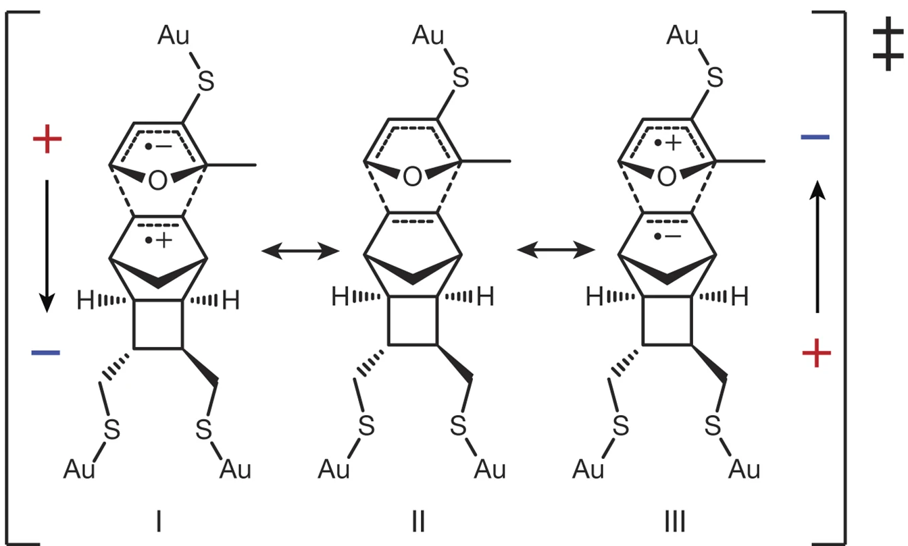
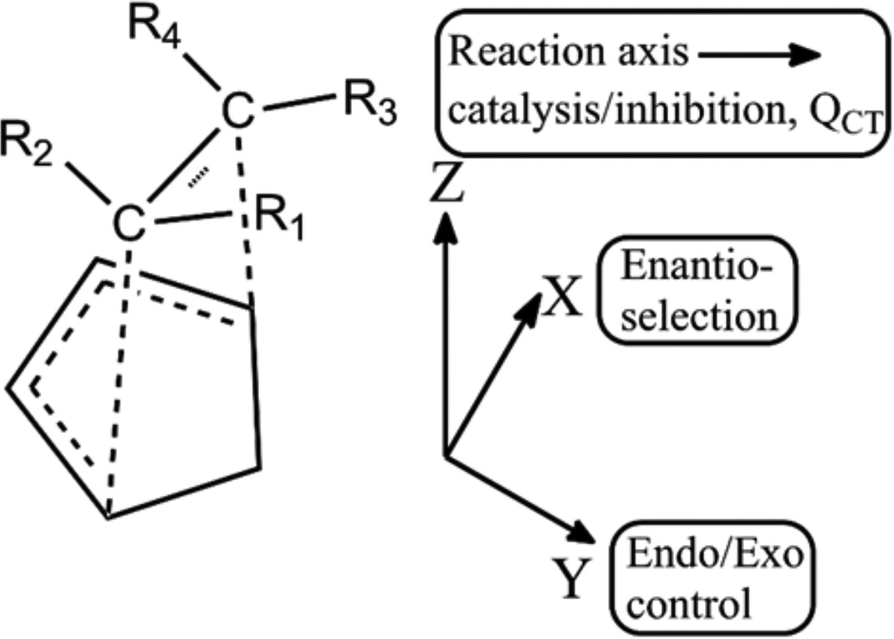
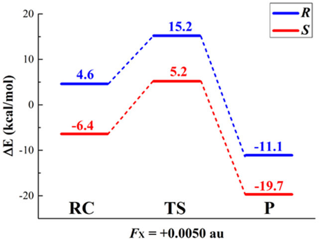

!!! info
	For those of you who prefer a PDF copy of publications, the formatted copy is [:fa-file: here](/Honours%20Thesis/ASnowFinalThesis.pdf)

## Investigating the Catalytic and Stereoselective Effects of Oriented External Electric Fields on the Cyclisation of 2’-Aminochalcone

Supervisors: Prof. Ekaterina Pas and Prof. Michelle Coote

Monash School of Chemistry - November 2021

## Abstract

{: style="width: 50%; "class="center"}

$\newcommand{\va}{V\cdot\AA^{-1}}\newcommand{\eh}{E_h}\newcommand{\dc}{^\circ C}\newcommand{\kcalmol}{Kcal\cdot mol^{-1}}\newcommand{\kjmol}{KJ\cdot mol^{-1}}$Controlling reactivity through means of oriented external electric fields (OEEFs) has grown in interest in the past 30 years, owing to its ability to manipulate the outcome of a reaction without the need for specially designed catalysts. At present, few solvated reactions have been computationally investigated to understand how OEEFs could be used to control stereoselection,  particularly with an intent to guide further experimental research. The intramolecular cyclisation of 2'-aminochalcone to aza-flavanone through an aza-Michael addition is a good candidate for OEEF mediated stereocontrol, and as of yet stereoselective synthesis has not been experimentally accomplished. In this research, the influence of directionality and strength of the OEEF, the choice of solvent and derivatisation were explored using density functional theory to better understand how OEEFs could be used to control the rate and stereoselectivity of the reaction. When solvated in ethanol, a catalytic increase in rate constant by a factor of 3.2 and an enantiomeric excess of 99.9% were found to be achievable in appropriate OEEFs of $|\vec F| = 0.2\:\va$, with derivatisation found to be a probable method for increasing this further. Future research is planned to be carried out, investigating how to solvate the reaction in specially designed solvents in order to ensure that the reactant stays aligned with an appropriately stereoselective OEEF.

# 1. Introduction

## 1.1 Reaction control through oriented external electric fields

Chemical reactivity can be broadly reduced down to the dynamics of electrons; if one can control the electronic environment, one can control the reactivity. This notion has been at the forefront of chemical research for as long as inductive and resonance effects have been utilised to manipulate the strength of bonds. While the understanding that electrons (as negatively charged particles) could be influenced by an Electric Field (EF) has been around for over a century, the idea of utilising these fields to influence reactivity has only been explored in the past 30 years.

The methods to this approach were initially theoretical in nature and experimentally crude, involving the use of ionic clusters and concentrated salt solutions,[^Pocker1970] however, through the use of early *ab initio* techniques, the mechanisms by which 'electrostatic catalysis' could be achieved were able to be more rigorously and precisely investigated. These computational studies in the early 90s sought to understand solvent effects, and more generally the effects of localised EFs on chemical reactions, such as the Friedel-Crafts[^Carbonell1991] reaction in which appropriately placed point charges were found to "dramatically lower" the reaction barrier. Further evidence for the direct influence of electrostatic catalysis came from biology, as the concept that within the binding site of an enzyme, an Internal Electric Field (IEF) generated by charged amino acids within the binding site could effectively be creating a pre-ordered environment that would stabilise the substrate's Transition State (TS).[^Warshel2006]

Through the development of the valence bond (VB) model of chemical reactivity, Sini *et al.*[^Sini1991][^Shaik1981] discovered that all covalent bonds could be stabilised through the introduction of charge-separated resonance contributors. A bond between atoms $\ce{A}$ and $\ce{B}$ could be described by the equation\linebreak $\ce{[A+ B- <-> A-B <-> A- B+]}$, with the specific ratio combinations of these resonance contributors defining how ionic the resulting bond is. In [Equation 1](#eqn:resonatingbonds) this is described in VB notation, as the superposition (linear combination) of the contributing resonance species ($\ce{A-B}$, $\ce{A- B+}$ and $\ce{A+ B-}$), with the amount that each resonance form contributes as a coefficient ($C_1$, $C_2$ and $C_3$). This gives rise to the most stable form of the bond, whose wavefunction ($\Psi_{\ce{A-B}}$) can be polarised by stabilising one of the ionic resonance species over another.

This theoretical formalism laid the groundwork for further computational research into the field, with Shaik *et al.*[^Shaik2004] continuing to explore the effects of external electric fields (EEF). Initially, they created selectivity between competing nonpolar epoxidation and hydroxylation reactions[^Shaik2004] and later, Meir *et al.* identified that an Oriented EEF (OEEF) applied uniformly across all atoms could afford endo/exo selectivity of Diels-Alder reactions by polarising the TS and allowing for the mixing of new charge-transfer states. As shown in [Figure 1.1](#F1.1), this was demonstrated through a model Diels-Alder reaction, where following the concerted cycloaddition, the reaction trajectory was found to be a linear combination of only the mixing of the reactant and product states, resulting in a single transition state. By introducing an electric field that stabilised the polarised Charge Transfer state (CT), a lower energy zwitterionic intermediate would form that reduced the overall barrier of the reaction.[^Stuyver2020] Simply put, the resulting CT state had a much lower energy than the non-polarised TS reducing the barrier of the reaction.

{: style="width: 40%; "class="center"}

<a name="F1.1">Figure 1.1:</a> Valence bond diagrams of a generic Diels-Alder reaction demonstrating (a) the uncatalysed, concerted pathway and (b) the resulting stepwise pathway with reduced barrier as a product of the stabilisation of the charge-transfer state, by the electric field denoted in the centre box. Reproduced from Stuyver *et al.*[^Stuyver2020]

Meir's theoretical exploration was put to the test experimentally by Aragonès *et al.*[^Aragones2016] who used the electric field from a scanning tunnelling microscope (STM) to catalyse a model Diels-Alder cycloaddition. This was accomplished by tethering the dienophile and diene to the STM plate and tip, respectively in such in a way as to align the forming bonds with the STM field direction. The tip and plate were brought into proximity of each other and the difference in potential between the two formed an OEEF which passed through the reaction axis of the cyclisation. As shown in [Figure 1.2](#F1.2), depending on the strength and direction in which the potential bias was applied, based on the VB diagrams in [Figure 1.1](#F1.1) a different polarised TS would be stabilised. In the absence of the field and at low field strengths, the natural polarity of the molecule resulted in species I being the main resonance contributor to the superposition of the TS. The direction of the field could either stabilise or destabilise this resonance form changing the composition of the TS and thus the barrier height of the reaction. At stronger field strengths, species III was also able to be stabilised, and since both resonance contributors became accessible, both field directions were seen to be catalytic. While this research was incredibly valuable as an experimental proof of concept for the progression of the field, being the first practical example of exclusively electrostatic catalysis, the impracticality of having to tether the reactants to align with the field left it unsuitable for any kind of reaction on scale.

{: style="width: 40%; "class="center"}

<a name="F1.2">Figure 1.2:</a> Polarised (I and III) and non-polarised (II) transition states of the model Diels-Alder reaction, used in the STM OEEF catalysis experiments of Aragonès *et al.*[^Aragones2016]

With sufficient experimental evidence and a theoretical understanding of the effect of OEEFs, Shaik *et al.* formalised the "governing effects and rules for electric-field effects on chemical reacivity",[^Shaik2020] here on referenced as the "rules". They are as follows:

<a name="rule:1"><h5>Rule 1)</h5></a>
An EEF that is oriented along a "bond axis" will polarise the bond, favouring one of the ionic species ([Equation 1](#eqn:resonatingbonds)), eventually cleaving it heterolytically. As this polarisation occurs, the bond dipole increases, causing it to interact more strongly with the OEEF, stabilising the species in the process. 

<a name="rule:2"><h5>Rule 2)</h5></a>
Every reaction possesses a "reaction axis" which follows the flow of electrons from reactant to product, through the TS. In the view of an organic chemist, this follows the flow of the "curly arrows".

<a name="rule:3"><h5>Rule 3)</h5></a>
Applying an OEEF along the "reaction axis" will stabilise the TS by increasing the bond ionicity (as per [Rule 1](#rule:1)), and symmetry of the HOMO-LUMO overlap of the transition state allowing, will encourage mixing of the charge-transfer states.

<a name="rule:4"><h5>Rule 4)</h5></a>
A molecule that either possesses a dipole moment or that is polarisable, will experience a torque that will cause it to rotate to align with a sufficiently strong OEEF. This is explored further in [Section 1.2](#sec:solution).

{: style="width: 30%; "class="center"}

<a name="F1.3">Figure 1.3:</a> OEEF direction and the resulting effect on the reaction trajectory for the Diels-Alder cyclisation of an asymmetrical ethene derivative into cyclopentadiene. Reproduced from Wang *et al.*[^Wang2018]

Beyond the four rules laid out by Shaik, electrostatic control of reactions can be extended, to create discrimination between the reaction pathways that form different isomers. Wang *et al.*[^Wang2018] demonstrated this theoretically in an *ab initio* study by using OEEFs to control the product formation of a Diels-Alder cycloaddition of polar, asymmetric ethene derivatives with cyclopentadiene (see [Figure 1.3](#F1.3)). Wang showed that by orienting the OEEF perpendicular to the reaction axis, discrimination could be created between the *endo* and *exo* pathways, or the *R* and *S* pathways, depending on the chosen cardinal direction. In the case of enantioselectivity, this discrimination occurred due to the OEEF in the positive X direction destabilising the *R* transition state and stabilising the *S* transition state causing a $44.4\:\kjmol$ difference at $F_X=+0.25\:\va$ ($F_X$ denoting the X component of the cartesian vector $\vec F$* of the OEEF). When the OEEF was flipped to point in the negative X direction, the selectivity favoured the *R* pathway over the *S* pathway with the same magnitude of separation between the two.

{: style="width: 30%; "class="center"}

<a name="fig:da-sep">Figure 1.4:</a> Resulting \R and \S reaction pathways of the asymmetric Diels-Alder reactions from Wang *et al.*, as perturbed by an OEEF of $F_X=0.005\:\eh$ ($\sim0.26\:\va$)

This enantioselection was the result of the OEEF pushing the electron density from one end of the molecule, through the ethylene bond to the other, depending on the direction of $F_X$. Since the ethene was asymmetric, the more electronegative end of the molecule was more receptive to the electron density than the other, leading to a discrimination between the direction of the polarisation of the ethylene bond and the resulting energy of the *R* and *S* transition states. This discrimination occurred to all species in the reaction trajectory equally and thus had no effect on the barrier heights of the reactions, as shown in [Figure 1.4](#fig:da-sep). Selection occurred through discrimination between the energy of the reactant pre-complexes which could easily break apart and re-form to produce the lowest energy species as per Boltzmann statistics.

Formal rules for OEEF controlled enantioselection are highly dependent on the specifics of the reaction. Therefore general rules cannot be made to characterise their behaviour beyond the non-specific:
<a name="rule:5"><h5>Rule 5)</h5></a>
*'Control over the isomeric products of a reaction will likely come as the result of an OEEF oriented perpendicular to the reaction axis, and will not typically be associated with a net catalytic benefit.'*

## 1.2 Extending the use of OEEFs to solution  

While the STM experiments of Aragonès *et al.*[^Aragones2016] were conveniently able to fix the reactants in the correct orientation to ensure that the OEEF passed through the reaction axis, reactions typically occur in solution making the adoption of the required geometry in relation to an OEEF far more challenging. Following [Rule 4](#rule:4), however, when allowed to rotate freely the reactant will align itself with the OEEF according to its dipole moment.[^Shaik2020][^Xu2020] The amount of  stabilising energy that is obtained from the OEEF can be quantified through the relationship $\Delta E=20.7\vec F\cdot\vec\mu\:\kjmol)$, where $\vec F$ is the EF strength (in $\va$) and $\vec\mu$ is the dipole moment (in Debye). The constant 20.7 is a unit conversion factor from $J$ to $\kjmol$. If the OEEF strength, or the magnitude of the dipole moment is strong enough, the stabilisation energy can overcome the rotational kinetic energy of the molecule, preventing it from freely rotating.[^Shaik2020][^Wang2019] If, however the electric field is too strong, the corresponding ionic species ([Equation 1](#eqn:resonatingbonds)) of bonds within the molecule will be stabilised more than the covalent forms, causing the molecule to be cleaved as per [Rule 1](#rule:1).[^Shaik2020][^Xu2020]

This ability for a solvent  as a bulk medium to stabilise the separation of charges within its continuum is quantified as its dielectric constant (relative permittivity), which is a relative measure of its ability to reduce electrostatic forces over a distance. It is generally considered to be a function of the solvent molecule's dipole, charge, polarisability, and bulk structure.[^atkins2014] As the polarisation of solutes from an OEEF is inherently a process that increases the magnitude of opposing charges across a distance (a dipole), the ability of the solvent to stabilise this charge separation is fundamental to the stabilisation of the polarised solute. Solvents with a large dielectric constant will better stabilise highly polarised species than those with small dielectric constants, making them more susceptible to the OEEF's perturbation. This separation of charges is accomplished by the solvent molecules rearranging themselves to align in a way to form an internal electric field that cancels out the field produced by the charged solute, minimising the energy of the system. This process is not specifically limited to the stabilising solute, however, and the solvent molecules will also produce an IEF that will oppose out an EEF.[^Xu2020] As a result, a trade-off must be made to choose a solvent which will maximise stabilisation and solubility of the polarised species, while minimising screening of the OEEF.[^Ciampi2018]

## 1.3 The cyclisation of 2'-aminochalcone

The cyclisation of 2'-aminochalcone (**1**) to form aza-flavanone (**4**) is a simple example of an intramolecular aza-Michael conjugate addition in which the nucleophilic lone pair electrons from the nitrogen attack the adjacent $\alpha,\beta$-unsaturated ketone at the electrophilic $\ce{C_\beta}$, pushing the electrons up the conjugated system and onto the receptive ketone oxygen. If an appropriate electrophile is present in solution, such as a free proton, the electron density can flow back down from the oxygen, allowing the addition of the electrophile into $\ce{C_\alpha}$. This cyclisation creates a new stereocentre at $\ce{C_\beta}$, which under standard conditions will form as a racemic mixture of the two stereoisomers, as shown in [Scheme 1](#schm:na).

{: style="width: 80%; "class="center"}

<a name="schm:na">Scheme 1:</a> Uncatalysed pathway for the aza-Michael addition of 2'-aminochalcone to form aza-flavanone.

The historical method for performing this reaction is to combine **1** in varying ratios of hot glacial acetic acid and phosphoric acid for 20 minutes, which produces yields of up to 78%. [^Tokes1989] Through the push to greenify the reaction, Lewis base catalysts were identified as the gold standard, with 2.7 mol% piperidine/$\ce{KOH}$ affording >99%  yield in 5 minutes at room temperature, using water as a solvent.[^Zheng2013]

While the non-enantioselective reaction has been thoroughly optimised, in order to select for a particular stereoisomer, the reaction requires the use of chiral acids and harsh solvents. Once such example from Saito *et al.*[^Saito2015] produces racemic **4** bound to a BINOL derived chiral phosphoric acid, which can be subsequently separated using column chromatography to give a 93% enantiomeric excess from a 95% yield. While this method of enantioselection is incredibly inefficient (as fundamentally, half of the product can be considered waste), it also requires the use of 1:1 benzene:*n*-hexane as solvent. This significantly restricts the industrial capabilities of this method, due to its highly hazardous nature.[^Chem21]

## 1.4 Theoretical methodology of reaction rates 

The Potential Energy Surface (PES) can be considered an *n*-dimensional plane, with each dimension representing a degree of freedom of the molecule, and the potential energy of the molecule represented as the surface's topology, as demonstrated in [Figure 1.5](#fig:pes). Any stable configuration of the system will therefore reside in an energetic minimum on the PES, and the extent that the system emerges out of the well will be determined by its kinetic energy. For any chemical system to move from one minimum on the PES (configuration of atoms) to another, it will traverse the PES along the along the lowest energy pathway, as afforded by the kinetic energy of the system.

{: style="width: 30%; "class="center"}

<a name="fig:pes">Figure 1.5:</a> Example potential energy surface of hypothetical molecule $\ce{A-B-C}$, displaying the degrees of freedom of the length of bonds $\ce{A-B}$ and $\ce{B-C}$ on the X and Z axes, with energy being displayed on the Y axis, reproduced from Cramer.[^Cramer2004]

Transition State Theory (TST) and the Eyring-Polanyi equation use the PES model to make the assumption that a reaction will go from one minimum to another across a "saddle point", where all degrees of freedom except for one are at an energetic minimum. Statistical mechanics defines that configurations that a system adopts can be described as a Boltzmann population distribution, and that this distribution is based on the potential energy of each respective configuration. TST follows the logic that the reactants and the TS will be in equilibrium with each other, and that the rate at which a reaction occurs will be directly proportional to the relative energy difference between the reactant and transition state; *i.e.* the barrier height. This is shown in the basic form of the Eyring-Polanyi equation, [Equation 2](#eqn:e-p).[^atkins2014][^Cramer2004] The rate constant of a reaction pertaining to the system moving between two minima without an energetic barrier can be described by the relationship [Equation 3](#3eqn:e-p-barrierless).[^atkins2014][^Cramer2004] Since TST assumes that an equilibrium is reached between the reactant and transition state of a single step, the theory cannot faithfully account for multi-step reactions, where intermediates are often short-lived, and equilibrium will not be reached. Rate constants for multi step reactions can be approximated as the product of rate constants for each individual step.

$$
\begin{align}
k^\ddagger&=\bigg(\frac{k_b T}{h}\bigg)\exp\bigg({\frac{-\Delta H ^{\circ\ddagger}}{RT}}\bigg)\label{eqn:e-p}\tag{2}\\
k&=\exp\bigg(\frac{-\Delta H^\circ}{RT}\bigg)\label{eqn:e-p-barrierless}\tag{3}
\end{align}
$$

TST is a convenient method in that it is computationally simple to calculate the potential energy of a system, however it is not guaranteed that the maximum on the $\Delta E$ PES will result in a maximum on the $\Delta G^\circ$ 'free energy surface' of the system, and thus the barrier may in fact be higher than TST would predict. It also assumes that any reactant species will only cross the barrier a single time to reach the product. Variational Transition State Theory (VTST) reduces these issues by taking the the Eyring-Polanyi equation ([Equation 2](#eqn:e-p)), and using the maximum energy from the 'Gibbs free energy surface' of the reaction coordinate ($\Delta G^{\circ\ddagger}$) in place of the potential energy barrier ($\Delta H^{\circ\ddagger}$) to provide a more accurate depiction of the reaction rate constant.

The approximations made by TST and VTST are effective at describing the rate of reactions that are thermally activated, as their Boltzmann population distribution will largely consist of high energy species that are capable of traversing the activation barrier. At lower temperatures, and with lighter elements, however, the effects of quantum tunnelling can start to predominate.[^Cramer2004] In this context, quantum tunnelling can be described as the ability for the reactants to pass *through* the reaction barrier rather than crossing over it. It is a fundamentally quantum phenomenon, whose probability will be dependent on the height and cross-sectional shape of the barrier, as well as the mass of the particles and the temperature of the system. Tunnelling is significantly more likely to happen for proton transfers, where the tunnelling particle has a wavelength comparable to the relatively narrow barrier width. The Eyring-Polanyi equation can be modified to account for this, with the addition of the transmission coefficient term ($\kappa_{(T)}$), as can be seen in the VTST example in [Equation 4](#eqn:e-p-k).

$$
\begin{align}
k^\ddagger&=\bigg(\kappa_{(T)}\frac{k_b T}{h}\bigg)\exp\bigg({\frac{-\Delta G ^{\circ\ddagger}}{RT}}\bigg)\label{eqn:e-p-k}\tag{4}
\end{align}
$$

While multiple approximations have been made to quantify this phenomena, the Skodje-Truhlar tunnelling coefficient approximation[^Skodje1981] is considered to be one of the most accurate, for its relative accessibility[^Sherer2003] and lack of extra computation required. At its core, it considers three terms; the imaginary component of the frequency pertaining to the reaction coordinate ($\text{Im}(\nu^\ddagger)$), the activation energy ($V^\ddagger$ as $(\Delta E + ZPVE)^\ddagger$ ), and the symmetry of the barrier ($V$ as  $\max\big([(\Delta E+ZPVE)_{prod}-(\Delta E+ZPVE)_{reac}], 0\big)$). All of these components can be conveniently obtained from the same thermodynamic corrections that are used to calculate $k^\ddagger$ from the TST and VTST approaches and the transmission coefficient can be calculated using [Equation 5](#eqn:STT).

$$
\begin{align}\tag{5}
\begin{split}
\kappa_{(T)}&=\left\{\begin{matrix}
\frac{\beta}{\beta-\alpha}\bigg[\exp\bigg((\beta-\alpha)(\Delta V^\ddagger-V)\bigg)-1\bigg] & ,\hspace{20pt}\alpha\leq\beta \\ 
\frac{\beta\pi/\alpha}{\sin(\beta\pi/\alpha)}-\frac{\beta}{\beta-\alpha}\exp\bigg((\beta-\alpha)(\Delta V^\ddagger-V)\bigg) &, \hspace{20pt}\alpha\geq\beta\\
\end{matrix}\right.\\
&\hspace{50pt}\alpha=\frac{2\pi}{h\text{Im}(\nu^\ddagger)}\hspace{40pt}\beta=\frac{1}{k_BT}
\end{split}\label{eqn:STT}
\end{align}
$$

## 1.5 Computational chemistry

Computational chemistry is the application of fundamental physical and mathematical methods to solve chemical problems, utilising computational resources to calculate the otherwise prohibitively complicated equations involved.

One such physical theory used by computational chemists is Quantum Mechanics (QM), which aims to solve the time independent Schrödinger equation ($\hat H\Psi=E\Psi$) in order to better understand the nature of the chemical system. *Ab initio* methods accomplish this by optimising a linear combination of primitive gaussian functions, representing the electrons in the system, to form its wavefunction ($\Psi$). This can then be used with an appropriate hamiltonian ($\hat H$) to determine the overall energy of the system ($E$). The optimisation of the wavefunction is an iterative process in which each electron's representative functions are optimised against the "mean field" of the electrostatic contributions of all other electrons in the system, until the solution reaches the specified convergence criteria. This mean field approach accounts for 99% of the system's energy, however it neglects to account for the dynamic interactions between electrons, (electron correlation). Since the nature of chemical reactivity is the dynamic movement of electrons, this 1% error has the most influence on the energy of the reaction itself. When higher levels of theory are made to mitigate this issue, these calculations can be highly accurate, however scale in computational cost much more rapidly with the size of the chemical system.[^Cramer2004]

Rather than optimising the wavefunction directly, Density Functional Theory (DFT) optimises the electron density of the system to determine its energy. This approach scales far more favourably and more explicitly accounts for the correlation energy than more affordable *ab initio* methods. The nature of DFT, however,  means that the solutions that emerge are fundamentally based on parameterisation and approximation, as no universal relationship between the electron density and the energy is known. Therefore, DFT methods are only as accurate as the approximations that the methods utilise.[^Cramer2004] It can be said that DFT solves approximate forms of the Schrödinger equation exactly, whereas *ab initio* methods solve the exact form of the Schrödinger equation approximately.

### 1.5.1 Thermodynamic corrections to the internal energy
While *ab initio* and DFT approaches are fundamentally tools that calculate the electronic energy of a molecule, for the output energies to be chemically meaningful in a real world context, it is required to calculate the thermodynamic properties of the system. This is accomplished by taking a starting geometry and measuring the gradient of the PES, either analytically, or by finite differences; perturbing every degree of freedom (DoF) and measuring the resultant energy. Since the first derivative of the PES gives the forces involved for every DoF, these differences can be converted into vibrational frequencies using the harmonic oscillator approximation for larger frequencies, and their sum used to calculate the zero point vibrational energy (ZPVE) as shown in [Equation 6](#eqn:zpve). This matrix of gradients is known as the Hessian. To determine the internal energy of the system, the ZPVE is added on to the electronic energy, with thermal corrections to the vibrational, rotational and translational energy, for DoF that become accessible at temperatures above $0K$ ([Equation 7](#eqn:internal)).

$$
\begin{align}
E_{ZPVE}&=\frac{1}{2}\sum_ih\nu_i\label{eqn:zpve}\tag{6}\\
\Delta U^\circ&=E^\circ + E_{ZPVE}+E_{vib}+E_{trans}+E_{rot}\label{eqn:internal}\tag{7}\\
\Delta H^\circ &=\Delta U^\circ + nRT\label{eqn:enthalpy}\tag{8}
\\\\
\Delta G^\circ &=\Delta H^\circ-T\Delta S\label{eqn:gibbs}\tag{9}\\
\Delta S&=\Delta S_{trans}+\Delta S_{rot}+\Delta S_{vib}\label{eqn:entropy}\tag{10}
\end{align}
$$

Assuming 1 mole of the system in question, the standard definition of $\Delta H^\circ =\Delta U^\circ +PV$ can be used, along with the statistical mechanical relationship $PV=nRT$ to give [Equation 8](#eqn:enthalpy), providing the enthalpy of the system. To obtain the Gibbs free energy of the system, as per [Equation 9](#eqn:gibbs), the entropy must be calculated, as the sum of rotational, vibrational, and translational entropic terms, as per [Equation 10](#eqn:entropy). These are calculated using standard thermodynamics of an ideal gas, under the rigid rotor and harmonic oscillator approximations.[^atkins2014][^Cramer2004]

### 1.5.2 Continuum solvation models

Solvation approaches in computational chemistry can be broken down into two broad categories; implicit, and explicit solvation. Explicit solvation involves modelling the bulk by explicitly placing solvent molecules around the solute, and including them as a part of the calculation. Since the scaling of QM calculations is exponential with the number of basis functions, explicit solvation methods are typically considered too expensive to be practically usable for the vast majority of systems.

Implicit solvation models take a different approach and treat the solvent as a continuum, based on its bulk properties. The most common of these is the Conductor like Polarisable Continuum Model[^CPCM] (CPCM) which, based on the size of the solvent molecule, places the solute in a cavity within the bulk and treats the surface of the cavity as a pure conductor ($\varepsilon = \infty$). Using the specified dielectric constant of the solvent, it then scales back the screening to more appropriately represent the permittivity of the solvent and subsequently allows the solute to be polarised. Through this process, the CPCM method breaks down the solvation free energy into the energy required to form the solvation cavity, the electrostatic stabilisation afforded by the charge screening process, and the energy associated with the change in dispersion within the bulk solvent.[^CPCM-ORCA] While the conductor scaling approach is an effective method for modelling high dielectric solvents such as water, it is less effective for low dielectric solvents, such as *n*-hexane.[^SMD]

An extension to the CPCM model is that of the Solvent Model based on Density (SMD), which takes the electrostatic term from CPCM and calculates a new cavity-dispersion solvent-structure (CDS) term based on the charge density of the solute to account for the rest of the solvation free energy. It calculates the CDS term as the sum of short-range interactions between the solute and the first solvation shell, and as such uses extra parameters for the bulk surface tension, hydrogen bonding acidity and basicity, aromaticity and halogenicity.[^SMD] When the system being studied is similar to the training data set which was used to parameterise the SMD model (as is the case for common organic reactions in conventional solvents), it can be considered a significant improvement over CPCM.

## 1.6 Research objectives

Following the work of Shaik *et al.*,[^Shaik2020] this project aims to use computational chemistry to investigate the cyclisation of 2'-aminochalcone to form aza-flavanone under the influence of OEEFs. The ultimate goal of this research is to both identify whether the reaction is suitable for studying under the effects of OEEFs, and to act as a "theoretical roadmap" to make better educated decisions for future theoretical and experimental studies into the effects of OEEFs on this reaction. 

The cyclisation of 2'-aminochalcone to form aza-flavanone was chosen as the subject of this study for a number of reasons. Firstly, the synthesis of the reactant is a simple process and can be performed using off-the-shelf reagents. Secondly, due to the change in conjugation that occurs from the **1** $\to$ **2** $\to$ **3**, the kinetics of the reaction can be easily monitored using UV-Vis spectrometry, or NMR spectroscopy. Thirdly, since the reaction is unimolecular, there are fewer factors that can influence its kinetics. This particular point is quite important when considering that the rate of intermolecular reactions would also be influenced by OEEF-induced diffusion through the solvent, and that having multiple constituents within a reaction would make aligning them with the OEEF significantly more difficult. Finally (and most importantly), the reaction forms a new chiral centre without any pre-existing chirality present in the reagents, making stereoselection significantly more impressive as a feat.

As a part of this theoretical roadmap, this research aims to:

* Understand the catalytic processes involved in performing the reaction and identify the most appropriate pathway for studying the reaction under the influence of an OEEF.
* Identify how the reaction can be controlled using OEEFs to produce both catalysis and enantioselection, to quantify these effects, and to understand their mechanistic processes.
* Investigate how this OEEF mediated reaction control could be influenced by the addition of localised electric fields, through charged functionality.

[^Pocker1970]: Pocker, Y.; Buchholz, R. F. Electrostatic Catalysis of Ionic Aggregates. I. Ionization and Dissociation of Trityl Chloride and Hydrogen Chloride in Lithium Perchlorate-Diethyl Ether Solutions. *J. Am. Chem. Soc.* **1970**, *92* (7), 2075–2084. https://doi.org/10.1021/ja00710a047.
[^Carbonell1991]: Carbonell, E.; Duran, M.; Lledos, A.; Bertran, J. Catalysis of Friedel-Crafts Reactions by Electric Fields. J. Phys. Chem. 1991, 95 (1), 179–183. https://doi.org/10.1021/j100154a036.
[^Warshel2006]: Warshel, A.; Sharma, P. K.; Kato, M.; Xiang, Y.; Liu, H.; Olsson, M. H. M. Electrostatic Basis for Enzyme Catalysis. Chem. Rev. 2006, 106 (8), 3210–3235. https://doi.org/10.1021/cr0503106.
[^Sini1991]: Sini, G.; Maitre, P.; Hiberty, P. C.; Shaik, S. S. Covalent, Ionic and Resonating Single Bonds. *J. Mol. Struct.*  **1991**, *229*, 163–188. https://doi.org/10.1016/0166-1280(91)90144-9.
[^Shaik1981]: Shaik, S. S. What Happens to Molecules as They React? A Valence Bond Approach to Reactivity. *J. Am. Chem. Soc.* **1981**, *103* (13), 3692–3701. https://doi.org/10.1021/ja00403a014.
[^Shaik2004]: Shaik, S.; de Visser, S. P.; Kumar, D. External Electric Field Will Control the Selectivity of Enzymatic-Like Bond Activations. *J. Am. Chem. Soc.* **2004**, *126* (37), 11746–11749. https://doi.org/10.1021/ja047432k.
[^Meir2010]: Meir, R.; Chen, H.; Lai, W.; Shaik, S. Oriented Electric Fields Accelerate Diels–Alder Reactions and Control the Endo/Exo Selectivity. *ChemPhysChem* **2010**, *11* (1), 301–310. https://doi.org/https://doi.org/10.1002/cphc.200900848.
[^Stuyver2020]: Stuyver, T.; Danovich, D.; Joy, J.; Shaik, S. External Electric Field Effects on Chemical Structure and Reactivity. *Wiley Interdiscip. Rev. Comput. Mol. Sci.* **2020**, *10* (2), 1–22. https://doi.org/10.1002/wcms.1438.
[^Aragones2016]: Aragonès, A. C.; Haworth, N. L.; Darwish, N.; Ciampi, S.; Bloomfield, N. J.; Wallace, G. G.; Diez-Perez, I.; Coote, M. L. Electrostatic Catalysis of a Diels–Alder Reaction. *Nature* **2016**, *531* (7592), 88–91. https://doi.org/10.1038/nature16989.
[^Shaik2020]: Shaik, S.; Danovich, D.; Joy, J.; Wang, Z.; Stuyver, T. Electric-Field Mediated Chemistry: Uncovering and Exploiting the Potential of (Oriented) Electric Fields to Exert Chemical Catalysis and Reaction Control. *J. Am. Chem. Soc.* **2020**, *142* (29), 12551–12562. https://doi.org/10.1021/jacs.0c05128.
[^Wang2018]: Wang, Z.; Danovich, D.; Ramanan, R.; Shaik, S. Oriented-External Electric Fields Create Absolute Enantioselectivity in Diels-Alder Reactions: Importance of the Molecular Dipole Moment. *J. Am. Chem. Soc.* **2018**, *140* (41), 13350–13359. https://doi.org/10.1021/jacs.8b08233.
[^Xu2020]: Xu, L.; Izgorodina, E. I.; Coote, M. L. Ordered Solvents and Ionic Liquids Can Be Harnessed for Electrostatic Catalysis. *J. Am. Chem. Soc.* **2020**, *142* (29), 12826–12833. https://doi.org/10.1021/jacs.0c05643.
[^Wang2019]: Wang, C.; Danovich, D.; Chen, H.; Shaik, S. Oriented External Electric Fields: Tweezers and Catalysts for Reactivity in Halogen-Bond Complexes. *J. Am. Chem. Soc.* **2019**, *141* (17), 7122–7136. https://doi.org/10.1021/jacs.9b02174.
[^atkins2014]: Atkins, P.; de Paula, J. *Atkins’ Physical Chemistry*, 10th ed.; Oxford University Press: Oxford, United Kingdom, 2014.
[^Ciampi2018]: Ciampi, S.; Darwish, N.; Aitken, H. M.; Díez-Pérez, I.; Coote, M. L. Harnessing Electrostatic Catalysis in Single Molecule, Electrochemical and Chemical Systems: A Rapidly Growing Experimental Tool Box. *Chem. Soc. Rev.* **2018**, *47* (14), 5146–5164. https://doi.org/10.1039/C8CS00352A.
[^Tokes1989]: Totildekés, A. L.; Janzsó, G. Reactions of 2′-Aminochalcone. *Synth. Commun.* **1989**, *19* (18), 3159–3168. https://doi.org/10.1080/00397918908052715.
[^Zheng2013]: Zheng, X.; Jiang, H.; Xie, J.; Yin, Z.; Zhang, H. Highly Efficient and Green Synthesis of Flavanones and Tetrahydroquinolones. *Synth. Commun.* **2013**, *43* (7), 1023–1029. https://doi.org/10.1080/00397911.2011.621096.
[^Saito2015]: Saito, K.; Moriya, Y.; Akiyama, T. Chiral Phosphoric Acid Catalyzed Asymmetric Synthesis of 2-Substituted 2,3-Dihydro-4-Quinolones by a Protecting-Group-Free Approach. *Org. Lett.* **2015**, *17* (13), 3202–3205. https://doi.org/10.1021/acs.orglett.5b01654.
[^Chem21]: Prat, D.; Wells, A.; Hayler, J.; Sneddon, H.; McElroy, C. R.; Abou-Shehada, S.; Dunn, P. J. CHEM21 Selection Guide of Classical- and Less Classical-Solvents. *Green Chem.* **2016**, *18* (1), 288–296. https://doi.org/10.1039/C5GC01008J.
[^Cramer2004]: Cramer, C. J. *Essentials of Computational Chemistry : Theories and Models*, 2nd ed.; John Wiley & Sons Ltd: West Sussex, England, 2004.
[^Skodje1981]: Skodje, R. T.; Truhlar, D. G. Parabolic Tunneling Calculations. *J. Phys. Chem.* **1981**, *85* (6), 624–628. https://doi.org/10.1021/j150606a003.
[^Sherer2003]: Sherer, E. C.; Cramer, C. J. Quantum Chemical Characterization of Methane Metathesis in L 2 MCH 3 (L = H, Cl, Cp, Cp*; M = Sc, Y, Lu). *Organometallics* **2003**, *22* (8), 1682–1689. https://doi.org/10.1021/om0209632.
[^CPCM]: Klamt, A.; Schüürmann, G. COSMO: A New Approach to Dielectric Screening in Solvents with Explicit Expressions for the Screening Energy and Its Gradient. *J. Chem. Soc., Perkin Trans. 2* **1993**, No. 5, 799–805. https://doi.org/10.1039/P29930000799.
[^CPCM-ORCA]: Garcia‐Ratés, M.; Neese, F. Effect of the Solute Cavity on the Solvation Energy and Its Derivatives within the Framework of the Gaussian Charge Scheme. *J. Comput. Chem.* **2020**, *41* (9), 922–939. https://doi.org/10.1002/jcc.26139.
[^SMD]: Marenich, A. V.; Cramer, C. J.; Truhlar, D. G. Universal Solvation Model Based on Solute Electron Density and on a Continuum Model of the Solvent Defined by the Bulk Dielectric Constant and Atomic Surface Tensions. *J. Phys. Chem. B* **2009**, *113* (18), 6378–6396. https://doi.org/10.1021/jp810292n.
