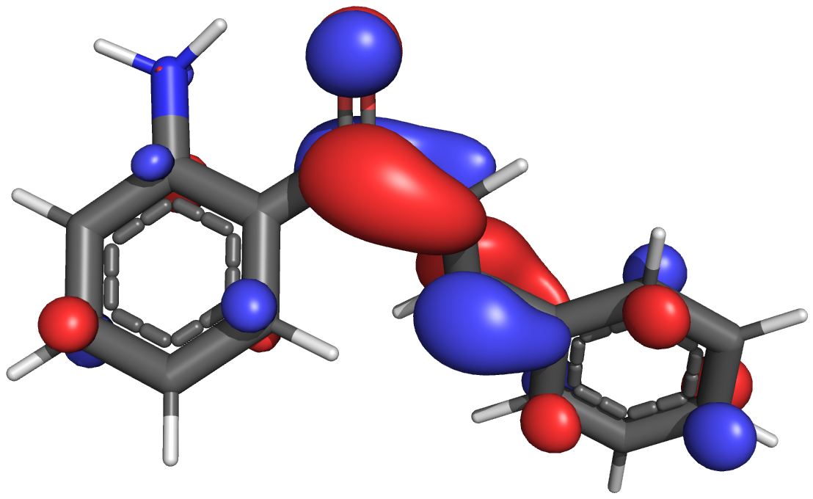
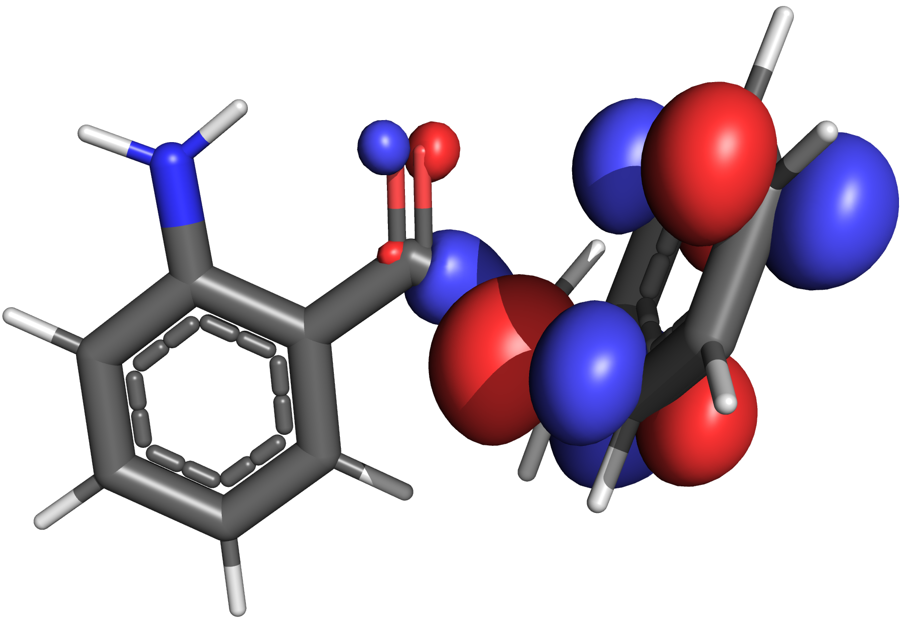
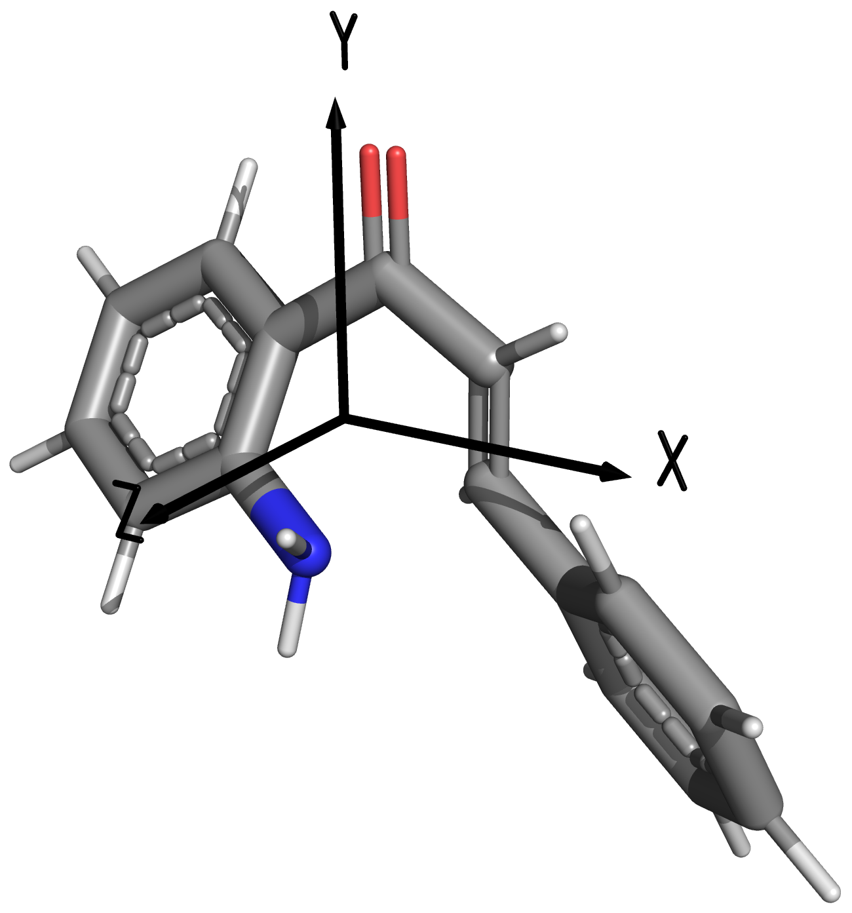
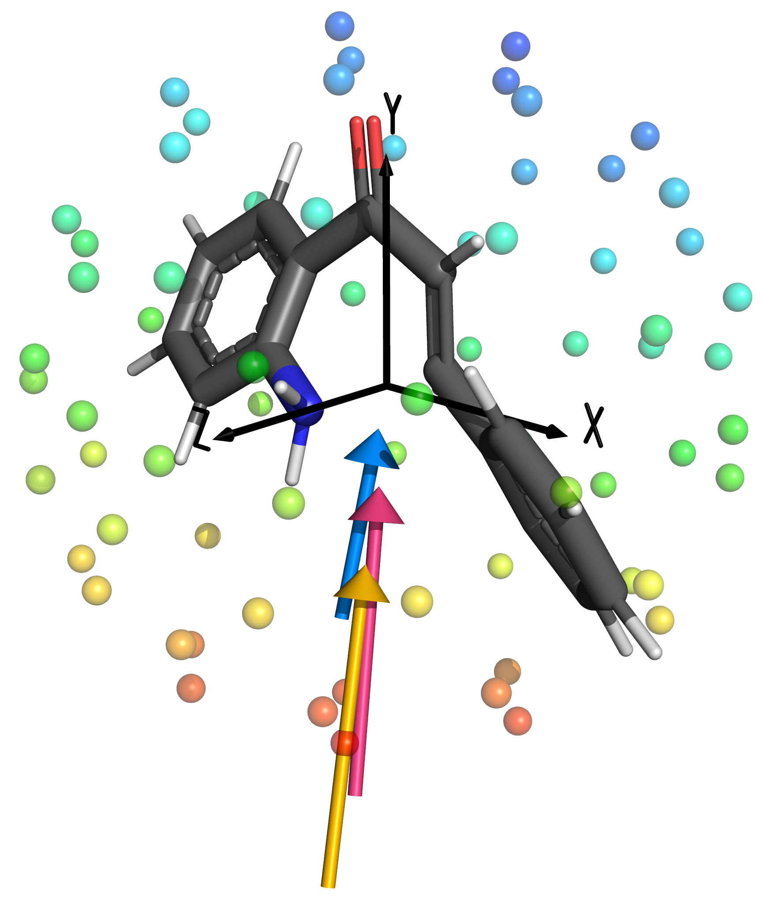
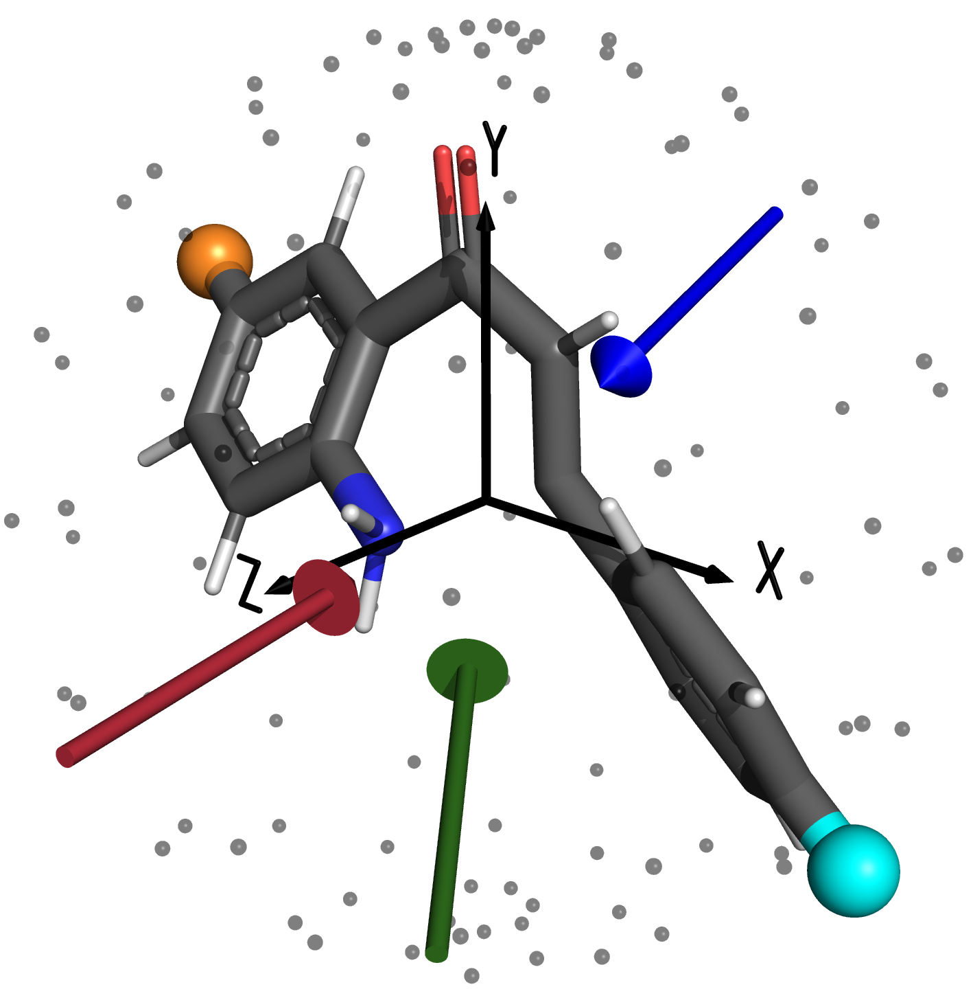

# 3. Results and Discussion

## 3.1 Pathway selection

$\newcommand{\va}{V\cdot\AA^{-1}}\newcommand{\eh}{E_h}\newcommand{\dc}{^\circ C}\newcommand{\kcalmol}{Kcal\cdot mol^{-1}}\newcommand{\kjmol}{KJ\cdot mol^{-1}}$For the reaction of $\bf{1}\to\bf{4}$, apart from the non-catalysed pathway, published mechanisms were only available for the Brønsted acid activation[^Bunce2011]. Two potential pathways were theorised ([Scheme 2](#scheme:bunce-pathways)), the first being activated through protonation of the ketone (**5**) and the second through protonation of $\ce{C_\alpha}$, producing $\ce{C_\beta+}$ (**6**). These pathways will be identified as 'Brønsted acid 1' and 'Brønsted acid 2', respectively. The Lewis base pathway was also known to be highly effective,[^Zheng2013] however the specific mechanism did not appear to have been fully elucidated. For the 'Lewis base' pathway in this research, the nucleophile was assumed to attach to the carbonyl carbon, forcing the carbonyl $\pi$ electrons onto the oxygen, as shown in [Scheme 3](#scheme:lb).

{: style="width: 45%; "class="center"}

<a name="scheme:bunce-pathways">Scheme 2:</a> Brønsted acid catalysed pathways 1 (top) and 2 (bottom) of $\bf{1}\to\bf{4}$ as suggested by, and recreated from [^Bunce2011]

[^Bunce2011]: Bunce, R. A.; Nammalwar, B. (±)-2-Aryl-2,3-Dihydro-4(1H)-Quinolinones by a Tandem Reduction-Michael Addition Reaction. *J. Heterocycl. Chem.* **2011**, *48* (3), 613–619. https://doi.org/10.1002/jhet.624.
[^Zheng2013]: Zheng, X.; Jiang, H.; Xie, J.; Yin, Z.; Zhang, H. Highly Efficient and Green Synthesis of Flavanones and Tetrahydroquinolones. *Synth. Commun.* **2013**, *43* (7), 1023–1029. https://doi.org/10.1080/00397911.2011.621096.
[^Tokes1989]: Totildekés, A. L.; Janzsó, G. Reactions of 2′-Aminochalcone. *Synth. Commun.* **1989**, *19* (18), 3159–3168. https://doi.org/10.1080/00397918908052715.

{: style="width: 80%; "class="center"}

<a name="scheme:lb">Scheme 3:</a> Theorised Lewis base pathway for the aza-Michael addition of 2'-aminochalcone to form aza-flavanone

It had been mentioned by Totildekés *et al.* [^Tokes1989] that the reaction could also be catalysed using a "strong base," so a 'Brønsted base' pathway was devised in which one of the labile amine protons was removed, giving the nitrogen a formal negative charge, as shown in [Scheme 4](#scheme:bb).

{: style="width: 60%; "class="center"}

<a name="scheme:bb">Scheme 4:</a> Theorised Brønsted base pathway for the aza-Michael addition of 2'-aminochalcone to form aza-flavanone

For completeness, a 'Lewis acid' pathway was devised in which $\ce{BF3}$ was used as a Lewis acid (as shown in [Scheme 5](#scheme:la)), similarly to the addition of a proton into the oxygen as per the Brønsted acid 1 pathway.

{: style="width: 80%; "class="center"}

<a name="scheme:la">Scheme 5:</a> Theorised Lewis acid pathway for the aza-Michael addition of 2'-aminochalcone to form aza-flavanone

To assess the theoretical performance of each of the pathways, the *S* isomer of the reactant, intermediate and cyclisation product of each of pathway was initially built with Avogadro$^2$ (1.94.0),[^Avogadro] and was optimised at M06-2X/aug-cc-pVTZ in ORCA[^ORCA], using CPCM[^CPCM-ORCA][^CPCM] ethanol. This geometry was subsequently refined and thermodynamic calculations were performed at $298.15\:K$, using ωB97M-V/Def2-QZVPP with SMD[^SMD] ethanol for solvation.
[^Avogadro]: Hanwell, M. D.; Curtis, D. E.; Lonie, D. C.; Vandermeersch, T.; Zurek, E.; Hutchison, G. R. Avogadro: An Advanced Semantic Chemical Editor, Visualization, and Analysis Platform. *J. Cheminform.* **2012**, *4* (1), 17. https://doi.org/10.1186/1758-2946-4-17.
[^ORCA]: Neese, F. The ORCA Program System. *WIREs Comput. Mol. Sci.* **2012**, *2* (1), 73–78. https://doi.org/10.1002/wcms.81.
[^CPCM]: Klamt, A.; Schüürmann, G. COSMO: A New Approach to Dielectric Screening in Solvents with Explicit Expressions for the Screening Energy and Its Gradient. *J. Chem. Soc., Perkin Trans. 2* **1993**, No. 5, 799–805. https://doi.org/10.1039/P29930000799.
[^CPCM-ORCA]: Garcia‐Ratés, M.; Neese, F. Effect of the Solute Cavity on the Solvation Energy and Its Derivatives within the Framework of the Gaussian Charge Scheme. *J. Comput. Chem.* **2020**, *41* (9), 922–939. 
[^SMD]: Marenich, A. V.; Cramer, C. J.; Truhlar, D. G. Universal Solvation Model Based on Solute Electron Density and on a Continuum Model of the Solvent Defined by the Bulk Dielectric Constant and Atomic Surface Tensions. *J. Phys. Chem. B* **2009**, *113* (18), 6378–6396. https://doi.org/10.1021/jp810292n.

For finding the transition states, 'nudged elastic band' calculations were performed to find the TS geometry through interpolation between the reactant and intermediate, and intermediate and cyclisation product geometries, before being optimised to a saddle point in ORCA at M06-2X/aug-cc-pVTZ with CPCM ethanol. The optimised TS geometries were subsequently refined with ωB97M-V/Def2-QZVPP in SMD ethanol, before being used to calculate thermodynamic energies as per the same method for the product, intermediate and reactant. Where barrierless reactions were suspected, the PES along the reaction coordinate was scanned using ωB97M-V/Def2-TZVPD in ORCA to confirm the absence of a barrier. These scans were performed by holding the reaction coordinate distance at fixed values while optimising the rest of the structure around it. Increments of $0.05\:\AA$ along the reaction coordinate were scanned, from their covalently bonded distance to a distance at which the bond would be completely dissociated. If the energetic pathway between bonded and dissociated had no intermediate maxima, the reaction was considered to be barrierless. These PES scan can be found in [Appendix A](../9.appendix/#a-raw-data-from-the-pathway-benchmarking-in-section-31)

Finding the transition state geometries of the Lewis base pathway proved significantly more difficult and required the use of Hessian guided optimisations, which involved performing thermodynamic calculations at $298.15\:K$ for each optimisation step and using the calculated force constants to guide to optimisation algorithm. These were performed in ORCA at ωB97M-V/Def2-TZVPD in SMD ethanol. Thermodynamic calculations to obtain benchmarking results were performed in ORCA as per the other transition states.

From the thermodynamic calculations benchmarking the energy of the six potential pathways, the energies were made relative to the non-activated reactant. For the Brønsted acid pathways, this was accomplished by adding on the $\Delta G^\circ$ of $\ce{H3O+}$ calculated at the same level of theory to the non-activated reactant, and adding on the $\Delta G^\circ$ of $\ce{H2O}$ to all the states in the Brønsted acid pathways. The corrected non-activated reactant $\Delta G^\circ$ was then subtracted from the Brønsted acid pathways to give the relative energy with respect to the non-activated pathway. This process was repeated with different corrective terms for each pathway, as shown in [Table 3.1](#tab:pathway-corrections). The $\Delta G^\circ$ for each of transition state 1 was not modified in any way, since they explicitly included all the components of the cyclisation pathways, and in the case of the Brønsted pathways, explicitly used $\ce{H2O}$ and $\ce{H3O+}$ as proton acceptors and donors.

<a name="tab:pathway-corrections">Table 3.1:</a> Energetic terms added to each benchmarked pathway to normalise them to the non-activated reactant.

| Pathway           |   Added to non-activated reactant   | Added to cyclisation pathway |
| ----------------- | :---------------------------------: | :--------------------------: |
| Brønsted acid 1/2 |             $\ce{H3O+}$             |          $\ce{H2O}$          |
| Brønsted base     |             $\ce{H2O}$              |         $\ce{H3O+}$          |
| Lewis Acid        |             $\ce{BF3}$              |              -               |
| Lewis Base        | $\ce{piperidine-}$($\ce{(CH2)5N-}$) |              -               |

The choice to use water to balance out the protonation states was made, as without any electrons in the $\ce{H+}$ ion, it is impossible to calculate its energy using standard quantum mechanical methods, so the $\ce{H2O + H+ <=> H3O+}$ equilibrium was used in conjunction with Hess' law. The difference between the $\ce{H2O}$ and $\ce{H3O+}$ energies can be considered that of the $\ce{H+}$ ion, affording an easy way to obtain the proton energy through thermodynamic cycles. This is a commonly used approach where energetics of protonation are of significance, such as for the determination of $pK_a$. While experimental values could be used to model just the $\ce{H+}$ energy, since explicitly modelled, participating $\ce{H2O}$ and $\ce{H3O+}$ were used for certain states in the reaction trajectory, this allowed for the cancellation of methodological errors. [^Ho2010] The relative energies of each pathway were subsequently plotted in [Figure 3.1](#fig:pathways).
[^Ho2010]: Ho, J.; Coote, M. L. A Universal Approach for Continuum Solvent PK a Calculations: Are We There Yet? *Theor. Chem. Acc.* **2010**, *125* (1–2), 3–21. https://doi.org/10.1007/s00214-009-0667-0.

{: style="width: 80%; "class="center"}

<a name="fig:pathways">Figure 1.1:</a>Relative reaction trajectories of the non-activated and five catalysed reaction pathways of $\bf{1}\to\bf{4}$. Where no transition states are present, that portion of the pathway was found to be barrierless.

Barrier heights for each step of each potential pathway of $\bf{1}\to\bf{4}$ were calculated, and $\log(k)$ rate constants for each step were determined, using the approach described in [Section 1.4](../1.%20Introduction/#14-theoretical-methodology-of-reaction-rates). For all steps within the pathways that had distinct barriers, [Equation ](../1.%20Introduction/#eqn:e-p-k) was used to calculate the rate constant, with the transmission coefficient from the Skodje-Truhlar approximations ([Equation 5](../1.%20Introduction/#eqn:STT)) being used to account for quantum tunnelling effects. Where no barrier was present, the rate constant was calculated using [Equation 3](../1.%20Introduction/#eqn:e-p-barrierless) instead, and without a barrier, transmission coefficient calculations were not necessary. The rate constants for the formation of the intermediate and the cyclisation step were multiplied together to give the overall rate constant for that particular pathway. Any subsequent steps within the pathways would involve further workup experimentally, and were thus not considered to effect the rate of cyclisation. The non-activated pathway involved no intermediate formation, and thus only one step was considered.

<a name="tab:benchmark-trajs">Table 3.2:</a> Rate constants ($\log(k)$) for both the intermediate formation reactions and the cyclisation, for each of the six pathways of $\bf{1}\to\bf{4}$. Since the non-activated pathway has no intermediate formation step, it has been left blank.

| Pathway         | Intermediate formation | Product formation | Overall reaction |
| --------------- | :--------------------: | :---------------: | :--------------: |
| Non-activated   |           -            |       -6.1        |       -6.1       |
| Brønsted acid 1 |          8.0           |        3.0        |       11.0       |
| Brønsted acid 2 |          -1.0          |       23.7        |       22.7       |
| Brønsted base   |         -31.7          |        1.2        |      -30.5       |
| Lewis Acid      |          6.7           |        1.6        |       8.3        |
| Lewis Base      |          8.8           |        2.9        |       11.7       |

<a name="tab:bench-charges-reactant">Table 3.3:</a> CHELPG partial charges (*e*) of the bonding atoms of the intermediate geometry of each of the pathways.

| Pathway         | $\ce{N}$ | $\ce{C_\beta}$ |
| --------------- | :------: | :------------: |
| Non-activated   |  -0.97   |     -0.10      |
| Brønsted acid 1 |  -1.00   |     -0.02      |
| Brønsted acid 2 |  -1.06   |      0.02      |
| Brønsted  base  |  -1.26   |     -0.12      |
| Lewis Acid      |  -1.08   |      0.04      |
| Lewis Base      |  -1.28   |      0.10      |

To further understand the catalytic processes involved, partial charge analysis was performed on the ωB97M-V/Def2-QZVPP optimised intermediate geometries of each pathway, to ascertain the nucleophilicity of the cyclising amine and the electrophilicity of $\ce{C_\beta}$. Multiwfn[^multiwfn] was used to calculate the CHELPG partial charges, based off the ωB97M-V/Def2-QZVPP calculated wavefunction. The process involved calculating the molecular electrostatic potential of the system and projecting the values onto the constituent atoms to assign partial charges. These charges have been tabulated in [Table 3.3](#tab:bench-charges-reactant).
[^multiwfn]: Lu, T.; Chen, F. Multiwfn: A Multifunctional Wavefunction Analyzer. *J. Comput. Chem.* **2012**, *33* (5), 580–592. https://doi.org/10.1002/jcc.22885.

The Hessian from the ωB97M-V/Def2-QZVPP thermal corrections was used to re-calculate the $\Delta G^\ddagger$ of the reaction at various temperatures. Skodje-Truhlar transmission coefficient calculations were performed based on these new values, and were used in the Eyring-Polanyi equation to obtain new rate constants, as shown in [Figure 3.6](#fig:na-T). The imaginary frequency of the transition state was not recalculated, and as such, the transmission coefficient would likely overestimate the proportion of the rate due to tunnelling, however this would introduce minimal error, compared to the large increase in kinetic energy through the increase in temperature.

<a name="fig:ts-geoms">Figure 3.2:</a> Transition state 2 of each of the pathways, excluding the Brønsted acid 2 pathway, as due to its barrierless nature, no transition state geometry exists. The labels show the transition state bonding distance, in angstrom.

| (a) Non-activated | (b) Brønsted acid 1 | (c) Brønsted base |
| :----------------------------------------------------------: | :----------------------------------------------------------: | :----------------------------------------------------------: |
| (d) Lewis acid | (e) Lewis base |                                                              |

Through the process of benchmarking the Lewis base pathway, it became apparent that the assumed mechanism shown in [Scheme 3](#scheme:lb) could not be correct. PES scans were conducted of the cyclisation of the intermediate species, with the proton attached to the cyclising amine, and attached to the Lewis base, forming $\ce{piperidine+}$. As shown in [Figure 3.3a](#subfig:lb2t), the cyclisation could only occur if the proton was attached to the Lewis base, as otherwise the new $\ce{N-C}$ bond was negligibly stable and would likely dissociate. In attempting to optimise the transition state with the deprotonated cyclising amine however, the piperidinium kept dissociating in order to neutralise its charge. Further PES scans were performed to investigate this dissociation and as can be seen in [Figure 3.3b](#subfig:lb2t-lb), once protonated, the piperidinium leaving was a barrierless process, indicating that it would dissociate before it could catalyse the cyclisation through this particular mechanism.

|  |  |
| :-----------------------------: | :--------------------------------: |
|               (a)               |                (b)                 |

<a name="fig:lb">Figure 3.3:</a> a) PES scans along the forming bond of the Lewis base pathway, with the free proton on the Lewis base (blue) and on the cyclising amine (orange). b) PES scan of the $\ce{N_{LB}-C}$ bond distance of the protonated Lewis base leaving the carbonyl carbon, prior to cyclisation occurring. The scans in a) were performed with constrained $\ce{N_{LB}-C}$ bond distances, in order to prevent the dissociation of the species.

{: style="width: 40%; "class="center"}

<a name="scheme:lb2">Scheme 6:</a> Revised Lewis base pathway for the aza-Michael addition of 2'-aminochalcone to form aza-flavanone

Having identified that the negative charge was more stable on the cyclising amine, its deprotonation was subsequently assessed for the presence of a barrier with the Lewis base floating freely in the solution, and again, the barrier was not present, leading to the formation of the revised Lewis base mechanism depicted in [Scheme 6](#scheme:lb2). In this mechanism, the Lewis base acted as a coordinating Brønsted base, stabilising the negative charge through hydrogen bonding, as shown in [Figure 3.2e](#subfig:ts-lb). Given that the rate determining step in the Brønsted base pathway was the removal of the amine proton, for the piperidine to result in a barrierless deprotonation, and an intermediate that is more stable than the reactant, explains the efficiency of this pathway as observed by Zheng *et al.* [^Zheng2013].

Of all the pathways investigated, the fastest was the Brønsted acid 2 pathway, which achieved catalysis through the formation of a carbocation in the $\beta$ position. These results did not agree with the partial charge analysis however, likely due to donation of electron density from the adjacent phenyl ring. Analysis of the LUMO of the intermediates of the non-activated and Brønsted acid 2 pathways ([Figure 3.4](#fig:lumos)) revealed that the main driving force of was the formation of the new tetrahedral geometry of $\ce{C_\alpha}$. As a result of this change in geometry, $\ce{C_\beta}$ became far more exposed to the HOMO lone pair electrons on the nitrogen (not depicted in [Figure 3.4](#fig:lumos)), making orbital overlap significantly more likely than for the non-activated pathway. Comparing this to the transition state 2 geometries shown in [Figure 3.2](#fig:ts-geoms), the slight torsional strain to the $\ce{C_\alpha=C_\beta}$ bond that needed to happen for proper HOMO-LUMO overlap to occur, was not required in this pathway, making it less sterically unfavourable for the cyclisation to proceed, due to the breaking of the $\ce{\alpha,\beta}$-unstaurated ketone.

|{: style="width: 80%; "class="center"}|{: style="width: 80%; "class="center"}|
| :---------------: | :-----------------: |
| (a) Non-activated | (b) Brønsted acid 2 |

<a name="fig:lumos">Figure 3.4:</a> Isosurfaces of the LUMO from the non-activated and Brønsted acid 2 pathway intermediate species, following an isovalue of 0.05.

The other key driving factor was the instability of the $2^\circ$ carbocation. This particular species was more unstable than the charged species of any other pathway studied, due to the breaking of the $\ce{\alpha,\beta}$-unstaurated ketone, which prevented the charge from being distributed up into the more electron rich atoms on the other side of the molecule. The result was that $\ce{C_\beta}$ adjacent phenyl ring had an overall partial charge of +0.52, compared with the non-activated pathway, in which the ring had an overall charge of +0.13, indicating the redistribution of the formal charge predominantly throughout the right side of the molecule.

{: style="width: 40%; "class="center"}

<a name="fig:bh-vs-ts">Figure 3.5:</a> Barrier height of the cyclisation step of each of the pathways plotted against their respective transition state bonding distance. A linear trendline ($R^2=0.996$) has been added to demonstrate the linearity of the non-intermolecularly stabilised species transition state bond length as a function of their barrier height. The Brønsted acid 2 pathway has been omitted, as no transition state geometry exists.

As can be seen in [Figure 3.1](#fig:pathways), the other pathways all followed a relatively similar trend to each other. The Lewis base and Brønsted base pathways both resulted in significantly more stabilised products than the Lewis acid and Brønsted acid 1 pathways, as the basic pathways resulted in the deprotonation of the amine, leading to the products containing only a single $2^\circ\:\alpha$ carbocation, instead of the zwitterionic species of the acidic pathways. Compared with the non-activated pathway, all of the catalysed pathways, except for the Brønsted base had transition states and products that were more stable, likely helping to not only increase the rate of the reaction, but also to reduce any re-crossing of the barrier. As can be seen in [Figure 3.2](#fig:ts-geoms) all of the catalytic pathways resulted in earlier transition states for the cyclisation step than in the non-activated pathway, which correlates quite well with their respective barrier heights, as shown in [Figure 3.5](#fig:bh-vs-ts). The Lewis base pathway was likely an outlier due to the intermolecular stabilisation contributed from the piperidine, which was not present in the other pathways, and has been depicted as such in [Figure 3.5](#fig:bh-vs-ts). This can also be seen as this pathway was closest mechanistically to the Brønsted base pathway and has a similar TS bonding distance, however it possesses a lower overall barrier height. This correlation indicates that with the exception of Brønsted acid 2, all the pathways ultimately follow the same approach to catalysing the reaction; increasing the electrophilicity of $\ce{C_\beta}$ and/or increasing the nucelophilicity of the cyclising amine.

Multiple approximations and assumptions had to be made to calculate the energy of these pathways. The largest of which was that while the use of SMD solvation does afford a certain amount of stability to separated charges, it lacks the ability to properly hydrogen bond and distribute the charge throughout the medium in the way that explicit solvation does. This particular issue may have caused $\ce{H3O+}$, ${piperidine-}$ and $\ce{C_\beta+}$ species to not be stabilised to the same extent that they would have if solvated explicitly, resulting in the driving force for the barrierless reactions to be the mitigation of these charged species. If the systems were solvated with explicit water, it is likely that the extra solvent molecules would share their lone pair electrons and that the resulting complex would be significantly more stable than is being represented in the calculations above. This, in turn, may possibly have introduced barriers to these processes, particularly in the formation of the Brønsted acid 1 pathway intermediate. While this could be accomplished by explicitly solvating at least part of the reactant with water or ethanol molecules, the nature of the catalytic pathways had been sufficiently studied to reach the aims of this research.

Further discrepancies from experiment within this method came from the use of transmission coefficient approximations. Using the Skodje-Truhlar approximation, transmission coefficients were estimated to make a significant contribution to the rate constant of $\kappa>13.6$ for proton transfers, compared with $<1.3$ for the cyclisation steps. Given that these approximations are known to overestimate the effects of quantum tunnelling, this will have associated errors that cannot be easily quantified due to the complexities of quantum phenomena. With how small the proton is, conventional approaches to quantum mechanics which decouple the movement of the protons and electrons, can no longer be assumed to be correct and as such, protons (particularly labile ones) should be treated similarly to an electron in quantum calculations; the proton should be modelled as a wave instead of a particle.[^Markland2018]
[^Markland2018]: Markland, T. E.; Ceriotti, M. Nuclear Quantum Effects Enter the Mainstream. *Nat. Rev. Chem.* **2018**, *2* (3), 0109. https://doi.org/10.1038/s41570-017-0109.
[^Goerigk2017]: Goerigk, L.; Hansen, A.; Bauer, C.; Ehrlich, S.; Najibi, A.; Grimme, S. A Look at the Density Functional Theory Zoo with the Advanced GMTKN55 Database for General Main Group Thermochemistry, Kinetics and Noncovalent Interactions. *Phys. Chem. Chem. Phys.* **2017**, *19* (48), 32184–32215. https://doi.org/10.1039/C7CP04913G.
[^Mardirossian2017]: Mardirossian, N.; Head-Gordon, M. Thirty Years of Density Functional Theory in Computational Chemistry: An Overview and Extensive Assessment of 200 Density Functionals. *Mol. Phys.* **2017**, *115* (19), 2315–2372. https://doi.org/10.1080/00268976.2017.1333644.

While the errors for the chosen methodology can be considered relatively low for density functional theory,[^Goerigk2017][^Mardirossian2017] it is important to note that errors in the range of $\pm 8\:\kjmol$ are not insignificant when calculating rate constants, which are highly sensitive to small fluctuations in energy. The errors are also calculated as RMSD values, based off benchmarking datasets that may not be representative of the systems being studied in this work.

Generally speaking, "chemical accuracy" is considered to be $\sim4.2\:\kjmol$

Given how dependent these systems are on the dynamic behaviour of protons, to truly capture their behaviour an *ab initio* molecular dynamics (AIMD) approach that incorporates nuclear quantum effects would need to be implemented, such as utilising the Feynman path integral AIMD approach (PI-AIMD) to model the system, as demonstrated by Cassone, [^Cassone2020] however given the aims of this research, such approaches would be unjustifiably expensive.
[^cassone2020]: Cassone, G. Nuclear Quantum Effects Largely Influence Molecular Dissociation and Proton Transfer in Liquid Water under an Electric Field. J. Phys. Chem. Lett. 2020, 11 (21), 8983–8988. https://doi.org/10.1021/acs.jpclett.0c02581.

{: style="width: 40%; "class="center"}

<a name="fig:na-T">Figure 3.6:</a> $\log(k)$ Rate constants of the non-activated pathway as a function of temperature.

From this work, despite its relatively high reaction barrier and low rate constant, the non-activated pathway was identified as the optimal pathway to study further, under the influence of an OEEF for a number of reasons. Firstly; while its rate constant corresponds to a reaction half life of between 7 and 14 days (depending on the reaction order), under the influence of an OEEF it is very possible that this could be reduced significantly. Secondly; as previously stated, all thermodynamic calculations were performed at $298.15\:K$. Increasing the temperature would result in a significant increase in the reaction rate, as can be seen by the slope of the curve in [Figure 3.6](#fig:na-T). Depending on the order of the reaction, a $25\dc$ temperature increase to $50\dc$ would result in a reaction half life of between 6 and 13 hours, which in conjunction with the effects of an OEEF would be be sufficiently fast for the purposes of experimental research.

Given that the the reaction is unimolecular and that the reaction site is pre-organised within the molecule, it is likely that it would be on the lower end of this scale

The choice to investigate the non-activated pathway further was also motivated by its simplicity, in that no extra reactants were required to make the cyclisation occur. In moving this reaction into the experimental space, in order to maximise the propagation of an OEEF through the solvent, tight control of ionic species in solution would be required to ensure that minimal charge screening occurs. Another potential issue could arise in that the the OEEF would induce charge based diffusion through the solution that may interfere with the approximations and assumption made in statistical mechanics based kinetic approaches, adding another variable that would need to be accounted for.

Given that the cyclisation of 2'-aminochalcone is not known to occur spontaneously, it is very probable that a proton source would be required to shuttle the ammonium proton up to the $\alpha$ carbocation to create a more stable product. Further investigation should be carried out to determine if water by itself would be sufficient for this purpose, or if small amounts of acid would be required to accomplish this experimentally, however as previously discussed, this investigation would likely require the use of explicit solvation and *ab initio* molecular dynamics approaches[^Brehm2012] and could not be justified for this particular investigation.
[^Brehm2012]: Brehm, M.; Weber, H.; Pensado, A. S.; Stark, A.; Kirchner, B. Proton Transfer and Polarity Changes in Ionic Liquid–Water Mixtures: A Perspective on Hydrogen Bonds from Ab Initio Molecular Dynamics at the Example of 1-Ethyl-3-Methylimidazolium Acetate–Water Mixtures—Part 1. *Phys. Chem. Chem. Phys.* **2012**, *14* (15), 5030. https://doi.org/10.1039/c2cp23983c.

## 3.2 Static benchmarks based on cardinal field directions, following the "rules"

### 3.2.1 Benchmarking the non-activated pathway barrier as a function of  $F_Y$

The ωB97M-V/Def2-QZVPP optimised geometries of the product, transition state, and reactant of the non-activated pathway from [Section 3.1](#31-pathway-selection) were oriented with their $\ce{C=O}$ bond along the Y axis, and their $\ce{O=C-C_{\alpha}}$ angle in the X/Y plane, as per [Figure 3.7](#fig:axes).

{: style="width: 30%; "class="center"}

<a name="fig:axes">Figure 3.7: </a>Non-activated transition state of 2'-aminochalcone, as aligned to the cardinal axes

With this constraint in place, according to [Rule 3](../1.%20Introduction/#rule:3), the field direction which would have the most stabilising effect on the transition state and thus the largest catalytic effect would be the field that follows the reaction trajectory. As the reaction trajectory for this particular mechanism involves the electron density flowing from the nitrogen, through the $\ce{C_\beta=C_\alpha}$ bond, and up onto the ketone as per [Scheme 1](../1.%20Introduction/#schm:na), the logical choice for a catalytic OEEF was $\vec F=-Y$. As such, to understand the magnitude of effects that could be expected from an OEEF in the catalytic field direction ($F_Y$), single point calculations at M06-2X/6-31+G* were performed on each of the geometries with an electric field specified in the Y direction, at strengths ranging from $-0.015\:\eh$ to $0.015\:\eh$ ($\sim0.77\:\va$) in $0.001\:\eh$ increments ($\sim0.05\:\va$) in SMD ethanol. It is important to note that the field strengths used for this perturbation were incredibly unrealistic, with $|\vec F|>0.006\:\eh$($\sim0.3\:\va$) being known to facilitate the cleavage bonds within conventional solvents,[^Cassone2015] and $0.6\:\va$ being beyond the limits of what is even  physically possible. The extended field range of $\vec F=0.015\:\eh$ has become standard in the field of electrostatic catalysis for analysing the extent of perturbative OEEF effects on static geometry.[^Wang2018]
[^Wang2018]: Wang, Z.; Danovich, D.; Ramanan, R.; Shaik, S. Oriented-External Electric Fields Create Absolute Enantioselectivity in Diels-Alder Reactions: Importance of the Molecular Dipole Moment. *J. Am. Chem. Soc.* **2018**, *140* (41), 13350–13359. https://doi.org/10.1021/jacs.8b08233.

These particular calculations were performed without allowing the geometry to relax in the field, which allowed for the resultant energy to be a measure purely of the displacement of the electron density, without letting the geometry adapt to minimise any destabilising effects. With this in mind, the choice of solvating the molecule with SMD ethanol was made to facilitate the charge separation afforded by the OEEF.

| ||
| :--: | :--: |
|                             (a)                              | (b)  |

<a name="fig:efieldstrength">Figure 3.8:</a> a) Potential energy of the reactant, transition state and product as a function of $F_Y$, in SMD ethanol. The energies are all relative to the unperturbed reactant. b) Reaction trajectory based on the potential energy from the OEEF scan in [Figure 3.8a](#subfig:efieldstrength-ethanol) , coloured from most negative field direction (brightest) to most positive (most dull).

[Figure 3.8](#fig:efieldstrength) shows that the transition state and product of the non-activated pathway were significantly more susceptible to the perturbative effects of $F_Y$, however the effect becomes much stronger as the field becomes more negative. This outcome is unsurprising, as $+F_Y$ corresponds to a negative charge placed above the oxygen, pushing the electron density against the molecular dipole ($\vec\mu$) as opposed to $-F_Y$ which amplifies $\vec\mu$. Since this polarisation goes against the natural polarity of the molecule, it presents an overall destabilising effect, and would likely result in the electrostatic decomposition of the molecule. These effects can be clearly seen in [Figure 3.9](#fig:dipole-fy), as more positive values of $F_Y$ begin to negate $\vec\mu$, making the molecule far less stable. The increase in $|\vec\mu|$ of the reactant at $F_Y >0.2\:\va$  and the  transition state at $F_Y >0.7\:\va$ correspond with a reversal of $\vec\mu$ as facilitated by the OEEF.

{: style="width:50%; "class="center"}

<a name="fig:dipole-fy">Figure 3.9:</a> Magnitude of the molecular dipole of the reactant, transition state and product of the non-activated pathway, as a function of catalytic OEEF field strength.

Since the decrease in OEEF perturbations for each of the reactant, TS and product, cancel out at large $|F_Y|$ the resulting barrier height had a linear trend, with a catalytic benefit, or anti-catalytic penalty of $16.5\:\kjmol$ per $0.1\:\va$ of $-F_Y$ or $+F_Y$, respectively. Since the product was far more polarisable than the reactant or transition state in the Y direction, the OEEF was not only able to decrease the reaction barrier, but also increased the thermodynamic stability of the product, reducing the likelihood of barrier re-crossing. This was likely due to the reactant being fully cyclised and thus being able to better facilitate the shifting electron density from the nitrogen, up through to the ketone. At field strengths $<-0.6\:\va$, the transition state was stabilised so significantly that the barrier was completely negated, however electric fields of this magnitude would likely cause electrostatic decomposition before the reaction could occur.

{: style="width: 50%; "class="center"}

<a name="fig:efieldstrength-barrier">Figure 3.10:</a> The resulting potential energy barrier heights of the reaction trajectory as a function of the strength of $F_Y$.

### 3.2.2 Benchmarking the bias of the *S* isomer over the *R* isomer as a function of $F_Z$

The process used to determine the perturbative effects of the OEEF in [Section 3.2.1](#321-benchmarking-the-non-activated-pathway-barrier-as-a-function-of-f_y) was repeated with the field direction along the Z axis ($F_Z$) to assess the magnitude of discrimination between the *S* and *R* isomer forming pathways that could be facilitated by an OEEF. This direction was chosen, as it was the axis that ran perpendicular to the reaction trajectory and pertained directly to the difference in $\vec\mu$ between the *R* and *S* isomers, making it the logical choice as per the unofficial . [Rule 5](../1.%20Introduction/#rule:5) Since the *R* and *S* isomers are mirror images of each other across the X/Y plane, only the *S* isomer was analysed, as the direction of the OEEF could be inverted to get the equivalent results for the *R* isomer. 

|||
| :---:: | :----: |
|(a)|(b)|

<a name="fig:efieldstrength-z">Figure 3.11:</a> a) Potential energy of the *S* isomer of the reactant, transition state and product as a function of $F_Z$, in SMD ethanol (b). The energies are all relative to the unperturbed reactant. b) Reaction trajectory based on the potential energy from the OEEF scan in [Figure 3.11a](#fig:efieldstrength-z) , coloured from most negative field direction (brightest) to most positive (most dull).

From [Figure 3.11](#fig:efieldstrength-z) it can be seen that in general, the species were far less polarisable in the Z direction than the Y direction, however this was somewhat unsurprising, as the conjugation that would allow for large amounts of electron density delocalisation were predominantly aligned within the X/Y plane. This did mean, however, that any electron density displacement that occurred was likely along the reaction coordinate itself, facilitating discrimination between the *S* and *R* transition states through the manipulation of the bond formation itself.

{: style="width: 50%; "class="center"}

<a name="fig:dipole-fz">Figure 3.12:</a> Magnitude of the molecular dipole of the reactant, transition state and product of the non-activated pathway, as a function of $|F_Z|$

In the Z direction, the product again proved to be the most polarisable component of the reaction, however the extent was significantly less than $F_Y$, and as such the energetic barrier always remained present. The reactant proved to be stabilised equally by $-F_Z$ and $+F_Z$, however the transition state and product were more stabilised by $+F_Z$, likely owing to through-bond electron density shifts, facilitated by the newly formed $\ce{N-C}$ bond. Looking at $|\vec\mu|$ of these species in [Figure 3.12](#fig:dipole-fz), a similar trend occurs with $F_Y$ as with $F_Z$, however, since the natural polarity of the molecule results in $\vec\mu$ having a negligibly small Z component compared to its Y component, the small shifts to the electron density in the Z axis had significantly smaller effects on the potential energy of the molecules.

{: style="width: 50%; "class="center"}

<a name="fig:efieldstrength-barrier-z">Figure 3.13:</a> The resulting gas phase and SMD solvated barrier heights of reaction trajectory as a function of the strength of $F_Z$.

Since the benchmarked geometry was that of the *S* isomer, and since it was aligned as per [Figure 3.7](#fig:axes), the results of the scans were inverted to reverse the field direction, which provided the results of the *R* isomer. Subtracting the potential energy barrier heights of the inverted scans (*R* isomer), from the non-inverted scans (*S* isomer), provided the amount of discrimination between the two isomer forming reactions that $F_Z$ afforded, as shown in [Figure 3.13](#fig:efieldstrength-barrier-z). From these results, it can be said that more positive values of $F_Z$ select for the *S* isomer and more negative values select for the *R* isomer which can be  quantified as a $9.1\:\kjmol$ bias in favour of the *S* pathway per $0.1\:\va$ $+F_Z$, or in favour of the *R* pathway per $0.1\:\va$ $-F_Z$.

Previous studies by Wang *et al.* [^Wang2018] on the stereocontrol of Diels-Alder reactions showed that a stereoselective OEEF posed a systematic effect on all of the species within the reaction, leaving the barriers of the *R* and *S* isomer forming pathways identical, so any separation between the two pathways occurred by stabilising the reaction pre-complex that resulted in one isomer over the other. Interestingly, in this particular study, the influence of  the *R*/*S* selective OEEF resulted in more significant stabilisation to the transition state and product of the reaction, causing a change in the reaction barrier itself.

Computational studies within this field often explore a very wide range of field strengths[^Wang2018][^Mattioli2019], however while they may provide interesting insights into molecules at, and beyond their limits of stability, they can be considered unrealistic and unrepresentative for practical applications. As such, further investigations within this research use an OEEF of $|\vec F|=0.1\:\va$ as a default with a larger $|\vec F|$ of $0.2\:\va$ , since the aims of this research were fundamentally to obtain a qualitative understanding as a guide for future experimental research.
[^Mattioli2019]: Mattioli, E. J.; Bottoni, A.; Zerbetto, F.; Calvaresi, M. Oriented External Electric Fields Affect Rate and Stereoselectivity of Electrocyclic Reactions. *J. Phys. Chem. C* **2019**, *123* (43), 26370–26378. https://doi.org/10.1021/acs.jpcc.9b07358.

Generally speaking $F_Z<0$ was found to stabilise the *S* isomer and destabilise the *R* isomer to the same extent that $F_Z>0$ destabilised the *S* isomer and stabilised the *R* isomer. Because of this, to reduce computational cost by taking advantage of stereoisomeric symmetry, further studies within this research were performed only on the *S* isomer. The assumption was made that any and all results pertaining to OEEF mediated stereoselectivity could be generalised to the *R* isomer by flipping the Z component of $\vec F$ across the X/Y plane. As such, an OEEF residing predominantly in $+F_Z$ will be referred to as "*S* selective" and a field predominantly in $-F_Z$ will be referred to as "*S* anti-selective". A similar approach to naming convention was taken for a field direction predominantly in $-F_Y$, with it from here on being referred to as "catalytic", since $F_Y<0$ was shown to decrease the barrier of the reaction. 

### 3.2.3 Investigating the role of dielectric medium (CPCM) on OEEF perturbation

To understand the extent by which the dielectric constant of the solvent influenced the effects of the OEEF, the oriented geometries from the previous calculations were used, and single point calculations were performed on each geometry at M06-2X/6-31+G\* with CPCM ethanol, varying the dielectric constant from 5 to 100 in increments of 5. Scans were performed using catalytic ($F_Y=-0.1\:\va$), *S* selective ($F_Z=0.1\:\va$) and, *S* anti-selective ($F_Z=-0.1\:\va$) OEEFs for each of the reactant, transition state and product geometries, to assess the solvent effects on both the catalytic and stereoselective OEEF field directions.

{: style="width: 50%; "class="center"}

<a name="fig:cpcm-relative-bh">Figure 3.14:</a> Reduction in barrier heights of the OEEF-perturbed and non-perturbed scans of the non-activated pathway as a function of solvent dielectric constant. The barrier heights are all relate to their maximum energy at $\varepsilon_r=0$.

Knowing that the nature of the OEEF is to polarise the species within the reaction, the assumption was made that solvation would be of particular importance to support any charge separation facilitated by the perturbation of the OEEF. However, [Figure 3.14](#fig:cpcm-relative-bh) indicated that the stabilisation of the species afforded by the dielectric medium was predominantly one of stabilising the molecule as a whole, with only marginal differences in energy arising from the polarisation of the molecules due to the OEEF itself.

{: style="width: 50%; "class="center"}

<a name="fig:cpcm-relative-bh-diff">Figure 3.15:</a> Differences between the OEEF perturbed barrier heights and non OEEF-perturbed scans of the non-activated pathway as a function of CPCM dielectric constant. This plot shows the amount of stabilisation afforded by the CPCM dielectric pertaining to the stabilisation of OEEF induced charge separation.

This energy difference has been quantified in [Figure 3.15](#fig:cpcm-relative-bh-diff) by taking the barrier height differences between each of the OEEF perturbed pathways and the unperturbed pathway, with the energetic difference pertaining to the stabilisation of the OEEF-polarised reaction by the dielectric medium. When considering both figures, and how minimally the solvation supports the OEEF perturbation, it can be concluded that rather than choosing a solvent that facilitates the charge separation of the polarised transition state, it is more important to choose a solvent with the lowest dielectric constant, in which the reactant remains soluble. This should allow for maximum propagation of the OEEF through the solvent, without significantly penalising the polarisation effects of the OEEF. With this in mind, the ideal solvent for this particular reaction should have a dielectric constant between 20 and 30 and will be further explored in [Section 3.4](#34-benchmarking-the-optimised-oeef-directions-on-relaxed-geometry).

## 3.3 Identifying optimal OEEF directions for catalysis and *R*/*S* selectivity

All assumptions so far about appropriate OEEF directions to obtain particular effects were made according to the Shaik's rules. To confirm their validity and to better identify the ideal OEEF directions, however, novel approaches to the issue had to be devised and as such involved the use of extensive scripting to interpret and visualise the data. Due to their extensive python scripting interfaces, all of the following calculations were performed using Psi4 1.4[^psi4-1][^psi4-2][^psi4-3] with the results being visualised in PyMOL open-source 2.6.0a0[^PyMOL].
[^psi4-1]: Parrish, R. M.; Burns, L. A.; Smith, D. G. A.; Simmonett, A. C.; DePrince, A. E.; Hohenstein, E. G.; Bozkaya, U.; Sokolov, A. Y.; Di Remigio, R.; Richard, R. M.; Gonthier, J. F.; James, A. M.; McAlexander, H. R.; Kumar, A.; Saitow, M.; Wang, X.; Pritchard, B. P.; Verma, P.; Schaefer, H. F.; Patkowski, K.; King, R. A.; Valeev, E. F.; Evangelista, F. A.; Turney, J. M.; Crawford, T. D.; Sherrill, C. D. Psi4 1.1: An Open-Source Electronic Structure Program Emphasizing Automation, Advanced Libraries, and Interoperability. *J. Chem. Theory Comput.* **2017**, *13* (7), 3185–3197. https://doi.org/10.1021/acs.jctc.7b00174.
[^psi4-2]: Turney, J. M.; Simmonett, A. C.; Parrish, R. M.; Hohenstein, E. G.; Evangelista, F. A.; Fermann, J. T.; Mintz, B. J.; Burns, L. A.; Wilke, J. J.; Abrams, M. L.; Russ, N. J.; Leininger, M. L.; Janssen, C. L.; Seidl, E. T.; Allen, W. D.; Schaefer, H. F.; King, R. A.; Valeev, E. F.; Sherrill, C. D.; Crawford, T. D. Psi4: An Open-Source Ab Initio Electronic Structure Program. *Wiley Interdiscip. Rev. Comput. Mol. Sci.* **2012**, *2* (4), 556–565. https://doi.org/10.1002/wcms.93.
[^psi4-3]: Smith, D. G. A.; Burns, L. A.; Simmonett, A. C.; Parrish, R. M.; Schieber, M. C.; Galvelis, R.; Kraus, P.; Kruse, H.; Di Remigio, R.; Alenaizan, A.; James, A. M.; Lehtola, S.; Misiewicz, J. P.; Scheurer, M.; Shaw, R. A.; Schriber, J. B.; Xie, Y.; Glick, Z. L.; Sirianni, D. A.; O’Brien, J. S.; Waldrop, J. M.; Kumar, A.; Hohenstein, E. G.; Pritchard, B. P.; Brooks, B. R.; Schaefer, H. F.; Sokolov, A. Y.; Patkowski, K.; DePrince, A. E.; Bozkaya, U.; King, R. A.; Evangelista, F. A.; Turney, J. M.; Crawford, T. D.; Sherrill, C. D. Psi4 1.4: Open-Source Software for High-Throughput Quantum Chemistry. *J. Chem. Phys.* **2020**, *152* (18), 184108. https://doi.org/10.1063/5.0006002.
[^PyMOL]: Schrödinger, L. *The PyMOL Molecular Graphics System, Version 2.6*; 2015.

{: style="width: 50%; "class="center"}

<a name="fig:efield_scan_rough">Figure 3.16:</a> Initial, rough scan of the catalytic stabilisation of the *S* isomer afforded by various OEEFs on the non-activated transition state, relative to the non-OEEF perturbed molecule. Each sphere represents a perturbed field direction, and it's colour represents the magnitude of the perturbation from most stabilising (red) to least (blue). The arrows represent the most stabilising field direction (yellow), the relative magnitude and direction of the molecular dipole of the unperturbed transition state (blue) and the perturbed transition state (pink).

For each of the *R* and *S* isomers, the oriented transition state geometry from the  ωB97M-V/Def2-QZVPP optimisations was taken, and single point calculations were performed at M06-2X/6-31+G* without solvation. A series of vectors, $0.1\:\va$ long, pointing in 56 equally spaced directions was generated, with each vector specifying the direction and magnitude of $\vec F$. For each of the field directions, the electric field was applied and subsequent single point calculations were performed at the same level of theory as the perturbed reference point. The resulting catalytic energies were taken as the difference between the perturbed and unperturbed single point energies for each field direction. These results have been presented in [Figure 3.16](#fig:efield_scan_rough). The scans were repeated at the same level of theory on the ωB97M-V/Def2-QZVPP optimised *R* isomer geometry, and the *R*/*S* separation energy for each OEEF direction was taken as $\Delta E_{TS} (\it{S})-\Delta E_{TS} (\it{R})$ for that specified OEEF perturbation.

Once the general direction of the optimal catalytic and selective fields was identified, higher resolution scans centred only around the region identified by the rough scans were performed at the same level of theory, with 106 vectors selected for the catalytic field direction and 319 vectors for the *S* selective field direction. From these results, an optimal *S* isomer "catalytic" field direction was identified based on the maximum OEEF mediated stabilisation relative to the unperturbed molecule, as shown in [Figure 3.17a](#subfig:efield_cat_scan). The field direction that proved the most selective for the *S* isomer over the *R* isomer was also selected as the "*S* selective" field direction, as shown in [Figure 3.17b](#subfig:efield_RS_sep_scan). Due to the symmetry of the *S* isomer across the X/Y plane, the *S* selective OEEF was flipped in the Z direction to provide the *S* anti-selective field direction. The specific vectors for these fields have been tabulated in [Table 3.4](#tab:optimal-field-directions).

| {: style="width: 80%; "class="center"} | {: style="width: 80%; "class="center"} |
| :----------------------------------------------------------: | :----------------------------------------------------------: |
|                             (a)                              |                             (a)                              |

<a name="fig:efield-scans">Figure 3.17:</a> More granular scans of a) the catalytic effects of the OEEF on the *S* isomer transition state, and b) the stereoselective effects of the OEEF for the *S* isomer over the *R* isomer. Each sphere represents a perturbed field direction, and its colour represents the magnitude of the perturbation from most catalytic (red) to least (blue), and most selective for the *S* isomer (red) to least (blue). The arrows represent the optimal field direction (yellow), and the the relative magnitude and direction of the molecular dipole of the unperturbed transition state (blue) and the perturbed transition state (pink).

For [Figures 3.16](#fig:efield_scan_rough) and [3.17](#fig:efield-scans), relative energy values for the figures have have been intentionally omitted, as without any form of solvation, their values would be meaningless. While this method has been shown to represent the perturbative effects of OEEFs quite well, when introducing the errors associated with gas phase calculations, these calculations should only be considered qualitative.

<a name="tab:optimal-field-directions">Table 3.4:</a> Optimal OEEF directions for catalysis and stereoselection in $\va$. The *S* anti-selective field is the *S* selective field, flipped along the mirror plane for the molecule; the Z axis.

|   OEEF function    | $F_X$        |   $F_Y$           |     $F_Z$                 |
| :----------------: | ------------------ | ------------------ | ------------------- |
|     Catalytic      | $2.728\e{-3}$ | $-9.513\e{-2}$ | $1.451\e{-2}$ |
|   *S* selective    | $-1.737\e{-2}$ | $0.0$   | $6.145\e{-2}$ |
| *S* anti-selective | $-1.737\e{-2}$ | $0.0$     | $-6.145\e{-2}$ |

As can be seen in [Figure 3.17a](#subfig:efield_cat_scan), the identified catalytic and selective OEEF directions were in general agreement with the rules laid out by Shaik *et al.* [^Shaik2020], however, these rules assume that then optimal catalytic OEEF should follow the reaction axis, pointing from the amine towards the oxygen. Through this scan it was shown that the optimal catalytic OEEF direction should follow from halfway between the forming $\ce{N-C}$ bond, up towards the oxygen, likely due to the electron density bulk of the reaction axis lying closer to $\ce{C_\beta}$, than to the $\ce{-NH2}$. As expected, the OEEF also had a large influence on $\vec\mu$, both causing it to align with the OEEF, and increasing its magnitude. The optimal field direction for discrimination between the *S* and *R* pathways proved to be almost exactly in line with the Z axis, with a slight bias to align along the newly forming $\ce{N-C}$ bond. This perturbation had minimal effect on the dipole moment, which was in line with the findings in [Section 3.2.2](#322-benchmarking-the-bias-of-the-s-isomer-over-the-r-isomer-as-a-function-of-f_z).
[^Shaik2020]: Shaik, S.; Danovich, D.; Joy, J.; Wang, Z.; Stuyver, T. Electric-Field Mediated Chemistry: Uncovering and Exploiting the Potential of (Oriented) Electric Fields to Exert Chemical Catalysis and Reaction Control. *J. Am. Chem. Soc.* **2020**, *142* (29), 12551–12562. https://doi.org/10.1021/jacs.0c05128.

It is worth noting that any OEEF aligned directly in the XY plane elicited no effect on the stereoselectivity of the reaction, however as soon as a Z component was added to $\vec F$, stereoselectivity started to increase. The same gradual increase was observed as the OEEF approached the reaction axis resulting in a gradual increase in stabilisation. Regardless of the the direction, the OEEF always produced some form of perturbation, but the closer that $\vec F$ was to the optimal stereoselective or catalytic field directions, the more pronounced and desirable the perturbative effects were.

As with the previous calculations, it is important to note that differences in the identified optimal field directions may result if the geometry were re-optimised within the electric field, allowing it to relax to the perturbation of the OEEF.

### 3.3.1 Electron density difference analysis of the optimised OEEF perturbations

To identify the mechanisms by which the catalytic and selective OEEFs exert their effects on the transition state, electron density differences between the unperturbed and perturbed transition states were compared. For each of the refined field directions identified in [Section 3.3](#33-identifying-optimal-oeef-directions-for-catalysis-and-rs-selectivity), electron density difference iso-surfaces of the ωB97M-V/Def2-QZVPP optimised geometry for the transition state of the non-activated pathway were produced. This was again performed in Psi4 1.4 and involved the subtraction of the unperturbed electron density from the OEEF-perturbed electron density of each of the systems. The electron densities were calculated with M06-2X/6-31+G* with CPCM solvation.

{: style="width: 80%; "class="center"}

<a name="fig:edd">Figure 3.18:</a> Electron density difference isosurfaces of the non-activated transition state geometry in CPCM ethanol, as perturbed by the optimised a) *S* selective, b) *S* anti-selective, and c) catalytic field directions at $|\vec F|=0.1\:\va$ as per [Table 3.7](#tab:final-oeefs), following an isovalue of 0.0002. The red and blue isosurfaces represent regions of increased and decreased electron density, respectively. The yellow arrow is a representation of $\vec F$.

The process by which these electric field selections exert their effects on the transition state can be quite clearly seen in the electron density difference isosurfaces shown in [Figure 3.18](#fig:edd). In the catalytic field direction, by pushing the electron density of the transition state along the reaction trajectory (according to [Rule 3](../1.%20Introduction/#rule:3)), while the $\ce{NH2}$ has no net displacement of electron density, $\ce{C_\beta}$ is made significantly more electrophilic, as the electron density of the $\ce{C_\alpha=C_\beta}$ $\pi$ bond is pushed up into to the LUMO $\pi^*$ orbital residing along the  $\ce{C(=O)-C_\alpha}$ bond (see [Figure 3.4a](#subfig:na1r-lumo)). This mixing of the $\ce{\alpha,\beta}$-unsaturated ketone $\pi$ system with the LUMO also occurs along the ketone double bond, making the oxygen much more negatively charged. This whole process could be considered to make the TS more like the cyclised product, resulting in a much smaller configurational change between the TS and product. It could also be considered to produce a more electrophilic $\ce{C_\beta}$ in order to more readily accept the $\ce{NH2}$ lone pair electrons.

A similar process seems to occur in the *S* selective field direction, in a much more simplified manner. The cyclisation process involves the $\ce{NH2}$ lone pair electrons mixing with the LUMO $\pi^*$ orbital around  $\ce{C_\beta}$ (as per [Figure 3.4a](#subfig:na1r-lumo)), so by pushing the electron density from the $\ce{NH2}$ into the $\pi^*$ orbital, the OEEF effectively starts the bond formation process. The opposite happens for the *S* anti-selective field direction, and any electron density from the lone pair that would naturally reside in the space between the $\ce{NH2}$ and $\ce{C_\beta}$ is forced back onto the nitrogen. This transition state is further deactivated, as some of the electron density from the conjugated system gets pushed onto $\ce{C_\beta}$ making it even less electrophilic.

## 3.4 Benchmarking the optimised OEEF directions on relaxed geometry

As all of the previous investigations into the effects of OEEFs on the non-activated pathway had been completed on static geometry, piecing together the individual components in a more cohesive study required the molecules to be relaxed within the field. Due to the rotational torque exerted on the molecules by the OEEF ([Rule 4](../1.%20Introduction/#rule:4)), the specific directionality of the field proportional to the reaction axis would not be able to be maintained. As such, constraints were used within the optimiser to keep the molecule aligned.

For each of the reactant, transition state and product, their geometries were constrained with their $\ce{C=O}$ bond aligned with the Y axis and their $\ce{O=C-Ph}$ angle constrained to the XY plane. They were subsequently optimised in each of the catalytic, *S* selective and *S* anti-selective field directions identified in ,[Section 3.3](#33-identifying-optimal-oeef-directions-for-catalysis-and-rs-selectivity) as well as without an electric field present. These calculations were performed in ORCA at M06-2X/6-31+G\* with CPCM solvation in n-hexane, dichloromethane (DCM), ethanol, dimethylsulfoxide (DMSO) and water, as well as without solvation. Thermodynamic calculations were subsequently performed on the optimised geometries at the same level of theory with the same solvation. As with the process from [Section 3.1](#31-pathway-selection), Skodje-Truhlar transmission coefficient approximations were calculated for each pathway using [Equation 5](../1.%20Introduction/eqn:STT), and rate constants were calculated using the Eyring-Polanyi equation, ([Equation 4](../1.%20Introduction/eqn:e-p-k)) as tabulated in [Table 3.5](#tab:CPCM-bench-Logk).

<a name="tab:CPCM-bench-Logk">Table 3.5:</a> Rate constants for the relaxed geometry of the non-activated pathway, as perturbed by the identified catalytic, *S* selective and *S* anti-selective OEEFs, in comparison to the unperturbed pathway, in a range of solvents. All rates are shown as $\log(k)$.

| Solvent                     | Unperturbed | *S* selective | *S* anti-selective | Catalytic |
| --------------------------- | :---------: | :-----------: | :----------------: | :-------: |
| Gas ($\epsilon_r=0$)        |    -14.7    |     -14.5     |       -15.4        |   -13.1   |
| Hexane ($\epsilon_r=2.0$)   |    -11.5    |     -10.8     |       -12.4        |   -9.6    |
| DCM ($\epsilon_r=8.9$)      |    -7.8     |     -7.1      |        -8.6        |   -5.4    |
| Ethanol ($\epsilon_r=24.9$) |    -7.4     |     -6.4      |        -8.0        |   -4.7    |
| DMSO ($\epsilon_r=46.8$)    |    -6.9     |     -6.0      |        -7.7        |   -4.4    |
| Water ($\epsilon_r=78.4$)   |    -6.8     |     -5.9      |        -7.7        |   -4.3    |

The general trends from [Table 3.5](#tab:CPCM-bench-Logk) emphasised the findings from [Section 3.2.3](#323-investigating-the-role-of-dielectric-medium-cpcm-on-oeef-perturbation) in that any increase in dielectric constant above $\varepsilon_r=20$ provided diminishing returns. Rate improvements between ethanol ($\varepsilon_r=24.9$) and water ($\varepsilon_r=78.4$) only provided marginal improvements in $\Delta\log(k)$ of 0.1 for *R*/*S* separation and 0.3 for catalysis, as can also be seen in [Figure 3.19](#fig:relaxed_benchmarks_final)

{: style="width: 50%; "class="center"}

<a name="fig:relaxed_benchmarks_final">Figure 3.19:</a> $\log(k)$ rate constant differences between the catalysed and unperturbed, and *S* selective and *S* anti-selective OEEF perturbed pathways, modelled against a series of solvents. Asymptotes have been drawn in for easier comparison of trends.

Compared with the results in [Section 3.2.3](#323-investigating-the-role-of-dielectric-medium-cpcm-on-oeef-perturbation) the process of relaxing the geometry afforded a significantly larger stabilisation of the barrier height, as a function of the solvent dielectric. This was likely due to the relaxation process allowing the molecule itself to physically separate any charges that were created through the perturbation of the OEEF.

In comparing [Figure 3.20b](#subfig:solv-bh-diff) with [Figure 3.15](#fig:cpcm-relative-bh-diff), significantly larger contributions from the solvation model to the effects of the OEEF were also identified. Unsurprisingly, while the geometry relaxation did cause an increase in the *S* anti-selective OEEF perturbation (likely due to the geometry being able to better separate charges), it also allowed for the geometry to better negate these effects, resulting in a smaller increase in OEEF effect than for the other perturbed fields.

|  |               |
| :----------------------------------------: | :----------------------------------------------------------: |
|                    (a)                     | (b) |

{: style="width: 40%; "class="center"}

<a name="fig:solv-bhs">Figure 3.20:</a> a) Reduction in barrier heights for the non OEEF-perturbed and for each of the optimised OEEF directions as a function of solvent dielectric constant, relative to the maximum energy at $\varepsilon_r=0$. b) Relative differences between the non OEEF-perturbed and OEEF-perturbed results from [Figure 3.20a](#subfig:solv-bh}). This plot shows the amount of stabilisation afforded by the CPCM dielectric pertaining to the stabilisation of OEEF induced charge separation, with the added stabilisation of the geometry relaxation.

The results from this experiment were far more discontinuous than that of any of the previous scans, owing to the geometry being allowed to relax itself within the OEEF in order to minimise its energy. Given that the optimiser followed a gradient descent from the same starting geometry, it is likely that small deviations in the effects of each particular solvent would have resulted in a slightly different pathway being followed and thus a different minima on the PES being reached, resulting in non-continuous results. When comparing the $\Delta\Delta E^\ddagger$, prior to the application of thermal corrections with the thermally corrected $\Delta G^{\circ\ddagger}$, a systematic increase in energy of $\sim2\:\kjmol$ was identified across all solvents, and OEEF directions. This indicates that the predominant differences in barrier height between [Figures 3.14](#fig:cpcm-relative-bh) and [3.20a](#subfig:solv-bh) were specifically a result of the relaxation process, and not of the thermal contributions.

As discussed in [Section 3.2.3](#323-investigating-the-role-of-dielectric-medium-cpcm-on-oeef-perturbation), a theoretical tradeoff had to be made in deciding whether to choose a computational methodology that better captured the effect of the OEEF perturbation or that better represented the thermodynamics of the system. For this particular study, despite calculating thermodynamic corrections in order to determine rate constants, it should be noted that for the non-perturbed reaction in ethanol, a $\log(k)$ rate constant of -7.4 was identified at M06-2X/6-31+G\*, where in [Section 3.1](#31-pathway-selection), ωB97M-V/Def2-QZVPP gave a $\log(k)$  rate constant of -6.1. As such, the results from this section cannot be directly compared with those of [Section 3.1](#31-pathway-selection)}. It also cannot be assumed that these differences were systematic.

Since the methods used in this section were chosen to better represent the perturbative effects of the OEEF, the absolute values of the rate constants within this section should be considered non-representative of the reaction itself, however the rate constant differences shown in [Figure 3.19](#fig:relaxed_benchmarks_final) provide an indication of the perturbative effects of the OEEF, and ultimately of the rate constants. From this study, it can be concluded that in a modest OEEF of $|\vec F|=0.1\:\va$,  $\log(k)$ rate constant increases of up to 2.5 in can be achieved for the reaction in a catalytic OEEF and $\log(k)$ rate constant differences of 1.8 can be obtained between the formation of the *R* and *S* isomer in an appropriately stereoselective OEEF.

## 3.5 Investigating the effects of charged derivatisation of 2'-aminochalcone

To understand the effects of derivatisation of 2'-aminochalcone with charged functionality, on the stereoselectivity afforded by the OEEF, a series of OEEF scans were performed in a similar fashion to [Section 3.3](#33-identifying-optimal-oeef-directions-for-catalysis-and-rs-selectivity).

{: style="width: 40%; "class="center"}

<a name="scheme:derivatives">Scheme 7:</a> Transition state of the non-activated pathway, showing the placements for $\ce{R1}$ and $\ce{R2}$

The locations of $\ce{R1}$ and $\ce{R2}$ were chosen, due to their maximal distance from the reaction centre. This would allow for electrostatic effects to dominate over electron direction through conjugation. Given how extensive the conjugation in the system was, these effects could not be wholly mitigated. The choice of using $\ce{-NO2}$ and $\ce{-NH2}$ was based on their overall formal charges. $\ce{-NO2}$ was considered a powerful electron withdrawing group, and electrostatically would present a negative charge, where $\ce{-NH2}$ was considered an electron donating group and would present a positive charge, making them polar opposites. $\ce{-H}$ was considered a neutral intermediate species.

Starting with the ωB97M-V/Def2-QZVPP optimised geometry of the transition state of the non-activated pathway, modifications were made to the geometry in Avogadro$^2$, as per [Scheme 7](#scheme:derivatives) with all permutations of $\ce{R1 / R2= H, NH2, NO2}$ being produced. Each of the derivatives were perturbed with 105 field directions of magnitude $|\vec F|=0.1\:\va$ at M06-2X/6-31+G\* without solvation in Psi4 1.4, using the same process as described in [Section 3.3](#33-identifying-optimal-oeef-directions-for-catalysis-and-rs-selectivity) For these scans, the methodology differed in that the geometries were constrained as per [Section 3.4](#34-benchmarking-the-optimised-oeef-directions-on-relaxed-geometry) and optimised in the specified OEEF at M06-2X/6-31+G\* before the single point energy was calculated.

Optimal OEEF directions were identified by subtracting the *S* isomer energy from the *R* isomer energy for each scanned OEEF direction and identifying the OEEF that resulted in the lowest energy difference. These OEEF directions have been shown in [Figure 3.21](#fig:derivative_directions), and their associated energy differences were tabulated in [Table 3.6](#tab:RS_sep_as_function_of_derivatives). To obtain a better understanding of how the OEEF effected each individual isomer, their relative energies were plotted in [Figure 3.22](#fig:deriv-perts).

A few methodological sources of error should be noted, in that this approach was severely limited by the granularity of the chosen OEEF directions, which as can be seen in [Figure 3.21](#fig:derivative_directions), was relatively sparse in regions where more precision would have be desired. There was also a limitation in that Psi4 1.4 was written with modern basis sets in mind, and as such, when using older Pople style basis sets, in conjunction with the optimiser that was considerably less robust than that used in ORCA, slightly less optimal transition state geometries may have resulted. As with [Section 3.3](#33-identifying-optimal-oeef-directions-for-catalysis-and-rs-selectivity), the results from this section should also be considered qualitative only, due to both the lack of solvation used, and the large methodological errors.

{: style="width: 40%; "class="center"}

{: style="width: 20%; "class="center"}

<a name="fig:derivative_directions">Figure 3.21:</a> OEEF directions that result in the maximum separation between the *S* and *R* pathways of the derivatised transition state. The grey dots represent the scanned OEEF directions and the arrows denote the OEEF that resulted in the maximum *S* and *R* separation for each derivative. The orange group represents $\ce{R1}$ and the cyan group represents $\ce{R2}$

Some of the systems proved more difficult to analyse the results of, and as such electron density difference isosurfaces were also produced for each OEEF perturbation of each derivative, following the methodology described in [Section 3.3.1](#331-electron-density-difference-analysis-of-the-optimised-oeef-perturbations). These surfaces have been included in [Appendix C](../9.appendix/#c-electron-density-difference-maps-of-the-derivatives-discussed-in-section-35)

Beyond the general effects afforded by the OEEF described in [Section 3.3](#33-identifying-optimal-oeef-directions-for-catalysis-and-rs-selectivity), the effects of derivatisation can largely be broken down into a few key generalisations. Firstly, functionality in the $\ce{R1}$ position generally posed a larger effect on the *S* isomer, and functionality in the $\ce{R2}$ position mostly effected the *R* isomer. This was due to the $\ce{R1}$ position predominantly effecting the cyclising amine, and the $\ce{R2}$ position predominantly effecting $\ce{C_\beta}$. The effects generally followed the order of $\ce{-NH2}$ decreasing the stereoselectivity, and $\ce{-NO2}$ increasing it.

<a name="tab:RS_sep_as_function_of_derivatives">Table 3.6</a> Maximum electronic energy energy differences between *S* and *R* isomers of the derivatives of the non-activated pathway, as identified by OEEF scanning. The energy reported as $\Delta\Delta E$ is calculated as $\Delta E(S)-\Delta E(R)$ as perturbed by $\vec F=0.1\:\va$.

|  $\ce{R1}$  |  $\ce{R2}$  | $\Delta\Delta E$ *R*/*S* Separation ($\kjmol$) |
| :---------: | :---------: | :-------------------------------------------: |
|  $\ce{H}$  |  $\ce{H}$  |                     -4.3                      |
|  $\ce{H}$  | $\ce{NH2}$ |                     -0.7                      |
|  $\ce{H}$  | $\ce{NO2}$ |                     -4.8                      |
| $\ce{NH2}$ |  $\ce{H}$  |                     -2.2                      |
| $\ce{NH2}$ | $\ce{NH2}$ |                     -6.3                      |
| $\ce{NH2}$ | $\ce{NO2}$ |                     -4.6                      |
| $\ce{NO2}$ |  $\ce{H}$  |                     -19.6                     |
| $\ce{NO2}$ | $\ce{NH2}$ |                     -16.1                     |
| $\ce{NO2}$ | $\ce{NO2}$ |                     -19.7                     |

A better understanding of the behaviour of the derivatives can be obtained from [Figure 3.23](#fig:deriv-perts-76), in which the trends become more obvious, that the addition of extra electron density through $\ce{-NH2}$ in either the $\ce{R1}$ or $\ce{R2}$ positions leads to a stabilisation of the R isomer. For $\ce{-NO2}$, the effects appeared to be dependent on the location within the molecule, with $\ce{R1=NO2}$ leading to significant stabilisation of the *S* isomer and destabilisation of the *R* isomer, and $\ce{R2=NO2}$ leading to a systematic destabilisation of both isomers.

{: style="width: 80%; "class="center"}

<a name="fig:deriv-perts">Figure 3.22:</a> Electronic energy of the *R* (red) and *S* (blue) energy of each derivative in their optimal field, relative to the non OEEF-perturbed derivative's energy.

An important feature of note, was that the $\ce{R1=NH2, R2=H}$ and $\ce{R1=NH2, R2=NH2}$ systems stabilised the *R* isomer so much that it resulted in a reversal of which isomer was more stabilised, and so to account for this, the optimal OEEF direction was also flipped. This posed a new mechanism, by which the OEEF pushed electron density from the $\ce{R1}$ amine, onto the cyclising amine, to stabilise the *S* isomer. This also slightly destabilised the *R* isomer by pushing some of the ketone electron density onto $\ce{C_\beta}$, making it less electrophilic.

{: style="width: 80%; "class="center"}

<a name="fig:deriv-perts-76">Figure 3.23:</a> Electronic energy of the *R* (red) and *S* (blue) isomer of each derivative as perturbed by the $\ce{R1=H, R2=H}$ optimal field, relative to the non OEEF-perturbed derivative's energy.

Through all of these derivatisations, it was possible that any stabilisation that occurred was simply from the increase in bulk of the molecule resulting in a larger anisotropic polarisability in the Z axis, so further calculations were performed, with all permutations of $\ce{R1,R2=H, \it{t}-Bu}$. Since the *tert*-butyl groups contain large amounts of bulk without introducing any extra charge, any deviation from $\ce{R1,R2=H}$ could be considered due to polarisation-only effects. These calculations were carried out as per all other relaxed OEEF scans, in Psi4 at M06-2X/6-31+G\*, however only the perturbation of the optimal field direction of $\ce{R1,R2=H}$ (as shown in [Figure 3.21](#fig:derivative_directions)) was investigated. These results were plotted in [Figure 3.24](#fig:deriv-polarisability).

|  |  |
| :----------------------------------------------: | :---------------------------------------------------: |
|                       (a)                        |                          (b)                          |

<a name="fig:deriv-polarisability">Figure 3.24:</a> a) Electronic energy of the *R* (red) and *S* (blue) isomers of all permutations of $\ce{R1,R2=H, \it{t}-Bu}$, as perturbed by the optimal *S* selective OEEF for $\ce{R1=H, R2=H}$, a) relative to their non-perturbed energy. Differences between the energy of the *t*-Bu derivatised geometries and $\ce{R1=H, R2=H}$ have been plotted in b) to explicitly show the stability afforded by the added polarisability of the bulky groups alone.

Looking at [Figure 3.24](#fig:deriv-polarisability), the effects of the additional polarisation that arise from having larger functionality can be considered minimal, with a maximum contribution from the addition of *t*-Bu groups to be $1.2\:\kjmol$. For the most part, these effects were non-preferable, as the addition of polarisable groups always led to a more stabilised *R*  isomer, over *S*. In cases where the *S* isomer was destabilised, this was likely due to the *t*-Bu groups accepting the electron density that would otherwise be localised at the cyclising amine, and in cases where the *R* isomer was stabilised, this was likely due to the slight increase in electron density that was afforded to the $\alpha$-$\beta$ unsaturated ketone.

With polarisability providing minimal contribution to the effects of derivatisation on the stereoselectivity afforded by OEEFs, in order to isolate the influence of through-bond effects of the added functionality from their electrostatic influence, further calculations were performed using point charge perturbation methods, as described by  Gryn'ova *et al.* [^GrynOva2017]. These methods replace the R groups with specifically placed point charges, and thus any change to the energy of the system as a result of these perturbations can only be considered the result of electrostatic effects.
[^GrynOva2017]: Gryn’ova, G.; Coote, M. L. Directionality and the Role of Polarization in Electric Field Effects on Radical Stability. *Aust. J. Chem.* **2017**, *70* (4), 367. https://doi.org/10.1071/CH16579.

Taking the M06-2X/6-31+G\* optimised geometry of $\ce{R1=H, R2=H}$, using ORCA, charges of $q=+0.1$ and $q=-0.1$ were placed $3\AA$ from the $\ce{R1}$ and $\ce{R2}$ terminal hydrogen, in line with their $\ce{C-H}$ bond. All permutations of $\ce{q1/q2=-0.1, 0, 0.1}$  were constructed and single point energy calculations were performed on both the *R* and *S* isomers of each of these geometries, as perturbed by the $\ce{R1=H, R2=H}$ optimal OEEF direction. Their energy was calculated relative to their non OEEF-perturbed counterparts and were plotted in [Figure 3.25](#fig:deriv-pc).

The specific charge strengths were chosen somewhat arbitrarily, however can be considered representative of the overall point charges of the functionality chosen. It could be argued that the magnitude of a nitro group would be significantly more negative and that an amine would be significantly more positive, however much like the rest of this section, these calculations were considered a qualitative investigation into the trends, rather than a quantification of the effects.

{: style="width: 80%; "class="center"}

<a name="fig:deriv-pc">Figure 3.25:</a> Potential energy of the *R* (red) and *S* (blue) isomer of the non derivatised 2'-aminochalcone, with $q_1/q_2=0.1, 0$, or $0.1$ point charges in place of the R groups.

As can be seen in [Figure 3.25](#fig:deriv-pc), the trends of the system could be identified by looking at the two positions independently. Charges in the $\ce{q1}$ position resulted in the separation of the two species, with $q_1=+0.1$ resulting in the inverse separation of the species, stabilising the *R* isomer and destabilising the *S* isomer, and $q_1=-0.1$ resulting in a large destabilisation of the *R* isomer with a modest stabilisation of the *S* isomer. In the $\ce{q2}$ position, the charges had a more subtle, systematic effect, influencing both isomers equally, with $q_2=+0.1$ destabilising both and $q_2=-0.1$ stabilising both.

This was likely the result of the charges in $\ce{q2}$ changing the angle of the molecular dipole subtly, either pushing or pulling the electron density across the molecule.  Through its extensively conjugated system, this changed the charge ratio between the cyclising amine and $\ce{C_\beta}$. As with functionality in the $\ce{R1}$ position, the contribution of the charges in the $\ce{q1}$ position mostly effected the cyclising amine, either pushing electron density onto the amine, or pulling it away, causing it to be more or less reactive (respectively).

Both of these findings were in line with the the results of [Figure 3.23](#fig:deriv-perts-76), with the $q_1=+0.1$ behaving similarly to the $\ce{-NH2}$ group and the $q_1=-0.1$ behaving similarly to the $\ce{NO2}$ group. Using [Figure 3.23](#fig:deriv-perts-76) as a baseline, this point charge study could be considered an energy decompositon method, and thus given the negligible influence of the increased polarisability shown in [Figure 3.24](#fig:deriv-polarisability), any stabilisation effects not seen in[Figure 3.25](#fig:deriv-pc) could be considered to come specifically from through bond effects. Given how well the point charges alone replicate these results, it can be concluded that the effects of the R groups were predominantly electrostatic in nature.

## 3.6 Thermodynamic benchmarking of the derivatised and non-derivatised species

To truly understand the effects of derivatisation, the reactant, transition state and product of $\ce{R1,R2=H}$, $\ce{R1,R2=NO2}$ and $\ce{R1,R2=NH2}$ were calculated, with thermal corrections to obtain Gibbs free energies and rate constants. These were performed at M06-2X/6-31+G\* as solvated in CPCM ethanol, using the same methodology as per [Section 3.4](#34-benchmarking-the-optimised-oeef-directions-on-relaxed-geometry). This included the same constraining of the $\ce{C=O}$ bond and $\ce{C=O-Ph}$ angle, and relaxing the species within the presence of the catalytic and stereoselective OEEFs as identified in [Section 3.3](#33-identifying-optimal-oeef-directions-for-catalysis-and-rs-selectivity). To maintain consistent results, the optimised directions of $\vec F$ at a magnitude of $0.1\:\va$ from [Section 3.3](#33-identifying-optimal-oeef-directions-for-catalysis-and-rs-selectivity) were used, ignoring those identified in [Secion 3.5](#35-investigating-the-effects-of-charged-derivatisation-of-2-aminochalcone). For completeness, and to ascertain how a stronger OEEF would effect the rate constants, the process was repeated at a field strength of $|\vec F|=0.2\:\va$. The rate constants calculated were tabulated in [Table 3.7](#tab:final-oeefs), and their relative differences have been plotted in [Figure 3.26](#fig:final-rate-diffs). A more positive value of $\Delta\log(k)$ represents a greater increase in the reaction rate over the unperturbed reaction for the catalytic perturbations. For the stereoselective perturbations, a positive value represents a rate increase of the formation of the *S* product over the *R* product, and a negative value represents a rate decrease.

<a name="tab:final-oeefs">Table 3.7:</a> $\log(k)$ rate constants for the cyclisation of both the $\ce{R1,R2=H}$ and $\ce{R1,R2=NO2}$ forms of 2'-aminochalcone, both unperturbed and perturbed by catalytic, *S* selective, and *S* anti-selective OEEFs.

| \|$\vec F$\| ($\va$) | $\ce{R1}$  | $\ce{R2}$  | Unperturbed | *S* selective | *S* anti-selective | Catalytic |
| ----------------------- | :--------: | :--------: | :---------: | :-----------: | :----------------: | :-------: |
| $0.1$                   |  $\ce{H}$  |  $\ce{H}$  |    -7.1     |     -6.4      |        -8.0        |   -4.7    |
| $0.2$                   |  $\ce{H}$  |  $\ce{H}$  |    -7.1     |     -6.0      |        -9.3        |   -3.9    |
| $0.1$                   | $\ce{NO2}$ | $\ce{NO2}$ |    -10.3    |     -12.8     |       -11.2        |   -5.3    |
| $0.2$                   | $\ce{NO2}$ | $\ce{NO2}$ |    -10.3    |     -12.5     |       -11.9        |   -4.1    |
| $0.1$                   | $\ce{NH2}$ | $\ce{NH2}$ |    -5.5     |     -4.0      |        -7.0        |   -4.1    |
| $0.2$                   | $\ce{NH2}$ | $\ce{NH2}$ |    -5.5     |     -5.7      |        -8.0        |   -4.4    |

The results from these scans were not consistent with the results of [Secion 3.5](#35-investigating-the-effects-of-charged-derivatisation-of-2-aminochalcone) in that the $\ce{R1,R2=NO2}$ resulted in negligible stereoselectivity while the results of $\ce{R1,R2=NH2}$ were surprisingly comparable to those of $\ce{R1,R2=H}$. This was predominantly due to two specific processes; firstly, the process of optimising the geometry in [Secion 3.5](#35-investigating-the-effects-of-charged-derivatisation-of-2-aminochalcone) occurred in the gas phase, reducing the amount of screening that would realistically exist between the remote functionality and the reaction site. This resulted in geometries in which the transition state bonding distances were much larger, placing the charged functionality closer to the Z axis, which as discussed in [Section 3.3](#33-identifying-optimal-oeef-directions-for-catalysis-and-rs-selectivity) had an increased effect on the stereoselectivity of the reaction.

||||
| :--: | :--: | :--: |
|(a) Non-derivatised|(b) $\ce{R1,R2=NO2}$|(c) $\ce{R1,R2=NH2}$|

<a name="fig:final-rate-diffs">Figure 3.26:</a> $\log(k)$ rate constant differences between the catalytic and stereoselective OEEFs for the non-derivatised and $\ce{R1,R2=NO2}$ derivatised species of 2'-aminochalcone in $|\vec F|=0$, $0.1$ and $0.2\:\va$

Secondly and probably more significantly, [Secion 3.5](#35-investigating-the-effects-of-charged-derivatisation-of-2-aminochalcone) only looked at the trends of differences in the transition state stability, as previous findings within this research had shown that the reactant was particularly unperturbed by the OEEF. This turned out not to be the case when derivatised, with the nitro groups making the reactant more polarisable than the product. The same effect was noticed for $\ce{R1,R2=NH2}$ however to a much smaller extent. This polarisability shift also influenced the effects of the OEEF away from the expected catalytic and stereoselective behaviours, with the nitro groups ultimately increasing $\Delta G^{\circ\ddagger}$ for the *S* isomer and the amine groups decreasing it.

In general however, due to the resonance effects of the 5' amine ($\ce{R1=NH2}$) contributing electron density to 2' amine, all of the $\ce{R1,R2=NH2}$ perturbations resulted in larger rate constants and faster reaction times, which when coupled with the non-negligible stereoselective rate differences could be considered a positive if trying to make the reaction occur within a more reasonable timeframe. The inverse happened for the 5' nitro group ($\ce{R1=NO2}$), with the electron withdrawing properties deactivating the 2' amine, resulting in a significant decrease to the rate constants of the species.

While the stereoselective effects of the $\ce{R1,R2=NO2}$ species were significantly lacking, the catalytic effects were impressive, though this was largely a product of how slow the non OEEF-perturbed reaction itself was. In reality, this catalysis did not occur as a result of the the stabilisation of the transition state, so much as a destabilisation of the reactant. This was can be clearly identified, as contrary to conventional logic, the increasing OEEF strength ultimately resulted in a less stable transition state.

One particularly significant issue of note was that due to [Rule 4](../1.%20Introduction/#rule:4), if $\vec F$ was not aligned with $\vec\mu$, with the restraints put in place on the position and angle of the ketone, the molecule would start to contort itself to align its dipole with the OEEF (full figures of this can be seen in [Appendix C](../9.appendix/#e-transition-state-geometries-and-reaction-trajectories-from-the-oeef-perturbed-benchmarks-in-section-36) As the magnitude of the OEEF increased, this contorting increased, both causing significant internal strain within the molecule, and moving the reaction axis out of alignment with the OEEF. From this alone it can be seen that for an OEEF that is not aligned to a molecule's dipole to be able to have a positive effect, it either needs to be toggled fast enough to not allow the geometry to relax and align itself, or the magnitude of the OEEF needs to be tuned in such a way for the rotational torque afforded by the processes in [Rule 4](../1.%20Introduction/#rule:4) to be mitigated by the structure of the solvent itself.

$$
\begin{align}
ee&=\frac{k_{\text{favoured}}-k_{\text{disfavoured}}}{k_{\text{favoured}}+k_{\text{disfavoured}}}\label{eqn:ee-from-k}\tag{11}
\end{align}
$$

With the recognition that both the non-derivatised and amine derivatised ($\ce{R1,R2=NH2}$) species of 2'-aminochalcone could be considered viable options for further study, enantiomeric excesses (ee) were subsequently calculated from the relative *R* and *S* isomer rate constants, using [Equation 11](#eqn:ee-from-k)[^Schneebeli2009]. This gave theoretical ee of 95.1% and 99.9% for the non-derivatised species in $|\vec F| =0.1$ and $0.2\:\va$, and 99.8% and 99.0% for the amine derivatised species in the same field strengths, respectively.

[^Schneebeli2009]: Schneebeli, S. T.; Hall, M. L.; Breslow, R.; Friesner, R. Quantitative DFT Modeling of the Enantiomeric Excess for Dioxirane-Catalyzed Epoxidations. *J. Am. Chem. Soc.* **2009**, *131* (11), 3965–3973. https://doi.org/10.1021/ja806951r.