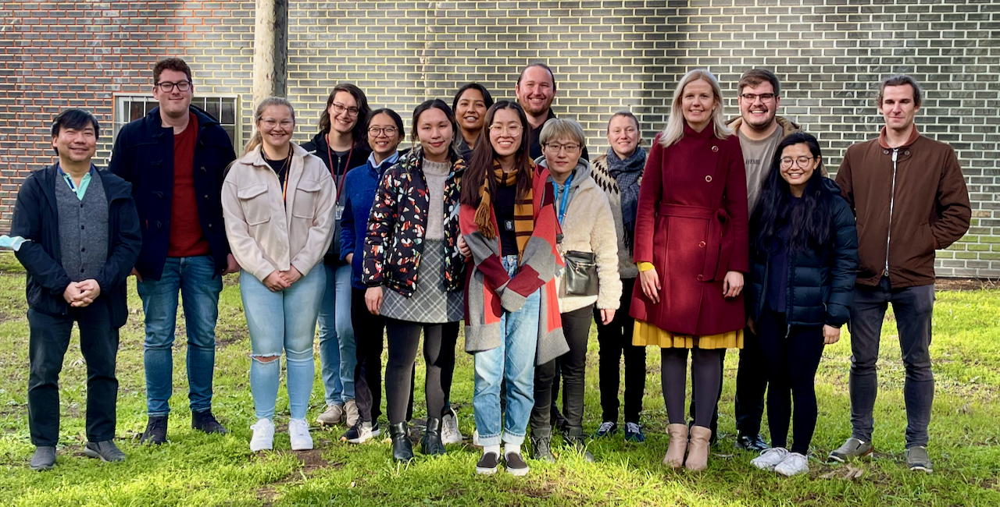

# Acknowledgements

I'd like to acknowledge and thank the following people for helping to make this work a possibility:

First and foremost, none of this work would have been possible without the unfaltering, and constantly positive support from Katya. You have always had confidence in my abilities, even when I've not been able to find the confidence in myself, and I'm sure that you will continue to do so as I tackle a PhD. Your support since I emailed you as an undergraduate at another university has motivated me to keep pursuing better things in academia and your support on a personal level and constant empathy for what I've endured this year has prevented me from giving up entirely.

Secondly, Michelle Coote who through listening to my tired and incoherent ramblings has opened up new avenues of investigation in my work and picked apart some of my less logical thought processes. You have kept my brain in check and ensured that I don't become complacent in my work.

To the staff and facilities of the Monash eResearch centre and MASSIVE, who's support and resources facilitated this research at the most fundamental level. Without computational resources, computational chemistry doesn't happen, and despite a plethora of technical issues, you've pulled through, have been been there when I've needed, and have always responded promptly to any and all service tickets I've had to lodge.

{: style="width: 60%; "class="center"}

{: style="width: 15%; "class="center"}

All the members of the Pas group, who have endured my constant excited posting on Slack, and who have helped me with otherwise illogical issues. It sucks that we've not been able to share an office this past year but hopefully soon we'll be popping out for a cheeky coffee together. In particular to Peter, Michael and Tom who have helped me with all sorts of technical and theoretical queries and issues that I've had over the course of the year. Some of your contributions to my project won't have made it into this work, but will definitely help, going forward.

{: style="width: 80%; "class="center"}

To everyone who has helped to provide feedback on my thesis; Katya, Michelle, Peter, Sophie, Michael and India. You helped me to consolidate my mindless ramblings into a cohesive, polished thesis that's deserving of submission. Thank you.

And finally, to all the members of my personal support network, both academic and non-academic, Michael, Erica, Alex, Rhys, India and Steph, without who I doubt I'd have had the had the emotional energy to make it through it through the year, and deal with the setbacks of research.