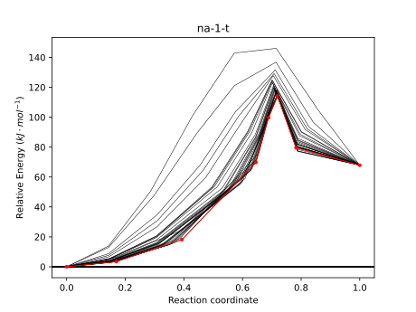
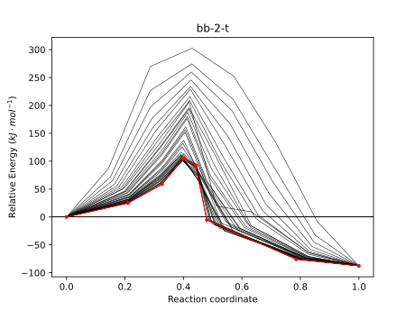
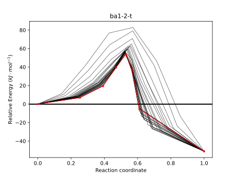
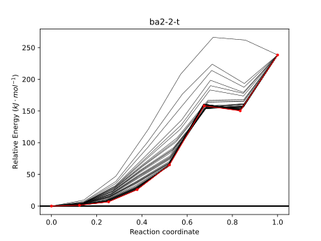

# Week 1

## Monday 8/3

### The Project

I've had some luck over the weekend and have started to optimise the benchmark geometries for my reaction. I'm only really focusing on the cyclisation step, as I assume that this is *the* step we care about. everything else should really be forced by the environment, but this the step that we really want to determine.

I decided that rather than trying the OptTS crap-shoot, I'd optimise the individual start and end point and use the NEB model to find the transition geometry. In ORCA there's also a convenient NEB-TS option that takes the transition state from the NEB calculation and uses it as the basis for an OptTS run, which has been pretty successful so far. though a few jobs are taking just a tiny bit too long and are timing out before the OptTS run. For these I'm just restarting them as OptTS jobs from the NEB minimised TS geometry.

I wrote a little tool to help me plot the NEB paths, called [`visualise_neb.py`](https://github.com/adreasnow/comp-chem-scripts/blob/master/visualise_neb.py). it just takes the `.interp` file from the ORCA output and plots all the pathways in python with `matplotlib`.

|       Non-activated        |  Brønsted base activated   | Brønsted acid (1) activated |                 Brønsted acid (2) activated  (Yeah... I'm working ion it :stuck_out_tongue:)                  |
| :------------------------: | :------------------------: | :-------------------------: | :----------------------------------------------------------: |
|  |  |   |   |

### Modules

I'm really not feeling great about this bit :/
I'm not entirely sure what I should be doing. Perhaps I should be going back to my undergrad study techniques and just spending my time writing notes and reading papers, but some of these topics just have SO MANY slides... It's like Peter Mahon's analytical chem all over again; spending two days writing up notes for two hours of lectures.

At least 'main group chem' and 'organic synthesis' are delivered without slides, making it *slightly* easier to follow along...

## Tuesday 9/3

!!! error "Emotions"
	I'm feeling really quite down tbh... I'm just so terrified of not doing well in the modules that I feel paralysed by it. I should have started writing notes last week, but I feel like I'm already months behind, especially considering how little of the assumed knowledge I actually have. Particularly around main group chemistry and inorganic chemistry. The organic module I feel okay about, the green chem I feel like once I get started on the assignment I should be okay with, supramolecular seems like the assignment is going to be a killer, as well as the sheer amount of content covered in the slides, but main group is just... something else...

MonARCH has been quite non-functional today, so I've just been trying to run jobs locally which has not been working terribly well.

## Wednesday 10/3

MonARCH has still been predominantly offline, so I've migrated to M3, though now none of my jobs are getting picked up :expressionless:
The afternoon was mostly TA work which left me so exhausted that when I got back to the office, I only managed to submit some jobs to get some freqs at ωB97X-D, none of which are getting picked up anyway. I did however, manage to write some notes for main group chem...

On the train home I had a thought; If the Lewis base catalysed pathways is so efficient that it's not usable for our purposes with piperidine, which is KNOWN to be an exceptional catalyst, why aren't I testing with Lewis bases that I *will* be using... This seems really logical in hindsight.

## Thursday 11/3

I spent the train ride in trying to get acetate working as a Lewis base, which it wouldn't do, so once I got to the office, I built up some jobs based around c2mim as a LB. these seem to be going better, though now I need to think about chirality, as forming the product that we want will only happen favourably if the LB attaches on the correct face. I'm also not sure about which way the ethyl group should be facing, if it should be pointing up towards to oxygen, or down towards to aryl groups.

I feel that I should write notes for green chem, but I'm really not sure how much of a silly pursuit that is...

## Friday 12/3

Today has been quite unproductive. I came in an hour late because I slept in, and as soon as I was about to start writing notes, we ended up getting coffee, then Katya and I kept chatting and then there was an hour and a half in which I queued up some jobs before lunch, then metallosupramolecular chem, which drained me so much that now I'm exhausted and so unmotivated to write notes :worried:. I think I might need to try and work through the weekend to try and catch up.

## Saturday 13/3

I'm trying to write these metallosupramolecular chem notes, but it's hard...