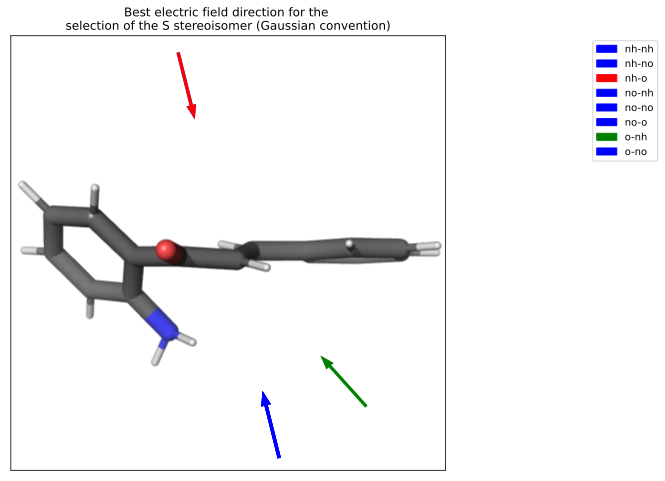
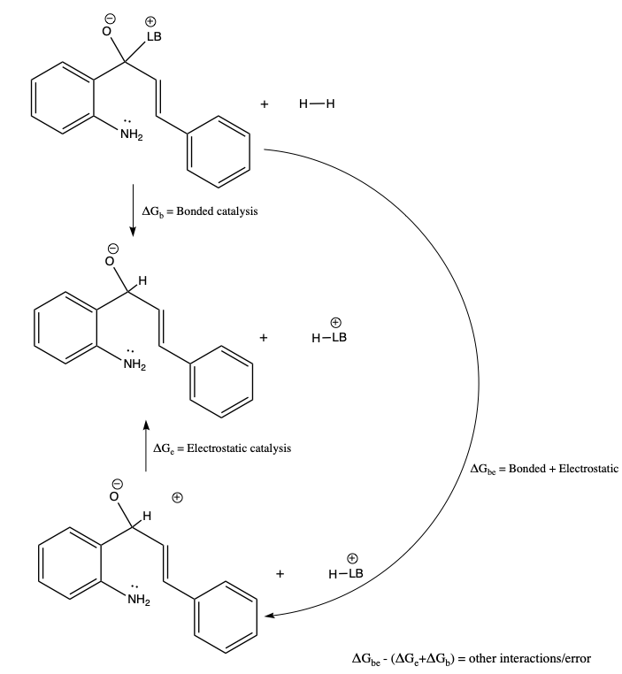
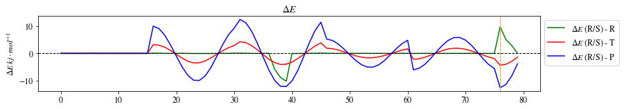

# Week n+7

## Sunday 15/8

### What I did today (and yesterday):

#### 12:36 AM

* I have just done some more work and found that yes, numerical hessians don't give all the incorrect frequencies, which also means that I can use ORCA! (also with the revelation that Gaussian will only read the last axis that you set for an e-field...)
* I've since re-submitted all the static and relaxed bench jobs and have come up with a method that seems to be pretty effective and relatively quick :slightly_smiling_face:
* I'm also trying to push lb2t through, though this probably won't be easy...

#### Later than 12:36 AM

* I've been restarting the derivative scans and trying to find a way to interpret the data, but it's really difficult to find a nice way to visualise it in 2D
* The bench jobs are coming through and there is definitely a big difference in the numfreq over the analytical ones. I did notice a few negative freqs where they shouldn't be though, so I've set the jobs off with `tightopt verytightscf` to see if it fixes it
* Today seems to mostly just be data wrangling, which is easy, but since it's mundane, it's too easy to make stupid mistakes, so I've had to be extra careful
* I re-queued the relaxed bench jobs in the non-priority queue ss that they'll be able to use the extra slots, since I'm just trying to push hard to get everything out!
* The lb2t optts job is plotting along, though it's going to time out soon and go to the back of the queue, so I'm not sure where I should run that to just get it though. maybe I should do the gross thing and run it locally? :/

## Monday 16/8

### What I did today:

* I've really just been pushing jobs through as much as I can, there's not a huge amount to report today...
* I set up a jupyter cell for the interpretation of the efield scans of the R, T and P of na1, as I want to know which efield direction will give the smallest barrier, as opposed to just which will just stabilise the TS, as the field that's stabilising the TS results in the stabilisation of the reactant as well
* I've started trying to do the point charge analysis of the LB pathway, but I'm kind of flailing in the dark atm, as I'm really not sure what I should be comparing to what without a barrier height to go off.

## Tuesday 17/8

### What I did today:

Jobs are starting to get a move on!

* I ended up cancelling the  static bench jobs as they're just producing bad results, so I've given those resources to the relaxed bench jobs which are turning out awesomely! (now that I now how to go about doing it...)
* I'm still pushing through the derivative efield scans, and I'm hopeful that they'll be finished today.
  * I still need to figure out a nice way to visualise them though, maybe a top down diagram with arrows for each derivative's best separation?
* The scanTS job had done a fantastic job, though it's found the configuration that has the ts along the bond I want, but not the LB attached. It's calculating a hessian now, so I should be able to see soon what the vibrational modes look like
* The na1* efield scan jobs are slow and I realised an error in my inputs, where I forgot to change the `opt_type` from `ts`, so I've resubmitted those...

## Wednesday 18/8

### What I did today:

* I was a bit optimistic on getting all the scans through, but only because none of my jobs are getting picked up on M3 atm. I've been pushing through the two jobs that are nearly done though
* My lb2t jobs are a bit of a mess atm, but I'm still figuring things out about how I can get some TS geoms.
* I've started a ZOOM-NEB job so that I can prove that the trajectory between lb2r and lb2t is barrierless
* I tried to plot the optimal R/S separation vectors for the efield scans of the derivatives, but anything that contains an NO2 seems to find the best separation in the same direction

{: style="width: 50%; "class="center"}

* I've come up with a perturbation cycle that I like for figuring out the interaction energy of the piperidine catalyst, but putitng a single +1 charge 3A away led to a lower energy than the piperidine itself, so I'm re-running with CHELPG point charges for each of the piperidine atoms.

  * This specific method ended up with only 16 KJ/mol of stabilisation form the point charge, so I'm not so convinced...

    

{: style="width: 70%; "class="center"}

* I started scripting up my notebook to analyse the R/S scans. I think I've done an alright job, but I won't know until I actually get some scan data of the R isomer
* I really should should start writing things up tomorrow, at the very least, my experimental methodology... after I get tested of course

## Thursday 19/8

### What I did today *(a very quick recap at 10pm after spending the afternoon in bed):*

* I didn't document much because I've been feeling pretty sick (yes, I got tested), but I did get a bit of work done
* I kept pushing through scans and started a new PC freq job, this time just using a whole piperidinium ion
* The NEB job will never work as the piperidine detaches before the bond starts to form, so I've modified the starting point of the NEB trajectory to hopefully bias the bond formation
* I spent a decent chunk of time today just trying to get data processing and figure generation to be as rigorous as possible

## Friday 20/8

### What I did today:

* I'm still feeling quite sick, though at least I did get a negative COVID test, so that's good
* I cleaned up a lot of the jobs that were queued
  * The MD runs had all crashed due to the filesystem errors, so I've restarted them
  * The rxn traj scans have almost all finished, so I pulled out what's done and restarted what isn't
  * The relaxed derivative are almost all done, but s-no-no is still coming along
  * I decided that I should do the o-o jobs should be done for comparison, so they are currently queueing
    * I cam eot the very uncomfortable realisation at 4pm that these are the same as the rxn traj scans -_-_

## Saturday 21/8

### What I did today:

* All of the derivative jobs are completed!! woo!!

* I've found the three specific points in na1r-s that are causing me grief, so I've increased the optimsier dynamic level and have queued that job.

  * Looking closer at the data, I'm starting to think that these aren't actually an issue and they're just areas that are really sensitive to the field!
    The same thing is happening mirrored in the na1r-r for the symmetrical field (note the green line)

  {: style="width: 80%; "class="center"}

* The ωB97X-D ORCA 4 bench jobs for lb2r and lb2p seemed to get stuck as they were processing the basis set, so I've given them 128GB of memory each and have re-queued them

  * This got me thinking about better methods and what I could do to find lb2t and I though, "why not try ωB97M-V?", so I had a look and it performs quite well on a more coarse integration grid and downs't have a particularly large basis set dependence, so I set up an OptTS job running ωB97M-V/def2-TZVP with CPCM water, and RIJCOSX approximations. It's actually surprisingly fast!
    * This makes me wonder if I should try re-doing the bench jobs in a similar fashion, but I won't be able to do analytical freqs, so it might take a while :\
    * Since it's pretty low priority, I've queued these on M3. If they get done, they get done, if not, then as long as I get the ωB97X-D bench jobs through, it's all okay

#### Things I need to do once I have the new scans completed:

* Re-do bench jobs with new R/S field directions and catalysis direction (if different) 
* Catalysis as a function of efield strength

#### Job Times

| Job                                                 | Time (h) | # SCF cycles | Energy         | Memory Used (GB) | Cost (SU) |
| --------------------------------------------------- | :------: | ------------ | -------------- | ---------------- | --------- |
| Gaussian (10 IP) - MonARCH                          |  10:05   | 26           | -14416.1063713 |                  |           |
| Gaussian (10 IP) - Gadi                             |  11:30   | 27           | -14416.1063713 | 14.94            | 368.24    |
| Gaussian w Ghost ILs (10 IP) - Gadi                 |   6:27   | 20           | -709.001510682 | 17.74            | 211.33    |
| Gaussian w Ghost ILs & CPCM(Ethanol) (10 IP) - Gadi |   6:35   | 16           | -709.024908436 | 30.87            | 215.48    |
| Gaussian core only                                  |    -     |              | -708.995468    |                  |           |
| Gaussian w Ghost ILs (10 IP)                        |   6:40   | 20           | -709.001510    |                  |           |
| Gaussian w Ghost ILs & CPCM(Ethanol) (10 IP)        |   6:40   | 16           | -709.024908    |                  |           |

*costs can be reduced by using less memory. Will check the Gadi cost report to see how much was actually used. 

#### R - Efield Scans Matrix

| ↓ left \| right → |               $\ce{NH2}$​               |               $\ce{NO2}$               |                   -                    |
| ----------------- | :------------------------------------: | :------------------------------------: | :------------------------------------: |
| $\ce{NH2}$        | done | done | done |
| $\ce{NO2}$        | done | done | done |
| -                 | done | done | done |

#### S - Efield Scans Matrix

| ↓ left \| right → |               $\ce{NH2}$               |               $\ce{NO2}$               |                   -                    |
| ----------------- | :------------------------------------: | :------------------------------------: | :------------------------------------: |
| $\ce{NH2}$        | done | done | done |
| $\ce{NO2}$        | done | done | done |
| -                 | done | done | done |

#### na1 - Efield Scans Matrix

| Steroisomer |                    na1r                    |                  na1t                  |                  na1p                  |
| ----------- | :----------------------------------------: | :------------------------------------: | :------------------------------------: |
| R           |                queued (80)                 | done | done |
| S           | done (?) | done | done |

#### Relaxed Bench Matrix

| solvent |                  na1r                  |                  na1t                  |                  na1p                  |
| ------- | :------------------------------------: | :------------------------------------: | :------------------------------------: |
| gas     | done | done | done |
| hexane  | done | done | done |
| ethanol | done | done | done |
| dcm     | done | done | done |
| dmso    | done | done | done |
| water   | done | done | done |

#### MD Run Matrix     

| IL                                                |                 na1r-r                 |                na1t-1-r                |                na1t-2-r                |                na1t-3-r                |                 na1p-r                 |                 na1r-s                 |                na1t-1-s                |                na1t-2-s                |                na1t-3-s                |                 na1p-s                 |
| ------------------------------------------------- | :------------------------------------: | :------------------------------------: | :------------------------------------: | :------------------------------------: | :------------------------------------: | :------------------------------------: | :------------------------------------: | :------------------------------------: | :------------------------------------: | :------------------------------------: |
| $\il{C4mpyr}{OTF} - \vec F =0.1\:V\cdot\AA^{-1}$​​​​  | done | done | done | done | done | done | done | done | done | done |
| $\il{C4mpyr}{MSO4} - \vec F =0.1\:V\cdot\AA^{-1}$​​​ | done | done | done | done | done | done | done | done | done | done |
| $\il{C4mpyr}{TCM} - \vec F =0.1\:V\cdot\AA^{-1}$​​  | done |                 queued                 | done | done | done |                 queued                 | done | done | done | done |
| $\il{C4mpyr}{OTF} - \vec F =0.0\:V\cdot\AA^{-1}$​​​  | done | done | done | done | done | done | done | done | done | done |
| $\il{C4mpyr}{MSO4} - \vec F =0.0\:V\cdot\AA^{-1}$​​​ | done | done |                 queued                 |                 queued                 | done | done |              ==running==               |              ==running==               | done | done |
| $\il{C4mpyr}{TCM} - \vec F =0.0\:V\cdot\AA^{-1}$​​  | done | done | done | done | done | done | done | done | done | done |

