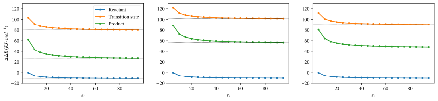
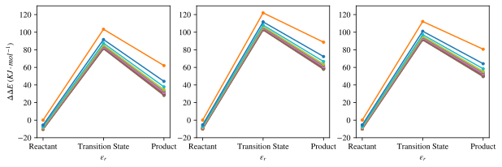
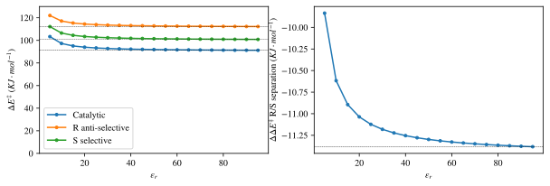
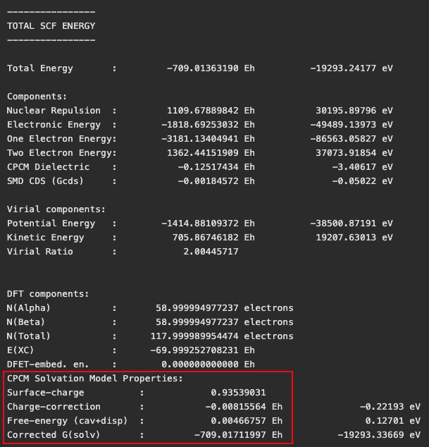
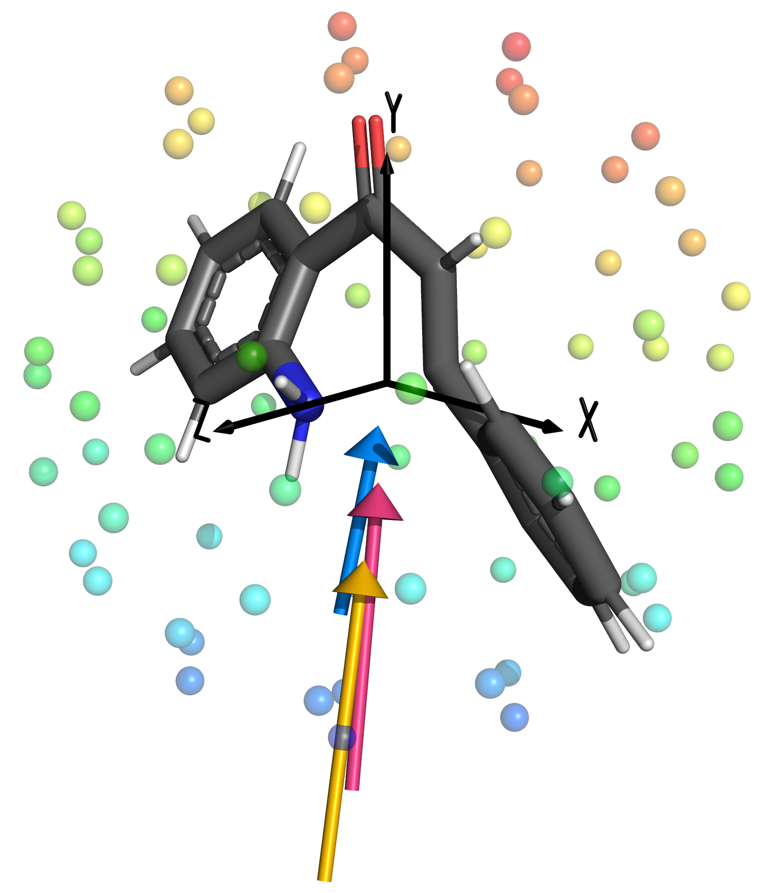
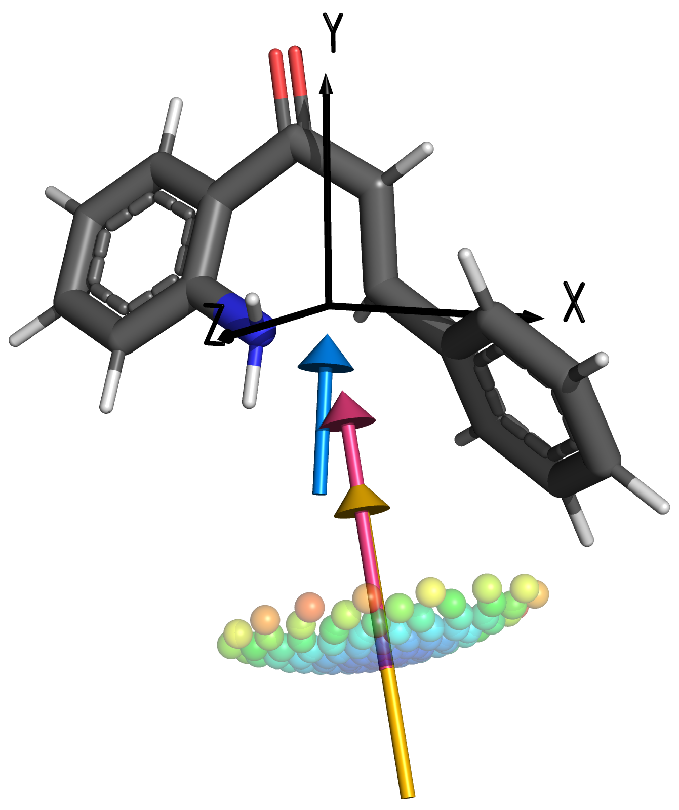
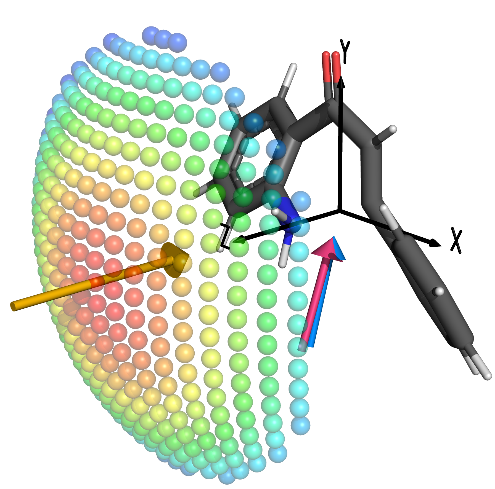
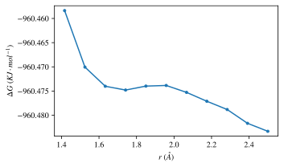

# Week n+10

## Sunday 5/9

### What I did today :

* I'm trying to take a weekend, but I wanted to get these scans out. The relaxed optimisation isn't working with the constraints, so I'm now back to going static geometry, and I'm using single point energy instead of freqs.

## Monday 6/9

### What I did today :

* Meeting with Katya was good! I haver a few things to do though

  * I've just submitted some CPCM scans to see how the solvent dielectric on static geometry facilitates the charge separation in a 0.1 V/Å field
  * Well that was quick... :slightly_smiling_face: The plots below are Catalytic, R, S
  * I've decided to re-do them with relaxed geometries form the relaxed bench scans. it was pretty easy to knock these up in a python script

{: style="width: 85%; "class="center"}

{: style="width: 65%; "class="center"}

{: style="width: 60%; "class="center"}

* I've spent a fair amount of time working on making my figures better, which I think has paid off. I've been trying to colour coordinate my figures so that there's some more consistency between them.
* Something that Katya mentioned was that ORCA doesn't apply all the solvation corrections to the final $\Delta G$ calculations, and that I need to go through and fix that up myself. I had a look through and Katya was saying that it would be easiest to add all the thermal, entropic and enthalpic corrections to the "Corrected G(solv)" energy, but ORCA 5 doesn't print this out, so instead I had to figure out where that energy comes from. It turns out that it's simple the sum of the total SCF energy + charge-correction + free-energy. Since everything that follows from this point is based on the total SCF energy, all you really need to do is take your target energy and add on those solvation corrections, so I wrote up a script that will do that and print out the appropriate energy; corrected $\Delta G$, if frequencies have been calculated, or the corrected "Final SCF Energy" (scf total + dispersion) iterations if no frequencies have been calculated.

{: style="width: 40%; "class="center"}

## Tuesday 7/9

### What I did today :

* The scans of the LB-C bond breaking finished last night and I decided to leave setting up the freq jobs until today, so I've just set them off. With 282 DoF and more atoms than the na1* jobs, they will definitely take longer, but I'm not sure how much longer.
* I extended the gsolv script (above) to another gsolv-z script that will output corrected SCF + ZPVE energies instead of $\Delta G$
  * I took this opportunity to submit them to my GitHub and then added a README so that people can see what these scripts actually do.
* I worked on getting some more figures out, in particular the ones for the efield scans. I used this line as the basis for my display, along with the standard na1t.pdb:
  `plotEField("/Volumes/MonARCH/honours/na1/na1-efield/irc_scans/na1t-efield-irc-precise/na1t-efield-irc-18/efield_perturbation.csv", maxH=230, bubble=5, alpha=0.5)`

|       Rough initial scan       |      Catalytic scan      |     R/S separation scan      |
| :----------------------------: | :----------------------: | :--------------------------: |
|  |  |  |

## Wednesday 8/9

### What I did today :

* I started to get some results out from the lb2t scans that I performed, and they're pretty rough, but I need more frequency jobs to finish to get anything conclusive.
* Today has been a day of cleaning up data to make it all work nicely together in the context of my narrative. I've decided that I need a few more pieces of data, so I:
  * Performed more $\varepsilon_r$ scans of the unperturbed reaction, so that I can report a $\Delta\Delta E$
  * Ran static gas and static ethanol scans of the $F_z$ effects, to show that a different axis will produce different energies.
  * Generated EDD isosurfaces for the TS in gas vs ethanol, so show the extent of the difference of charge stabilisation by the dielectric medium
* I really have spent most of my afternoon just trying to pull figures together, consolidate ones that can be combined and fix up lots of niggle little issues in them and how they flow together.
* I really need to try and find a better way to present the derivatives section, as it's quite ugly atm, then I need to finish my introduction and start just writing.

## Thursday 9/9

### What I did today :

* I decided to go back and think about the LB scans that I just did. Looking at the PES around the LB-C coordinate, there is a small but distinct saddle point, so I'm going to constrain that bond to 1.9 Å and scan the cyclisation bond distance in the same manner.

{: style="width: 40%; "class="center"}

* I also decided to look at the hessian and at this saddle point there is only one negative frequency, and it's for the ring formation, so I'm also going to run a Hessian guided ts-opt, following this mode to see what happens. I'm sure it will collapse, but if I combine both scans, I might find that I can find an even lower energy TS that way, without using the OptTS algorithm at all.
  * The real question here is whether or not I want to just get my benchmark energies using ωB97M-V, and also do the same for the na* pathway, but if I do that, then I won't be able to compare to any other pathways, even if it will be much faster to do it this way.
  * I could/should also repeat this process (scan one coordinate, then the other) with ωB97M-V so that I have a reasonable geometry for the ωB97X-D bench...
    * Maybe I'll set this off now just to be safe, since the hessian doesn't really seem to be all that necessary to get a 
* I've actually been quite productive with my writing and have spent a large chunk of the afternoon just working on my intro which is a good feeling, though I can't shake the feeling that I'm using it to procrastinate writing up my methodology and results...

## Friday 10/9

### What I did today (written on Sunday):

* I was actually really productive, but at this point I've just been working on my write-up
  * I finished off my intro, then was working on my methodology and realised that I needed to go back and write some more things in my intro, about solvation, and TST/thermodynamics. I'll probably also need to do some more work to introduce the DFT functionals, RI approximations and basis set choices, but all in all, it's coming along nicely!
