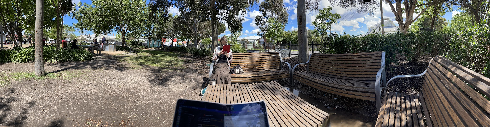
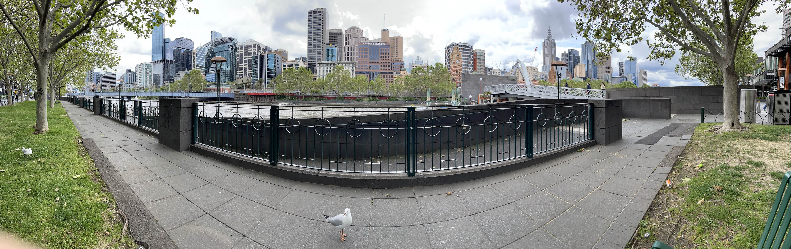

# Week n+15

## Sunday 10/10

### What I did today:

* I finished off the first draft for my presentation

## Monday 11/10

### What I did today:

* I had a meeting with Katya which was mostly just a "you're doing great, just keep pushing through" chat
* Did a little bit of polishing to my presentation 

## Tuesday 12/10

### What I did today:

* It's 2:30 and I've not done a huge amount. I was teaching before, and I watched some honours presentations this morning. Once my teaching hour is up (in case any students pop back in and need a hand), I'll probably practice my talk a bit and maybe try and work on the "Relaxed $\vec F$" section of my thesis.
  * Okay, working on my thesis never happened...

## Wednesday 13/10

### What I did today:

* Gave my final talk
  * It went really well and I was genuinely surprised by how many academics had questions to ask :smile:
* I've been working on the "Relaxed $\vec F$"  section, and I reckon that I need one more calculation which is to obtain rate constants for the $\ce{R1/R2=NO2}$ derivative, so that I can provide an indication of the kind of increases that derivatisation would afford, so I've got that running

## Thursday 14/10

### What I did today:
 * Espresso and tonic in the park to wake me up and hopefully be productive :3

{: style="width: 100%; "class="center"}

 * So I got distracted and have trying to compile Psi4 on ARM64...
    * The good news is that Psi4 actually compiles on my M1 mac now, which is awesome! the bad news is that I've definitely not done much writing today...
 * I've decided that what this thesis really needs is a final benchmarking section to compare the $\ce{R1/R2=NO2}$  deriv in both $\vec F = 0.1$ and $0.2\:V\cdot\AA^{-1}$ as well as to compare the na1 relaxed geom in $\vec F = 0.2\:V\cdot\AA^{-1}$, so I've got those jobs queued atm.

## Friday 15/10

### What I did today:

* Back in the city today I'm starting to get some results out from the new benchmark jobs and they're looking interesting. the $\ce{R1/R2=NO2}$ species has a much higher($21.4\:\kjmol$) barrier in $\vec F = 0.2\:V\cdot\AA^{-1}$ than it does in $0.1\:V\cdot\AA^{-1}$, but the product is more stable by $\sim10\:\kjmol$, so perhaps it's just not been optimised properly, or perhaps that's just how it works. The barrier is still higher than the $0.1\:V\cdot\AA^{-1}$ stabilised non-derivatised species, so perhaps the benefit of the $\ce{NO2}$ groups is limited to stereoselection, which would be pretty cool, since it would mean that the $\ce{NO2}$ groups themselves would ultimately support the stereoselection.

{: style="width: 100%; "class="center"}

## Saturday 15/10

### What I did today:

* I've got all the PyMOL scripts ready to produce the figures for the final section, and have got my Jupyter scrips ready to go as well. I just need the final job to finish!
* The results from the derivatised benchmarks are proving to be really weird and may invalidate some earlier results, but I'm still pushing them through and have started writing bits of my conclusion and abstract

| Job                                  |                    Reactant                    |                  Transition State                  |                    Product                     |
| ------------------------------------ | :--------------------------------------------: | :------------------------------------------------: | :--------------------------------------------: |
| na1 $\vec F = 0.2\:V\cdot\AA^{-1}$   |     Done     |       Done       |     Done     |
| Deriv $\vec F = 0.1\:V\cdot\AA^{-1}$ |     Done     |       Done       | Running (S) |
| Deriv $\vec F = 0.2\:V\cdot\AA^{-1}$ | Running (R) | Running (C/R/S) |     Done     |

#### Writing Tasks

* [ ] Finish off the rest of the drafty first edit, including all of the front/tail matter

* [x] Review the few red points left in the thesis (it's just the intro atm)

* [ ] Add more discussion with comparison to literature 

* [ ] Review the paper by Wang et al. to find any other analysis that you should perform, or any other things that should be discussed.

* [ ] Proof read, proof read, proof read.

#### Writing Matrix

| Section                | Status                                                       | Notes                                                        |    In Progress     |
| ---------------------- | ------------------------------------------------------------ | ------------------------------------------------------------ | :----------------: |
| Abbreviations          | First draft done           |                                                              |                    |
| Abstract               | To do (up to results has been drafted) |                                                              | :white_check_mark: |
| Intro                  | Second draft done          |                                                              |                    |
| Computational details  | First draft done           |                                                              |                    |
| Reaction benchmarking  | First draft done           |                                                              |                    |
| Static $F_Y$           | First draft done           |                                                              |                    |
| Static $F_Z$           | First draft done           |                                                              |                    |
| Static $\varepsilon_r$ | First draft done           | more discussion tying together all of the static scans?      |                    |
| Efield Scans           | First draft done           | I'm not sure what else to add here, but it feels weak.       |                    |
| EDD maps               | First draft done           | perhaps needs a discussion of the implication of these mechanisms? |                    |
| Relaxed $\vec F$       | First draft done           |                                                              |                    |
| Derivatives            | First draft done           |                                                              |                    |
| Final Benchmark        | To do                     |                                                              | :white_check_mark: |
| Conclusion             | To do (future work has been drafted) |                                                              | :white_check_mark: |
| Acknowledgements       | First draft done           |                                                              |                    |
| Appendices             | WIP                       | should I add in lists of partial charges?                    |                    |
