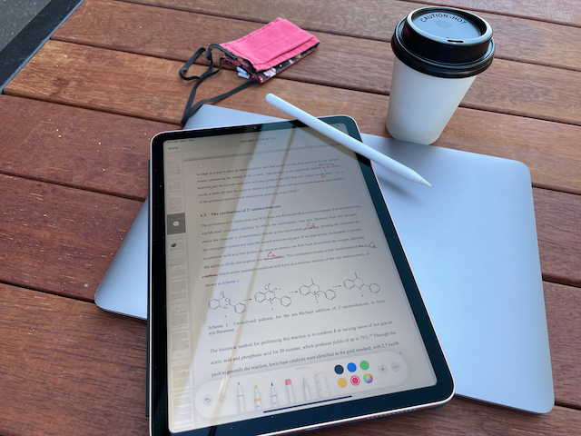

# Week n+18

## Monday 1/11

### What I did today:

* I just had a meeting with Katya in which we went over any little lingering things that needed to be addressed, so I have a few things to implement before It's ready to send of to Michelle.
* I'm probably going to plonk at a cafe and go through my thesis with a red pen after lunch.

{: style="width: 60%; "class="center"}

## Tuesday 2/11

### What I did today:

* Today, I've been continuing on from yesterday's work and have spent most of my day going through my thesis draft 2 with a red pen.

* Red penning has been done, I just need to implement my changes now.

## Wednesday 3/11

### What I did today:

* I've implemented all of my red pen changes and am putting the final touches on to send off my second draft this evening
* Second draft done and sent off for review :smile:

## Thursday 4/11

### What I did today:

* I went over India's thesis for her while waiting for feedback on mine

## Friday 5/11

### What I did today:

* I've started to implement the feedback on my second draft. I think Michelle's is going to involve a fair amount of reading to better understand what's going on.
  * This has been implemented, but I have disregarded some of her advice.

#### Writing Tasks

* [x] Review the few red points left in the thesis (it's just the intro atm)
* [x] Finish off the rest of the drafty first edit, including all of the front/tail matter
* [x] Proof read and tweak
* [x] Implement round 1 feedback suggestions
  * [x] Sophie
  * [x] Peter
  * [x] Alexandr - I'm actually going to ignore a decent chunk of his feedback tbh. His feedback is a bit contentious in places, and he was missing a large chunk of my work/polish when he reviewed it.
  * [x] Katya
* [x] Proof read and tweak
* [x] Review India's thesis
* [ ] Implement round 2 feedback suggestions
  * [ ] Michael
  * [x] Michelle
  * [ ] India
  * [ ] Katya
* [ ] Proof read and tweak
* [ ] Submit
