# Group 14

A fundamental rule of chemistry is that elements of the 3rd row or lower do not form more than one bond with themselves or with other atoms. This is due to larger elements having larger and more diffuse valence orbitals, resulting in poor orbital overlap and ultimately weaker bonding. This can be seen in the image below, as only in the first row elements are $\pi$ bonds significantly strong.

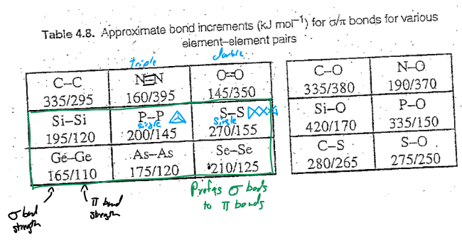{: style="width: 40%; "class="center"}

## Ditetrelenes

The first hint that group 14 elements could form multiple bonds came in the form of a $\ce{Me2Si=SiMe2}$ intermediate. It was theorised that for the reaction below (heating with anthracene), the transformation had to occur via a double bonded intermediate, adding in a [4+2] reaction.

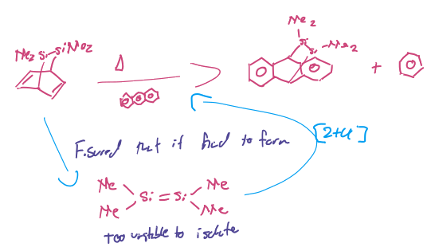{: style="width: 50%; "class="center"}

### 1972

To try and stabilise the this, an alkali metal reduction was attempted to form the above compound with phenyl groups instead of methyl groups

$$
\ce{Ph2SiCl + Li_{(s)} -> Ph2Si=SiPh2}
$$

But instead the following compound was formed

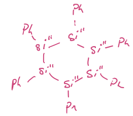{: style="width: 20%; "class="center"}

### 1981 - Bob West

Trying to form the same compound with even bigger $\ce{Mes}$ ($\ce{dimethyl-m-toluene}$) ligands, Bob west managed to make his $\ce{Mes2Si=SiMes2}$ molecule using UV light to break the weak $\ce{Si-Si}$​ bonds,  but noticed that at low temperatures ($<70K$) a **deep blue** intermediate formed that disappeared as the temperature increased ($>77K$).

He could never isolate the intermediate, but he summised that he had formed the disilene, carbene equivalent

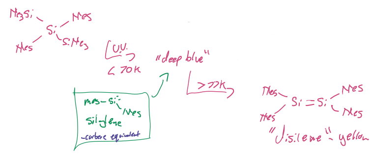{: style="width: 60%; "class="center"}

This process could later be generalised to all group 14 elements

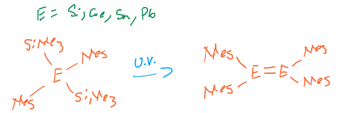{: style="width: 40%; "class="center"}

Bulkier stabilising ligands could also be used, and the reaction was also further simplified with the use of alkali reducing groups. These compounds were named according to their elements.

|      | Silicon   | Gallium    | Tin         | Lead         |
| ---- | --------- | ---------- | ----------- | ------------ |
| Name | disilenes | digallenes | distannenes | dipblumbenes |

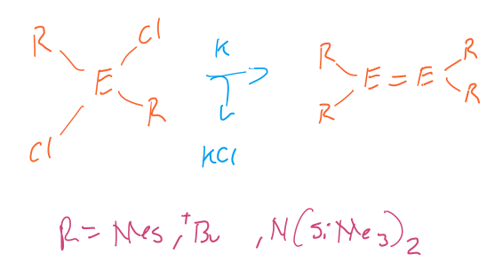{: style="width: 40%; "class="center"}

These compounds are curious though in that they're not planar like their carbon counterparts, and their extra bond lengths don;t increase as much as over their single bonded counterparts.

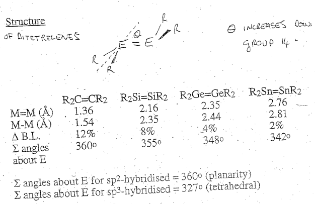{: style="width: 40%; "class="center"}

This was initially thought much like how the group 13 elements bonded, the group 14 elements formed a pair of dative bonds from two singlet fragments, as opposed to alkenes triplet fragments, forming a $\sigma$ and $\pi$ bond

|                            Elkene                            |                          Tetrelene                           |
| :----------------------------------------------------------: | :----------------------------------------------------------: |
|               1 $\sigma$ bond 1 $\pi$ bond               |                        2 $\pi$ bonds                         |
| 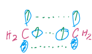 | 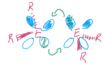 |

## Colour

These compounds have small HOMO-LUMO gaps compared to carbon and thus have quite strong colours.

| Element     | Solid state | Solvent       |
| ----------- | ----------- | ------------- |
| $\ce{E=Si}$ | Yellow      | Yellow/Orange |
| $\ce{E=Ge}$ | Yellow      | Orange        |
| $\ce{E=Sn}$ | Yellow      | Red           |
| $\ce{E=Pb}$ | Yellow      | Deep purple   |

However these species are also strongly solvatochromic. This is because in water, they dissociate and exist in an equilibrium between their double bonded form and their lone pair (carbene analogue) form. As the elements go down the group, the equilibrium shifts to the right, as the inert pair effect makes it more energetically unfavourable for the fragments to come back together, leading the heavier elements to have more colour influence from the carbene form.

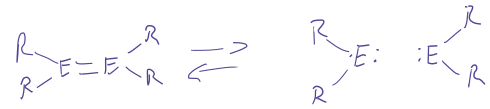{: style="width: 50%; "class="center"}

This has a knock on effect of making the heavier G14 carbene analogues more stable.

### As Ligands

They can also be used as ligands, much as ethylene can, and can even be used in some chemistry similarly to how alkenes are used.

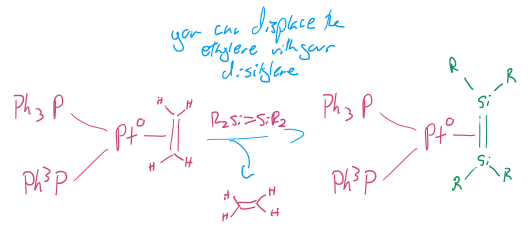{: style="width: 50%; "class="center"}

## Ditetrelynes

Starting with a single ligand, single halide carbene analogue of the group 14 metal, the compound can be reduces with an alkali metal to give the ditetrelyne. These molecules are "isolelectronic" to the digallyne ($\ce{Ar^*Ga#GaAr^*}$).

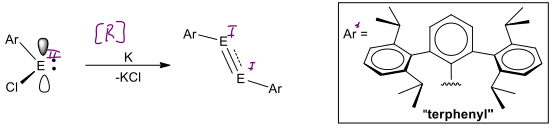{: style="width: 50%; "class="center"}

These really bulky ligands are required to prevent disproporionation.

This was first identified by Phil Power, who tried to make a lead hydride, stabilised by $\ce{Ar^*}$:

$$
\ce{Ar^*PbCl _ Li[AlH4] ->Ar^*PbH}
$$

While he did probably make the hydride form, it likely rapidly decomposed to give the diplumbyne shown in the table below.

$$
\ce{Ar^*PbCl _ Li[AlH4] ->Ar^*PbH -> Ar^*Pb#PbAr^*}
$$

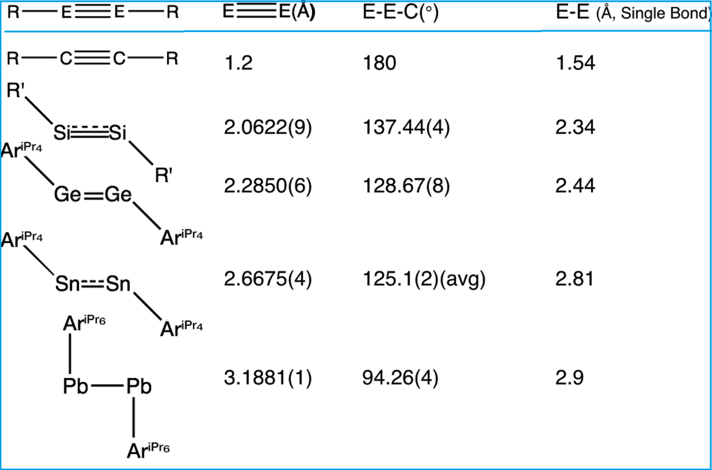{: style="width: 50%; "class="center"}

These compounds behave quite strangely though, as rather than being linear, like the alkynes, they are **trans-bent**, with a decreasing angle the as the rows go down, just as we saw with the ditetrelenes. The bonds also become much weaker and the bond order decreases.

### Robinson's Proposal

If we use the typical alkyne bonding model, we would expect that two quartet state fragments would come together to form one $\sigma$ bond and two $\pi$ bonds.

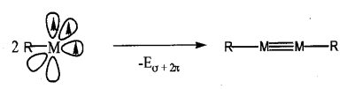{: style="width: 40%; "class="center"}

We can turn back to the simplified model from the ditetrelenes to try and describe how the bonding would change so drastically down the group. Using this model we can say that due to the inert pair effect, each of the singular $\ce{R-E}$ fragments is in a doublet state, and so can't form the three covalent bonds of an alkyne. Instead, the triple bond is formed as one $\pi$ bond and two dative bonds.

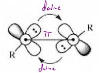{: style="width: 20%; "class="center"}

And since the diplumbynes have angles of nearly $90^\circ$, it would suggest that there is no hybridisation due to the inert pair effect, leading to **only** p-orbital bonding. This would give a pure s-orbital LPE and one p-p $\sigma$ orbital. Since this has a non-directional lone pair, it's a poorly coordinating Lewis base.

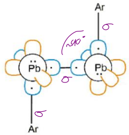{: style="width: 20%; "class="center"}

This description isn't the most satisfactory though, as the bonding would depend so strongly on the rotation of the atoms, that if they rotated slightly out of phase, the whole system would only be joined by a single p-p $\pi$ bond, which would be far too week to hold the atoms together.

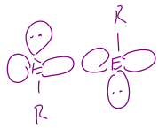{: style="width: 20%; "class="center"}

Another explanation has been put forward, which says that due to the inert pair effect, trans bending occurs to lower the overall energy of the molecule. 

> "By bending the molecule, we decrease the HOMO-LUMO gap enough to get some mixing to stabilise the molecule"

As opposed to the typical p-p $\sigma+\pi+\pi$ combination of an alkyne, the resulting orbitals that form are:

|                   Distorted $\sigma$ bond                    | "slipped" "non bonding" $\pi$ bond  (very slight overlap) |                    Regular p-p $\pi$ bond                    |
| :----------------------------------------------------------: | :----------------------------------------------------------: | :----------------------------------------------------------: |
| 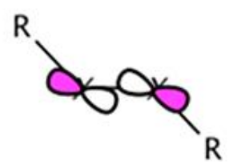{: style="max-width: 100px; "class="center"} | 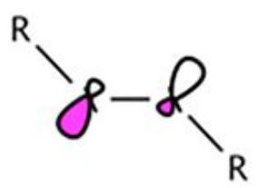{: style="max-width: 100px; "class="center"} | 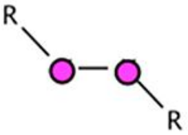{: style="max-width: 100px; "class="center"} |

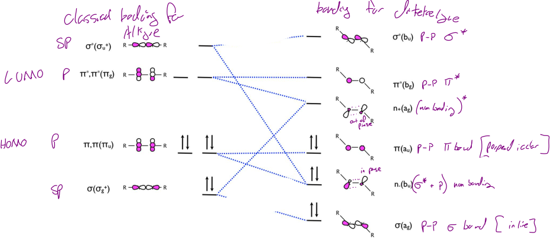{: style="width: 80%; "class="center"}

These ditetrelynes are extremely reactive as they have a very small HOMO-LUMO gap, much closer to what's found in transition metals, which makes these potential non-toxic alternatives to heavy transition metals.

An example of this reactivity is the hydrogenation of the germanium carbene analogue, which can facilitate the breakage of the $\ce{H-H}$ bond.

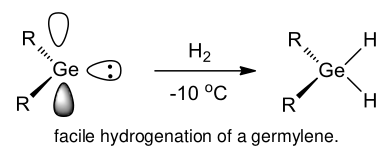{: style="width: 30%; "class="center"}

It does this by donating it's very basic LPE into the $\ce{H2}\:\sigma^*$ orbital, while the 2, $\ce{H2}\:\sigma$ electrons are donated into the empty p-orbital.

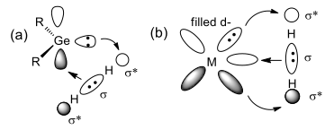{: style="width: 30%; "class="center"}

## Metal Carbynes (Metal Allkylidines)

Are characterised by the structure:

$$
\ce{L_nM#E-R}
$$

With the carbon based version of this molecule, the molecule is linear and is useful for making asymmetrical alkynes (different substituent at each end).

These compounds can be produced via salt elimination:

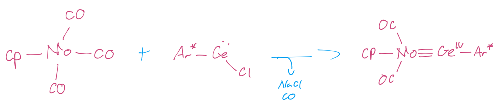{: style="width: 75%; "class="center"}

The question was posed, would *these* be linear like their carbon counterpart, or would they also be trans-bent?

-1617066167721.png){: style="width: 50%; "class="center"}

While you might assume that they would be trans bent, as they would need to form from two quartet state (sp3 hybridised) fragments, the inert pair effect would prevent this from occurring.

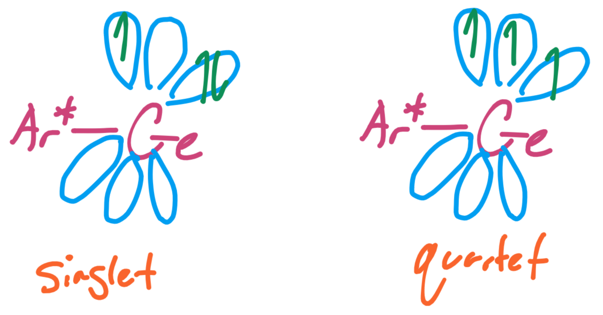{: style="width: 30%; "class="center"}

However because only one excitation is required to form the metal carbyne, compared to the two required for a linear ditetrelyne

-1617069866343.png){: style="width: 60%; "class="center"}

There should be an equivalent amount of bond stabilisation from both the systems forming linear triple bonds, but the promotion energy required to get the two Ge fragments into the quartet state is too great in the digallyne.

.png){: style="width: 60%; "class="center"}