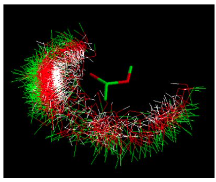

# Crystal Engineering Grammar

**Periodicity** can be described by its **dimensionality**:

* 0D - nonperiodic
* 1D - linear/polymeric
* 2D - periodic planar
* 3D - periodic in all directions

Ligands can be either **convergent** (binding back to the same centre) or **divergent**, (binding to different centres), Divergent ligands can form periodic systems, where convergent ones cannot.

{: style="width: 30%; "class="center"}

**Capping ligands**, such as Cp* can also prevent the crystal from growing as they will only coordinate with one metal centre

Supramolecular chemistry and crystal engineering depend on the ability to **control the intermolecular interactions** between molecules.

The way that molecules pack in the solid state will effect most of its physical properties, such as magnetic properties, electrical properties, optical properties, hardness, brittleness, porosity, solubility, and melting point.

An example of this is that alkanes pack in two distinct series; the odd chained and even chained alkanes have different intermolecular interactions to each other, so the odd length chains pack less efficiently than the even chain lengths, giving them a lower melting point

{: style="width: 30%; "class="center"}

**Polymorphs** are crystals with the same components and stoichiometry, but different bonding topologies.

In the pharmaceutical industry, patents only apply to a single morphology of a compound, as the compound's physical **morphology** is going to be fundamental to its function.

**Concomitant polymorphs** are different structures that crystallise from the same reaction mixture

**Psuedo-polymorphs** only differ in the type of solvent molecules included in the structure. Historically, these have been called "solvates"

Just as in organic chem, pesudo-polymorphs can form a **kinetic** and a **thermodynamic product**, with the kinetic product forming initially, but slowly being redissolved and transformed into the thermodynamic product over period of time.

**Co-crystals** are crystals that contain two or more compounds. All the components of the crystal have to be solid at room temperature.

Depending on the morphology of the crystal, it may be more or less susceptible to reaction. In the solid phase, the yields of a crystal will be 100%, as there is entropic assistance from the reactants all being in the correct configuration to react. Reaction that occur in the solid phase are called **topochemical** reactions.

{: style="width: 30%; "class="center"}

Much like **synthons** in organic chemistry represent ideal synthetic fragments, synthons in crystal engineering represent ideal fragments for the construction of predictable intermolecular bonds. They range from strong hydrogen bonds, to halide bonds, π-π interactions, CH-π interactions, and dispersion forces as the weakest.

{: style="width: 30%; "class="center"}

**Tectons** on the other hand are the organic builder fragments that contain the synthons. These include components of synthons and may contain multiple different synthons to be **polyvalent**

## Hydrogen Bonding

**Hydrogen bonds** are some of the most simple interactions, but can be extremely powerful.

{: style="width: 40%; "class="center"}

One major downside is that they're not particularly selective in how they bond, so they can bond in many different ways to many different things. They are however reliable, reproducible and predictable, and can be quite directional. By coupling them together, we can get even stronger interactions, such as DNA base pair binding and carboxylic acid dimers.

!!! info "Database Probing"
	One way to determine which bonding is more likely to occur is to probe a crystal database, such as the Cambridge Structural Database (CSD), Protein Data Bank (PDB) or Inorganic Crystal Structural Database (ICSD) to see which structure forms more commonly.
	
	{: style="width: 40%; "class="center"}
	
	Here is an example of a probe, here looking at thiocarbonyl hydrogen bonds to see at what angle and length they will occur at most frequently.
	
	{: style="width: 30%; "class="center"}
	
	We can also plot binding locations as a distribution function to show a particular synthon's probability to bind in 3D space.
	
	{: style="width: 30%; "class="center"}

A series of rules by Etter (**Etter's rules**) have been laid out to describe how hydrogen bonding will work

1. All good hydrogen bond donors and acceptors will be used in hydrogen bonding
2. Six membered ring intramolecular hydrogen bonding is preferred over intermolecular hydrogen bonding
    {: style="width: 40%; "class="center"}
3. The bonds form in hierarch of strongest acceptor with strongest donor, then second strongest acceptor with second strongest donor, and so on

    {: style="width: 40%; "class="center"}

### CH-X

There are also other, weaker hydrogen bonds, that can occur. In these cases it can be useful to use the vdW radii as a cutoff for interaction (is the distance within the vdW radii of the two atoms). These acceptors include π systems, such as aromatic rings and alkynes, as well as electronegative atoms.

In benzene the crystal structure is actually more dominated by CH-π interactions that π-π stacking.

Looking at the interaction between carbonyls and other donors, alkene and alkyne protons can also act as donors in hydrogen bonding.

## π-π Stacking

Is the stacking between aromatic systems, typified by that of graphene, which stacks $3.3\AA$ apart. We consider distances of $3.6\AA$ to be sufficient to call π-π stacking.

In these systems, the rings aren't usually directly on top of each other, but are slightly offset, as there will be some exchange-repulsion if the $e^-$ clouds overlap too much. This allows the aromatic protons to interact with the π cloud.

### Phenyl Embraces

Can occur between molecules with multiple phenyl groups and can either be **edge to face** (ef) or **offset face to face** (off).

When multiple phenyl groups are on ions, they can overcome repulsive electrostatics and have strengths that rival hydrogen bonds.

Common motifs include the 4 fold and 6 fold edge to face phenyl embraces. Sixfold Phenyl Embraces are known as SPE.

{: style="width: 40%; "class="center"}

## Halogen Bonding

Is where carbon bound halides (excluding F) can act as electrophiles to form bonds with nucleophilic atoms, such as nitrogen ($\ce{-R}\color{red}\ce{N...Br}\color{black}\ce{-CF2-R}$)

### σ-Hole

Highly polarisable halogens will be polarised by whatever they're bonded to, creating a slight +ve charge that can interacts as a bond

{: style="width: 30%; "class="center"}

## Metallophilic Bonding

Certain closed shell $d^{10}$ metals an also form weak interactions between themselves due to relativistic effects that can also rival hydrogen bonds

* Cu: Cuprophilic
* Ag: Argentophilic
* Au: Aurophilic

## vdW and Electrostatic interactions

These are important but aren't the most useful *for engineering* as they're not particularly directional and can be quite weak.

## Metal Coordination Bonds

These are probably the most important bonds as they are the strongest, most directional and most predictable, but are still weak enough to be reversible, allowing for the thermodynamic product to form.

