# Crystal Engineering Design

We need suitable tectons which assemble using good synthons to be able to design a crystal structure.

## Coordination Polymers

Are polymers in which metal ions are connected by bridging ligands. These are much more regular than organic polymers, as the reversibility of the metal coordination bonding allows them to self correct and form the thermodynamic product. These can be 2D or 3D, where organic polymers are typically cross linked 1D networks.

## Nets

Are a useful way to understand, describe and design crystal structures in terms of topological networks. The structure is reduced down to a graph of nodes and connections.

There are multiple ways to obtain a desired geometry

* We can control the geometry of the bridging ligands
* We can control the geometry of the metal centres

For example

* Tetrahedral $\ce{Zn^{II}}$ with linear $\ce{C#N}$ linkers will give a tetrahedral geometry gives us a diamond network
* Tetrahedral $\ce{Cu^I}$ with tetrahedral $\ce{C(PhC#N)4}$ linkers also gives us a diamond network, but  with much larger pores. The tetrahedral centres alternate between metal and ligand

### Typical Ligands and Metals

Given how formulaic this process can be, we can  make a list of typical ligands and metals

| Geometry            |                         Metals                          |                           Ligands                            |
| ------------------- | :-----------------------------------------------------: | :----------------------------------------------------------: |
| Octahedral          |                   divalent 3d  metals                   |                                                              |
| Tetrahedral         |           $\ce{Cu^I, Ag^I, Zn^{II}, Cd^{II}}$           | {: style="width: 60%; "class="center"} |
| Square Planar       | $\ce{Pd^{II}, Pt^{II}}$, octahedral with pyridyl donors |                                                              |
| Bent                |                                                         | {: style="width: 60%; "class="center"} |
| Trigonal            |  octahedral with chelating ligands, $\ce{Cu^I, Ag^I}$   | {: style="width: 60%; "class="center"} |
| Linear              |          $\ce{Cu^I, Ag^I}$, metal bis-chelates          | {: style="width: 60%; "class="center"} |
| Higher Connectivity |          fancy ligands  up to 12 coordination           |                                                              |

### Secondary Building Units (SBU)

These can be thought of as a secondary structure. It's a substructure motif which can be used to build the overall structure. These are typically built with known molecular analogues. For example, the tetrahedral motif below.

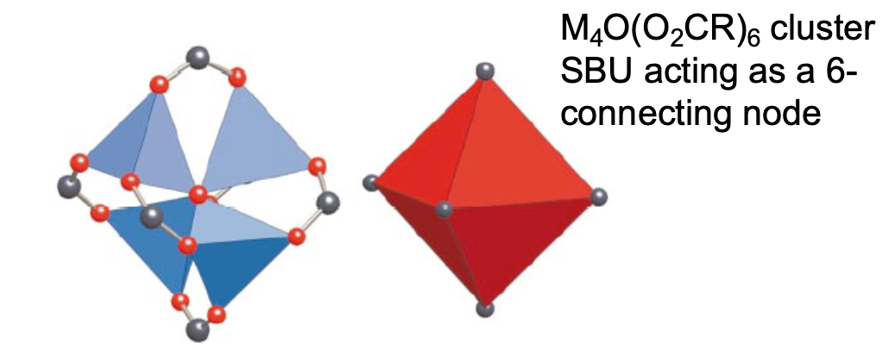{: style="width: 30%; "class="center"}

Many of these motifs can be combined to form complex structures,  such as below, we have  $\ce{M2(O2CR)4}$  SBUs acting as square planar nodes and adamantane tetracarboxylic acid acting as a tetrahedral node (the COOH groups have been omitted)

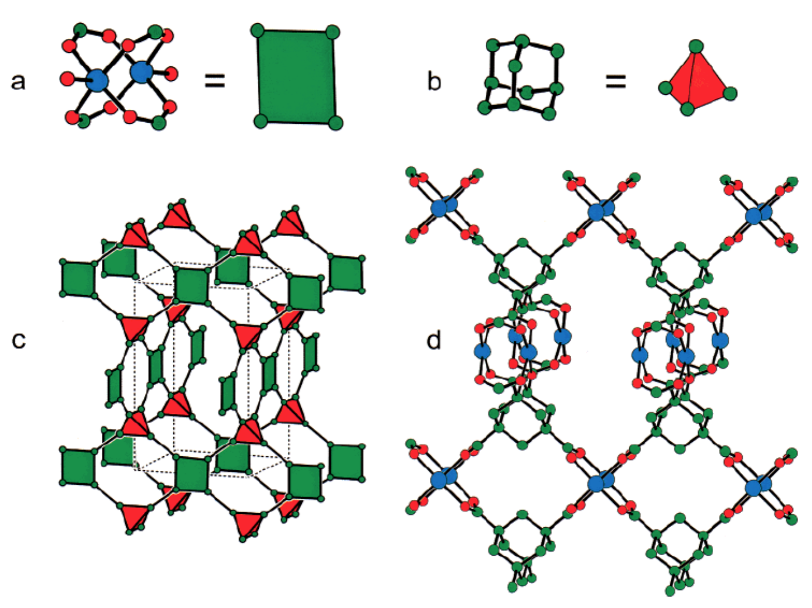{: style="width: 60%; "class="center"}

If instead we used (linear) tetraphalic acid linkers, we would end up with a 2D network (sheet)

### Describing Topology

Topology is all about the connectivity, not the shape, so all the linkers shown below have three points of connectivity, despite one being T-shaped, one having chelating ligands (polydentate),and one bridging through multiple ligands.

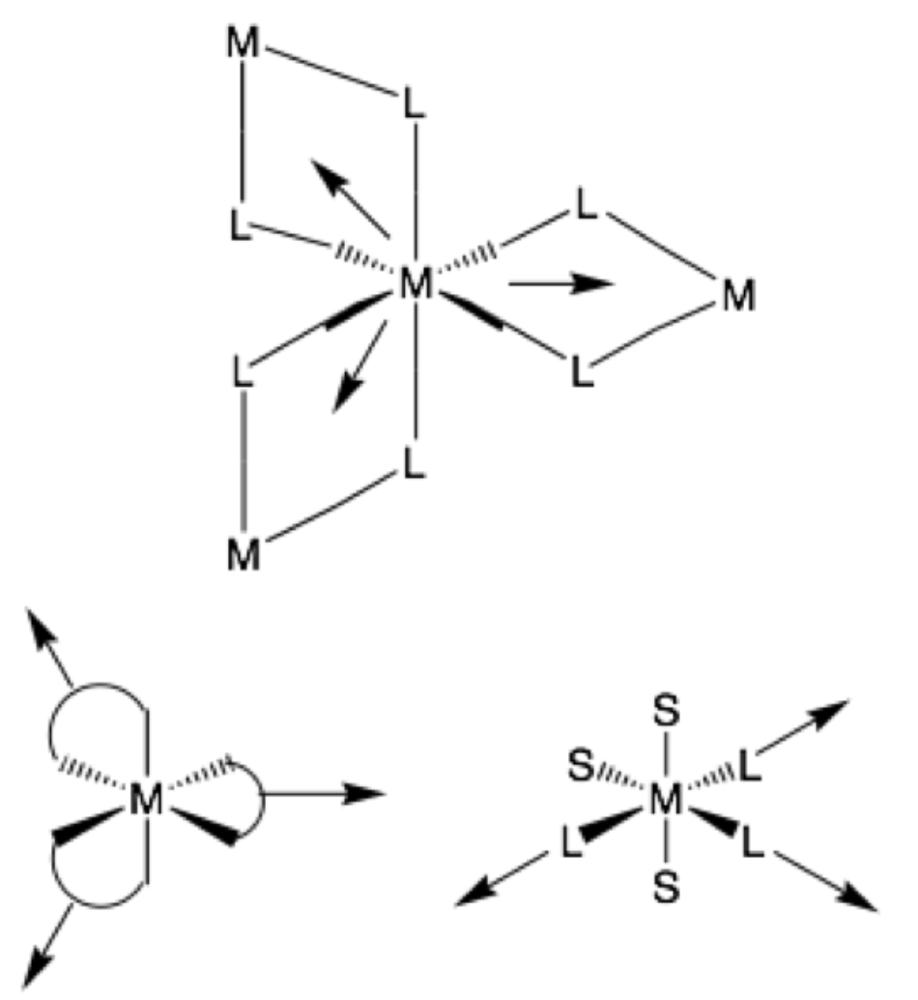{: style="width: 20%; "class="center"}

So a tetrahedral planar structure would be reduced down to a flat grid of a net.

{: style="width: 50%; "class="center"}

In topological descriptions, anything making two connections is a link (a  straight line) and anything making more than two connections is a node (a junction, or dot).

### Naming Networks

* Networks can be named after model geometries, such as "diamond", or "simple cubic"
* Wells notation (10,3)-a, (10,3)-b
  * Where the first number  is the size of the smallest circuit
  * The second number is the connectivity
  * The letter orders them in order of how symmetrical they are
* Schläfli symbol $4^4.6^2$
  * For a node, the number represents how many nodes are in a ring
  * The power represents how many pairs of bonds have that connectivity
    * If there are multiple ways to connect a node to itself through bond pairs, then dot notation is used.

{: style="width: 40%; "class="center"}

In the first geometry above, if the bond pairs  are on opposite sides of a node, the ring has to go through 6 nodes to get back to the beginning, but if the bonds are perpendicular to each other, then the rings are only 4 membered. 

### Combining Networks

Networks can combine in three main ways:

* Interdigitation - The networks poke in to each other. They are intruding in the other network

{: style="width: 40%; "class="center"}

* Intercalation - The networks stack to form channels

{: style="width: 40%; "class="center"}

* Interpenetration - The networks are physically interlinked in a way that makes them inseparable without breaking connections

{: style="width: 40%; "class="center"}

### Interpenetrating Networks

Can be described through the $mD(/nD)\to pD$ notation

#### $1D\to1D$ Parallel Interpenetration

The two 1D networks are interprenetrating in a parallel fashion

{: style="width: 40%; "class="center"}

#### $1D\to2D$ Parallel Interpenetration

Two 1D networks are interpenetrating in an alternating parallel manner to form an overall 2D network

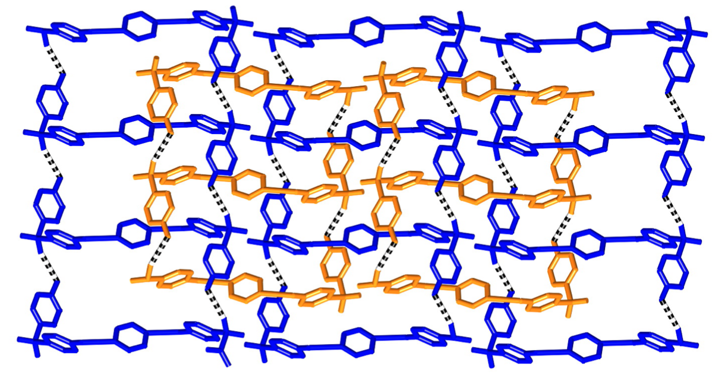{: style="width: 40%; "class="center"}

#### $1D\to3D$ Inclined Interpenetration

Multiple 1D networks are combining in a non-parallel manner to form a 3D network

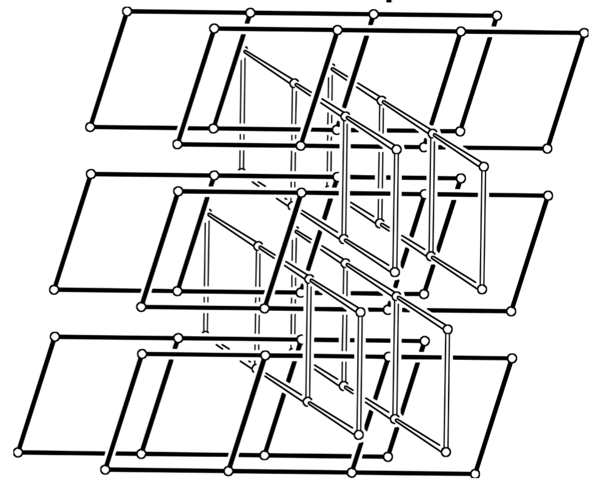{: style="width: 40%; "class="center"}

#### $2D\to2D$ Parallel Interpenetration

 Multiple 2D networks can combine in sheets to form another 2D interpenetrating network

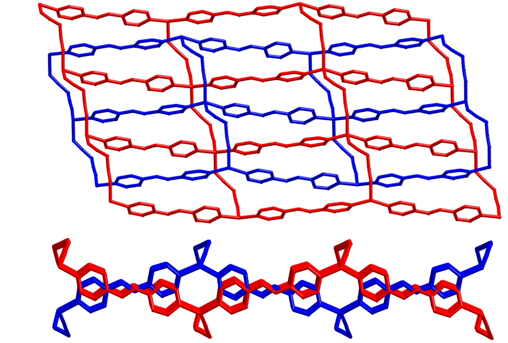{: style="width: 40%; "class="center"}

#### $2D$ Inclined Interpenetration

The $\to3D$ is implied, as inclined interpenetrating networks of the same dimensionality will always increase the number of dimensions. This is not the case for parallel networks.

{: style="width: 40%; "class="center"}

#### $1D/3D$ Interpenetration

The $/$ notation indicates that networks of multiple dimensionality are used to form the network. The lack of a $\to xD$ implies that the dimensionality is not increased as a result

{: style="width: 40%; "class="center"}

### Self-Penetration

Certain networks will even interpenetrate themselves. This seems to be pretty common for $\ce{R-C#N}$ linkers.

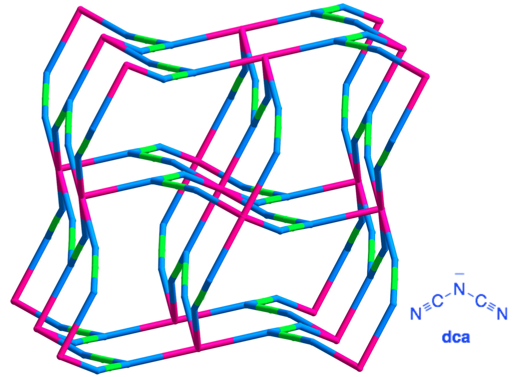{: style="width: 40%; "class="center"}

## Design Challenges

### Linking Issues

The building blocks won't always behave as they should. Metal centres might not take on the correct geometry/oxidation state, organic linkers might be flexible and chelate, some linkers might coordinate in multiple manners, (e.g. $\ce{C#N-N^--N#C}$ coordinating with three metals instead of two), or the metals might coordinate at the wrong site (e.g. $\ce{M-N=N=N-M}$ vs $\ce{N=N=NM2}$)

The same connectivity might result in different geometries, e.g. all the geometries below are from 4-connecting linkers

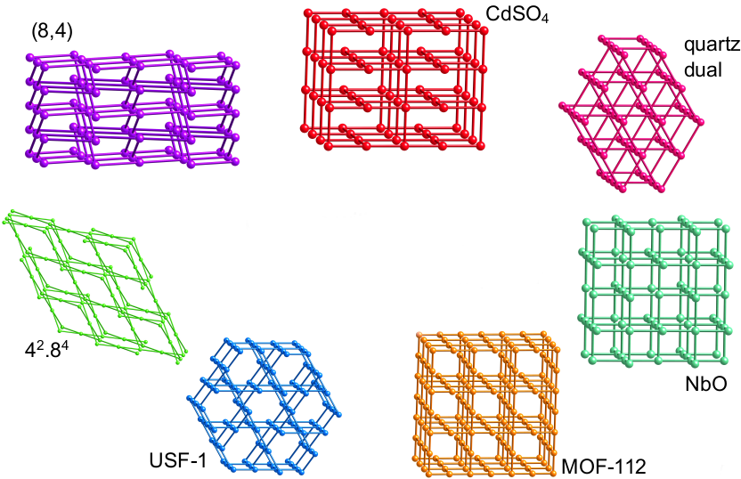{: style="width: 40%; "class="center"}

### Packing Issues

The way in which the networks pack may not be easily predictable. Controlling interdigitation, intercalation (what types of ) and interpenetration can be tricky, especially considering the potential for polymorphism and pseudopolymorphism. 

### Templation

In the case below, the counterions are **templating** the crystal, so the resulting structure is going to be based aroud that geometry

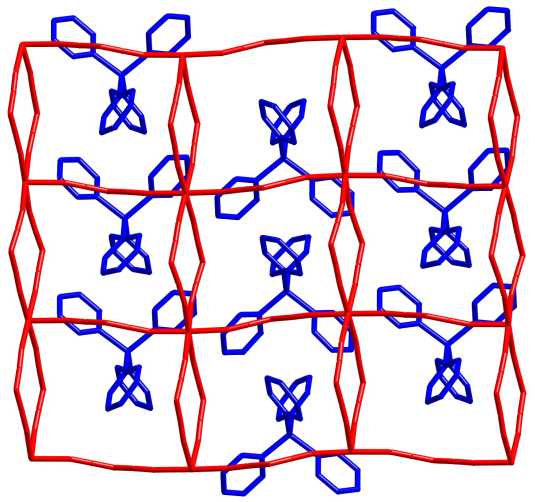{: style="width: 40%; "class="center"}

For the same framework, just by using a different counterion ($\ce{MePh3P}$ instead of $\ce{Ph4P}$), we can completely change the geometry.

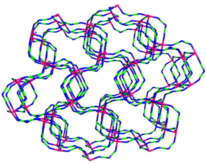{: style="width: 40%; "class="center"}

This is particularly prevalent for $\ce{Cd(CN)2}$ derivatives.

|                        $\ce{Cd(CN)2}$                        |                     $\ce{Cd(CN)2.CCl4}$                      |                 $\ce{Cd(CN)2.2/3H2O.^tBuOH}$                 |
| :----------------------------------------------------------: | :----------------------------------------------------------: | :----------------------------------------------------------: |
|              Two interpenetrating diamond nets               |                       One diamond net                        |                         Moganite net                         |
| 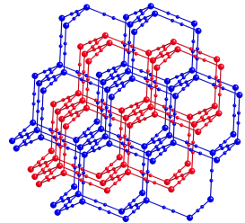 |  |  |

### Synthetic Approach

Depending on the synthetic approach, you might not end up with full polymerisation. It's possible to end up with the same components forming discrete molecular complexes instead. 