# Host-guest Systems

Depending on the binding constant $K_A$, the system will either be sensing (low binding) or sequestering (high binding). Sequestering species might be able to get away with lower selectivity than sensing species.

Early host-guest chemistry started with dibenzo-crown ethers, which would be templated by the presence of alkali metals in solution

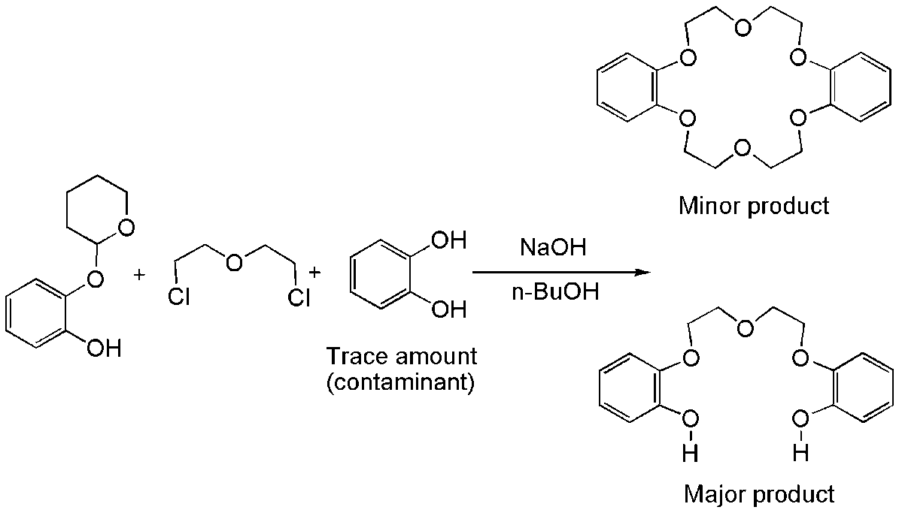{: style="width: 60%; "class="center"}

Templating typically happens in an exo fashion, where a macrocycle is made around a template guest species, and the bound components are then reacted to form the macrocycle. Otherwise, rather than getting a macrocycle, you'd end up with a mess of polymeric byproducts.

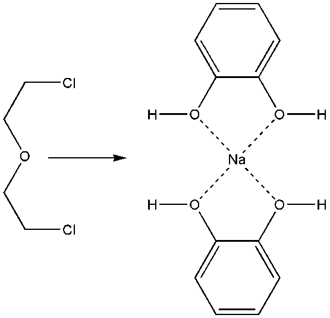{: style="width: 20%; "class="center"}

### Kinetic Template Effect

In the kinetic template effect, the metal serves not only to template the formation of the macrocycle, but also to catalyse the formation of the product.

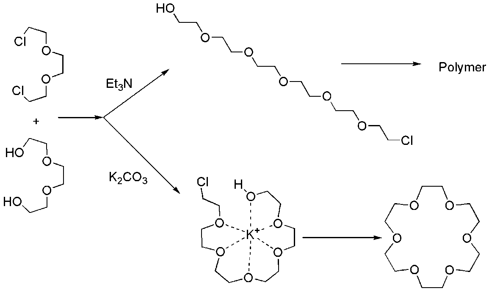{: style="width: 40%; "class="center"}

Though since the kinetic templates will ultimately be very stabilising, they can be quite difficult to remove. Some approaches to accomplishing this include:

* If the coordinating metal is weakly associating ($\ce{K+}$) it can be washed out with water
* Strongly coordinating metals, including transition metals can be removed by using strongly coordinating anions such as cyanide
* The chemical nature of the macrocycle can be changed, such as converting bases to free amines
* Metals can be oxidised/reduced to more labile forms that can subsequently be washed out

### High Dilution Synthesis

Another approach to making macrocycles is to do so at low enough concentrations that the chance of self interaction is much higher than that of interaction with another reactive species, however this is an incredibly environmentally unfriendly method.

## Cation Binding Receptors

The size and fit of the guest molecule is a really important factor in the binding constant. In the table below (binding constants as $\log{K_A}$ ), we can see that potassium which has the least puckered fit in the crown ethers has the highest binding constants. There is less conformation strain required for binding to occur.

| Crown Ether |$\ce{Na+}$ | $\ce{K+}$ | $\ce{Cs+}$ | $\ce{NH4+}$|
| ---------------------- | :--------------------------------: | :--------------------------------: | :--------------------------------: | :--------------------------------: |
|                        | 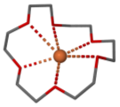 | 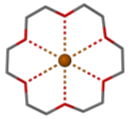 | 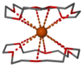 | 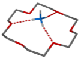 |
| [12]crown-4            |                1.70                |                1.30                |                 -                  |                 -                  |
| [15]crown-5            |                3.24                |                3.43                |                2.36                |                3.03                |
| [18]crown-6            |                4.35                |                6.08                |                3.90                |                4.14                |
| Benzo[18]crown-6       |                4.30                |                5.30                |                3.50                |                 -                  |
| Cyclohexano[18]crown-6 |                4.09                |                5.89                |                 -                  |                 -                  |

### Chelate Ring Binding

The charge of the metal obviously plays a big role in the strength of the ion-dipole interactions, though the size of the chelate ring also plays a role in preferential binding. Larger metals prefer smaller 5-membered rings, while smaller metals prefer 6-membered rings.

This is due to the donor atoms in the 5-membered ring diverging, allowing for larger metals to fit.

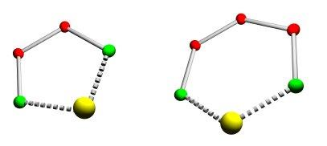{: style="width: 30%; "class="center"}

### Phase Transfer Catalysis

Since crown ethers are flexible rings, they can invert, putting their polar oxygens on the outside making them more water soluble. This can be used to the advantage of separation, as the binding of a metal centre to to the ether will flip it, making the hydrophobic components sit on the outside. If this happens within a biphasic system, the occupied crown ether will partition into the non-polar solvent, while the unoccupied one will say in the aqueous phase.

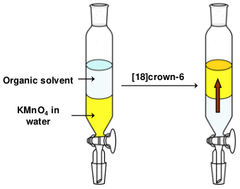{: style="width: 30%; "class="center"}

This can be extremely useful when trying to get ionic species into non-polar solvents, since if you put a highly charged species into a crown ether and it migrates from the aqueous to the organic phase, the counter-ion will be dragged along with it. This can be used to make $\ce{KMnO4}$ soluble in organic solvents.

### Naked Ions

Macrocycles will, however, leave the ion partially exposed, allowing it to interact with it's remaining counter-ion still in solution. It's possible to fully encapsulate the ion, to leave it's counter-ion "naked in solution"

### Lariat Ethers

One approach is to use lariat ethers, which have arms that swing out from the macrocycle to encapsulate the ion completely. 

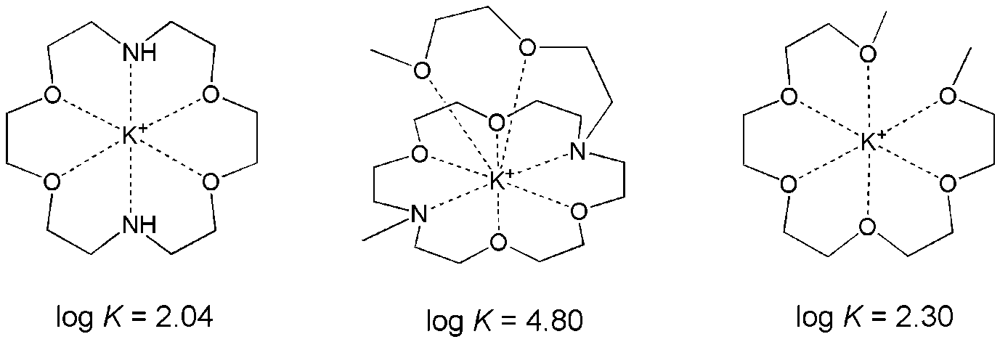{: style="width: 40%; "class="center"}

They can have one or more lariat arms.

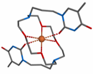{: style="width: 25%; "class="center"}

### Cryptands and Spherands

It's also possible to use bicycles to encapsulate the ion in more directions, making a 3D flexible cage. These have a much stronger ($\times10^4$) affinity than their respective macrocycles

|             [2.2.1]cryptand Selective for Na             |             [2.2.2]cryptand Selective for K              |                          Spherand-6                          |
| :----------------------------------------------------------: | :----------------------------------------------------------: | :----------------------------------------------------------: |
| 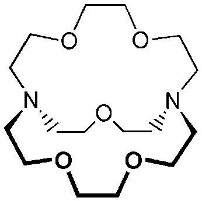{: style="max-width: 150px; "class="center"} | 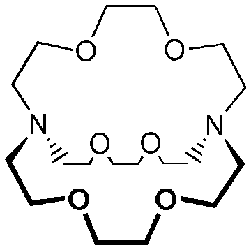{: style="max-width: 150px; "class="center"} | 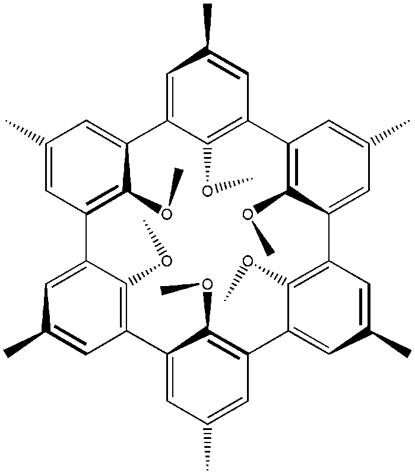{: style="max-width: 250px; "class="center"} |

Spherands are the most pre-organised macrocyclic receptors,, and have an octahedral array of oxygen donors. The binding constants are significantly higher than crown ethers ($\log K_A=16\text{ for }\ce{Li+})$), due to how unfavourable the interactions of all the oxygens are.

### Calixarenes

Are polymers of *p*-substituted phenols and formaldehyde, and are termed calix[n]arenes based on how many monomers are int he ring.

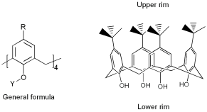{: style="width: 30%; "class="center"}

## Anion Binding Receptors