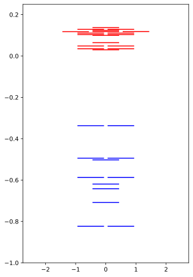
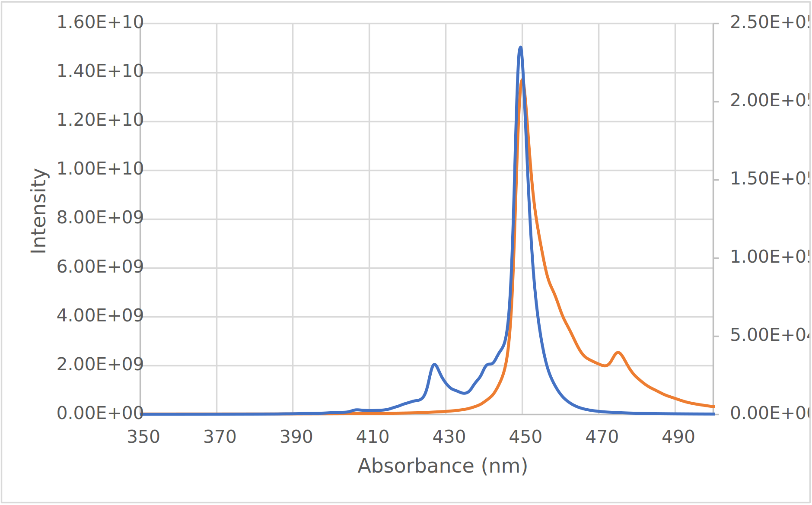
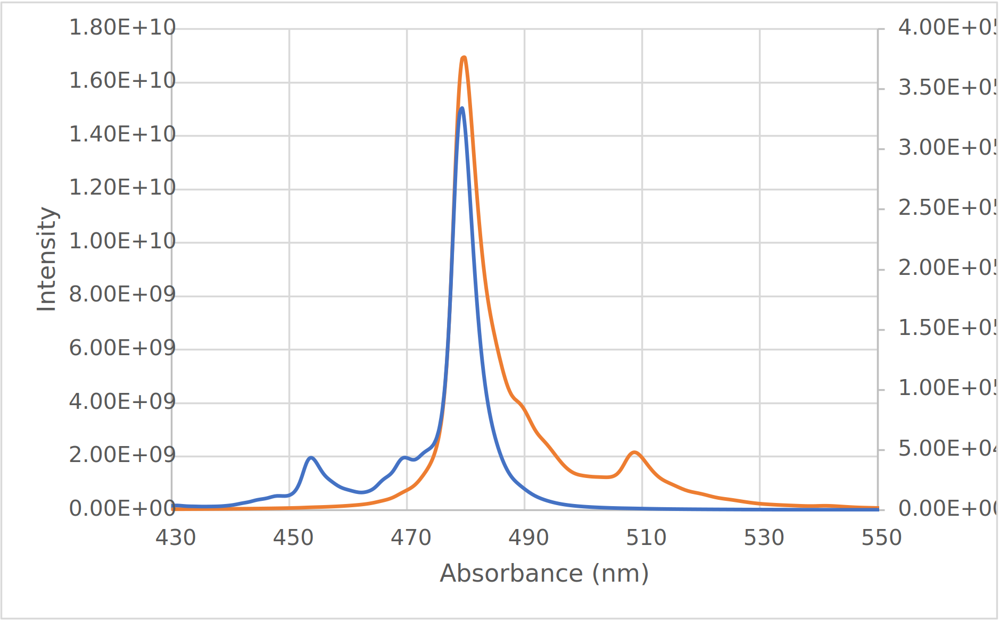
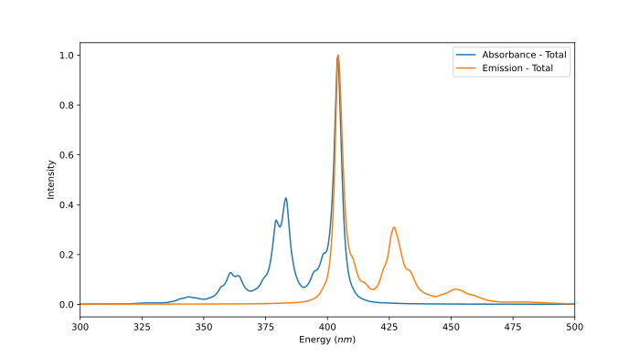

# PhD Begin

## Monday 4th April

I guess this is my *real* first day then (as per my call with the Science faculty admin).

I've got my big long list of review papers, pertaining to ONIOM, solvation models, excited state calculations, solvatochromism, TD-QM methods, multiconfigurational methods, and a few other little tidbits. Should be a huge amount of reading! Today though, I am teaching.

On Thursday it looks like I'll have a meeting with Toby Bell, to discuss some key systems of interest and grand challenges in the field.

My offer and enrolment are still nowhere to be seen :unamused:

!!! info "Definition of the day"
	* **Adiabatic**: Electronic excitation not coupled with nuclear motion
	* **Non-adiabatic**: Electronic excitation coupled with nuclear motion 

## Tuesday 5th April

I got my offer letter while teaching yesterday!
So today, I’ve been spending my morning filling out forms, completing compliance modules, putting in a request for a laptop, trying to organise and orientation session, etc. after group meeting, I might try to get a start on re-watching those Chris Cramer lectures, watching that David Sherill talk and possibly (if I have any time left) getting started on some reading. I also have my chem faculty orientation at 3!

So laptop ordering has failed dismally, but Katya has put in another request for me, so hopefully it will go through!

I ended up writing some notes on Chris Cramer's [Configuraiton Interaction](../../../Cheat%20Sheets%20and%20Play/SDL/Chris%20Cramer/Computational%20Chemistry/7.%20Excited%20States/07.04/), [Perturbation and TD-DFT](../../../Cheat%20Sheets%20and%20Play/SDL/Chris%20Cramer/Computational%20Chemistry/7.%20Excited%20States/07.05/) and [Conical Intersections](../../../Cheat%20Sheets%20and%20Play/SDL/Chris%20Cramer/Computational%20Chemistry/7.%20Excited%20States/07.06/) videos.

!!! info "Definition of the day"
	* **Rydberg States**: Excitations in which the electrons is excited so high up that rather than being a part of the molecule, it behaves more like an electron orbiting a nucleus, in a S/P/D like orbital.
	* **Kasha's Rule:** Due to how close in energy excited states will be to each other, photonic emission will only happen in appreciable yield from the lowest excited to the ground state. Another way to think about this is that the wavelength of an emitted photon is going to be independent of the photon that excited the molecule.

## Wednesday 6th April

Watched the last of Chris Cramer's videos on [Solvatochromism](../../../Cheat%20Sheets%20and%20Play/SDL/Chris%20Cramer/Computational%20Chemistry/7.%20Excited%20States/07.07/). While it's already something that I'm somewhat familiar with, I've also re-watched the QM/MM vides from this series, but I haven't taken notes.


!!! info "Definition of the day"
	 * **Stokes shift**: The difference between an adiabatic absorbed and adiabatic emitted photon for a particular set of $\ce{\Psi_0_{minima}->[h\nu_1]\Psi_*\to\Psi_*_{minima}->[h\nu_2]\Psi_0}$ 

So I got distracted based on something that Chris Cramer said about the excited state orbitals being so close together (as per Kasha's rule) and ended up writing a script to visualise the energy levels of calculations instead of reading/studying. This is benzene btw ⇩

{: style="width: 40%; "class="center"}


## Thursday 7th April

Today I didn't do a huge amount. I sat in a cafe and worked through the PhD compliance modules, saw my psych, met with Toby, and that's about it.

### Meeting Notes

* Toby's main areas of interest seem to be in photoswitching mechanisms and understanding the behaviour of excited states
  * He mentioned that most researchers seem to have their known set of fluoropohres that they can use base don empirically derived protocols
  * There was definitely an emphasis on switching these fluorophores  on and off. A few concepts/mechanisms were highlighted, including:
    * Excited states that don't emit, so called "dark states"
    * Photoreduction of compounds. These ionic species may have different properties
    * Conformational changes that can enable certain excited states
    * Binding based switches, that might be non-fluorescent when free, but fluoresces when bound
  * Modern fluorophores that act as "polarity probes," where the  extent of charge transfer is controlled by conformation of the molecule
* Photoswitchable proteins are also of interest. These could be:
  * Dark when created, requiring photo-activation 
  * Reversibly switchable, either being photo or chemically driven
* ==One particularly interesting system was that of BODIPY derivatives. Apparently they are attracted to lipid droplets and light up when in that lipid environment, but the mechanism behind this is currently unknown.==
* Photoswitching of NDIs?
  * Toby theorised that NDIs might be able to undergo a process to make them switchable, essentially:
    * Photoreduction ⟹ singlet excited state ⟹ (relaxes to) triplet state ⟹ (binds to another species) stable radical species
  * Naphalene monoimides might also be useful, since they're smaller and can be more water soluble
* When I asked Toby about what key properties he'd be interested in investigating computationally, he mentioned:
  * Photostability - knowing how long these species last while activated. Molecules don't seem to like being activated and deactivated over and over again :P
  * General questions of:
    * What makes a photostable compound?
    * What makes a good photoswitcher?
  * I mentioned that these properties might actually be quite difficult to explore because of the breadth of the question and the extent of the PES that might need to be explored
  * He also mentioned liquid-liquid phase separations that occur within cells and how molecules seem to have quite different fluorescence properties in there, compared to the rest of the cell


## Friday - Sunday 8-10th April

Today I've been trying to get my head around the role of multi-determinant calculations in fluorescence spectroscopy, which seems to be quite difficult to do. Following Kasha's rule, for most systems there should only be one primary de-excitation, so fluorescence spectroscopic studies should mostly be (by my internal logic):

```
optimise excited state ⟹ calculate energy ⟹ compare energy to ground state at same configuration
```

But that seems too simple...
I'm currently watching the David Sherril lecture on [*Excited Electronic States in Quantum Chemistry*](../../../Cheat%20Sheets%20and%20Play/SDL/MCSCF%20Methods) to see if I can make heads or tails of this, since all the MCSCF reviews are 90% inaccessible maths.

I ended up getting distracted putting my computer in a new case (to fit on my new standing desk) but have worked on getting this lecture finished on Saturday.

!!! info "Definition of the day"
	 * **Charge-Transfer State**: "A state, related to the ground state by a charge transfer transition"
	 * **Charge-Transfer Transition**: The movement of an electron from one part of a molecule/complex to another. This can be thought of as an intramolecular redox process.


I've also been trying to get my head around a few of these concepts by playing with some TD-DFT and CASSCF in orca and Psi4.

| Job<br/> | Absorbance energy (eV) | Absorbance wavelength (nm) | Error (eV) | Emission energy (eV) | Emission wavelength (nm) | Error (eV) |
| --------------------------------- | :--------------------: | :------------------------: | :-----------------: | :------------------: | :----------------------: | :---------------: |
| Experiment | ==2.460== | ==504== | - | ==2.407== | ==515== | - |
| ωB87X-D/cc-PVTZ                   |         2.889          |           429.2            |   0.429    |        2.796         |          443.4           |   0.389    |
| cam-B3LYP/cc-PVTZ <br/>(ωB87X-D/cc-PVTZ geom) | 2.705 | 458.4 | 0.245 | 2.620 | 473.2 | 0.213 |
| CASSCF (8,6)/cc-PVTZ              |         3.528          |           351.5            | 1.068 |                      |                          |            |
| RI-NEVPT2 (SC) (8,6)/cc-PVTZ      |         2.690          |           461.0            | 0.320 |                      |                          |            |
| RI-NEVPT2 (QD) (8,6)/cc-PVTZ      | 2.584 | 479.9 | 0.124 |                      |                          |            |
| DLPNO-STEOM-CCSD (geom from TDDFT) | 2.376 | 521.9 | -0.084 | 2.376 | 547.2 | -0.031 |

* All jobs are solvated with SMD cyclohexane and measure the first excitation of BODIPY ($S_0 \to S_1$) for the geometry optimised for either `iroot 0` (for absorbance) of `iroot 1` (for emission)

Notes:

* Use `%tddft tda off end` for more accurate TDDFT (turns off the Tamm-Dancoff approximations)
* Use sufficient roots, a big enough basis set, and a fine enough grid.
* Augmented basis sets seem to not be so necessary, but I'm guessing that this would be different for Rydberg states

I've definitely noticed a couple of big limitations in Psi4:

* Non-analytical solvation (already knew this)
* No analytical gradients for MCSCF methods

In ORCA, the big one is just that TDDFT analytical gradients aren't available for VV10 dispersion correction (no ωB97M-V :slightly_frowning_face:), though the lack of `.fchk` exporting does make browsing orbitals a bit frustrating... This can mostly be overcome by generating a `.cube` file using `orca_plot` though.

Ended up automating this with a little script:

```bash
#!/bin/bash
orca_plot $1 -i > gbw2cube.log << EOF
5
7
10
11
EOF
```


Reading through [this pdf](http://scienide2.uwaterloo.ca/~nooijen/Chem-440-computational/CASSCF_and_NEVPT2_calculations.pdf) it looks like a general procedure for CASSCF could be described as:

1. Choose a starting guess for the active space based on chemical intuition. in ORCA, run your MP2 or DFT calc with `!normalPrint` to get the `LOEWDIN REDUCED ORBITAL POPULATIONS PER MO` which will give an indicator of the character of each orbital. You might want to aim for a 𝜋 system for example, or d orbitals if working with a transition metal. Also look at the orbital energies and add easily accessible and degenerate orbitals. The final active space should probably be symetrical for occupied and unoccupied
2. Run a CASSCF job (loading in the orbitals from step 1) optimising for only one root (`nroots 1`) 
   * This gives us a basic starting point to test our active space
3. Run the CASSCF job (loading in the orbitals from step 2) again, with more roots (maybe `nroots 20`) without re-optimising the orbitals (`!NoIter`). 
   * This will give us an idea of which states will be important to optimise for.
4. Run another CASSCF job (loading in the orbitals from step 2) optimising the orbitals for only the roots that we care about and inspect the output for unoccupied orbitals with minimal occupation, which can be culled from the active space.
5. If everything is looking good, now you can think about running your production run with the culled active space, and for the roots of interest, probably tightening up the scf convergence to `VeryTightSCF` or `ExtremeSCF` 
6. You can then run an RI-NEVPT2 calc for added correlation, reading in the orbitals from step 5 and freezing the orbitals using `!NoIter`. This could potentially be QD-NEVPT2 (quality) or DLPNO-NEVPT2 (cheap) 
7. For *extra* vibronic corrections you can ran an ESD calculation using ground and excited state hessians to generate vibronic corrections

??? example "To Do"
	
	* [x] Re-Watch Chris Cramer's excited state videos
	  * [x] [Configuration interaction](https://www.youtube.com/watch?v=KrDz8zayXoI&list=WL&index=9)
	  * [x] [Perturbation and time-dependent DFT](https://www.youtube.com/watch?v=YG9eXUzlHRk&list=WL&index=10)
	  * [x] [Conical intersections](https://www.youtube.com/watch?v=Jsi8b1M45bg&list=WL&index=11)
	  * [x] [Solvatochromism](https://www.youtube.com/watch?v=PdNE4VZrhys&list=WL&index=12)
	* [x] Watch David Sherill's [talk on excited electronic states](https://www.youtube.com/watch?v=MlbKoXACAx8&list=WL&index=8)
	* [ ] Read the review papers (to start with)
	  * [ ] Spectroscopic Approaches
	    * [ ] Modelling absorption spectra of molecules in solution
	    * [ ] Polarizable embedding QM/MM: the future gold standard for complex (bio)systems?
	    * [ ] Spectroscopy in Complex Environments from QM–MM Simulations
	    * [ ] Solvatochromism: a tool for solvent discretion for UV-Vis spectroscopic studies
	  * [ ] Computational Theory
	    * [ ] Hybrid QM/classical models: Methodological advances and new applications
	    * [ ] Single-Reference ab Initio Methods for the Calculation of Excited States of Large Molecules
	    * [ ] Multireference Approaches for Excited States of Molecules
	    * [ ] Combining Wave Function Methods with Density Functional Theory for Excited States
	    * [ ] Polarizable continuum model
	* [ ] Read state of the art papers
	  * [ ] Time-Dependent Complete Active Space Embedded in a Polarizable Force Field
	  * [ ] Photochemistry and transient intermediates in a bacteriophytochrome photocycle revealed by multiscale simulations

## Monday 11th April

* Plonked in a cafe trying to slam out some marking with a very large mocha. Also continuing on with those CASSCF jobs... They're not easy to slam out your first time :sweat_smile:
* I've prettied up the TD-DFT jobs, but the CASSCF jobs are still nasty. I'm currently looking at expanding the active space to see what might be going on. I also turned my jupyter orbital visualiser into a script that can be run remotely. I think I need to really just get to reading though...
* I'm slowly working my way through '*Modelling absorption spectra of molecules in solution*' and am writing up my notes [here](../../Notes/solventsForEstates)


!!! warning "Everyone seems to state a different \"Gold Standard\""
	This article is saying that EOM-CCSD is the current gold standards at 0.0 1eV errors with DFT solvent... Which I guess I'd believe... It's inevitable though, as the field changes, new methods are developed, and hardware becomes more capable that our gold standard would keep shifting.<br/>
	I guess that I need to read some benchmarking studies!

## Tuesday 12th April

* Group meeting day today, so I'm back in the office. This morning I decided to extend my BODIPY play to see if QD-NEVPT2 gave better results than regular SC-NEVPT2, and I also decided (for good measure) to run a DLPNO-EOM-CCSD calculation on the same excitations/emissions, using the TD-ωB97X-D geometries.


I *have* been working through the rest of the paper from yesterday, but it's been slow... It feels a lot like a love letter to one particular method and I'm not sure how I fI've also been eel about that.

## Wednesday 13th April

* Today I'm teaching CHM3911, so I've been working through the exercise and questions to make sure I understand them all, but I decided to make [a little visual tool](https://www.desmos.com/calculator/uwjilj9iwn) to help explain negative frequencies

* I've also been playing with some of ORCA's other spectroscopy tools in it's `ORCA_ESD` module, that allows it to calculate Franck-Condon weighted spectra for absorption, fluorescence and phosphorescence. These jobs are naturally pretty slow since they're analysing the hessians of both the ground and excited state, so I'm playing with them with TDDFT for now, but I'll be curious to see how much the results reflect experiment for BODIPY.
  * In reading deeper, if you run the `ESD(ABS)` or `ESD(FLUOR)` jobs, with `doht true` if will calculate both the Herzberg- Teller (HT) and Franck-Condon (FC) components of the spectrum.

* I don't think I'll have a huge amount of time for reading today, but I might be able to sneak in a couple of hours before my TA session.

## Thursday 14th April

* Today I am teaching again, and I've had an emotionally rough morning so I haven't done a huge amount of work, but I did look over the outputs form my "excited state dynamics" jobs, and while the fluorescence was very bad, the absorbance actually looks kind of good! 
  * **Edit:** I have since re-done the fluorescence with `!usesym` off and not specifying `maxdim`, and it looks much better, but doesn't seem to have much of a stokes shift, though admittedly, experimentally it's only 11 nm...


{: style="width: 40%; "class="center"}

* And as a test, I also did it with CAM-B3LYP in Ethanol (exp $\lambda_{abs}=499\:nm$ $\lambda_{em}=535\:nm$). These results seem to be even worse...

{: style="width: 40%; "class="center"}

!!! info "Definition of the day"
	 * **Franck-Condon principle**: That during an electornic excitation, a change form one vibrational energy leverl to another will be more likely if there is significant overlap between the vibrational wavefunctions.

## Friday-Tuesday 15-19th April

Easter break

I keep finding more fantastic looking papers pop up in my twitter feed that keep getting added to my library. This seems counterproductive, and it would be nice if science just stopped and waited for me to catch up!

I did decide to do a few extra calculations thought to figure out a few particular things:

* Is CAM-B3LYP opt better than ωB87X-D? ==Here, yes==
  * Does this also help with STEOM-DLPNO-CCSD? ==Yes==
* Do diffuse functions help? ==Not looking good==
* Can I get `iroot 1` opt working with CASSCF? ==In reading the tips and tricks in the ESD section, it looks lime the indexing of roots for MRSCF jobs starts at 1, not 0, so $S_1$ would actually be `iroot 2`==

| Job<br/> | Absorbance energy (eV) | Absorbance wavelength (nm) | Error (eV) | Emission energy (eV) | Emission wavelength (nm) | Error (eV) | Stokes Shift (nm) |
| --------------------------------- | :--------------------: | :------------------------: | :-----------------: | :------------------: | :----------------------: | :---------------: | ----------------- |
| Experiment | ==2.460== | ==504== | - | ==2.407== | ==515== | - | 10 |
| CAM-B3LYP/aug-cc-PVTZ | 2.675 | 463.4 | 0.215 | 2.591 | 478.5 | 0.184 | 15.1 |
| CASSCF (8,6)/aug-cc-PVTZ          |         3.697          |           335.3            |   1.237    |        3.697         |          335.3           |   1.290    | 0                 |
| RI-NEVPT2 (QD) (8,6)/aug-cc-PVTZ  |         2.708          |           457.9            |   0.249    |        2.708         |          457.9           |   0.302    | 0                 |
| DLPNO-STEOM-CCSD (CAM-B3LYP geom) |         2.422          |           512.0            |   0.038    |        2.332         |          531.7           |   0.075    | 19.7              |

I've also been playing with Psi4 to see how it behaves, so I thought I'd make a little matrix to note a few key things:


| Program          |                      ORCA                       | Analytical<br/>grads |                             Psi4                             | Analytical<br/>grads |
| ---------------- | :---------------------------------------------: | :------------------: | :----------------------------------------------------------: | :------------------: |
| Solvation        | CPCM (LR, PTE, PTE(S))<br>CPCMC (COSMO)<br/>SMD |  :white_check_mark:  |             IEFPCM<br/>CPCM<br>(non-equilibrium)             |   :no_entry_sign:    |
| TD-DFT           |               :white_check_mark:                |  :white_check_mark:  |                      :white_check_mark:                      |   :no_entry_sign:    |
| EOM-CCSD*        |               :white_check_mark:                |   :no_entry_sign:    |                      :white_check_mark:                      |   :no_entry_sign:    |
| STEOM-CCSD (RI)  |               :white_check_mark:                |   :no_entry_sign:    |                       :no_entry_sign:                        |         N/A          |
| DLPNO-EOM-CCSD   |               :white_check_mark:                |   :no_entry_sign:    |                       :no_entry_sign:                        |         N/A          |
| DLPNO-STEOM-CCSD |               :white_check_mark:                |   :no_entry_sign:    |                       :no_entry_sign:                        |         N/A          |
| CASSCF           |               :white_check_mark:                |  :white_check_mark:  |                      :white_check_mark:                      |  :white_check_mark:  |
| PC embedding     |               :white_check_mark:                |  :white_check_mark:  |                      :white_check_mark:                      |  :white_check_mark:  |
| NEVPT2           |               :white_check_mark:                |   :no_entry_sign:    |                       :no_entry_sign:                        |         N/A          |
| CC2*             |                 :no_entry_sign:                 |         N/A          |                      :white_check_mark:                      |                      |
| ADC*             |                       (2)                       |   :no_entry_sign:    | (2) built in (unmaintained)<br/><br/>(1), (2), (2)-x, (3) <br/>through `set qc_module adcc`<br/>With/without CVS |   :no_entry_sign:    |

\* needs lots of memory

To look at Psi4's capabilities, I wanted a smaller fluorophore, so I decided to pick up the $\ce{HINA-}$ anion in SMD solvent. All are using aug-cc-PVTZ

* So as it turns out, I did none of these in Psi4, owing to the lack of analytical gradients for anything solvated...

#### HINA Table

| Job<br/>                                    |          Transition           | Absorbance energy (eV) | Absorbance wavelength (nm) | Error (eV) |        Transition        | Emission energy (eV) | Emission wavelength (nm) | Error (eV) |
| :------------------------------------------ | :---------------------------: | :--------------------: | :------------------------: | :--------: | :----------------------: | :------------------: | :----------------------: | :--------: |
| Experiment                                  |                               |        ==3.22==        |            385             |     -      |                          |       ==2.36==       |         ==525==          |     -      |
| **SMD (ORCA)**                              |                               |                        |                            |            |                          |                      |                          |            |
| CAM-B3LYP/aug-cc-pvtz                       | $S_0\to S_1$<br/>$f = 0.1285$ |         3.312          |           374.4            |    0.09    |        $f=0.3460$        |        2.958         |          419.2           |    0.60    |
| ωB97X-D/aug-cc-pvtz                         | $S_0\to S_1$<br/>$f = 0.1422$ |         3.377          |           367.2            |    0.16    |        $f=0.3610$        |         3.01         |          412.6           |    0.65    |
| NEVPT2/aug-cc-pvtz                          | $S_0\to S_1$<br/>$f = 0.2623$ |         3.276          |           378.5            |    0.06    |        $f=0.2057$        |        2.688         |          461.2           |    0.33    |
| RI-ADC(2)/aug-cc-pvdz                       | $S_0\to S_1$<br/>$f = 0.1479$ |         3.204          |           387.0            |    0.02    |       $f = 0.1308$       |        2.806         |          441.8           |    0.45    |
| DLPNO-STEOM-CCSD/aug-cc-pvtz                | $S_0\to S_2$<br/>$f = 0.2857$ |         3.302          |           375.4            |    0.08    |        $f=0.1451$        |        2.591         |          478.6           |    0.23    |
| STEOM-CCSD/aug-cc-pvtz<br/>(10 roots)       |  $S_0\to S_1$<br/>$f=0.1745$  |         3.064          |           404.7            |    0.16    | Too expensive to compute |                      |                          |            |
|                                             |                               |                        |                            |            |                          |                      |                          |            |
| **Explicit Solvation<br/>(2 water shells)** |                               |                        |                            |            |                          |                      |                          |            |
| CAM-B3LYP/cc-pvdz/aug-cc-pvtz (ORCA + SMD)  |                               |                        |                            |            |                          |                      |                          |            |
| CAM-B3LYP/cc-pvdz/aug-cc-pvtz (Psi4)        | $S_0\to S_1$<br/>$f = 0.$2442 |         3.803          |           326.0            |    0.58    |        $f=0.2021$        |        3.083         |          402.2           |    0.72    |
|                                             |                               |                        |                            |            |                          |                      |                          |            |
| **XTB2 optimised EFP (Psi4)**               |                               |                        |                            |            |                          |                      |                          |            |
| CAM-B3LYP/aug-cc-pvtz                       | $S_0\to S_2$<br/>$f = 0.1705$ |         3.337          |           371.5            |    0.12    |                          |                      |                          |            |
| ADC(2)/aug-cc-pvdz                          |  Huge amounts of mem needed   |                        |                            |            |                          |                      |                          |            |
| EOM-CC2/aug-cc-pvdz<br/>(5 roots)           |  $S_0\to S_2$<br/>$f=0.1892$  |         3.116          |           397.9            |    0.10    |                          |                      |                          |            |
| EOM-CCSD/aug-cc-pvdz<br/>(5 roots)          |  $S_0\to S_1$<br/>$f=0.2021$  |         3.320          |           373.5            |    0.02    |                          |                      |                          |            |

So the absorption and emission spectra for HINA are very strange... I suspect that this may be a case where solvent effects are quite extensive, which would make sense given it's a cation in an aqueous environment. I feel like I should stop while I'm ahead on this one...

I get the feeling that this job also exhibits a very strong multireference character, which is why DLPNO-STEOM-CCSD seems to get the closest emission. I'd be curious to run an opt at this level... 

## Wednesday 20th April

Rough morning, but I'm in the office now. That HINA fluorophore is proving really interesting, as every vertical emission ($S_{1_{min}}\to S_0$) is drastically too high in energy. I suspect that there's a HT/FC thing going on here, but I'm also optimising for states $S_2$, $S_3$, and $S_4$ in case the emission doesn't follow Kasha's rule.

After explaining frequencies, PES and Hessians to our honours student, I've also started reading through *'Spectroscopy in Complex Environments from QM–MM Simulations'*


In producing an ESD fluorescence spectrum the emission of HINA for from $S_1\to S_0$ appeared to have a $\lambda_{max}$ of ~1500 nm, but when looking at the emission from $S_2\to S_0$ the $\lambda_{max}$ is ~600 nm, so I'm not entirely sure what's going on here...

> I feel like I should stop while I'm ahead on this one... 

I think I was right :sweat_smile:

  

## Thursday 21st April

I did start reading, but got distracted again... So here's a list of things I learned/did today:

* Wrote [a script](https://github.com/adreasnow/comp-chem-scripts/blob/master/energyExtractors/pltSpectrum.py) to plot `.spectrum` files from ORCA's ESD module
* Found out first hand how much better SMD is for excited state modelling of strongly interacting solvents than regular CPCM or IEFCPM
* Realised that I'm made a very stupid, very basic chemistry mistake with HINA that means I'm redoing all my calcs

{: style="width: 40%; "class="center"}

* Ths revised, CAM-B3LYP optimised abs and emission spectra of HINA^ they the second largest peak is spot on for $\lambda_{max}$, but there's obviously the other peak that's kind of screwing that up...
* The emission spectrum is still completely off though. I wonder if I can use DLPNO-STEOM-CCSD to do the ESD calcs though, since it got much closer!
* MRSCF jobs start indexing from 1, not 0, so $S_1$ would actually be `iroot 2`, not `iroot 1`

#### Jobs currently running:

* Re-doing the BODIPY CASSCF jobs `3-bodipy-casscf-root-*.inp`
  * Next will be the corresponding NEVPT2 jobs `4-bodipy-nevpt2-root-*.inp`
  * ==These didn't optimise to separate roots again. I don't know that the CASSCF jobs can do this tbh.==
* Low level opt of a full solvation shell for HINA `25-hina-cb3lyp-preefp.inp`
  * Next will be the efp job `25-hina-cb3lyp-efp.in`
    * Compare these values with ORCA SMD solvated jobs
  * Can also play with including a few explicit water molecules around the negatively charged oxygen
  * Can also re-opt for $S_1$ with TD-DFT, but this might be a bit expensive...
    *  EFP of $S_1$?

## Friday 22nd April

I sat in a cafe this morning and decided to read some of Skoog to round out my undergrad knowledge of fluorescence spectroscopy and these are my basic notes:

!!! summary "Notes from Skoog on fluorescence"
	
	* Excitation will typically happen from the lowest vibration state of the ground singlet state to whatever corresponding state on the excited state PES as detemrined by the FC rules
	* Nonradiative **"internal conversion"** between states will typically happen when the states are close together in energy or when the molecule is reasonably flexible
	  * This in turn means that the more rigid a molecule, the more likely it is to fluoresce
	* FLuorescence is typically a $S_*\to S_0$ process, as the $T_*\to S_0$ transition requires a spin pairing to happen which could take a fair amount of time
	  * The triplet state will also be lower in energy than the corresponding singlet state, and will thus be more prone to internal conversion than emission 
	* Increaing temperature leads to an increase in internal conversion and collision relaxation, thus leading to a decrease in quantum yield
	  * The same also happens for a decrease in solvent viscosity 
	* Absorbance and fluorescence spectra tend to be mirror images to each other ([as shown on Thursday](#thursday-21st-april)), which is a product of the FC principle and the idea that the PES of the excited state and ground state will be relatively similar.
	  * Molecules with larger PES changes through the excitaiton process will have less symmetric spectra

| Transition                                     |       Timeframe (s)        |  Timeframe (human)   |
| ---------------------------------------------- | :------------------------: | :------------------: |
| $S_0\to S_*$                                   |        $10^{-15}s$         |       $1\:fs$        |
| $S_1\to S_0$                                   |  $10^{-9}s$ to $10^{-7}s$  | $1\:ns$ to $100\:ns$ |
| $T_1\to S_0$                                   |  $10^{-3}s$ to $10^{2}s$   | $1\:ms$ to $100\:s$  |
| Internal conversion<br/>Vibrational relaxation | $10^{-14}s$ to $10^{-11}s$ | $10\:fs$ to $10\:ps$ |

#### Notes from today's reading:

* RT-TDDFT is more costly because of the simulation time involved, but more modern methods are making progress in bringing that cost down. It scales linearly compared to LR-TDDFT (how ironic) though and is able to measure larger perturbations to the electron density, as the perturbation is allowed to propagate over time.

!!! info "Definition of the day"
	 * **Quantum Yield ($\Phi$)**: The ratio of photons emitted to the ratio of photons absorbed (range of 0 to 1).
	 * **Internal conversion**: transitions between electronic excited states that release energy in the form of heat/motion instead of emitted light.
	 * **Real-time TDDFT**: considers the actual time porpogation of the electron density by simulating it over tens of femtoseconds. The absorption spectrum can be obtained from the response of the dipole moment in response to an electric perturbation in this simulation
	 * **Linear-response TDDFT**: This approach considers the instantaneous response through perturbatiuon of the ground state density at time $=t_0$. 

!!! error "WIP Definition of the day"
	*  **Herzberg-Teller effect**: It looks like this is some form of coupling between ground and excited states that can allow FC forbidden transitions to occur. In talking to someone more versed in physics than myself, it sounds like this is a term that's used to account for non-adiabatic (diagonal) transitions, which is why it might allow for certain forbidden FC vertical excitations to happen.


## Tuesday/Wednesday 26/27th April

I've not been getting a huge amount from *Polarizable embedding QM/MM:* that I didn't from *Spectroscopy in Complex Environments*, so I'm just going to read a couple of sections that didn't have too much overlap.

* General gist of everything seems to be a question of how to properly embed systems in a way that allows for mutual polarisation. This is complex for adiabatic MD syimulation, but gets even more complex for non-adiabatic ones.

> "As a matter of fact, we are confident that polarizable QM/MM might become, in the next decade, the new golden standard for simulating condensed-phase spectroscopy... Their extension to nonadiabatic dynamics will then come as a natural step for the simulation of complex photophysical processes."

!!! warning "Stupid realisation"
	I realised about 20 minutes ago that the whole beauty of calculating multiple roots in these jobs is that you're identifying each of the lowest $n$ excited states for that particular point on the PES. This seems really obvious in hindsight... 

I think it's time to read *The calculations of excited-state properties with Time-Dependent Density Functional Theory*

### Suggestions for issues in the field

> "The development of criteria or screening procedures designed to determine the required level of QM−MM theory for a given system or transition would be a very useful contribution to the field."

> "the current limitation in the application of these techniques to systems of increasing complexity is not related to the accuracy in the spectrum of a single structure but often lies in the extensive configurational sampling necessary to get a proper representation of solvent and thermal effects"

> "A promising alternative for overcoming the necessity of extensive sampling for realistic predictions at an affordable cost involves the use of a serial approach in which a simpler accurate Hamiltonian is employed. A possible way to deal with this delicate issue is the use of learn-on-the-fly or machine-learning classical Hamiltonians.505,506 In this context, one can envisage a classical potential fully consistent with the QM−MM Hamiltonian that should be used for its construction along the time scale of the simulation. An example is the technique developed by Csá nyi and co-workers,506,507 in which the force field parameters are recomputed every few steps along a classical dynamics simulation to achieve full consistency with the DFT forces inside a selected “QM cluster”. The application of such an approach to spectroscopic simulations is a very interesting challenge that could be extremely helpful to cope with the sampling issue."

> "Several of the most common failures that have been reported in QM−MM approaches are related to an inadequate match in the QM/MM boundaries. The substitution of the exchange interaction between the QM and MM domains by Lennard-Jones potentials and the imbalance between the strengths of the QM−QM, QM−MM, and MM−MM electrostatic interactions can lead to an unphysical preference for specific intermolecular interactions."

> "All the applications that we have here presented and discussed, however, require the fulfillment of a fundamental preliminary condition, namely polarizable QM/MM implementations have to be made available in robust, effective and simple-to-use software packages."

Something that I need to remind myself of is that my ground state geom opt doesn't need to be done in conjunction with my tddft job, so it would be perfectly valid for example to produce ωB97M-V optimised geom and a freq, then use that in an AHAS ESD job  with something fancy like DLPNO-STEOM-CCSD, or use the ground state optimised geom for subsequent CAM-B3LYP TD-DFT excitations.

## Thursday/Friday 28/29th April

I realised in the shower this morning that I could probably use a smaller basis set for the water in the fully solvated TDDFT jobs, so I've fixed those up and they seem to be running alright now, though we shall wait to see what the long term SCF convergence behaviour is like.

I also decided to just suck it up and start some QMMM jobs with bigger solvation boxes (perhaps EFP requires a much bigger solvation shell, since there isn't PCM for long-range interaction)? which meant getting XTB running (it seems like a nice fast method for this...) but generation of the internal coordinates in ORCA is taking a very long time (there are 300 water molecules)...

I have a meeting with Katya in a couple of hours , which should be interesting.

* I spent my afternoon re-writing my `2slm` input generator in python
* When I got home I started to play with MOPAC (PM7) and XTB2 optimised structures for EFP input and the results are actually quite impressive with 500 water molecules.
  * Since the chromophore geometry is going be kind of messed up, I've been using the semiempirical optimised geometry to position the EFP fragments and have been optimising the chromophore in the static EFP. The results in the [HINA table](#hina-table) speak for themselves

### Meeting Notes

* Katya's big criticism of the field seems to be that it's constantly chasing experimental results, rather than understanding the underlying physics, so her big suggestion is that we need to:
  * Separating out the error of the computational method (level of theory) compared with the methodology used to get the results
  * Separating out the implementation of solvent effects from how they behave with that particular methodology
  * Separating out vertical excitation (0-0) from the emission spectra
* Katya's idea:
  * To build an established approach or process of thinking that has understandable and predictable errors involved.
    * She seems to be very keen on the detection of metals as a grand challenge.
* The process for my approach to this might need to be to figure out
  1. What are all the different approaches? - benchmark them to find their associated errors
     * I think I might need to talk to toby about building a dataset.
  2. What would be the most expensive gold standard option that we could use?
  3. How can we use this knowledge to break down this field into predictable simple approaches with well understood errors.

???+ example "To Do"
	

	* [ ] Read the review papers (to start with)
	  * [ ] Spectroscopic Approaches
	    * [x] Modelling absorption spectra of molecules in solution
	    * [x] Polarizable embedding QM/MM: the future gold standard for complex (bio)systems?
	    * [x] Spectroscopy in Complex Environments from QM–MM Simulations
	    * [ ] Solvatochromism: a tool for solvent discretion for UV-Vis spectroscopic studies
	  * [ ] Computational Theory
	    * [ ] Hybrid QM/classical models: Methodological advances and new applications
	    * [ ] Single-Reference ab Initio Methods for the Calculation of Excited States of Large Molecules
	    * [ ] The calculations of excited-state properties with Time-Dependent Density Functional Theory
	    * [ ] Multireference Approaches for Excited States of Molecules
	    * [ ] Combining Wave Function Methods with Density Functional Theory for Excited States
	    * [ ] Polarizable continuum model
	* [ ] Read state of the art papers
	  * [ ] Time-Dependent Complete Active Space Embedded in a Polarizable Force Field
	  * [ ] Photochemistry and transient intermediates in a bacteriophytochrome photocycle revealed by multiscale simulations


