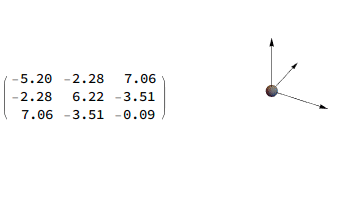
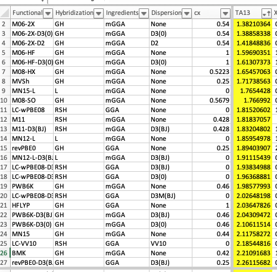

# May 2022

| Job<br/>                                                     |          Transition           | Absorbance energy (eV) | Absorbance wavelength (nm) | Error (eV) |        Transition        | Emission energy (eV) | Emission wavelength (nm) | Error (eV) |
| :----------------------------------------------------------- | :---------------------------: | :--------------------: | :------------------------: | :--------: | :----------------------: | :------------------: | :----------------------: | :--------: |
| Experiment                                                   |                               |        ==3.22==        |            385             |     -      |                          |       ==2.36==       |         ==525==          |     -      |
| **SMD (ORCA)**                                               |                               |                        |                            |            |                          |                      |                          |            |
| CAM-B3LYP/aug-cc-pvtz                                        | $S_0\to S_1$<br/>$f = 0.1285$ |         3.312          |           374.4            |    0.09    |        $f=0.3460$        |        2.958         |          419.2           |    0.60    |
| ωB97X-D/aug-cc-pvtz                                          | $S_0\to S_1$<br/>$f = 0.1422$ |         3.377          |           367.2            |    0.16    |        $f=0.3610$        |         3.01         |          412.6           |    0.65    |
| NEVPT2/aug-cc-pvtz                                           | $S_0\to S_1$<br/>$f = 0.2623$ |         3.276          |           378.5            |    0.06    |        $f=0.2057$        |        2.688         |          461.2           |    0.33    |
| RI-ADC(2)/aug-cc-pvdz                                        | $S_0\to S_1$<br/>$f = 0.1479$ |         3.204          |           387.0            |    0.02    |       $f = 0.1308$       |        2.806         |          441.8           |    0.45    |
| DLPNO-STEOM-CCSD/aug-cc-pvtz                                 | $S_0\to S_2$<br/>$f = 0.2857$ |         3.302          |           375.4            |    0.08    |        $f=0.1451$        |        2.591         |          478.6           |    0.23    |
| STEOM-CCSD/aug-cc-pvtz<br/>(10 roots)                        |  $S_0\to S_1$<br/>$f=0.1745$  |         3.064          |           404.7            |    0.16    | Too expensive to compute |                      |                          |            |
| STEOM-CCSD/aug-cc-pvdz (B3LYP geom)<br/>(2 roots)            |        Keeps crashing         |                        |                            |            |        $f=0.1446$        |        2.590         |          478.7           |    0.23    |
| STEOM-CCSD/aug-cc-pvdz (CIS geom)<br/>(2 roots)              |        Keeps crashing         |                        |                            |            |        $f=0.1791$        |        2.655         |          467.0           |    0.33    |
|                                                              |                               |                        |           316.7            |            |                          |                      |                          |            |
|                                                              |                               |                        |                            |            |                          |                      |                          |            |
| **Explicit Solvation<br/>(2 water shells)**                  |                               |                        |                            |            |                          |                      |                          |            |
| CAM-B3LYP/cc-pvdz/aug-cc-pvtz (Psi4)                         | $S_0\to S_1$<br/>$f = 0.$2442 |         3.803          |           326.0            |    0.58    |        $f=0.2021$        |        3.083         |          402.2           |    0.72    |
|                                                              |                               |                        |                            |            |                          |                      |                          |            |
| **XTB2 optimised EFP (Psi4)**                                |                               |                        |                            |            |                          |                      |                          |            |
| CAM-B3LYP/aug-cc-pvtz                                        | $S_0\to S_2$<br/>$f = 0.1705$ |         3.337          |           371.5            |    0.12    |                          |                      |                          |            |
| EOM-CC2/aug-cc-pvdz<br/>(5 roots)                            |  $S_0\to S_2$<br/>$f=0.1892$  |         3.116          |           397.9            |    0.10    |                          |                      |                          |            |
| EOM-CCSD/aug-cc-pvdz<br/>(5 roots)                           |  $S_0\to S_1$<br/>$f=0.2021$  |         3.320          |           373.5            |    0.02    |        $f=0.1542$        |        2.799         |          442.9           |   0.439    |
|                                                              |                               |                        |                            |            |                          |                      |                          |            |
| **PySCF**                                                    |                               |                        |                            |            |                          |                      |                          |            |
| PySCF CASSCF/ddCOSMO/aug-cc-pvtz opt with ORCA NEVPT2(10,10)/SMD/aug-cc-pvtz energy |                               |          3.83          |           324.4            |    0.61    |                          |         2.61         |          475.0           |    0.25    |
| PySCF CASSCF(10,10)/ddCOSMO/aug-cc-pvtz opt with ORCA DLPNO-STEOM-CCSD/SMD/aug-cc-pvtz energy |                               |                        |                            |            |        $f=0.1308$        |         2.38         |          521.2           |    0.02    |


## Monday 2nd May

Meeting with Tanja later, but for now, it's Rosalie's seminar!

#### To look up

* Find/read review on correlated excited state methods.  
* Random-Phase approximation
* Tamm-dancoff approximation

Meeting went well. It looks like it should be a simple enough project to do on a relatively small dataset.

!!! info "Definition of the day"
	* **0-0 transition**: The non-adiabatic energy difference between the enthalpy of the ground and excited state ($\Delta (E^{ES}+ZPVE^{ES})-(E^{GS}+ZPVE^{GS})$)

Still reading that TDDFT paper...

* Equilibrium solvation decreases the solvatochromic shift, as the solvent is modelled as having instantaneously responded to the electronic excitation, which is unrealistic. To describe a transition:
  * The solvent can be equilibrium or non-equilibrium (has the solvent rearranged?)
  * The transition can be adiabatic or non-adiabatic (has the nuclei moved with the electron density in a quantum manner?) 

So I got distracted writing a really hacky script that runs iterations of xtb optimisation and efp solvated chromophore optimisation in order to optimise the efp fragments with the geometry in an iterative manner... very hacky, but it seems to be working!

### Meeting Notes

Tanja and her PhD, student Emma would like some help to generate some data for their ML work. By the sounds of things is relatively simple and they're looking at trying to find rates for the propagation reaction (which is the addition of the monomer to the growing radical polymer). Emma has 8 months left on her PhD and so that's the sort of timeframe that they have to be getting this data finalised. There are ~40 fragments and the key properties that they want to be calculated by me are:

* Radical stability
  * Could be measured by protonating the radical and measuring the dissociation energy of the proton
  * Calculate orbitals of the radical, and measure the size of the corresponding IBO?
  * Energy difference between the singlet and $- 1e^-$ doublet?

* Quantity of h-bonding
  * I've suggested that this is going to be tricky to model without the use of extensive MD, but perhaps by using multipoles instead of dipoles, we might better be able to capture these effects?
  * Or perhaps we could run a PCM or SMD calculation and measure the surface charge?
* Dipole moment
  * Easy to calculate
* Isotropic polarisability 
  * Should be simple enough as a single point calculation
* Inductive effect, what is the effect of substitution
  * Probably the easiest way would be to measure the partial charge change as a function of the R group chain length

Ultimately, they're open to suggestions for how to get data and new descriptors, so if I can find analogous physical properties to the empirical properties that they have, that's a pretty decent start.

## Tuesday 3rd May

My Macbook arrived today so naturally I've just spent all my time trying to get everything set up, compiled, and transferred over,


## Wednesday 4th May

#### Emma's Project

I got an email with the database form Emma, so I just wrote up a quick little script to take the SMILES strings from her `.csv` file, convert them to `.xyz` with pybel and run CREST on them to find the optimal conformation of each. This seems like a *relatively* quick and cheap way to process these in bulk, and from here, I'll be able to perform higher level optimisations  on the best conformers and start to calculate some properties. 

In looking for good methods for polarisability calculations, I decided to check out MP2/aug-cc-pvtz  in Psi4, since it seems to be pretty easily justifiale from this paper ([10.1021/jp502475e](https://doi.org/10.1021/jp502475e)). This was a pretty easy choice for me, as Pis4 has a simple api that makes it easy to script for without having to use wrappers, and since the polarisabilities will be gas phase, and since there seems to be a [simple enough perturbative method to accomplis this](http://forum.psicode.org/t/mp2-polarizability-using-finite-field/1606/2), I'll see how it goes. The only downside to not using ORCA though is that I don't have access to the RI-MP2, but there is still DF-MP2, which I guess is pretty much the same thing...?

#### My Project

There's only a few small things left for me to set up on my macbook, but otherwise, I'm mostly good to go!

I just learned something new about tensors today! (or maybe I already knew it...)
The polarisability tensor always confused me, but it's actually quite simple. If we are measuring the response of a molecule to electric fields in directions $\vec X$, $\vec Y$ and $\vec Z$, then we can assess how the dipole changes in directions $x$, $y$ and $z$. We could then note this in tensor form as:

$$
\alpha = \begin{bmatrix}
\alpha_{xX} & \alpha_{xY} & \alpha_{xZ}\\
\alpha_{yX} & \alpha_{yY} & \alpha_{yZ}\\
\alpha_{zX} & \alpha_{zY} & \alpha_{zZ}\\
\end{bmatrix}
$$

Since the we would expect the values for $\alpha_{xY}$ and  $\alpha_{yX}$ to be the same, we can consider this matrix to be symmetric along the diagonal. Unsurprisingly, a perturbation from field $\vec X$ will have the largest effect on the dipole in the $x$ direction, so we mostly care about the diagonal elements, so once we **make sure** that the matrix is completely symmetric (it might be off by a coupule of decimal places), we can effectively rotate the matrix to line up with the basis vectors, in a process called "diagonalisation".

{: style="width: 40%; "class="center"}

This gives a new vector that contains all of the properties of the original matrix, and here, would correspond to our polarisability vector. This I think is an eigenvector of the matrix?

## Thursday 5th May

Today was a teaching day, so I had to slam out some marking this morning, but I also did a bit of work on the radical project:

### Emma's Project:

I've decided that I'm not happy with the polarisabilities that I'm getting so I'll just write a wrapper for ORCA instead.

I started to generate some generic base smiles strings in order to be able to measure inductive effects, and while I have them for acrylates, methacrylates and urethanes, the "other" category is a tad more complex.

I also need to figure out what series to use, do I go:

* H, methyl, ethyl, n-propyl, n-butyl
* H, methyl, ethyl, iso-propyl, tert-butyl?

The conformer searching job is ticking along, and getting there, though some of the larger monomers are proving very slow (floppy molecules be damned!)

## Friday 6th May

#### Emma's Project

The CREST conformer searches are almost done and I've prepared scripts to be able to do ORCA optimisations ==(ωB97M-V/Def2-TZVP DefGrid3 SMD:DCM) and ORCA polarisabilities (RI-MP2/aug-cc-pVTZ SMD:DCM).==

From the opt, I should also be able to get dipole moment magnitudes and SMD surface charge.

In looking through the *30 years of DFT* paper's raw data, it definitely looks like the M06 suite is the clear best option for radical species, so that's what I guess I'll use for my radical stability tests. This also seems to be in consensus with the *DFT Zoo* benchmark, though the data was much harder to read. If not, then I'll have to go to bond dissociation, which will be **much** more time consuming.
(It's honestly not even close...)

{: style="width: 50%; "class="center"}

#### My Project

Am still reading through that TD-DFT paper... I'll get there eventually...
I *may* have gotten distracted and am now reading '*Is the Tamm-Dancoff Approximation Reliable for the Calculation of Absorption and Fluorescence Band Shapes?*' instead

* Conclusion: Don't use RPA or CIS for ESD. Stick with TDA or plain TD-DFT


After this I think I need to read '*TD-DFT Assessment of Functionals for Optical 0–0 Transitions in Solvated Dyes*'

Then probably '*Choosing a Functional for Computing Absorption and Fluorescence Band Shapes with TD-DFT*'

!!! info "RPA vs TDA"
	I've come across these two terms a lot in my reading, so I decided to look into them. They're seemingly both corrections to TD-DFT to help with the limitations around extended 𝜋 systems, Rydberg states, double excitations, conical intersection, triplet state instability, CT complexes, etc. and account for correlation energy.
	

	* Random Phase Approximation (RPA) seems to be a baseline for the TD-DFT formalism in order to account for corerelation, since there is no exact XC function for excited states.
	* Tamm-Dancomm Approximation (TDA) seems to be an alternative approach that can better handle some of these particular issues, like triplet states, but most significantly it also seems to be much cheaper than the RPA approach


## Wednesday 11th May

#### Emma's Project

Things have slowed to a crawl on the back of me contracting COVID, but the conformer searching has finally finished overnight and I'm now in the process of optimising all of the molecules. This might take a while, but I have 9 threads running these simultaneously. 

#### My Project

On Monday I was busy teaching which is why I haven't done any PhD work, but yesterday I contracted COVID which has really hit me quite hard. I'm obviously not getting on with readings or anything, but I have found a new Head-Gordon group benchmark paper on TD-DFT, which given their "30 years of DFT" paper makes me very happy.
I'm still pushing through some straggling jobs though, particularly with parameter generation of the radical dataset, since it's very heavily automated.

## Thursday 12th May

#### Emma's Project

I ran into some issues with OpenMPI that have cause my ORCA jobs to keep failing, so I've had to babysit them to get them through in my delirious state. They are slowly getting there and I think I might have found a fix for the next pass of all the jobs.

I've decided to go pack to Psi4 for the polarisailities, and am going to go a gas phase ωB97X-D3/aug-cc-pvtz opt followed by an ωB97X-D3/aug-cc-pvtz polarisability calculation.

#### My Project

Still feeling really gross, but I have been able to do a little bit of coding from within bed. I've figured out how to do nice polarisabilities from within Psi4, and have been writing a fair amount of hacky code for the radical descriptor generation.

## Friday 13th May

#### Emma's Project

Today's meeting with Katya turned up a few interesting things, which are available in the notes section, but I'm now trying to decode some of that. Looking at [one of Michelle's papers](http://rsc.anu.edu.au/~cylin/Publication/9.ONIOM.pdf), it's a bit old, but it looks like a better probe might be $\ce{(CH3)2NO}$, and it's looking like for radical energetics, it's really important to use more robust *ab initio* methods, even if in an ONIOM system, just to model the core. (The core here being all substituents α to the reaction centre, keeping organic functionalities intact)

I'm trying to figure out what my system would actually look like though, and that's where it starts to get complicated, as I'm guessing that I'd need to add something on the alkene to act as the radical initiator, so I'm not sure if I could get away with using $\ce{H^.}$ or $\ce{^.CH3}$ for that, and then on the other side is where I'd need to attach my probe, I'm guessing.

According to [this](http://rsc.anu.edu.au/~cylin/Publication/22.RSE.pdf), the radical stabilisation energy (RSE) is related to the bond dissociation energy (BDE) by:
$\ce{RSE = BDE(CH3-H) - BDE(R-H)}$ Which measures the thermodynamic stability of the $\ce{R^.}$ radical relative to $\ce{^.CH3}$ .

Or for a more *practical* definition:
$\ce{RSE=\Delta H(R^.) + \Delta H(CH3-H) - \Delta H(R-H) - \Delta H(^.CH3)}$

The process seems to be:

1. Optimise and calculate frequencies at low level of theory (DFT)
2. Calculate high level single points and apply vibronic corrections to the high level energy, using a scaling factor.
   * People seem to really like G3(MP2)-RAD for some reason.

I'm honestly not entirely sure if all this is necessary though, since we don't really care about getting exact experimental values, so much as getting good trends. It looks like DFT can potentially accomplish that with modern functionals, decent basis sets, and fine grids, but I'm not entirely sure about comparing closed and open shell systems to get these values. Looking at [this paper](https://pubs.acs.org/doi/10.1021/ct300846m) you'd assume that if a functional can model binding energies correctly, that it should be able sufficient for use in relative RSEs, right?

### Meeting Notes

#### Radical Project

* Could use a smaller probe and still do dissociation constants 
  * Michelle has done these studies and has a pathway to be able to do this
  * Methyl radical? ($\ce{^.CH3}$) as described in [this paper by Ganna Gryn'ova](https://www.nature.com/articles/nchem.1625) 
    * 'Radical Stabilisation Energy' (RSE) $\ce{R^. +H-CH3 -> R-H + ^.CH3}$ [DOI](https://doi.org/10.1071/CH07339)
* Solvent model for geom-opt is vital
* SMD surface charge probably won't be sufficient, we should find some thermodynamic method, perhaps using a proton probe
  * Perhaps defining things in reference to a minimum monomer (smallest methacrylate)
  * Kamlet-Taft?
    * Tom Welton has done this to understand acidity and basicity 
  * Test the model system and see if we can correlate with SAPT results
    * Perhaps induction/(induction+dispersion) as per $k_{ij}$ 
* For the inductive effects, stick with charge analysis, perhaps RESP, CM5?

#### Fluorescence work

* Jon Beves - UNSW
  * Adding his molecules to a dataset?

## Monday 16th May

#### Emma's Project

I'm back at my (home) desk today and I've just heard back from Emma, and have given her a progress update, things are ticking along and now it's mostly just waiting and watching, unfortunately.

RSE protocol is to use M06-2X/aug-cc-pvtz, and the thermodynamic formula above. I've been doing everything relative to the $\ce{^.CH3}$ radical stability, but I'm currently working on getting TEMPO optimised and enthalpies calculated.

#### My Project

I'm feeling much better today. I'm still not 100%, but I'm back at my (home) desk and am going to try to get back to my excited state readings today. I've spent a lot of time working on Emma's dataset which has been good because it's mostly busy-work, keeping my hands occupied while my brain was COVID mush, but now I need to wake up again :pensive:

Time to move on to something a bit heavier... *'Single-Reference ab Initio Methods for the Calculation of Excited States of Large Molecules'*

#### Notes from today's reading:

TD-DFT

* Pure functional (non-hybrids) tend to underestimate transition energies
* Excited state geometries will often not have have the same symmetry as their ground-state counterparts, so do not consrain
* Since the excitations that come out of QM jobs will often include transitions form multiple orbitals, Natural Transition Orbitals (NTOs) can be a useful way of reducing these into the one set of orbitals. 

Single-Reference *AI* methods

* Irreducible representations (irreps) can be used to constrain a ground state to an excited state, much as a spin multiplicity can.
* In physics, LR-TDHF seems to be called the RPA method and CIS as the TDA to it.
* CIS is useful because it's size-consistent, which CISD is not, and analytical solutions are known, so analytical gradients/freqs. Errors are massive though at 0.5-2eV since this is ultimately an HF level calculation. Oscillator strengths are also qualitative at best.
* If you wanted to solve for all the eigenvalues of the CI matrix, it would be a problem that scales at $O(n^6)$ , so instead, it's much cheaper to iteratively diagonalise the matrix for a few eigenvalues of interest.

## Tuesday 17th May

Group meeting today, talking about moving offices!

Looks like we're moving to GCF 316 (building 86, 13 Rainforest walk). While it needs to happen ASAP, There's a lot of COVID issues atm, so that might be tricky. we also need to do a clean-out of MonARCH, but I'm not entirely sure how to go about doing that, since we can't access other user's folders within the project.

#### Notes from today's reading: 

* TDA only helps when working with hybrid DFT functionals, and when it does, it should theoretically cause a 2x decrease in cost.
* RI approximations are a good choice for TDDFT, as the errors associated will be the same between the GS and EES, and should thus be systematic
* Charge Transfer can happen intermolecularly across long molecules, but they can also happen between different molecules

That paper was dense, and seemingly pretty out of date. Not sure why you'd focus on TDHF and CIS, but I guess the paper is 15 years old... I guess next is *'Multireference Approaches for Excited States of Molecules'*, though I wouldn't mind a "post HF for excited states" review... **Edit:** found one :smile:! *'Coupled‐cluster theory and its equation‐of‐motion extensions'*

#### Notes from today's reading: 

* if a CI method has +Q it means that it has Davidson size extensive corrections, since CI methods are not size-extensive
  * An inbuilt fix for this comes with the MR averaged coupled pair function method (MR-ACPF), though it tends to over-estimate higher excitations, so the Quadratic method was developed (MR-AQCC). The -LRT suffix means that it's a linear response method on top of the MRCI
* "Contraction" seems to be a popular method, I'm guessing to cull the amount of configurations needed to build the full wavefunction. This comes in many flavours, and the more contracted, the more associated error will result.
  * Full (internal) contraction (FIC) seems to only keep double excitations, with ORCA adopting other Strongly internally Contracted (SC-) (6% contraction error), and Partially internally Contracted (PC-) (2-3% contraction error),schemes

## Wednesday 18th May

Today has been a bit of a mental write off. I think that yesterday took a bit too much out of me, and today I've not been in the best headspace to focus on research things.


## Thursday 19th May

I've decided to revive some of my old HINA jobs with a bit of a new mindset from the Head-Gordon paper I just read and am doing a CIS optimisation of HINA in SMD to see if it gives better geometries than TDDFT. I doubt it will, since the doubles correction does not have analytical gradients, so it's effectively an HF level calculation, but there's only one way to find out!

Emma's jobs are slowly ticking along...

#### Notes from today's reading: 

* The benefit of MRCI is that if a *"balanced"* set of determinants are included in the resulting Hamiltonian, all of the excited states should be able to be calculated from the diagonalisation of the Hamiltonian. This makes logical sense though, since you're including all of the excitations within a reasonable energy range, though how many excitations need to be considered, as most MRCI methods truncate at singles or doubles.
* It is also possible to constrain the configurations to those which occur locally (spatially) so only orbitals that are physically close together can have electron transitions. This is the Local Correlation (LC-) treatment.
* Using canonical orbitals can be quite expensive, and there can be issues where there are multiple solutions that result in the same reference state, so the use of natural orbitals from a correlated method as a starting point for MRCI approaches can be quite useful.
* MCSCF differs from MRCI in that MCSCF also optimises the orbitals for all the different determinants, where the MRCI approach just uses the orbitals straight form the reference state and only optimises the coefficients for the linear combination of determinants.
* If trying to describe multiple electronic states with the one MCSCF calculation, State Averaging (SA) is used as it will need to be a linear combination of multiple, individually optimised states.
* When using CC formalism methods, the amount of excitations is detemined to be one less than that considered by the method. E.g., CCSD can only handle single excitations, where CCSDT can handle single and doubly excited states.
* CCSD(T)-LR is more expensive than the equivalent EOM-CCSD(T), but is also more accurate.
* CC methods are only particularly good if the ground state is purely single reference

I am REALLY drained today having done remarkably little. I think COVID has left its mark on my body.

!!! info
	I keep forgetting this, but MRCI and LR are tools that can be applied to ANY level of theory. so MRCI-CCSD is a thing, as is EOM-CCSD, as it LR-CCSD. TDDFT is LR-DFT, however you could also have MRCI-DFT.

## Friday 20th May

#### Notes from today's reading: 

* MRCC methods really aren't ready for general application. (can quote this paper)

Psi4 1.6 just dropped with some aweosme changes that I've been waiting for!!

* “Chain of Spheres” exchange. Used with density-fitted J, this is completely in-core and faster than DF for large system. Access through `SCF_TYPE=COSX`. ([#2567](https://github.com/psi4/psi4/pull/2567))
* Screening of one electron integrals to improve efficiency of PCM, EFP, and embedding methods. ([#2388](https://github.com/psi4/psi4/pull/2388))
* Parallelized PCM integral computations, which are typically rate-limiting for implicit solvent SCF. ([#2388](https://github.com/psi4/psi4/pull/2388))
* Multipole Potential Integrals (for EFP/PE) with McMurchie-Davidson. ([#2504](https://github.com/psi4/psi4/pull/2504))

So naturally I've spent the rest of the day/night getting it running on MonARCH and compiled on my macbook.


## Sunday 22nd May

!!! tip "Little method to get a remote ipython session running on MonARCH"
	
	1. Port forward whichever port yo want to use through SSH `ssh -L 1234:localhost:1234 monarch`
	2. `salloc` a new session (`smux `does not seem to work for this) `salloc --ntasks 16 --job-name "Pyscf testing" --cpus-per-task 1 --mem 32GB --time 12:00:00 --ntasks-per-node=16`
	3. Deactivate any pre-existing conda environments `conda deactivate`
	4. Load up a conda environment that includes an install of jupyter notebook `source ../apps/pyscf/activate_pyscf_shell.sh`
	5. Start jupyter notebook on the port that you just forwarded `jupyter-notebook --no-browser --port=1234`
	6. Either go to the provided address (`http://127.0.0.1:1234/?token=...`) in your browser locally or attach to it with something like VScode
	7. Profit :sweat_smile:


## Monday 23rd May

The office should be empty today, as it's ASIL, and I'm in a decent mood, so hopefully I should get a bit of work done! Last set of marking to get through as well.

Marking is done, and I've spent far too much of my day working on getting CASCI optimisation in solvent for excited states working in pyscf...

#### Notes from today's reading: 

* NEVPT2 really is much better than CASPT2 it's size consistent, free form intruder states, supports multiple states in the QD-NEVPT2 version, and has a time dependent addition.
* Another approach to getting perturbation energies is to use the multireference MP2 method (MRMP2), which works on top or RAS-CI and quasi-complete active space formalisms (QCAS)
  * This is formally known as multiconfiguration quasi-degenerate perturbation theory (MCQDPT)
* There seem to be a plethora of approaches to multiconfigurational perturbation, each with its own specific problems. 
* There are semiempirical methods for multireference calculations as well. Errors seem to be really large though with MAEs ~0.45 eV

## Tuesday 24th May

It's Monash ally training today so that's most of my afternoon gone, but I got some reading in beforehand and have been working on some pyscf stuff at the same time.

!!! info "Definition of the day"
	 * **CASSCF VS CASCI**: This one pops up a lot, but is simply that if CASCI creates a multireference wavefunction based on many determinants of the reference wavefunction/theory, with different orbital occupations, CASSCF does so, AND optimises the orbitals for the linear combination of those states accordingly. Excited states seem to be added in separately as an MRCI on top of CASSCF, so that each of the states has their own set of partial orbital occupations.

#### Notes from today's reading: 

* There are a few methods for multireference DFT as well:
  * DFT/MRCI uses semiempirical MRCI with conventional DFT and has an MAD of 0.22 eV for simple singlet excitations up to 0.53 eV for more complex situations. Naturally this method is as good as it's SE paramaterisation and can thus be better than conventional CASPT2 when comparing to experiment (==very black box==).
  * Hybrid wave function/DFT (MC-WFT) - not much to say, still in early development, and handles excited state through ensemble DFT.
  * Multiconfigurational DFT (MC-DFT) uses specific functionals that are designed to give appropriate range separation and works on the same multi-determinant approach as MRCI methods.
    * This has the issue that non-dynamic correlation should be exclusively handled by the MC reference and dynamic correlation by the DFT functional, but DFT may include some non-dynamic correlation, and there's no clear distinction between them in the xc functional.
    * Different approximations exist within MC-DFT:
      * *Generalised valence bond* DFT (GVB-DFT)
      * CAS wavefunction without orbital relaxation (CAS-DFT)
      * CAS wavefunction with orbital relaxation (CASSCF-DFT)
      * DFT based valence bond (DFVB)
      * Multiconfigurational pair-density functional theory (MC-PDFT)
  * Ensemble DFT - This one is a bit more complex while also being underdeveloped, so I don't think I'm going to try to digest it.

## Thursday 26th May

#### Notes from today's reading: 

* Apparently the upper scaling limitations of CASSCF are considered to be a CASSCF(16,16), but this paper is four years old at this point
* DMRG is a method to variational approximation to FCI and was initially developed to solve strongly correlated systems. As such it's great at capturing nondynamic correlation for multireference problems.
  * It allows for much larger active spaces to be calculated, and can also be extended to excited states with DMG-LRT (linear response), DMG-CIS, DMG-TDA and DMG-RPA.
  * DMRG-MRCI, DMRG-CASPT2, DMRG-NEVPT2, and DMRG-TCCD are also implemented, but don't scale as favourably as the simple ES methods.
* Analysing MCSCF results are tricky because of the different orbitals that can be produced
  * The results could either be from a state-specific orbitals, or state-averaged orbitals
  * They, could be canonical (unlikely), natural orbitals, natural transition orbitals, natural difference orbitals, etc.
  * Looking at the contributions of each of the reference states can provide an indicator of how multireference the system is; e.g. if the closed shell, ground state determinant has a contribution of close to one, it's likely to be single reference
  * It looks like Martin Head-Gordon [has a formalism for this](https://doi.org/10.1016/S0009-2614(03)00422-6) that looks at deviation in orbital occupation numbers.
* Conclusions - This review mostly carried on to show examples of these methods being used for specific system types. Not too relevant for me. 
  * It looks like in this space there are a lot of approaches that are kind of equally footed in many ways. Everything seems to be another alternative with its own specific issues.
  * There seems to be a lot of promise and expectation in the DMRG approach

## Friday 27th May

Today is a mostly social day, with MGA queer hangout and CHAMPS board game night, but I have managed to do a couple of things in between. I've been looking at pyscf for ADC(2) calculations, and since it's the only program with analytical CASSCF gradients, to optimise in pyscf, and calculate NEVPT2 energies in ORCA.

Okay, that EOM-CC paper was horrible and I don't think I know any more than when I started...

So I just figured out how to get good MR ES geometries, for surprisingly fast, using pyscf, and the HINA emission is absolutely fantastic (4nm off with CASSCF/ddCOSMO/aug-cc-pvtz opt with DLPNO-STEOM-CCSD/SMD/aug-cc-pvtz energy)

??? info
	
	```python
	from pyscf import gto, lib, mp, mcscf
	import numpy as np
	
	def printXYZ(mol):
	    coords = f'{mol.natm}\n\n'
	    for i in range(mol.natm):
	        x, y, z = mol.atom_coord(i)
	        coords += f'{mol.atom_symbol(i)}    {x*0.529177: .10f}    {y*0.529177: .10f}    {z*0.529177: .10f}\n'
	    print(coords)
	    return coords
	
	lib.num_threads(16)
	
	mol = gto.Mole()
	mol.atom = '''
	C     -3.109550033609   1.633542599039   0.167571302812
	C     -3.092951367071   0.265937763998   0.341142820911
	C     -0.802036100645   0.153099577948   0.024705145578
	C     -1.893829982492   2.362972437933  -0.101996271823
	O      0.531503997464   2.097648297795  -0.419012927533
	O     -2.810906531361   4.572336599437  -0.254990766284
	N     -1.984882993159  -0.576200994739   0.289232681235
	H     -4.033061182533  -0.241965748925   0.542421764612
	H     -4.045895539113   2.168170497060   0.234798824327
	H      0.107624470083  -0.435856123583  -0.030788701609
	C     -0.709640154148   1.525525923291  -0.165519392360
	C     -1.846637223353   3.786565358098  -0.292717662469
	H     -0.830178255836   4.174112072701  -0.489015817675
					'''
	
	mol.basis = 'augccpvtz'
	mol.charge = -1
	mol.build()
	mol.max_memory = 65536
	mol.verbose = 4
	nstates = 4
	norbs = 10
	nelec = 10
	state = 1
	
	mf = mol.RHF().run()
	mmp = mp.MP2(mf).run()
	nocc, natorb = mcscf.addons.make_natural_orbitals(mmp)
	
	# Larger basis with COSMO, single state optimisation
	mc1 = mol.CASSCF(norbs, nelec).ddCOSMO()
	mc1.max_cycle_macro = 500
	mc1.max_cycle_micro = 10
	mc1.max_stepsize = 0.01
	mc1.fcisolver.nstates = nstates
	mc1.state_specific_(state=state)
	mc1.with_solvent.state_id = state
	mc1.with_solvent.equilibrium_solvation = True
	mc1.kernel(natorb)
	mol_opt = mc1.nuc_grad_method().as_scanner().optimizer().kernel()
	
	printXYZ(mol_opt)
	```


## Monday 29th May

==I really need to read '*CAS without SCF—Why to use CASCI and where to get the orbitals*' next==

### Current Reading List:

* [ ] Read the review papers (to start with)
  * [ ] Spectroscopic Approaches
    * [x] Modelling absorption spectra of molecules in solution
    * [x] Polarizable embedding QM/MM: the future gold standard for complex (bio)systems?
    * [x] Spectroscopy in Complex Environments from QM–MM Simulations
    * [ ] Solvatochromism: a tool for solvent discretion for UV-Vis spectroscopic studies
  * [ ] Computational Theory
    * [ ] Hybrid QM/classical models: Methodological advances and new applications
    * [x] Single-Reference ab Initio Methods for the Calculation of Excited States of Large Molecules
    * [ ] ~~Coupled‐cluster theory and its equation‐of‐motion extensions~~
    * [x] The calculations of excited-state properties with Time-Dependent Density Functional Theory
      * [ ] [Choosing a Functional for Computing Absorption and Fluorescence Band Shapes with TD-DFT](https://pubs.acs.org/doi/abs/10.1021/ct4000795)
      * [x] Is the Tamm-Dancoff Approximation Reliable for the Calculation of Absorption
      * [ ] Revisiting the Performance of Time-Dependent Density Functional Theory for Electronic Excitations: Assessment of 43 Popular and Recently Developed Functionals from Rungs One to Four
    * [x] Multireference Approaches for Excited States of Molecules
    * [ ] Combining Wave Function Methods with Density Functional Theory for Excited States
    * [ ] Polarizable continuum model
* [ ] Read state of the art papers
  * [ ] Noncovalently bound excited-state dimers: a perspective on current time-dependent density functional theory approaches applied to aromatic excimer models
  * [ ] Time-Dependent Complete Active Space Embedded in a Polarizable Force Field
  * [ ] Photochemistry and transient intermediates in a bacteriophytochrome photocycle revealed by multiscale simulations

