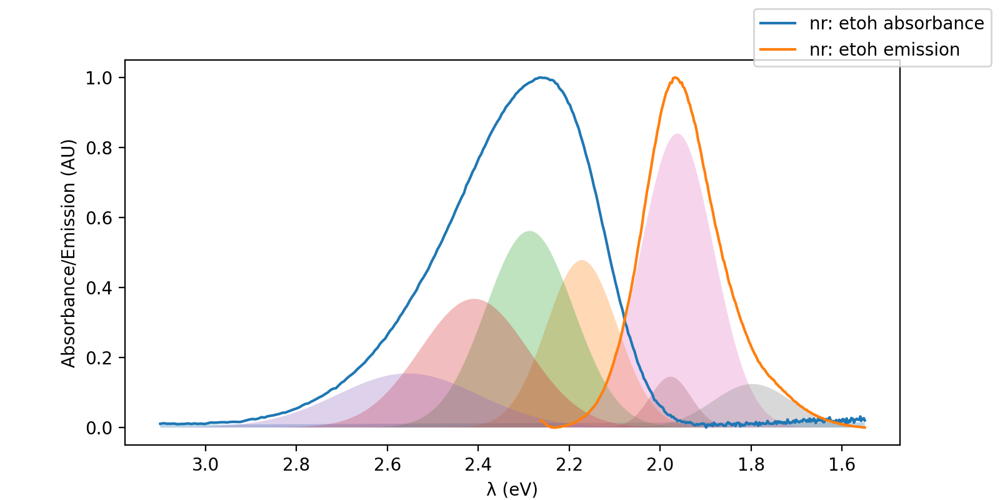
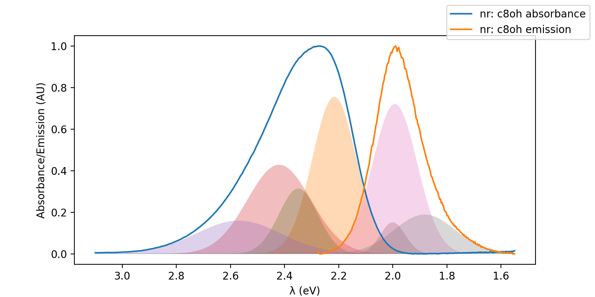
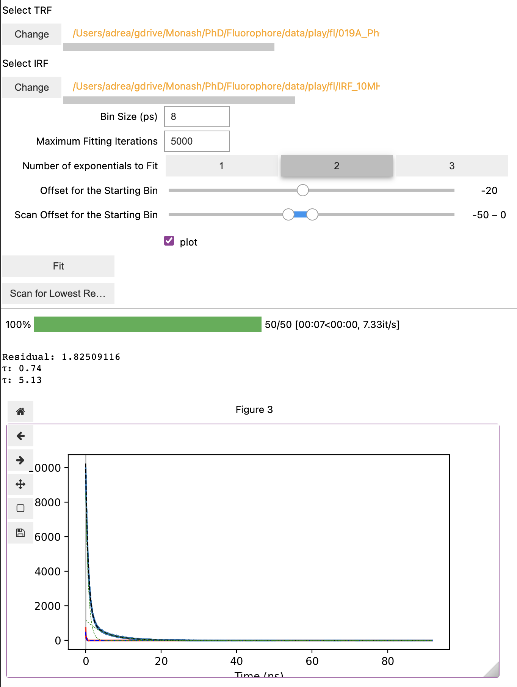
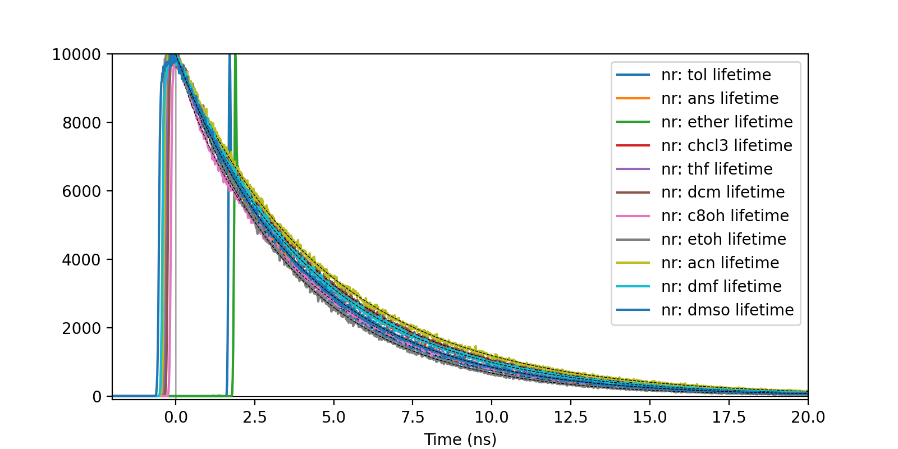
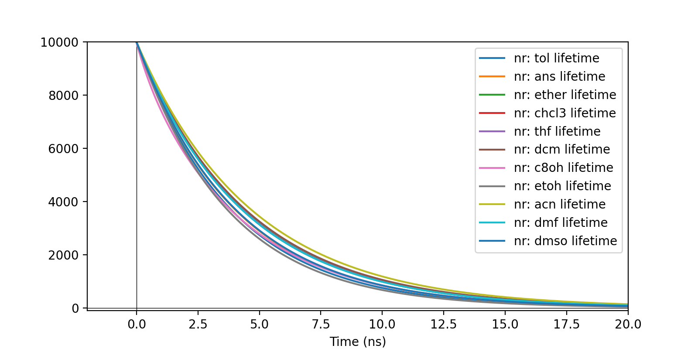
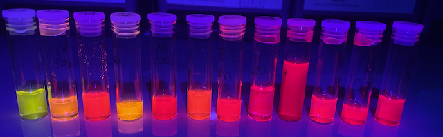
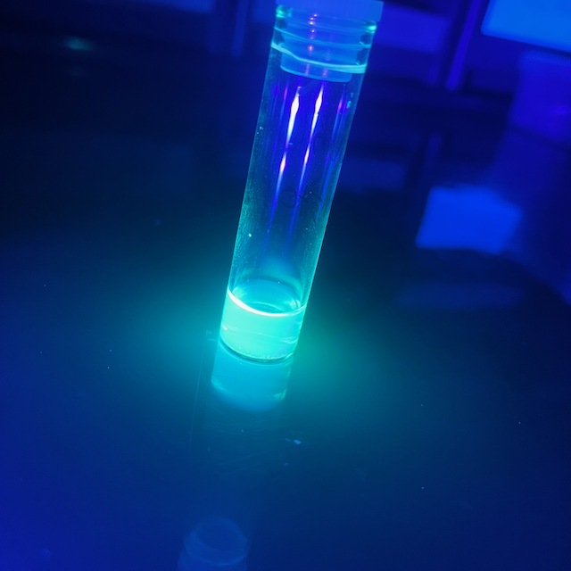
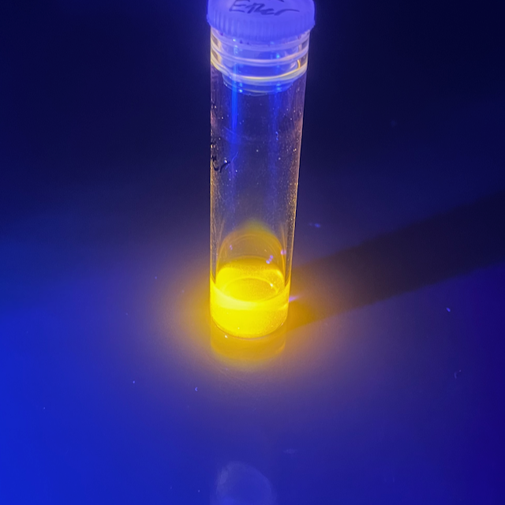
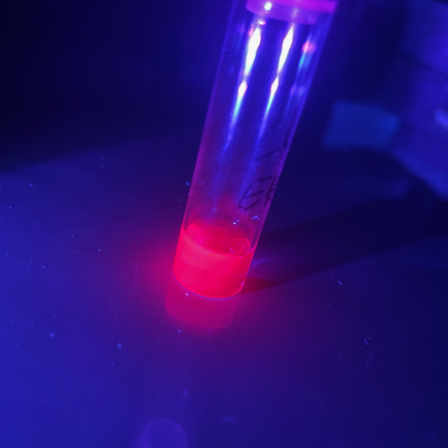

# December 2022

## Thursday 1st December

Conclusions from my brief CASSCF testing:

* Increasing the number of states calculated increases the accuracy for each state
  * Unsurprisingly, this also increases the MR character
* Basis set choice is tricky to assess
  * Def2 basis sets do seem to behave better than Dunning's for the same 𝜁
    * That said, aug-cc-pvdz does seem to be better than Def2-tzvp(d)
  * Adding diffuse functions I think is a system specific problem
* Increasing the SCF convergence had a negligible effect

## Friday 2nd December

WOOO!! I get to go in to the lab for training today :smile:

Training went well, but I need to get access to an ATR-FT/IR as well before I can take any spectra.

!!! info "From Fluorimeter training"
	
	Rosey pointed me in the direction of a cool feature of the fluorimeter though which is the excitation spectra, that is, measuring the emission at a fixed point, point, how does it vary based on the exciting wavelength. This could be incredibly useful for figuring out which absorbance peaks lead to which characteristic emission.
	
	She also suggested that the best way to ascertain the concentration of the solution is probably find documented extinction coefficients for the absorbance of the fluorophores and use their absorbance and path length to determine the concentration that way, which negates the need for making analytically accurate solutions. 

From today's reading:

> "The mechanism also suggests that the intensity of the fluorescence ought to depend on the ability of the solvent molecules to accept the electronic and vibrational quanta. It is indeed found that a solvent composed of molecules with widely spaced vibrational levels (such as water) can in some cases accept the large quantum of electronic energy and so extinguish, or ‘quench’, the fluorescence."

## Saturday/Sunday 3rd/4th December

I've been mostly "play" coding and implementing a save/load feature for spectra and deconvolution, so that it's possible to load from csv -- > deconvolute --> save and then to also be able to load from df --> plot multiple plots with/(out) gaussians in either nm or eV and with appropriate y scaling, in order to be able to see trends between the spectra.

I also realised that due to the nature of the $E=h\nu=\frac{hc}{\lambda}$ non-linear relationship, deconvolution needs to be performed on the energy or frequency scale, which I've also implemented.

In the afternoon I also made a spreadsheet to use molar extinction coefficients to determine what sort of masses I need to be able to make solutions that give a specific absorbance reading. I think I'm probably going to go with a quantitative double dilution.

## Monday 5th December

It's the FoS end of year/Alumni event today, which is kinda fun, but I've also been continuing to implement code while I have an excuse not to be writing my IPR :sweat_smile:

To fix:

* [x] Add/remove functional
* [x] Add/remove fluorophore

And I suddenly have borrowed an ATR-FTIR from the second year teaching labs to put in Toby's lab... 

I've slotted myself in to the calendar to use the UV-Vis and Fluorimeter tomorrow, so I guess we'll see how we go!

I really want to sort out this dataset already so that I can order everything I need and slowly work through the experimental stuff while everyone else is away, but I know I also need to be working on my IPR...

## To Implement:

* [x] CSV --> deconvolute --> spectra

## Tuesday 6th December

What a day!
I went into the lab and started recording data, but I found some issues with my protocol that I need to check with Toby and Katya, because doing things quantitatively is going to be VERY expensive, and if we're going to do that, we'd may as well also measure extra information, such as extinction coefficients and quantum yields. 

I'm also not sure about ATR-FTIR, since some of the solvents are too volatile to stay on the crystal for long enough to get a spectrum. I've had a quick word with Kai, and hopefully he'll have some answers to me about wether we have access to a transmission solvent well for our FTIR.

Later, I realised that I needed to implement proper linear baseline corrections to be able to do consistent deconvolutions, and when I *eventually* got that sorted, I was REALLY stoked with how good my results look, and how tight my residuals are.

I only have nile red in octanol and ethanol since I didn't want to waste too much if I needed to change my protocol.

=== "Ethanol"
	

=== "Octanol"
	

I also spent some time cleaning up some other code that I wrote, namely polishing the dataset management tools to be able to add/remove methods and fluorophores.

## Wednesday 7th December

Had a good email chat with Toby who said a few things:

* Take spectra to do quantum yield, they're not hard, 
  *  Possibly also fluorescence lifetimes
* Don't worry about concentration, so long as you get an absorbance spectra with each fluorescence, we can figure it out later
  * Absorbance shouldn't have too strong of a solvent dependence, so we should be able to use the one concentration standard curve for all solvents, but we can do this later.

Since I'm going to be doing QY calcs, I decided to set up my spectrum importer to do an auto-clipping (manual as well if needed) after baselining the spectrum, for cleaner integration. I did this on the train on my way in.

I ended up going into the lab and recording some spectra for QY measurements, but I left the fluorescence data at the lab :unamused:. I did manage to write an importer for these abs/fluor dilution series and created a new datatype for storing them. I still need to write the bit that actually computes the quantum yields though, but that will be easier with proper data.

## Thursday 8th December

Today I was back in the lab getting QY data for NR in c-hexane, MeOH (twice) and DMSO. I was up late last night and was working this morning to get my QY code working, so I need data to test it with.

#### Lessons I learned today

* Don't bother naming and saving out each individual spectra, just keep your digital workspace clean and save the batch .csv file
* Work quickly when working with volatile solvents, or your concentration will keep increasing
* If you're dealing with low-solubility solvents/solutes, keep diluting it until the absorbance stops increasing, otherwise your QY dilution with increase the concentration...
* Clean your cuvette EVERY time. A fingerprint on the glass can mess with your baseline

## Friday 9th December

Troubleshooting some of my QY issues, feedback form Toby to check:

* [x] Corrected emission spectra
  * I Have baselined all of these
* [x] Refractive index squared
  * This is sorted
* [ ] fraction of light absorbed, not abs
* [ ] use abs value at excitation wavelength (not max abs)
* [ ] correction for different excitation wavelengths if same not used for both samples
* [ ] fraction of light absorbed corrections applied the 'right way around'

#### QY Standard testing:

Possible standards:

* Rhodamine B in water @ 514nm Φ=0.31 
* Rhodamine 6G in water @ 488nm Φ=0.95
* Rhodamine 101 in ethanol @ 450nm Φ=1.00
* Cresyl Violet in ethanol @580nm Φ=0.53

A good database for these standards (including excitation wavelengths) [here](http://publications.iupac.org/pac/pdf/2011/pdf/8312x2213.pdf)!

!!! error "I am and idiot!!"
	Of course my quantum yields don't line up. I've been using $\lambda_{max}^{abs}$ for my excitations, which means that there was some spillover from the excitation beam, which was causing the non-linearity. Unfortunately though, most quantum yileds don't seem to be provided with excitation wavelengths.

Yup, fixed it...

Process Flow for data procurement:

## Sunday 11th December

Holy crap my code is getting complicated and cool!
After figuring out my QY issues on Friday, I've been cleaning up and condensing my Jupyter tools to make them as error-free as possible. They used to cry for any reason, but now I have slightly better error handling in place, as well as logging levles for good measure.

I guess I have a couple of options for this week:

* I could focus on refining my dataset and figuring out what I should add/change/order, etc.
  * This also includes trying to find extinction coefficients, quantum yields and excitation wavelengths.
* I could focus on my IPR and put everything else aside until next year
* Or I could get into the lab and start collecting some good data (NR solvatochromic series, and decent QY references)

## Monday 12th December

Well, I decided to focus on my dataset, and it's been paying off. I think the week in the lab has also helped me to get a bit of an understanding of what I'm looking for, which is good.

Okay, really good chat with Toby.

* When to baseline: if the lower energy tail is *slightly* higher then a shift is okay, but you need to be careful because it might not be truly approaching zero
* With Φ, you want to run an excitation spectrum to make sure that you're getting enough emission from your excitation wavelength
* Fluorescence lifetimes are important for the dataset, but you'll need to get Rosey to teach you
* Corrections are applied post-hoc and we have them for both the excitation lamp (single point) and an excel spreadsheet for full fluorescence corrections
* IPR notes are in the IPR tex document
* 0-0 transitions will be infrequent since they are probably forbidden, but they do represent a non-vertical transition
* ==There might be another paper in the de-convolution and interpretation of deconvoluted spectrum==

## Tuesday 13th December

Another busy day!!
Rosey taught me how to do fluorescence lifetime measurements, I picked out a naphthalamide from the pile in the lab, I tidies up a few other loose ends in my dataset, and I wrote a load of code for fluorescence lifetime fitting that's made Toby a bit jealous :stuck_out_tongue:

Look! One click lifetime fitting!

{class="center", style="max-width: 60%;"}

## Wednesday 14th December

For meeting with Katya:

* Show some of the code and tools you've written
* Talk about fluoresence lifetime stuff
* Talk about IPR and Toby's take
* Ask about purchasing chemicals, are we ready to make the big purchase?
* Run GANTT by Katya
* Deconvolution paper?
* Splitting dataset paper into experimental and computational work?

Do a literature search on UV-Vis deconvolution

## Thursday 15th December

Laser lab day!!! woo!!!

I also got my whole data set ordered, so I'm just waiting for full approval, though it does mean that I have a mostly finalised dataset and can start back up on computations.

I think today I'll be trying to do fluorescence lifetimes of the NR dataset

Well, I got four TRFs. I'm pretty pleased with that! Lots of coding as well, but I managed to set up the time resolved setup almost entirely without help!

#### To do:

* [ ] CASSCF active space predictions for each fluorophore
  * Am currently running MP2 natorbs to get more representative orbitals

* [x] Kick off the TD-DFT opts for the new fluorophores
* [x] Fix $\chi^2$ calc
* [x] Find all the known values for `fluorophores.py`
* [x] Plot residuals in FL
* [ ] UV-Vis deconvolution lit search

## Sunday 18th December

Big day!

I went to uni and spent the afternoon/evening in the lab, and got all the time resolved data from nile red, which meant that I'v enow worked with all the solvents in my series, and I have been able to put a bit more polish into my lifetime code. 

Here I show all the data, and that by removing the IRF and offsetting by b and d, I can get everything to line up properly.

{class="center", style="max-width: 60%;"}

And without the data to make it less messy

{class="center", style="max-width: 60%;"}

I also took some fantastic photos of the solvatochromic series 

{class="center", style="max-width: 80%;"}

And some even more spectacular pics of my reference species!

|  |  |  |
| :------------------------: | :------------------------: | :------------------------: |
|       R6G in ethanol       |        NR in ether         |       CV in ethanol        |

## Monday 19th December

I decided not to work today... so naturally I'm plonked in a cafe doing work :unamused:

I had to chase up some customs stuff with one of my chemical orders which was a bit frustrating...

I've been pushing through the MP2 natorbs jobs and have been setting up the gas phase optimisations.

## Tuesday 20th December

Group Christmas celebrations today!

## Wednesday 21st December

I feel a big code refactor coming on...

I think I need some kind of db to better handle all the different job types.

## Over the break

Yup, first day off and did a BIG refactor :unamused: Philip did get QChem up and running on MonARCH and theoretically M3, so that's VERY exciting :)

As you can see by my to do list below, there's still plenty more to do!

Looking at higher level calculations I'm having some trouble deciding what to do...

I think that RI-ADC(2) in qchem is looking okay, especially since it also supports ptSS, but CASSCF is trickier. ORCA is looking like my best shot though if I don't care too much about solvation.

#### Azulene Opt Trial (3.35eV)

| Job (10 rots unless specified)                               | States |     SS      |  RI  | $s_2\to s_0$ | Error |     $f$      |
| ------------------------------------------------------------ | :----: | :---------: | :--: | :----------: | :---: | :----------: |
| QChem RI-CCSD/aug-cc-pvdz opt/sp                             |   4    |             |  RI  |     4.57     | 1.22  | Didn't print |
| ORCA SS-RI-CASSCF(12,12)/aug-cc-pvdz                         |   10   |     SS      |  RI  |     3.34     | 0.01  |    0.0033    |
| ORCA SS-RI-NEVPT2(12,12)/aug-cc-pvdz                         |   10   |     SS      |  RI  |     3.66     | 0.31  |    0.0036    |
| ORCA SS-RI-QD-NEVPT2(12,12)/aug-cc-pvdz                      |   10   |     SS      |  RI  |     3.67     | 0.32  |    0.0134    |
| ORCA SS-RI-CASPT2(12,12)/aug-cc-pvdz                         |   10   |     SS      |  RI  |     3.32     | 0.03  |    0.0033    |
| ORCA RI-CASSCF(12,12)/aug-cc-pvdz                            |   10   |             |  RI  |     3.51     | 0.16  |    0.0019    |
| ORCA RI-NEVPT2(12,12)/aug-cc-pvdz                            |   10   |             |  RI  |     3.65     | 0.30  |    0.0020    |
| ORCA RI-QD-NEVPT2(12,12)/aug-cc-pvdz                         |   10   |             |  RI  |     3.66     | 0.31  |    0.0154    |
| ORCA RI-CASPT2(12,12)/aug-cc-pvdz                            |   10   |             |  RI  |     3.30     | 0.05  |    0.0041    |
| SS-RI-CASSCF(12,12)/aug-cc-pvdz//RI-ADC(2)/aug-cc-pvdz       |   10   |     SS      |  RI  |     3.44     | 0.09  |    0.0074    |
| RI-CCSD/aug-cc-pvdz//RI-ADC(2)/aug-cc-pvdz                   |   10   |             |  RI  |     3.62     | 0.27  |    0.0582    |
|                                                              |        |             |      |              |       |              |
| ORCA CASPT2(12,12)/aug-cc-pvdz                               |   10   |             |      |     3.28     | 0.07  |    0.0019    |
| ORCA SS-CASPT2(12,12)/aug-cc-pvdz                            |   10   |     SS      |      |     3.35     | 0.00  |    0.0024    |
|                                                              |        |             |      |              |       |              |
|                                                              |        |             |      |              |       |              |
| ORCA CASPT2(12,12)/aug-cc-pvdz                               |   4    |             |      |     3.30     | 0.05  |    0.0020    |
| ORCA CASPT2(12,12)/aug-cc-pvdz                               |   4    |     SS      |      |     3.31     | 0.04  |    0.0033    |
| ORCA RI-CASPT2(12,12)/aug-cc-pvdz                            |   4    |             |  RI  |     3.30     | 0.05  |    0.0020    |
| ORCA RI-CASPT2-K(12,12)/aug-cc-pvdz                          |   4    |             |  RI  |     2.90     | 0.45  |    0.0017    |
| SS-RI-ORCA CASPT2-K(12,12)/aug-cc-pvdz                       |   4    |     SS      |  RI  |     3.40     | 0.05  |    0.0034    |
|                                                              |        |             |      |              |       |              |
| These jobs are all from an MP2 natorb basis                  |        |             |      |              |       |              |
| SS-RI-FIC-CASPT2(10,10)/def2-tzvp                            |   4    |     SS      |  RI  |     3.02     | 0.33  |    0.0026    |
| SS-RI-FIC-CASPT2-K(10,10)/def2-tzvp                          |   4    |     SS      |  RI  |     3.21     | 0.14  |    0.0027    |
| SS-RI-FIC-NEVPT2(10,10)/def2-tzvp                            |   4    |     SS      |  RI  |     3.66     | 0.31  |    0.0030    |
| SS-RI-SC-NEVPT2(10,10)/def2-tzvp                             |   4    |     SS      |  RI  |     3.68     | 0.33  |    0.0031    |
|                                                              |        |             |      |              |       |              |
|                                                              |        |             |      |              |       |              |
| These jobs are all from an MP2 natorb basis with  Perturbation was only performed on states 0-2 |        |             |      |              |       |              |
| SS-CASSCF(12,12)/def2-tzvp                                   |   10   |     SS      |      |     3.50     | 0.15  |    0.0048    |
| SS-CASPT2-(12,12)/def2-tzvp                                  |   10   |     SS      |      |     3.07     | 0.28  |    0.0042    |
| SS-RI-CASPT2(12,12)/def2-tzvp                                |   10   |     SS      |  RI  |     3.09     | 0.26  |    0.0043    |
| SS-NEVPT2(12,12)/def2-tzvp                                   |   10   |     SS      |      |     3.60     | 0.25  |    0.0050    |
| SS-RI-NEVPT2(12,12)/def2-tzvp                                |   10   |     SS      |  RI  |     3.60     | 0.25  |    0.0050    |
| SS-QD-NEVPT2(12,12)/def2-tzvp                                |   10   |     SS      |      |     3.68     | 0.33  |    0.0031    |
|                                                              |        |             |      |              |       |              |
|                                                              |        |             |      |              |       |              |
| **==top left==**                                             |        |             |      |              |       |              |
| These jobs are all from an MP2 natorb basis with  Perturbation was only performed on states 0-2 |        |             |      |              |       |              |
| SS-CASSCF(12,12)/aug-cc-pvdz                                 |   10   |     SS      |      |     3.45     | 0.10  |    0.0104    |
| SS-CASPT2-(12,12)/aug-cc-pvdz                                |   10   |     SS      |      |     3.36     | 0.01  |    0.0102    |
| SS-RI-CASPT2(12,12)/aug-cc-pvdz                              |   10   |     SS      |  RI  |     3.34     | 0.01  |    0.0101    |
| SS-NEVPT2(12,12)/aug-cc-pvdz                                 |   10   |     SS      |      |     3.79     | 0.44  |    0.0115    |
| SS-RI-NEVPT2(12,12)/aug-cc-pvdz                              |   10   |     SS      |  RI  |     3.79     | 0.44  |    0.0115    |
| SS-QD-NEVPT2(12,12)/aug-cc-pvdz                              |   10   |     SS      |      |     3.79     | 0.44  |    0.0115    |
|                                                              |        |             |      |              |       |              |
| **==bottom left==**                                          |        |             |      |              |       |              |
| SS-CASSCF-(12,12)/aug-cc-pvdz                                |   10   |     SS      |      |     3.41     | 0.06  |    0.0169    |
| SS-CASPT2-(12,12)/aug-cc-pvdz (all roots perturbed)          |   10   |     SS      |      |     3.05     | 0.30  |              |
| SA-CASSCF-(12,12)/aug-cc-pvdz                                |   10   | SA (SS ref) |      |     3.65     | 0.30  |    0.0130    |
| SA-CASPT2-(12,12)/aug-cc-pvdz (all roots perturbed)          |   10   | SA (SS ref) |      |     2.68     | 0.67  |    0.5461    |
| SS-CASPT2-(12,12)/aug-cc-pvdz (all roots perturbed) (noiter) |   10   |     SS      |      |     3.05     | 0.30  |              |
| SA-CASPT2-(12,12)/aug-cc-pvdz (all roots perturbed) (noiter) |   10   | SA (SS ref) |      |     2.68     | 0.67  |    0.5461    |

* CASSCF SS vs SA - SS
* CASPT2 SS vs SA - SS
* CASPT2 RI on/of - Negligible difference
* CASPT2 K not K - K off seems to be better
* States - less seems better. 4 is probably a good amount
  * Except that pure SS-CASPT2(12,12) with 10 roots gave the best result overall...
* NEVPT2 vs CASPT2 - CASPT2
* Noiter doesn't change the results

Takeaways:

* Use RI
* Use noiter if you have a casscf ref wfn
* CASPT2 seems to be the better MRPT method
* SS is definitely needed
* only use as many states as you need, or your wfn will be too average

Yeah, I think ORCA is going to be the way to go for CASSCF opts. QChem seems to be decent for correlated jobs, and surprisingly fast for ADC(2).

## To do:

* [ ] Jobs

  * [x] Fire off s1 freqs
  * [ ] Test QChem to figure out how to do VEM/cLR/LR/IBSF **emission**
* [ ] Code

  * [x] Write QChem wrapper
  * [x] Write QChem job status checking
  * [ ] Write energy extractors
    * [ ] These need to write into the respective computational DBs
    * [x] pullORCA_Freq
      * $\Delta E_{ZPVE}$
      * $\Delta E_{elec}$
      * Number of -ve freqs
      * [ ] Extend and test for CASSCF
    * [x] pullORCA_En
      * State specific total energy
      * State energy
      * Oscillator strengths
      * Transition dipoles 
      * [ ] Extend and test for CASSCF
    * [ ] pullQChem_Freq
      * $\Delta E_{ZPVE}$
      * $\Delta E_{elec}$
      * Number of -ve freqs
      * [ ] Extend and test for CASSCF
    * [x] pullQChem_En
      * State specific total energy
      * State energy
      * Oscillator strengths
      * Transition dipoles 
      * [ ] Extend and test for CASSCF
    * [ ] ~~pullPySCF_CASSCF~~
      * State specific total energy
      * State energy
      * Oscillator strengths
      * Transition dipoles 
      * M-diagnostic
  * [x] Write computational energy db
    * [x] Different one for each job type

      * [x] Freqs [fluorophore, state, metajob, property) solvent]
      * [x] Emission [fluorophore, state, metajob, property) solvent]
      * [x] Excitation [fluorophore, state, metajob, property) solvent]
      * [x] CASSCF [fluorophore, state, metajob, property) solvent]
  * [x] Extend db manager to handle computational energy DBs
  * [x] Write notebook to submit from metajob
  * [x] read tddft from job object to make sure it's not being run for gs opt/freq jobs
  * [x] fit spectra view and import spectra to handle not having a qy_ref db
* [ ] For Lizzie

  * [x] Jupyter on cluster
  * [ ] Transfers documentation
* [ ] Documentation

  * [x] QChem on the group wiki
  * [ ] Transfers documentation
* [ ] Develop a casscf/caspt2 workflow for my fluorophore testing

  * [ ] CASSCF active space predictions for each fluorophore
    * Am currently running MP2 natorbs to get more representative orbitals

  * [x] Once the dataset is finalised, identify the active spaces for the molecules with IBOView
  * [ ] Then do some basis set benchmarking
  * [ ] Try linearly interpolating between states
