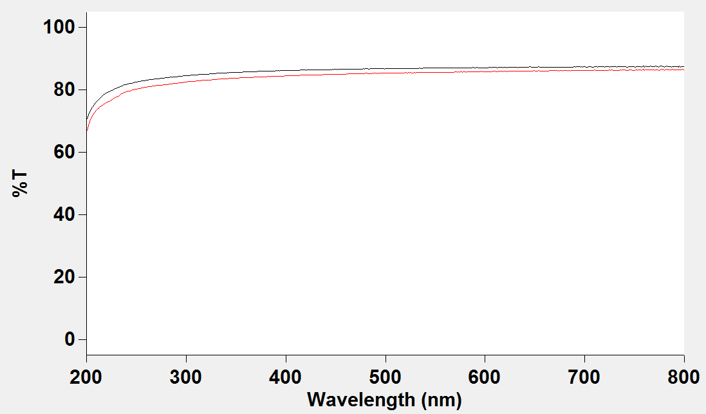
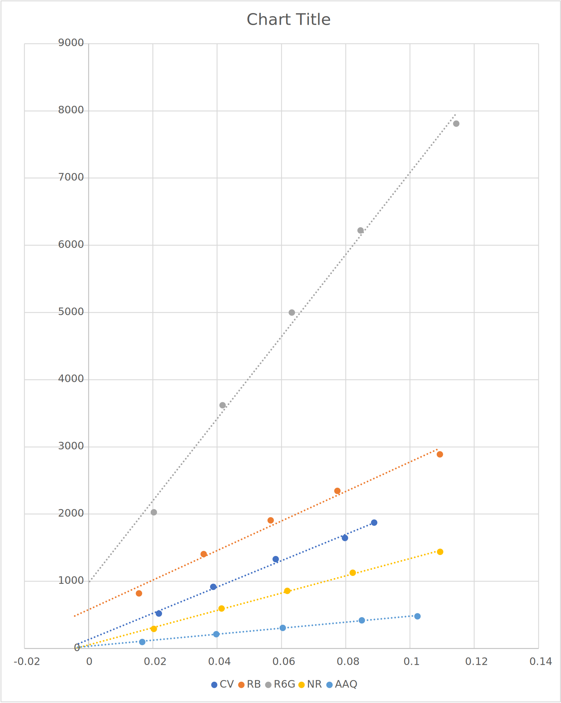
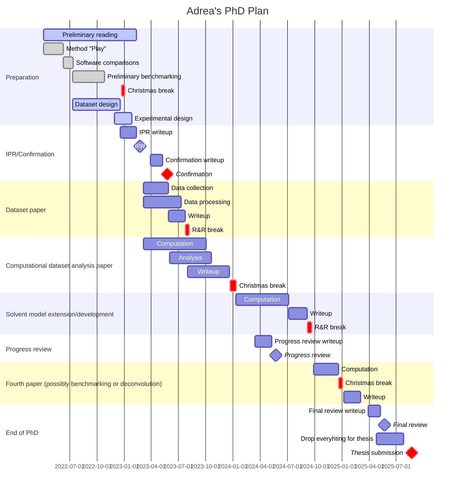
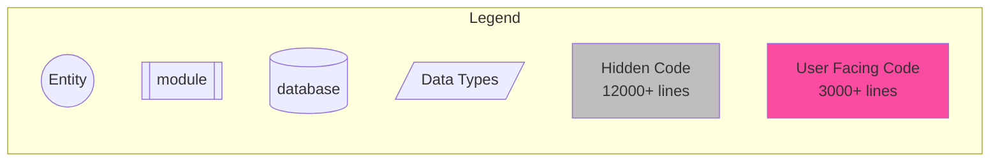
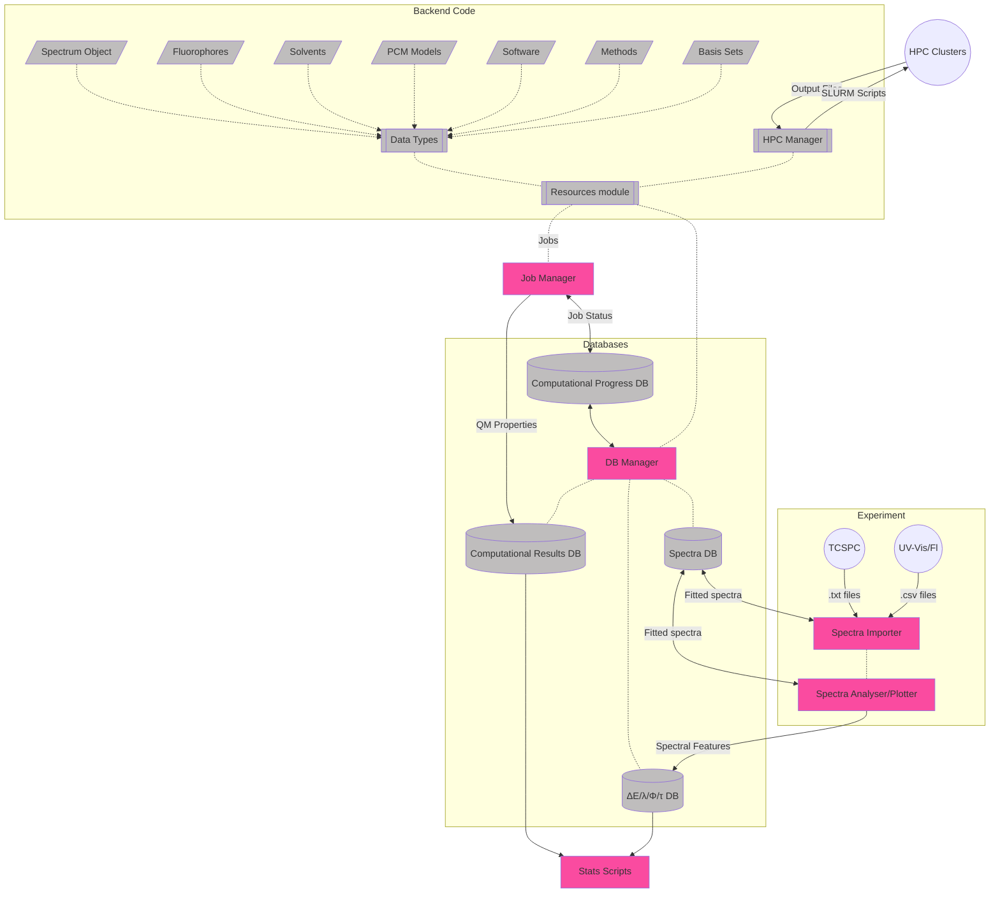

# January 2023

## Tuesday 3rd January

First day back (officially), and I am feeling drained. Triple shot latte to start the day though.

Today I think I should do some reading on UV-Vis deconvolution in the morning, then after lunch I'll focus on my IPR. It's going to be very hard not to get distracted with computation and coding though...

It looks like UV-Vis devoncolution has been done before, but seems to be a forgotten art. [Calabrese et al](https://doi.org/10.1016/j.saa.2014.12.095) did this in 2015 in order to resolve complex band shapes within micelles, and used a linear baseline correction. [Vanderbel and Henrich](https://doi.org/10.1366/000370253774634702) explored the idea in  1953 in a very crude way to demonstrate the method's usefulness.

In recent years, it seems to have been relinquished to the domain of biochemistry, where extremely complex spectra need to be understood, and other techniques have been developed to help with this by looking at the band shapes rather than the component gaussians.

And conveniently there's a 1999 review on it by [Antonov and Nedeltcheva](https://doi.org/10.1039/a900007k)! They also talk about the use of fitting within the first derivative of the spectrum to remove baseline issues, but I'm not sure that this is so relevant for our work.

I did manage to get a couple of paragraphs of my IPR out before a migraine took over...

I also popped my head into the lab to assess the difference in transmission between the two good quartz cuvettes, and there is a quantitative difference (~3-5%T), so I think it might be important to use the same singular cuvette for baselining/blanking as for readings. The error is also not consistent wrt energy

{class="center", style="max-width: 60%;"}

#### For Azulene (3.35 eV)

| Job                          | States |  SS  |  RI  | $s_2\to s_0$ | Error |  $f$   |
| ---------------------------- | :----: | :--: | :--: | :----------: | :---: | :----: |
| **==left==**                 |        |      |      |              |       |        |
| CASSCF(12,12)/aug-cc-pvdz    |   3    |  SS  |      |     3.37     | 0.02  | 0.0078 |
| CASPT2(12,12)/aug-cc-pvdz    |   3    |  SS  |  RI  |     3.33     | 0.02  | 0.0101 |
| NEVPT2(12,12)/aug-cc-pvdz    |   3    |  SS  |  RI  |     3.79     | 0.44  | 0.0115 |
| QD-NEVPT2(12,12)/aug-cc-pvdz |   3    |  SS  |  RI  |     3.81     | 0.46  | 0.0135 |

## Wednesday 4th January

I mostly focused on extending my code, because my brain was barely functional, and scraping by running on caffeine.

## Thursday 5th January

Looking at the molcas guide to excited states the suggestion that they implement is as follows

1. SS opt to get the geometry
2. SA opt to get the orbitals for each state
3. SA-CASPT2 since it will effectively be SS wrt each root

This might address the issue of CASPT2 convergence as well. Currently testing on Gadi

==This seems to make things worse? I'm testing with 8-methoxy-BOBIPY, since it's more dynamically correlated than azulene==

#### For 8-methoxy-BODIPY (2.59eV)

| Job                                  | States |  SS  |  RI  | $s_2\to s_0$ | Error |
| ------------------------------------ | :----: | :--: | :--: | :----------: | :---: |
| CASSCF(10,10)(3)                     |   3    |  SS  |      |     1.87     | 0.72  |
| CASSCF(10,10)(10)                    |   10   |  SS  |      |     1.87     | 0.72  |
| CASPT2(10,10)(3)//CASPT2(10,10)(3)   |  3/3   |  SS  |  RI  |     7.86     | 5.27  |
| CASPT2(10,10)(3)//CASPT2(10,10)(10)  |  3/10  |  SS  |  RI  |     2.53     | 0.06  |
| CASPT2(10,10)(10)//CASPT2(10,10)(10) | 10/10  |  SS  |  RI  |     2.53     | 0.06  |
|                                      |        |      |      |              |       |
| CASSCF(10,10)(3)                     |   3    |  SA  |      |     3.03     | 0.44  |
| CASSCF(10,10)(10)                    |   10   |  SA  |      |     3.12     | 0.53  |
| CASPT2(10,10)(3)//CASPT2(10,10)(3)   |  3/3   |  SA  |  RI  |     2.45     | 0.14  |
| CASPT2(10,10)(3)//CASPT2(10,10)(10)  |  3/10  |  SA  |  RI  |     2.45     | 0.14  |
| CASPT2(10,10)(10)//CASPT2(10,10)(10) | 10/10  |  SA  |  RI  |     2.41     | 0.18  |

==Yup... SS is definitely better. I think I need to try a combination now? SA+SS or SS+SA==

I had a look at using a derivative of the spectra for fitting to remove baseline issues, but in trying it, I couldn't get normalisation to work, and in looking deeper, it's a pretty contentious method, as it dramatically increases the signal-to-noise ratio in the data, which means that Fourier smoothing is required, which makes the actual peaks allocations less reliable. In reading further baselines can effectively be treated as VERY broad gaussians that we just don't have the resolution to see, so in this case, it should theoretically be okay to let the baseline issues be.

From Tuesday's testing, baselines are also pretty cuvette dependent, so it definitely warrants a lot of care and attention to get.

Today I tried to re-do my quantum yield standards, and again they turned out really wrong. I'm honestly not sure why.

I think the samples might have degraded...

## Friday 6th January

Today I managed to do some more writing on my IPR, then I got distracted with CASSCF stuff, then got distracted re-arranging my desk, then got distracted with upgrading my gaming pc to windows 11 (and all the subsequent bug fixing)... :sweat_smile:

#### For 8-methoxy-BODIPY (2.59eV)

| Job                                             | States |  SS   |  RI  | $s_2\to s_0$ | Error |
| ----------------------------------------------- | :----: | :---: | :--: | :----------: | :---: |
| CASSCF(10,10)(3)                                |   3    |  SS   |      |     1.87     | 0.72  |
| CASPT2(10,10)(3)//CASPT2(10,10)(10)             |  3/10  |  SA   |  RI  |     2.53     | 0.06  |
| CASPT2(10,10)(3)//CASPT2(10,10)(3)              |        | SS/SA |  RI  |     2.53     | 0.06  |
| CASPT2(10,10)(3)//CASPT2(10,10)(3/10 perturbed) |        | SS/SA |  RI  |     2.53     | 0.06  |
| CASPT2(10,10)(3)//CASPT2(10,10)(5/10 perturbed) |        | SS/SA |  RI  |     2.53     | 0.06  |
| SA-CASPT2(10,10)(2/10)                          |        |  SA   |  RI  |     2.41     | 0.18  |
| SA-CASPT2(10,10)(2/20)                          |        |  SA   |  RI  |     2.53     | 0.06  |
|                                                 |        |       |      |              |       |
| CASSCF(10,10)(3)                                |   3    |  SA   |      |     3.03     | 0.44  |
| CASPT2(10,10)(3)//CASPT2(10,10)(10)             |  3/10  |  SS   |  RI  |     2.45     | 0.14  |
| CASPT2(10,10)(3)//CASPT2(10,10)(3)              |        | SA/SA |  RI  |     2.45     | 0.14  |
| CASPT2(10,10)(3)//CASPT2(10,10)(3/10 perturbed) |        | SA/SA |  RI  |     2.45     | 0.14  |
| CASPT2(10,10)(3)//CASPT2(10,10)(5/10 perturbed) |        | SA/SA |  RI  |     2.45     | 0.14  |

I guess this is it... State specific wavefunction of just enough states for the starting wfn, then let the CASPT2 job handle the 

#### Today's findings:

1. Assuming `noiter` is used (CASCI), then the amount of states you calculate in the CASPT2 calculations seems to be irrelevant.
2. If a state-specific wavefunction is used as the input for the CASPT2 run, then the number of roots determined in that first run is also irrelevant.
3. For state-averaged runs with `noiter`, the number of roots in the CASPT2 calculation is irrelevant, however the number of states you average over does seem to make a difference, with more states making the resulting wavefunction better? (*I think*...)
4. Don't calculate a rood in CASPT2 unless you want to perturb it, otherwise the screwed up energies change the root ordering and ORCA's output isn't the most useful.
5. Perturbing roots too far from the current state in a state specific calculation results in poorly converging roots. This is where multiple state-specific or a state-averaged calculation should be used.
6. Iterations in the CASPT2 step will convert the wavefunction to a state-averaged one if iterations are allowed.

This means that the ideal protocol should be:

1. SS CASSCF run with good quality TD-DFT geometry to get the orbitals
2. CASPT2 with noiter for as many states as needed. SA/SS is irrelevant, since it only does CASCI.

## Saturday/Sunday 7/8th January

| Basis       | States |  SS  | $s_2\to s_0$ CASSCF | $s_2\to s_0$ CASPT2 | CASPT2 Error | Notes                                              |
| ----------- | :----: | :--: | :-----------------: | :-----------------: | :----------: | -------------------------------------------------- |
| def2-tzvp   |   3    |  SS  |        1.96         |        2.92         |     0.33     |                                                    |
| def2-tzvpd  |   3    |  SS  |                     |                     |              | Did not converge                                   |
| aug-cc-pvdz |   3    |  SS  |        1.87         |        2.53         |     0.06     |                                                    |
| aug-cc-pvtz |   3    |  SS  |        2.04         |                     |              | Could not provide enough memory without burning SU |

#### Current ideal jobs?

* SS version
  1. MP2 natorbs
  2. SS-CASSCF (minimal states)
  3. CASCI-CASPT2 (as many states as are required)
*  SA Version
  1. MP2 natorbs
  2. SA-CASSCF (lots of states... maybe 20?)
  3. CASCI-CASPT2 (as many states as are required)

Following the ideal jobs above (and using def2-tzvp for cost), I'm running one last (hopefully) set of tests...

* 8-methoxy-BODIPY $s_1\to s_0=$ 2.59 eV
* Azulene $s_2\to s_0=$ 3.35 eV
* Coumarin 153 $s_1\to s_0=$ 3.37 eV

| Fluorophore      | States |  SS  | $s_2\to s_0$ CASSCF | $s_2\to s_0$ CASPT | CASPT2 Error |
| :--------------- | :----: | :--: | :-----------------: | :----------------: | :----------: |
| 8-methoxy-BODIPY |   2    |  SS  |        1.96         |        2.92        |     0.33     |
| 8-methoxy-BODIPY |   10   |  SA  |        3.26         |        2.44        |   ==0.15==   |
| 8-methoxy-BODIPY |   20   |  SA  |        3.66         |        2.32        |     0.27     |
| 8-methoxy-BODIPY |   30   |  SA  |  Did not converge   |                    |              |
| Azulene          |   3    |  SS  |        4.08         |        3.16        |   ==0.19==   |
| Azulene          |   10   |  SA  |        4.24         |        2.95        |     0.40     |
| Azulene          |   20   |  SA  |        4.28         |        2.94        |     0.41     |
| Azulene          |   30   |  SA  |        4.30         |        2.92        |     0.43     |
| Coumarin 153     |   3    |  SS  |        2.09         |        2.57        |   ==0.8==    |
| Coumarin 153     |   10   |  SA  |        4.33         |        2.33        |     1.01     |
| Coumarin 153     |   20   |  SA  |        4.07         |        2.30        |     1.07     |
| Coumarin 153     |   30   |  SA  |        4.05         |        2.28        |     1.09     |

The results are not consistent, Azulene works best with state specific, 8-methoxy-BODIPY works best with state averaged. Azulene has a much greater contribution from static correlation though, so I'm not sure if it's better indicator or not?

Throwing Coumarin 153 into the mix, SS seems to be the way to go. With a better basis set, this should hopefully yield better results...

## Monday 9th January

I lost my glasses today, so I didn't get much done... Michael also came back for the first time in his postdoc since submitting his thesis, so there was lots of catching up to do.

## Tuesday 10th January

I didn't get much done today in the way of actual work, but I did get some housekeeping chores sorted.

## Wednesday/Thursday 11/12th January

I decided to work form home today to keep myself more focused on writing, and I think it's working so far...

## Friday 13th January

The new cuvette I ordered finally arrived, and I'm very keen to get in the lab and see it compares the the current ones we have. I had a look and it seems that this manufacturer also makes screw cap cuvettes, so if the optical clarity of these is decent, it might be worth saving Toby a bunch of money when he goes to buy more.

#### Cuvette testing

In this transmission plot, each coloured line is a different cuvette, and the two lines are the two different paths. The pink and blue lines are the current premium cuvettes that we have, and the orange line is the new cuvette that I bought.

The weird blue line was a face that had a scratch in it, so I'm guessing that something that absorbs might have gotten stuck in that crevice.

The new cuvette is interesting though, as the two paths have different optical properties below 400nm, which makes me think that they might be using offcuts to form the cuvettes, rather than using the same quartz supply. Either way, I think it should be perfectly fine for use in the visual region.

{class="center", style="max-width: 60%;"}

## Saturday 14th January

I've been struggling to get a few of the larger CASSCF jobs through with the full (16,16) active space, so I'm going to try and do them (r800, nr, bsc, asp, fl) with a smaller active space to see if a) they'll fit, and b) to see if their active space is actually smaller...

I didn't feel like doing any writing in the heat, but I did end up making a few fables for the later stages of my IPR. This also meant trying to figure out a way to quantify the amount of CT and MR character, and I came across the $D_{CT}$ and $t$ metrics for defining hole-electron distances and overlaps, and I've been processing my jobs for those today. I think that the *m*-index is probably a good one for MR character though.

## Sunday 15th January

I realised that I need to re-do a bunch of the CASSCF calculations and that my fluorescein geometry was wrong, so I've been trying to push those jobs through today (and a bit last night).

## Monday 16th January

Well I did eventually get some more IPR writing done, and I've still been trying to figure out some active space challenges with my fluorophores. Tomorrow I should check and re-run all my CASSCF jobs.

## Tuesday 17th January

My tailing sections of my IPR are a bit of a mess, but I'm slowly fleshing them out.

I've also been pushing out some MDP hours

## Wednesday 18th January

More MDP "multitasking" today :sweat_smile:...

I've been doing more work in identifying active spaces for my fluorophores, and I think I'm narrowing in on some values.

I'm currently trying to pick some dates for my IPR as well, and so far these are the dates I have:
| Date/time               |       Katya        |        Toby        |       Alison       |       Bayden       |
| ----------------------- | :----------------: | :----------------: | :----------------: | :----------------: |
| Thursday 16th Feb 3pm   | :white_check_mark: |                    |                    |                    |
| Monday 20th Feb 4pm     |                    | :white_check_mark: |                    |                    |
| Wednesday 22nd Feb 10am | :white_check_mark: | :white_check_mark: | :white_check_mark: | :white_check_mark: |
| Wednesday 22nd Feb 2pm  |                    | :white_check_mark: |                    |                    |
| Thursday 23rd Feb 1pm   | :white_check_mark: | :white_check_mark: | :white_check_mark: | :white_check_mark: |

A Doodle poll has been created and sent out.

## Thursday 19th January

I've put myself down as a backup TA for some outreach work which means that I needed to head in to campus way too early :tired_face:. On the bright side, I can't really avoid doing work if I'm here...

## Friday 20th January

I didn't want to come in to the office today, but I think that Anna wants to chase down the origin of why my staff account got removed... Either way, I'mma take my time going in.

## Saturday 21st January

I think I figured out my QY issues; In looking at some new species, it stands to reason that the x/y intercept being off is related to the amount of degradation in the sample. An intercept of (0,0) indicates that every photon going in is being accounted for in the fluorescence/relaxation process.

{class="center", style="max-width: 40%;"}

The two bottom species have been freshly bought, hence their perfect intercepts.

RB in water and CV in etoh should be re-tested.

Should also try fluorescein in 0.1M NaOH (Φ=0.91 @ 470nm)

Perhaps quinine sulphate in 0.05M $\ce{H2SO4}$ (Φ=0.60 @ 350nm)

C153 in chex? (Φ=0.90 @ 393nm)

## Active Spaces Finalised

| Fluorophore                             |     Finalised?     |
| --------------------------------------- | :----------------: |
| Nile Red                                | :white_check_mark: |
| *N*-propyl-4-hydroxyl-1,8-naphthalamide | :white_check_mark: |
| Rhodamine 800                           | :white_check_mark: |
| Coumarin 153                            | :white_check_mark: |
| BODIPY 493/503                          | :white_check_mark: |
| Azulene                                 | :white_check_mark: |
| 1-aminoanthraquinone                    | :white_check_mark: |
| DAPI                                    | :white_check_mark: |
| Dansyl Amide                            | :white_check_mark: |
| Boron subphthalocyanine chloride        | :white_check_mark: |
| α-Sexithiophene                         |                    |
| Rhodamine 575                           | :white_check_mark: |
| Fluorescein                             | :white_check_mark: |
| 8-methoxy-BODIPY                        | :white_check_mark: |

## Sunday 22nd-29th January

!!! warning "COVID Time :unamused:"
	So I tested positive for COVID on Sunday evening and have decided to take things pretty slowly in this recovery. That Said I have done a *little* bit of work...
	

I realised that the problem with my QY comparisons is the difference in excitation lamp intensity. Without corrections we can't really do anything about this, except to excite reference and sample at the same wavelength.

I've been extending my code to allow for alternative orb/switch steps in the CASSCF optimiser, and to make an automated system for MO inputs in ORCA.

#### Wednesday
Well my MacBook is dead. It looks like a logic board hardware fault since the backlight is completely dead and it gets stuck in a boot loop. Thankfully, I can still use my iPad for latex and markdown stuff, and I’ve set up my code on my Windows (:nauseated_face:) gaming pc.

I've lodged a ticket with eSolutions, but it might take some time for them to assess and decide to repair or replace the MacBook.

#### Friday
In the process of setting up on my iPad, I've had to migrate to using Overleaf as well, which isn't bad, but it's taken a bit of work (CSS injection of better fonts mostly) to get to the comfort of working in something native. On the bright side, I'm not reliant on a local Zotero install to do my bibTeX syncing.

## Monday 30th January

What a crazy day... I got some excitation corrections form Toby and have trying to implement, which also meant recording some new sample QY series. I have found some bugs in my code though, and I'm still trying to work through those fixes.

I need to put the finishing touches on my IPR draft write up, then send it off to Katya for review.

## Tuesday 31st February

Group meeting notes...

one prac each for marking ex9 - Wednesdays for this 

To add to the group wiki - contact list

## To do:

* [ ] Jobs

  * [ ] Test QChem to figure out how to do VEM/cLR/LR/IBSF **emission**
* [ ] Code

  * [ ] Write energy extractors
    * [x] These need to write into the respective computational DBs
    * [x] pullORCA_Freq
      * $\Delta E_{ZPVE}$
      * $\Delta E_{elec}$
      * Number of -ve freqs
      * [ ] Extend and test for CASSCF
    * [x] pullORCA_En
      * State specific total energy
      * State energy
      * Oscillator strengths
      * Transition dipoles 
      * [x] Extend and test for CASSCF
    * [ ] pullQChem_Freq
      * $\Delta E_{ZPVE}$
      * $\Delta E_{elec}$
      * Number of -ve freqs
      * [ ] Extend and test for CASSCF
    * [x] pullQChem_En
      * State specific total energy
      * State energy
      * Oscillator strengths
      * Transition dipoles 
      * [ ] ~~Extend and test for CASSCF~~
        * QChem's RASSCF implementation doesn't seem to do excited states all that well.
* [ ] For Lizzie

  * [ ] Transfers documentation
* [ ] Documentation

  * [ ] Transfers documentation
* [x] Develop a casscf/caspt2 workflow for my fluorophore testing

  * [x] CASSCF active space predictions for each fluorophore
    * Am currently running MP2 natorbs to get more representative orbitals

  * [ ] Then do some basis set benchmarking
  * [ ] Try linearly interpolating between states

## To Do for IPR:

* [ ] Read cLR geom paper [10.1039/C4CP03919J](https://doi.org/10.1039/C4CP03919J)
* [x] UV-Vis deconvolution lit search
  * [x] I did a really basic one...
* [ ] Read Betaine 30 paper [10.1002/chem.201604619](https://doi.org/10.1002/chem.201604619)

## For Katya

* I decided that we needed to add *n*-hexane to our solvents, since we needed something without a dipole with 100% dispersion contribution. Toluene has a dipole, and cyclohexane does have a small electrostatic component. 
* When should I book my IPR for?

## GANTT Chart

## Code Object Structure

