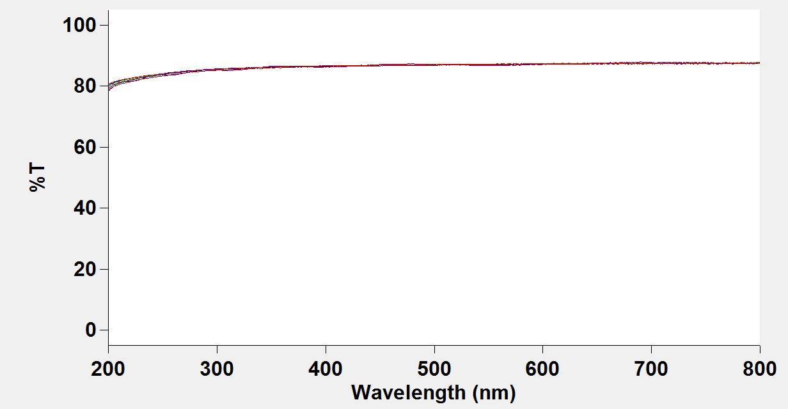
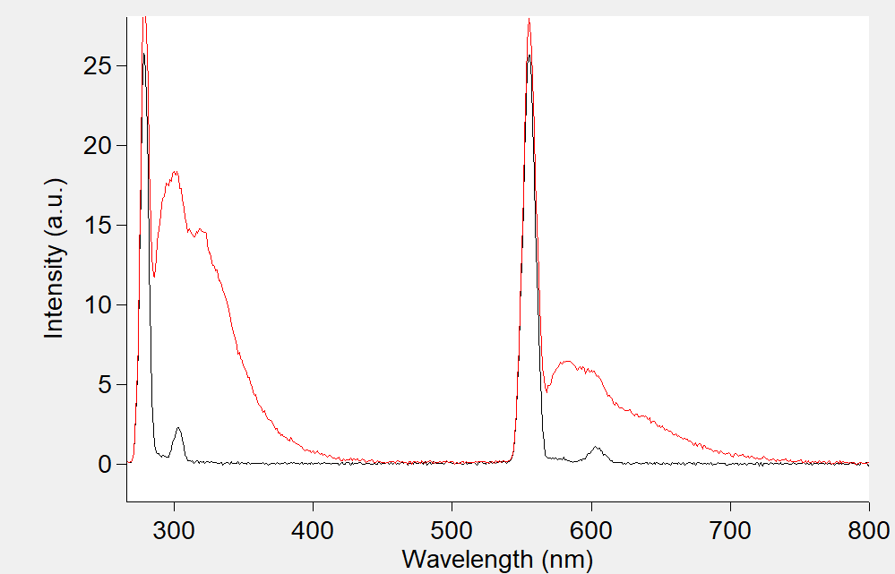
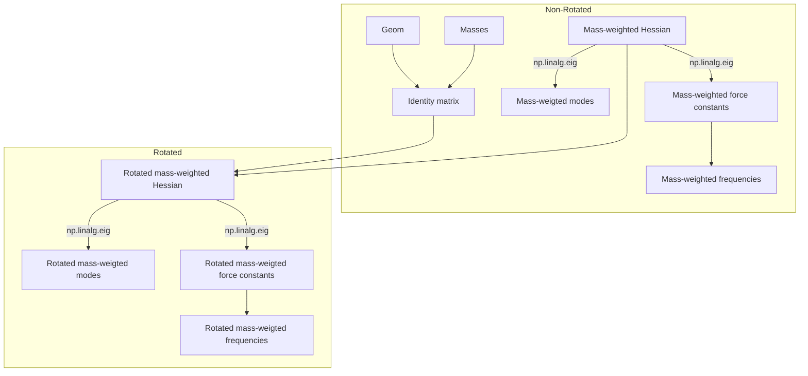
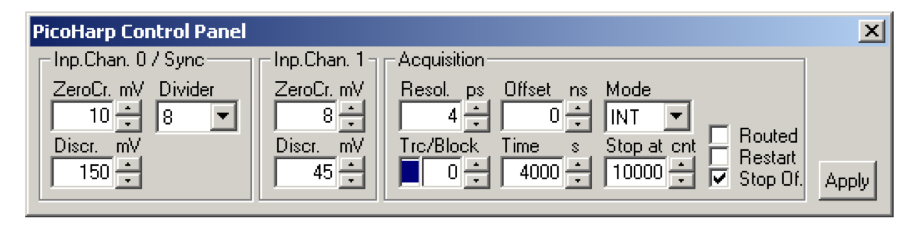
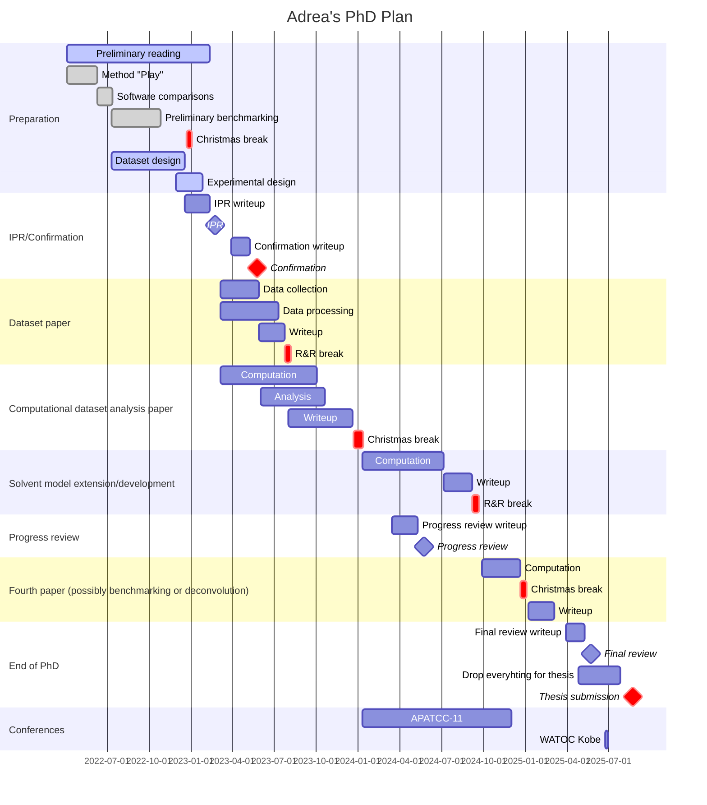
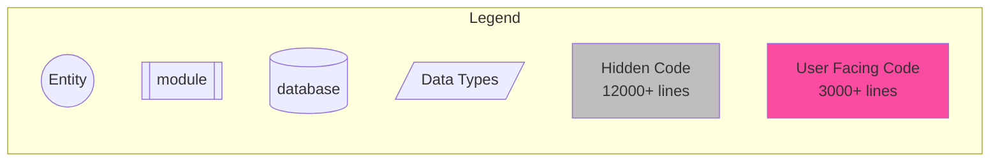
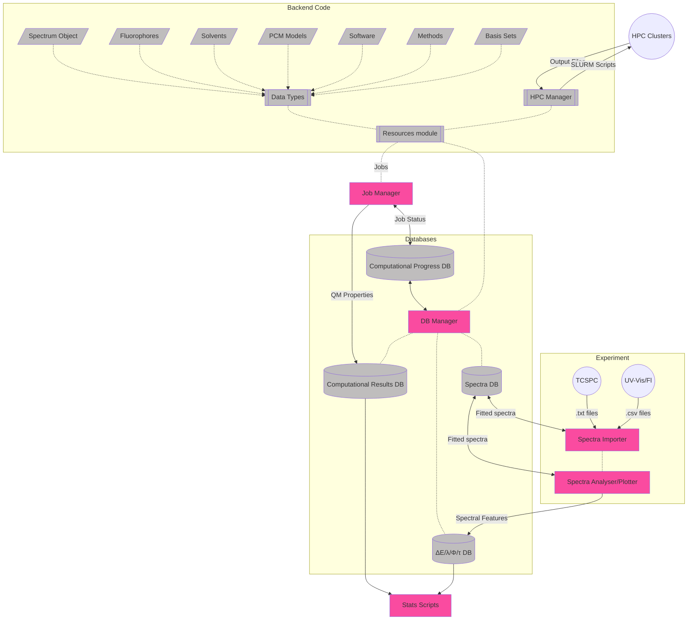

# April 2023

## Saturday/Sunday 1st/2nd April

#### Things to to this weekend:

* [x] TD-DFT vs CASSCF geometries (read up on them)
  * I suspect that CASSCF geoms would be about as good as HF...
    * Yeah, based on some of the erroneous geometries I've been getting, even if it can do GS geometries vaguely okay, I'm really not convinced that it can handle ES geoms.
* [x] Update `hess2trans.py` to include dipole overlaps
  * Turns out that you have to linalg this guy and take the inner product of your vectors.

* [x] Read HT paper to try to digest that maths

I spent way too much of my weekend listening to ChatGPT telling me how to do physics, and I think it's shot me in the foot...

## Monday 3rd April

Teaching day, don't expect much.

## Tuesday 4th April

#### Marking Ex. 8

* Marking due 19th April
* Marking due 3rd May

## Wednesday 5th April

Honestly, I'm in a lot of physical pain rn and I think it's mostly (if not entirely) related to stress.

## Thursday 6th April

Crazy day!
The new cuvettes came in and they look amazing!

Only problem is that there are rubber seals in the PTFE caps, that all my organic solvents dissolve. I tried using parafilm to get around this, not realising that parafilm dissolves in organic solvents... So I've spent the past 30 mins huffing DCM fumes trying to clean parafilm off all my shiny new cuvettes :unamused:

I also realised that using syringes is a problem (below: solvent blank vs solvent from syringe):

This means that syringe filters are a no go, so I've been trying to set up a Soxhlet extractor and also test out glass syringes. The soxhlet did a few cycles before it reached the end of the day and I switched it off, but we need to re-do all our spectra that we took today.

I think for solvents I'll probably need:

* One syringe for all high volatility solvents:
  * (nhex, toll ans, ether, chcl3, thf, tdcm, etoh, acn)
* One for c8oh
* One for dmf 
* One for dmso

We're going to need some luer plugs, and they come in nylon and polypropylene

The solvent compatibilities are:

| Solvent       | Plastic            |
| ------------- | :----------------- |
| *N*-Hexane    | Nylon              |
| Toluene       | Nylon              |
| Anisole       | Nylon should work? |
| Diethyl ether | Nylon              |
| $\ce{CH3Cl}$  | Nylon              |
| THF           | Nylon              |
| DCM           | Nylon should work? |
| Ocanol        | Either             |
| EtOH          | Either             |
| ACN           | Nylon              |
| DMF           | Either             |
| DMSO          | Either             |

## Saturday 8th April

I decided that trying to build the vibrational hamiltonian from scratch was silly, so I deferred to the Psi4 source code for help, which conveniently, this whole section is written in python (numpy). So now I'm comparing my results with everything else that's been generated in the hessian, and it looks good so far! the freqs are spot on, but the modes are not, which makes me think that orca isn't being so straightforward with their processing.

[Einsum notation cheat sheet!](https://stackoverflow.com/a/33641428)

## Monday 10th April

I finally gave in and emailed the corresponding author on the FC/HT paper (Nancy Makri) about obtaining parameters $s_g$/$s_e$ and $c_k$. I also asked if they have a code repository for their approach that I'd be able to look at.

I started to document out the structure of the hessian processing:

I finally got around to adding in the %T corrections for the cuvette, and should be able to start importing data on Wednesday when I start producing it.

## Wednesday-Friday 12-14th April

the QD part of QD-NEVPT2 means that the reference wavefunction is revised in the presence of the NEVPT2 dynamic correlation

I'm also running a few tests of NEVPT2

| job                                        |   Time   | s1 (r0) | s2 (r0) | s3 (r0) | s1 (r1) | s2 (r1) | s3 (r1) |  0-0  |
| ------------------------------------------ | :------: | :-----: | :-----: | :-----: | :-----: | :-----: | :-----: | :---: |
| Base QD-NEVPT2                             | 9:15:01  |  380.5  |  294.3  |  210.9  |  395.8  |  292.6  |  251.0  | 3.071 |
| Base NEVPT2 + relaxed canonical orbitals   | 10:09:38 |  384.4  |  300.6  |  214.1  |  396.3  |  210.9  |  197.9  | 3.033 |
| QD-NEVPT2 + RIJK                           | 1:14:29  |  380.7  |  289.6  |  247.1  |  391.9  |  207.5  |  194.2  | 3.113 |
| NEVPT2 + RIJK + relaxed canonical orbitals | 1:09:59  |  396.1  |  379.0  |  253.3  |  397.9  |  210.1  |  197.3  | 2.981 |

I have checked and I also can't really use filter paper, syringe filters or even autopipettes...

### Hygroscopic solvents

I have realised that a few of my solvents are probably very wet, so I need to find a refractometer to check them. Once I've done that, I'll probably need to dry them over sieves in separate bottles.

| Solvent      |                             DOI                              | m/v of sieves [link](https://pubs.acs.org/doi/10.1021/jo101589h) |
| ------------ | :----------------------------------------------------------: | :----------------------------------------------------------: |
| THF          | [10.1021/je030196t](https://pubs.acs.org/doi/pdf/10.1021/je030196t) |                          sure/seal                           |
| DMSO         | [10.1021/je60012a032](https://pubs.acs.org/doi/pdf/10.1021/je60012a032) |                          sure/seal                           |
| DMF          | [10.1007/978-3-540-75291-2](https://materials.springer.com/googlecdn/assets/sm_lbs/326/sm_lbs_978-3-540-75291-2_367/sm_lbs_978-3-540-75291-2_367.pdf?trackRequired=true&originUrl=/lb/docs/sm_lbs_978-3-540-75291-2_367&componentId=Download%20Chapter) |                          sure/seal                           |
| Anisole      |                                                              |                          sure/seal                           |
| DCM          |                                                              |                             10%                              |
| $\ce{CHCl3}$ |                                                              |                             10%                              |
| EtOH         | [10.1007/978-3-540-75291-2](https://materials.springer.com/googlecdn/assets/sm_lbs/320/sm_lbs_978-3-540-75291-2_361/sm_lbs_978-3-540-75291-2_361.pdf?trackRequired=true&originUrl=/lb/docs/sm_lbs_978-3-540-75291-2_361&componentId=Download%20Chapter) |                           ~~20%~~                            |
| ACN          | [10.1007/978-3-540-75291-2](https://materials.springer.com/googlecdn/assets/sm_lbs/297/sm_lbs_978-3-540-75291-2_359/sm_lbs_978-3-540-75291-2_359.pdf?trackRequired=true&originUrl=/lb/docs/sm_lbs_978-3-540-75291-2_359&componentId=Download%20Chapter) |                             10%                              |
| Toluene      |                                                              |                             10%                              |
|              |                       Total for 150mL                        |                             135g                             |

### New protocol

Working one solvent at a time (solvent series, not fluorophore series)

1. Pour out solvent into beaker or syringe using ==a 5mL glass syringe and disposable needle==. 
   * For sure/seal:
     * use ==a 5mL glass syringe and long metal needle==
     * Use ==a 20mL glass syringe with nitrogen== for refilling the headpsace

2. Using ==a 5mL glass syringe + disposable needle== and a ==glass pipette==, make fluorophore concentrate
3. Using ==a 5mL glass syringe + disposable needle== add clean solvent to two clean clean cuvettes (one solvent one fluorophore) and baseline with the fluorophore cuvette
4. Using ==glass pipette== add concentrate to fluorophore cuvette and mix with the ==glass pipette==

5. Transfer remaining concentrate to ==1.5 mL screw cap vial== and top up with more solvent if needed
6. Measure absorbance
7. Measure fluorescence and solvent response
8. Measure excitation and solvent response
9. Measure fluorescence lifetime

#### If filtering needed:

* Cotton wool through pipette filter!
  * This seems to be able to pull daa out of n-hexane, but I'm not sure how it will got for non-polar fluorophores in polar solvents.

## To Test/Answer:

* [x] Can cotton wool alone filter dansyl amide?

  * I think so, though there's also some polarity selective partitioning going on that probably won't be there for filtering azulene (for example) out of dmso

* [x] Do we have any thimbles for Soxhlet if we need to clean our celite?

  * No, so we're going to need to buy some if we want to go down that route.

* [x] What kind of molecular sieves does the Robinson lab have?

  * We're going to need a bit too much to mooch off them

  * Will they leach any contaminant into solution?
    * Yes, but this should be minimal and included in the baseline.

* [x] How can I safely back-fill a sure/seal bottle with nitrogen?

  * I think the solution to do this relatively cheaply will be to pre-pressurise the bottle with another syringe and single needle

* [x] TCSPC: Can I use the UV laser?

  * Yes, by using the PicoQuant line instead of the laserdiode trigger.

## Suggestions form Peter

Try taking the modes in mass weighted coordinates and reshaping each mode to a N*3 matrix, each dipole deriv wrt each mode can be divided by each column's norm. this treats the average displacement as the derivative's displacement.

try explicitly calculating the dipole of each 

### For Katya:

* Probably going to need to buy some anhydrous DMSO in a sure/seal bottle \$190/100mL
* How dry is dry - for the other hygroscopic solvents I think we're going to need to dry them, but how imporetant is it for our work?

## Monday-Tuesday 17-18th April

Teaching/marking days

#### Conferences to look in to

* Gordon Conferences

* RSC - Faraday discussions - pick a relevant symposium

* WATOC 2025 - Oslo June 22-27

* APATCC - Kobe Japan Autumn 2024

## Wednesday 19th April

  Today I'm going to be slamming out my CHM3911 marking. Don't expect too much else from me...

!!! error
	Aaaaand I tested positive for COVID again -_-

## Thursday 20th April

We've ruled out RIJK, as exchange fitting seems to give erroneous errors, but now the question is:

QD with fixed canonical orbitals, or non-QD with relaxed canonical orbitals

| job                                      |   Time   | s1 (r0) | s2 (r0) | s3 (r0) | s1 (r1) | s2 (r1) | s3 (r1) |
| ---------------------------------------- | :------: | :-----: | :-----: | :-----: | :-----: | :-----: | :-----: |
| EOM-CC2/aug-cc-pvdz                      |          |  392.0  |  303.4  |  280.3  |  408.4  |  307.0  |  280.9  |
| Base QD-NEVPT2 (RI)                      | 9:15:01  |  380.5  |  294.3  |  210.9  |  395.8  |  292.6  |  251.0  |
| NEVPT2 (RI) + relaxed canonical orbitals | 10:09:38 |  384.4  |  300.6  |  214.1  |  396.3  |  210.9  |  197.9  |
| CAM-B3LYP/aug-cc-pvdz                    |          |         |         |         |  384.7  |  295.6  |  270.8  |
| ωB97X-D3/aug-cc-pvdz                     |          |         |         |         |  381.9  |  284.8  |  262.7  |

## Sunday 23rd April

!!! info "Thoughts on our current approach"
	I've noticed something that might be a bit of a problem in our methodology.  The current way that I'm trying to allocate peaks is going to be giving the static distances between the peaks that are based on the shape of the PES. This means that the peak allocations will be no better than a basic 0-0 transition comparison, unless the Hessian is ALSO calculated with ssPCM. The only benefit of looking at the hessian like this is that we *might* be able to allocate a deconvolutable peak, instead of the non-identifiable 0-0.
	

	Assuming that the PES will be close enough between the levels fo theory, what we could do is use FC-ESD calculations for each functional, take the single tallest ESD peak and allocate it to the relevant vibrational transition from the Hessian, and compare that to the relevant transition in the experimental spectrum.

## Monday 24th April

Steps ESD Follows:

1. Calculates vertical R(GS) transition energy
   * Not sure what this is for
2. Adjusts ES and GS geoms to center of mass
3. Rotates ES geom to align with GS
4. Calculates Wilson's ($\bf{B}$) matrix 
5. Converts geometries to "delocalised Internal" (BAKER) coordinates
6. ==`USEJ` ONLY== - Calculates the Duschinsky rotation matrix ($\bf{J}$) and displacement vector ($\bf{K}$)
   * If `usej false`, $\bf{J}$ is a 3Nx3N matrix of zeros and $\bf{K}$ ids a 3N vector of ones
7. Calculate the ES stationary point geometry
   * I think this is for the R(ES) Eq solvation energy
8. ==HT ONLY== - Computes the transition dipole derivatives from step **6**
9. ==HT ONLY== - Calculate the HT displacements
   * I think this is done by transforming the mode matrix ($\bf{Q}$) into internal coordinates
10. ==HT ONLY== - Displaces each mode to obtain the transition dipole
11. ==HT ONLY== - Calculates the transition dipole derivatives
12. Builds the correlation function
    * This takes a very long time if applying Duschinsky rotations
13. Fourier transforms the correlation function
14. Calculates the rate constant

## Tuesday 25th April

Got all the spectra redone that needed redoing (excitation spectra were cut off a little bit short, so we had to measure at a higher wavelength)

I couldn't solvate r800 or dapi in *n*-hexane though. We will have to accept those two as unsolvatable

## Wednesday 26th April

Today I mostly focused on getting Laura's introduction up to scratch.

## Thursday 27th April

I spent most of my day on the TCSPC, setting up the new UV line and troubleshooting all losses of power across the system.

* The approach of using a cover slip to redirect some of the light into the trigger diode has a loss of ~10-12%T when done properly. That is; the whole diameter of the laser must be passing through the cover slip, and the cover slip must be clean. The Trigger diode takes a lot of power to trigger, so this is really important.

* The PicoQuant laser driver has a base rate of 80MHz of 1MHz and needs to be subdivided to get to different rep rates.

  * Do not exceed a cps that is >1% of the rep rate, e.g. if the rep rate = 1MHz, keep the cps ~1e+4 in order to avoid [pile-up](https://www.tcspc.com/doku.php/glossary:pile-up_effect)
  
  * I think the base frequency is set by the INT1 and INT2 options, with CW being continuous and EXT being externally triggered
    
  * Lower frequencies result in higher power
  
  * The discriminator (in the software) should be set to half of the amplitude voltage of the sync signal
  
    * The peak voltage of the trigger diode is >100 mV when the LED is green and >350mV when the LED is red according to the [spec page](https://www.picoquant.com/products/category/accessories/tda-200-trigger-diode-assembly#specification)
      * Discriminator should be set somewhere between 50 and 200 mV
  
    * The PicoQuant outputs an 800mV pulse according to the [PicoQuant manual (old version)](http://ridl.cfd.rit.edu/products/manuals/PicoQuant/PDL800B_%20manual.pdf)
      * Discriminator should theoretically be set to ~400mV
  
  * > "Then look at the Sync Divider. It must be set so that the sync rate divided by the shown divider value does not exceed 10 MHz. E.g. for a diode laser with 80 MHz repetition rate it must be set to 8"
  
  * Software defaults form the [PicoHarp manual](http://ridl.cfd.rit.edu/products/manuals/PicoQuant/PicoHarp%20300%20v2.3/manual/Manual.pdf):
  

| Base Freq (MHz)               | 80        | 80      | 80      | 80       | 80       | 80       | 1      | 1      | 1      | 1       | 1       | 1        |
| ----------------------------- | --------- | ------- | ------- | -------- | -------- | -------- | ------ | ------ | ------ | ------- | ------- | -------- |
| Subdivision                   | 1         | 2       | 4       | 8        | 16       | 32       | 1      | 2      | 4      | 8       | 16      | 32       |
| Rep Rate (MHz)                | 80        | 40      | 20      | 10       | 5        | 2.5      | 1      | 0.5    | 0.25   | 0.125   | 0.0625  | 0.03125  |
| Window                        | 12.5 (ns) | 25 (ns) | 50 (ns) | 100 (ns) | 200 (ns) | 400 (ns) | 1 (μs) | 2 (μs) | 4 (μs) | 8 (μs)  | 16 (μs) | 32 (μs)  |
| Software Divisor              | 8         | 4       | 2       | none     | none     | none     | none   | none   | none   | none    | none    | none     |
| Max cps to avoid pile-up (1%) | 8e+5      | 4e+5    | 2e+5    | 1e+5     | 5e+4     | 2.5e+4   | 1e+4   | 5e+3   | 2.5e+3 | 1.25e+3 | 6.25e+2 | 3.125e+2 |

From all of this, it looks like my issues with the PicoQuant can be directly attributed to pile-up, or photons coming outside the window, though could also be related to the discriminator voltagem

## Friday 28th April

#### Things to test on the TCSPC today:

* [x] Does changing the INT value switch the base frequency of the PicoQuant?

  * Yes

* [x] Does setting a lower rep rate remove the weird artefacting?

  * Yes

* [x] Does changing the discriminator value remove the artefacting?

  * Yes

  * [x] Does this decrease the performance of the trigger diode?
    * I think this is going to need to be manually set based on the wavelength anyway

* Can we use the difference between TDDFT Eq and nEq energies to figure out the stokes correction to the 0-0 energy in abs and fluor

* Dielectric constants do include the water content

  * Just buy some more DMSO

* For confirmation

  * What are the "critical points" that I needed to fix in order to get the point of data collection?
    * Be honest about how much work has gone in to getting to the point of being able to collect data

  * Present the matrix of the dataset - with values
  * Present a bit of an update on the current state of how we calculate things theoretically.

#### TCSPC to re-do:

* [x] bsc
* [ ] daa
* [x] nda
* [ ] ~~az~~ Needs a higher energy laser

## Questions I'm currently trying to answer

* Can we use frequency calculations directly to think about the individual transitions?
* How significant is anharmonicity in effecting transition energies?
  * Even if it's significant in overall thermodynamic properties, do the errors cancel out when considering both GS and ES PES anharmonically?
* In investigating 0-0 transition energies, what is the most correct formal approach?
  * ~~Adiabatic 0-0 - R(initial) Eq -->  R(initial) nEq~~ ==!! This approach is fundamentally flawed, as you will ALWAYS get negative frequencies !!==
  * Equilibirated 0-0 - R(initial) Eq -->  R(final) Eq
    * ==This doesn't give the distinct difference in abs and fluor 0-0 peaks though==

## Job Matrix

### CAS (M3)

| State |   Active Spaces    | Opt  | Freq | FIC-CASPT2K | SC-NEVPT2 | QD-NEVPT2 |
| ----- | :----------------: | :--: | :--: | :---------: | :-------: | --------- |
| s0    | :white_check_mark: | N/A  | N/A  |             |           |           |
| s1+2  | :white_check_mark: | N/A  | N/A  |             |           |           |

### DFT - Gas (MonARCH)

| State | Functional |        Opt         |        Freq        |        Pol         |       Ex/Em        | ESD  |
| ----- | ---------- | :----------------: | :----------------: | :----------------: | :----------------: | :--: |
| s0    | ωB97X-D    | :white_check_mark: | :white_check_mark: | :white_check_mark: | :white_check_mark: |      |
| s1+2  | ωB97X-D    | :white_check_mark: |     :running:      |     :running:      |                    |      |
| s0    | CAM-B3LYP  | :white_check_mark: | :white_check_mark: |        N/A         |                    |      |
| s1+2  | CAM-B3LYP  | :white_check_mark: |     :running:      |        N/A         |                    |      |

### DFT - solv (MonARCH)

| State | Functional |        Opt         |   Freq    | Pol  |  SS  | VEM  | ESD  |
| ----- | ---------- | :----------------: | :-------: | :--: | :--: | :--: | :--: |
| s0    | ωB97X-D    | :white_check_mark: | :running: |      |      |      |      |
| s1+2  | ωB97X-D    | :white_check_mark: | :running: |      |      |      |      |
| s0    | CAM-B3LYP  |                    |           |      |      |      |      |
| s1+2  | CAM-B3LYP  |                    |           |      |      |      |      |

## To do:

* [ ] To read
  * [ ] Read Betaine 30 paper 10.1002/chem.201604619
* [ ] Jobs to figure out
  * [ ] Test QChem to figure out how to do VEM/cLR/LR/IBSF **emission**
* [ ] Code
  * [ ] Write energy extractors
    * [ ] pullQChem_Freq
      * $\Delta E_{ZPVE}$
      * $\Delta E_{elec}$
      * Number of -ve freqs
      * [ ] Extend and test for CASSCF
    * [ ] Q-chem ex/em extractors
      * [ ] ss-ex
      * [ ] ss-em
      * [ ] lr-ex
      * [ ] lr-em

  * [ ] Try lerping between states

## GANTT Chart

## Code Object Structure

