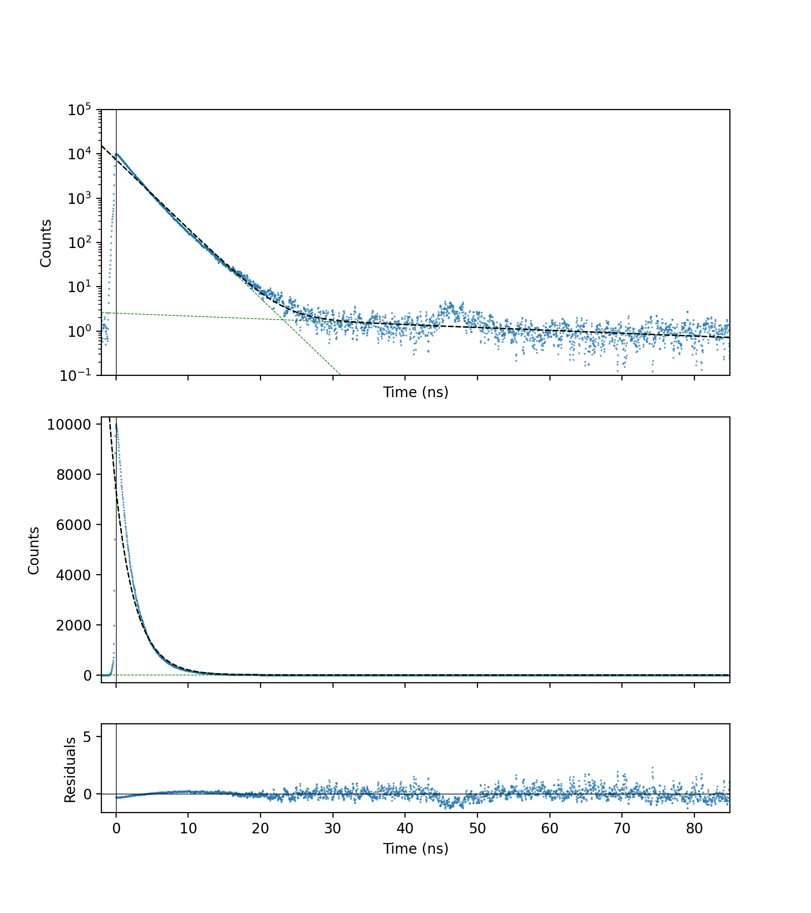
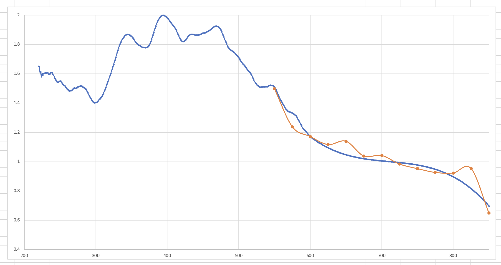
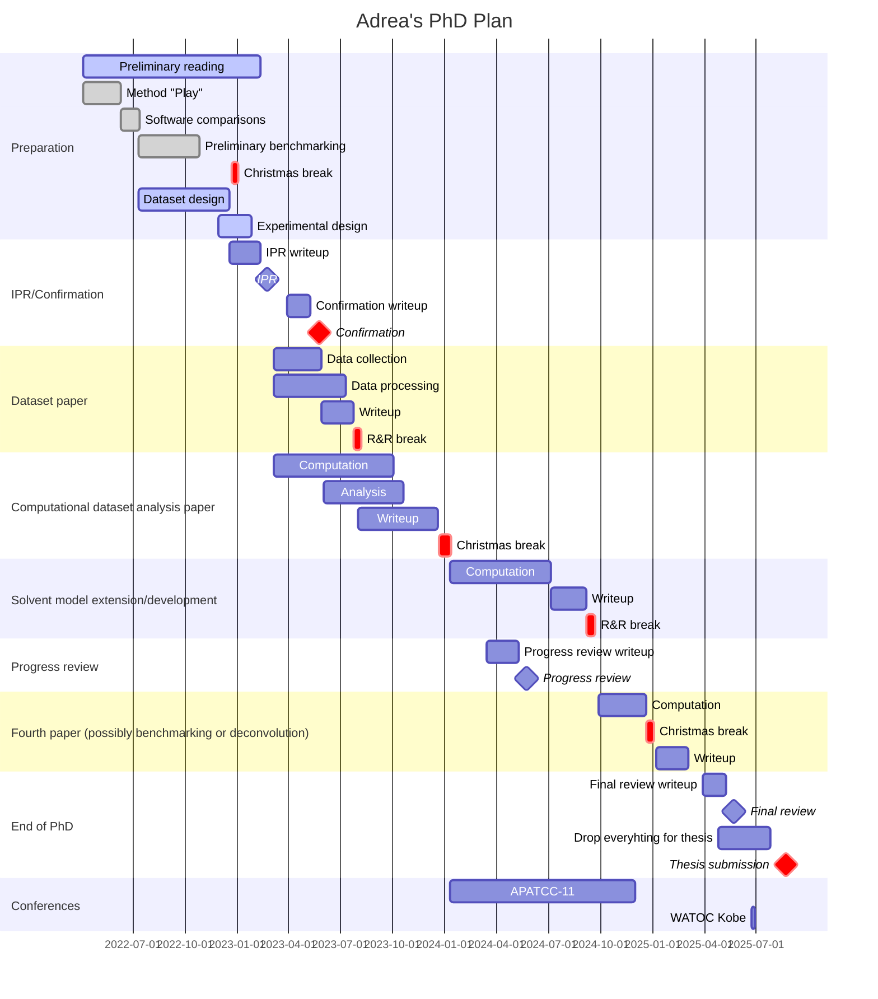
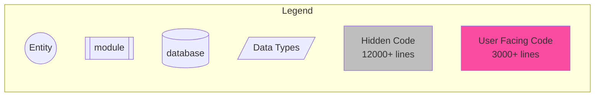

# May 2023

## Monday-Tuesday 1st-2nd May

I started uploading my data in progress this morning:

* [.phd loader](https://github.com/adreasnow/picoharp-phd)
* Up to date [fluorophore dataset](https://github.com/adreasnow/fluorophore-data)

These are teaching days though, so don't expect too much from me.

DAA is in the RCSPC, but the counts are coming in so slowly that it will probably take 10+ hours to accumulate enough data points. I'm currently waiting on a reply form Toby as to whether I can  leave it running overnight,

## Wednesday 3rd May

The fluorometer is booked out for today, but I'm going to see if I can get some absorbance spectra and lifetimes for the ethanol series.

I didn't get much of this done, but I did a histogram for the DAA in EtOH decay and I got a quick check of all the EtOH species and their excitations/emissions for easy TCSPC work.

I also re-wrote a chunk of my lifetime fitting work, as I realised that I was doing a lot of the maths wrong. it is now fixed at 12:54am on Thursday...

## Thursday 4th May

#### To do:

* [x] Continue on EtOH series
* [x] Re-implement TRF saving and loading in the notebooks and datasets

I finished off the EtOH series today!

#### To code on my way in:

* [x] Import the rest of the lifetimes
* [x] Add a separate output widget for each tab in spectraImport.ipynb

## Friday 5th May

Importing the EtOH series, I've noticed that I'm going to need to find a way to extrapolate the excitation corrections to beyond 600nm for the excitation spectra of some of the low energy emitters (NR/R800), otherwise I'm going to need to import these without any corrections.

I did manage to get most of the DMF series, but I think I might need to re-do the TCSPC for a few, because the IRF has erroneous peaks:

* [ ] DAA
* [ ] NDA
* [ ] NR
* [ ] R800

## Saturday 6th May

Well today came as a kick in the teeth, as it turns out the IRF for scatter references needs to be collected at the excitation wavelength, not the emission wavelength.

Turns out that the IRF need to be collected at the excitation wavelength, not at the emission wavelength, so all my species need to be re-done.

## Sunday 7th May

BIIIIIGGGG day spent coding (not tracked because it was in Jupyter :disappointed:)

I compared my lifetime fitting to that coming out of a commercial software package and I noticed that in log space, the data was able to be fitted properly. This makes sense, as the residuals will more heavily be impacted by the larger changes in the linear space, so the tail end won't get fitted.

In implementing that change, I also noticed that three and four exponents could be fitted when performing it in log space. The fits I'm getting are now gorgeous! 

My χ values are also making more sense now as well!

This is definitely making me think that some of my cuvettes were dirty though...

## Monday 8th May

Teaching day.

## Tuesday 9th May

I have the TCSPC booked out for the afternoon, so I'm going to try and work through some more lifetime data, and try and figure out what the bump in my data is in the tail-end of of the decay.

I'm also going to use the photon power meter from the laser lab to try and approximate some crude excitation lamp corrections beyond 600nm. These won't be perfect by any means, but they'll be a good first approximation in order to continue the trend of the data.

They look alright to me!

## Wednesday 10th May

Slammed out the lifetimes for the DMF series.

## Thursday 11th May

Today was spent rationalising and cleaning up the TCSPC/confocal table. Was very tiring, and will continue to tomorrow.

#### Things to bring up with Rosey/Toby tomorrow:

* The ND filter approach works fantastically, except that the ND20 is too dense, so the trigger diode has a really low discretisation voltage
* There is a lot of reflection off the coloured filters, can we use that to trigger the diode?
  * Only concern is the amount of scatter

#### To do tomorrow:

* [x] White laser head head mount needs to be re-aligned and tightened up
  * [x] Add a second post to the white laser head mount to keep it aligned
* [x] Drill a new hole for the white laser?
* [x] Check the scatter on the MCP to see if the white light being filtered later in the box is an issue

## Friday 12th May

IT IS DONE! (and I am pooped 😮‍💨)

## Sunday 14th May

We seem to be in a bit of a pickle with M3 atm, as our quota just dropped form 5TB to 2TB, and we have a lot of data on there from former group members, so I've spent my day trying to move all of their data over to MonARCH, but I'll need to wait for Philip to chmod the project folder so that we wan delete some old data.

## Monday/Tuesday 15th/16th May

Teaching days with a big sleep in.

## Thursday 18th May

Another lab day, I'm going to be working on the new TCSPC rig today (yay) and will be trying to re-do the nhex series.

Looks like Katya wants to write up Laura's results in a J Phys Chem Letter, so I'll probably need to:

* Re-analyse the data - possibly my own just to make sure it's all correct
* Do cam-b3lyp opts and freqs
* DFT SPs need to be re-done at a TZ level

## Friday 19th May

I realised yesterday as I was in the lab that the dataset is really small on the low polarity end of the spectral series, so I've approved it with Katya and we're adding three new low-polar species:

* 9-fluorenone (ε=260, τ=18, φ=2.7%)

<iframe style="width: 500px; height: 300px;" frameborder="0" src="https://embed.molview.org/v1/?mode=balls&cid=10241"></iframe>

* Fluoranthene (ε=10000, τ=?, φ=30%)

<iframe style="width: 500px; height: 300px;" frameborder="0" src="https://embed.molview.org/v1/?mode=balls&cid=9154"></iframe>

* 9,10-bis(phenylethynyl)anthracene (ε=35400, τ=3.6, φ=100%)

<iframe style="width: 500px; height: 300px;" frameborder="0" src="https://embed.molview.org/v1/?mode=balls&cid=82338"></iframe>

They've been ordered and are just waiting for approval. They're coming form Truganina, so they should arrive very quickly.

## Sunday 21st May

This week is going to be a bit of a mess and I'm not sure how much time I'll get in the lab, so I'm heading in today to try and get started on the DMSO series.

DMSO is a pain to work with in winter...

## Monday 22nd May

Today is a teaching day, but I have also been pushing through the jobs for the new fluorophores.

## Tuesday 23rd May

## Wednesday 24th May

MDP session all day today.

And now I have covid again :angry:

## Thursday 25th May

I spent my Thursday/Friday pulling a hyperfocused all nighter getting a standalone lifetime fitting tool written up. I've also published it to pypi as my first module.

https://github.com/adreasnow/LifetimeFittingTool

## From Today's Meeting with Katya

* Confirmation in late July
* Write up Laura's results for confirmation
  * "here is the fudge factor for this particular method"
  * "n-hexane gives a consistent/systematic shift, since it's not driven by electrostatics"
* Doodlepoll for confirmation dates
* TCSPC benchmarking against reference species for a write-up 
  * Use this to determine an uncertainty 

#### Chapters

1. Intro/review
2. Experimental dataset dev
3. Theoretical breakdown of 2
4. Is going to be based on the outcome of 3
   * We've found the methods we need, we know the models we can modify
   * We don't know how revolutionary the work will be, but we know where it can go

## Tuesday 30th May

@ 2800V discretiser max ~ 350mV - optimal ~ 125mV

@ 3000V discretiser max >800mV - optimal ~ 400-600 mV

## Important Questions:

* Can we use the difference between TDDFT Eq and nEq energies to figure out the stokes correction to the 0-0 energy in abs and fluor
* Can we use the shape of the Theoretical PES to determine what the width of the deconvoluting Gaussians should be for fitting?

## Experimental work

#### Problematic spectra:

* Collecting:
  * AZ lifetimes - all solvents. No solvatochromic shift on s2 --> s0
  * DMSO with azulene seems to have issues, I'm guessing DMSO excites
* Difficulty fitting
  * TCSPC
    * DAA/nhex
    * BSC/etoh

#### Experimental to-do:

* [x] Re-do TCSPC
* [ ] Dry solvents (waiting on molecular sieves)
* [x] EtOH series
* [x] DMF series (sure/seal)
* [x] DMSO series (sure/seal)
* [ ] Anisole series (sure/seal)
* [ ] THF series (sure/seal)

#### UV/FL

|        | nhex               | tol  | ans  | ether | chcl3 | thf  | dcm  | c80h |        etoh        | acn  |        dmf         |        dmso        |
| ------ | ------------------ | :--: | :--: | :---: | :---: | :--: | :--: | :--: | :----------------: | :--: | :----------------: | :----------------: |
| nr     | :white_check_mark: |      |      |       |       |      |      |      | :white_check_mark: |      | :white_check_mark: | :white_check_mark: |
| nda    | :white_check_mark: |      |      |       |       |      |      |      | :white_check_mark: |      | :white_check_mark: | :white_check_mark: |
| r800   | insol              |      |      |       |       |      |      |      | :white_check_mark: |      | :white_check_mark: | :white_check_mark: |
| c153   | :white_check_mark: |      |      |       |       |      |      |      | :white_check_mark: |      | :white_check_mark: | :white_check_mark: |
| bod493 | :white_check_mark: |      |      |       |       |      |      |      | :white_check_mark: |      | :white_check_mark: | :white_check_mark: |
| az     | :white_check_mark: |      |      |       |       |      |      |      | :white_check_mark: |      | :white_check_mark: | :white_check_mark: |
| aaq    | :white_check_mark: |      |      |       |       |      |      |      | :white_check_mark: |      | :white_check_mark: | :white_check_mark: |
| dapi   | insol              |      |      |       |       |      |      |      | :white_check_mark: |      | :white_check_mark: | :white_check_mark: |
| daa    | :white_check_mark: |      |      |       |       |      |      |      | :white_check_mark: |      | :white_check_mark: | :white_check_mark: |
| bsc    | :white_check_mark: |      |      |       |       |      |      |      | :white_check_mark: |      | :white_check_mark: | :white_check_mark: |
| fno    |                    |      |      |       |       |      |      |      |                    |      |                    |                    |
| bpa    |                    |      |      |       |       |      |      |      |                    |      |                    |                    |
| fat    | :white_check_mark: |      |      |       |       |      |      |      |                    |      |                    | :white_check_mark: |

#### TCSPC

|        |        nhex        | tol  | ans  | ether | chcl3 | thf  | dcm  | c80h |        etoh        | acn  |        dmf         |        dmso        |
| ------ | :----------------: | :--: | :--: | :---: | :---: | :--: | :--: | :--: | :----------------: | :--: | :----------------: | :----------------: |
| nr     | :white_check_mark: |      |      |       |       |      |      |      | :white_check_mark: |      | :white_check_mark: | :white_check_mark: |
| nda    | :white_check_mark: |      |      |       |       |      |      |      | :white_check_mark: |      | :white_check_mark: | :white_check_mark: |
| r800   |       insol        |      |      |       |       |      |      |      | :white_check_mark: |      | :white_check_mark: | :white_check_mark: |
| c153   | :white_check_mark: |      |      |       |       |      |      |      | :white_check_mark: |      | :white_check_mark: | :white_check_mark: |
| bod493 | :white_check_mark: |      |      |       |       |      |      |      | :white_check_mark: |      | :white_check_mark: | :white_check_mark: |
| az     |         -          |  -   |  -   |   -   |   -   |  -   |  -   |  -   |         -          |  -   |         -          |         -          |
| aaq    | :white_check_mark: |      |      |       |       |      |      |      | :white_check_mark: |      | :white_check_mark: | :white_check_mark: |
| dapi   |       insol        |      |      |       |       |      |      |      | :white_check_mark: |      | :white_check_mark: | :white_check_mark: |
| daa    | :white_check_mark: |      |      |       |       |      |      |      | :white_check_mark: |      | :white_check_mark: | :white_check_mark: |
| bsc    | :white_check_mark: |      |      |       |       |      |      |      |                    |      |                    |                    |
| fno    |                    |      |      |       |       |      |      |      |                    |      |                    |                    |
| bpa    |                    |      |      |       |       |      |      |      |                    |      |                    |                    |
| fat    | :white_check_mark: |      |      |       |       |      |      |      |                    |      |                    | :white_check_mark: |

## Job Matrix

### CAS (M3)

| State |   Active Spaces    | CASSCF/aug-cc-pvdz | QD-NEVPT2/aug-cc-pvdz |
| ----- | :----------------: | :----------------: | :-------------------: |
| s0    | :white_check_mark: |                    |                       |
| s1+2  | :white_check_mark: |                    |                       |

### DFT - Gas (MonARCH)

| State | Functional |        Opt         |        Freq        |        Pol         |   Ex/Em   | ESD  |
| ----- | ---------- | :----------------: | :----------------: | :----------------: | :-------: | :--: |
| s0    | ωB97X-D    |     :running:      |     :running:      | :white_check_mark: | :running: |      |
| s1+2  | ωB97X-D    |     :running:      |     :running:      |     :running:      |           |      |
| s0    | CAM-B3LYP  | :white_check_mark: | :white_check_mark: |        N/A         |           |      |
| s1+2  | CAM-B3LYP  | :white_check_mark: |     :running:      |        N/A         |           |      |

### DFT - solv (MonARCH)

| State | Functional |        Opt         |   Freq    | Pol  |  SS  | VEM  | ESD  |
| ----- | ---------- | :----------------: | :-------: | :--: | :--: | :--: | :--: |
| s0    | ωB97X-D    | :white_check_mark: | :running: |      |      |      |      |
| s1+2  | ωB97X-D    | :white_check_mark: | :running: |      |      |      |      |
| s0    | CAM-B3LYP  |                    |           |      |      |      |      |
| s1+2  | CAM-B3LYP  |                    |           |      |      |      |      |

## To do:

* [ ] Jobs to figure out
  * [ ] Test QChem to figure out how to do VEM/cLR/LR/IBSF **emission**
* [ ] Code
  * [ ] Write energy extractors
    * [ ] pullQChem_Freq
      * $\Delta E_{ZPVE}$
      * $\Delta E_{elec}$
      * Number of -ve freqs
      * [ ] Extend and test for CASSCF
    * [ ] Q-chem ex/em extractors
      * [ ] ss-ex
      * [ ] ss-em
      * [ ] lr-ex
      * [ ] lr-em

## GANTT Chart

## Code Object Structure

```mermaid
flowchart TD
	a -- Output Files --> g
	g -- SLURM Scripts -->  
	a((HPC Clusters))
	subgraph Backend Code
	s[/Spectrum Object/]:::backend
	m[/Fluorophores/]:::backend
	n[/Solvents/]:::backend
	o[/PCM Models/]:::backend
	p[/Software/]:::backend
	r[/Methods/]:::backend
	q[/Basis Sets/]:::backend
	s & m & n & o & p & r & q -.-> l[[Data Types]]:::backend -.- w
	g[[HPC Manager]]:::backend -.- w
	w[[Resources module]]:::backend
	end
	
	c <-- Job Status --> v
	c -- QM Properties --> k
	
	subgraph Databases
	j[DB Manager]:::ui -.- b & e & k
	e[(ΔE/λ/Φ/τ DB)]:::backend
	b[(Spectra DB)]:::backend 
	k[(Computational Results DB)]:::backend
	v[(Computational Progress DB)]:::backend
	v <--> j
	end
	
	subgraph Experiment
	h[Spectra Importer]:::ui 
	i[Spectra Analyser/Plotter]:::ui
	t -- .txt files --> h
	d -- .csv files --> h
  t((TCSPC))
	d((UV-Vis/Fl)) 
	end
	

	c[Job Manager]:::ui 
	b <-- Fitted spectra --> i

	h -.- i -- Spectral Features --> e
	b <-- Fitted spectra --> h
	
	w -. Jobs -.- c
	w -.- j
	

	
	k & e --> u[Stats Scripts]:::ui
	
	
	classDef backend fill:#bfbdbd;
	classDef ui fill:#fa4ba0;
	classDef db fill:#00f2ff;
```

