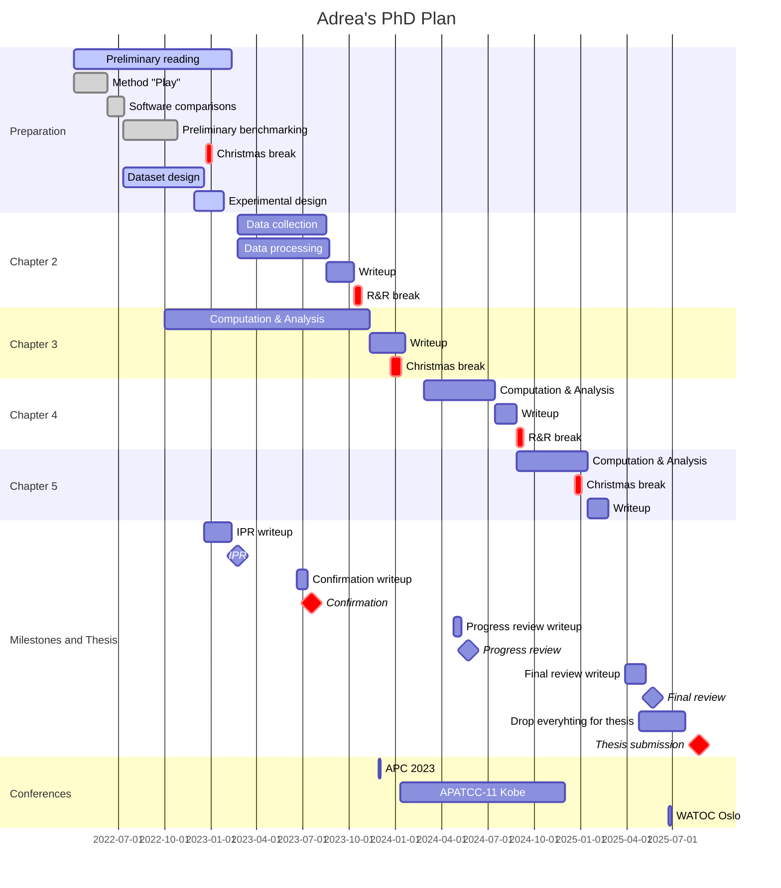
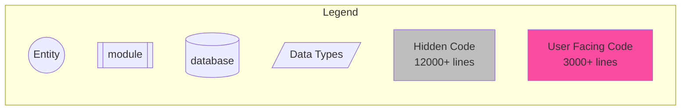

# July 2023

## Saturday 8th July


I haven't written anything here for a while because I've just been working on my confirmation report. I got COVID again for the 7th time on Tuesday which has really been a kick in the teeth while I'm cramming to get this report written.

I've finally sent it off to people today to get some feedback.

## Sunday 9th July


Katya just sent through some feedback last night which I have implemented and sent my report off!
Now I can relax for today before I get started on the presentation tomorrow!

## Monday 10th July


I'm running on very little sleep today and I am pushing myself a bit too hard post COVID to make personal appointments, so I think since I worked through Saturday, I might call today my Sunday, since I worked through Saturday.

## Tuesday-Friday 10/14th July


Working on the presentation, but COVID has made me quite slow.

## Monday 17th July


Today I focused on getting my presentation done. I think it's good enough for me to do a practice tomorrow to to group, and if they like it I'll polish and practice with their feedback for Wednesday!

## Tuesday 18th July


Katya and the group liked my presentation, but thought it needed a bit more depth to show off all the work that I have actually done, so I spent my day making more slides, and putting together some fun figures to go with it!

## Wednesday 19th July


Smashed my confirmation! Tomorrow is group lunch, but otherwise I'mma take the rest of the week off, I think :smile:

## Tuesday 25th July


I got a couple of spectra done, and I got a couple of TCSPC histograms produced as well :)

### Meeting notes:

* Moderation is a go for sem 2.
* People Movement
  * Two new PhDs for work with ML with Ralf.
  * Grant coming to work with Agilio.
  * Two potential honours students - currently research students.
* CHM3911 is probably not going to be revamped this year.
* Daniel Crawford will be coming while we're teaching, so we'll try to join after we're done for drinks and possibly dinner.
* Dispersion paper
  * Trying to correlate electrostatics with dispersion to see where the trend becomes non-linear, using SAPT of non-charged, charge-neutral and charged clusters of organic, inorganic and metallic species.

## Wednesday 26th July


Rider training today, so no work.

## Thursday 27th July


I'm waiting for my bike to be delivered either today or tomorrow, so I'm wfh for the rest of the week.

I'm a bit sick of job maintenance though, so this is going to be a little bit tedious :sweat_smile:

## Monday 31tst July


Teaching day. Also Daniel Crawford visit, so we'll see how that goes :slightly_smiling_face:

I'm a bit grumpy that the TCSPC is booked out all week (literally all day every day), so I won't actually be able to collect any lifetimes.

## Idea for freqs/deconv

What if instead of starting with a random guess, we make a function that has a fixed number of Gaussians at a fixed spacing from each other, and we fit them with an offset parameter. We could use the frequencies to dictate the distribution of the Gaussians and and only have the amplitude and sigma as free parameters

```python
func(shift: float, amps: list[float], sigma: list[float] cen_FIXED: list[float])
```


## Important Questions:

* Can we use the difference between TDDFT Eq and nEq energies to figure out the stokes correction to the 0-0 energy in abs and fluor
* Can we use the shape of the Theoretical PES to determine what the width of the deconvoluting Gaussians should be for fitting?

## Experimental work

#### Problematic spectra:

* Collecting:
  * AZ lifetimes - all solvents. No solvatochromic shift on s2 --> s0
  * DMSO with azulene seems to have issues, I'm guessing DMSO excites
* Difficulty fitting
  * TCSPC
    * DAA/nhex
    * BSC/etoh


#### Experimental to-do:

* [ ] Anisole series (sure/seal)
* [ ] THF series (sure/seal)

#### UV/FL

|        | nhex               | tol  | ans  | ether | chcl3 | thf  | dcm  | c80h |        etoh        | acn  |        dmf         |        dmso        |
| ------ | ------------------ | :--: | :--: | :---: | :---: | :--: | :--: | :--: | :----------------: | :--: | :----------------: | :----------------: |
| nr     | :white_check_mark: |      |      |       |       |      |      |      | :white_check_mark: |      | :white_check_mark: | :white_check_mark: |
| nda    | :white_check_mark: |      |      |       |       |      |      |      | :white_check_mark: |      | :white_check_mark: | :white_check_mark: |
| r800   | insol              |      |      |       |       |      |      |      | :white_check_mark: |      | :white_check_mark: | :white_check_mark: |
| c153   | :white_check_mark: |      |      |       |       |      |      |      | :white_check_mark: |      | :white_check_mark: | :white_check_mark: |
| bod493 | :white_check_mark: |      |      |       |       |      |      |      | :white_check_mark: |      | :white_check_mark: | :white_check_mark: |
| az     | :white_check_mark: |      |      |       |       |      |      |      | :white_check_mark: |      | :white_check_mark: | :white_check_mark: |
| aaq    | :white_check_mark: |      |      |       |       |      |      |      | :white_check_mark: |      | :white_check_mark: | :white_check_mark: |
| dapi   | insol              |      |      |       |       |      |      |      | :white_check_mark: |      | :white_check_mark: | :white_check_mark: |
| daa    | :white_check_mark: |      |      |       |       |      |      |      | :white_check_mark: |      | :white_check_mark: | :white_check_mark: |
| bsc    | :white_check_mark: |      |      |       |       |      |      |      | :white_check_mark: |      | :white_check_mark: | :white_check_mark: |
| fno    | :white_check_mark: |      |      |       |       |      |      |      | :white_check_mark: |      |                    |                    |
| bpa    | :white_check_mark: |      |      |       |       |      |      |      | :white_check_mark: |      |                    |                    |
| fat    | :white_check_mark: |      |      |       |       |      |      |      | :white_check_mark: |      | :white_check_mark: | :white_check_mark: |

#### TCSPC

|        |        nhex        | tol  | ans  | ether | chcl3 | thf  | dcm  | c80h |        etoh        | acn  |        dmf         |        dmso        |
| ------ | :----------------: | :--: | :--: | :---: | :---: | :--: | :--: | :--: | :----------------: | :--: | :----------------: | :----------------: |
| nr     | :white_check_mark: |      |      |       |       |      |      |      | :white_check_mark: |      | :white_check_mark: | :white_check_mark: |
| nda    | :white_check_mark: |      |      |       |       |      |      |      | :white_check_mark: |      | :white_check_mark: | :white_check_mark: |
| r800   |       insol        |      |      |       |       |      |      |      | :white_check_mark: |      | :white_check_mark: | :white_check_mark: |
| c153   | :white_check_mark: |      |      |       |       |      |      |      | :white_check_mark: |      | :white_check_mark: | :white_check_mark: |
| bod493 | :white_check_mark: |      |      |       |       |      |      |      | :white_check_mark: |      | :white_check_mark: | :white_check_mark: |
| az     |         -          |  -   |  -   |   -   |   -   |  -   |  -   |  -   |         -          |  -   |         -          |         -          |
| aaq    | :white_check_mark: |      |      |       |       |      |      |      | :white_check_mark: |      | :white_check_mark: | :white_check_mark: |
| dapi   |       insol        |      |      |       |       |      |      |      | :white_check_mark: |      | :white_check_mark: | :white_check_mark: |
| daa    | :white_check_mark: |      |      |       |       |      |      |      | :white_check_mark: |      | :white_check_mark: | :white_check_mark: |
| bsc    | :white_check_mark: |      |      |       |       |      |      |      | :white_check_mark: |      | :white_check_mark: | :white_check_mark: |
| fno    | :white_check_mark: |      |      |       |       |      |      |      |                    |      |                    |                    |
| bpa    |                    |      |      |       |       |      |      |      |                    |      |                    |                    |
| fat    | :white_check_mark: |      |      |       |       |      |      |      | :white_check_mark: |      | :white_check_mark: | :white_check_mark: |

## Job Matrix

### CAS (M3)

| State |   Active Spaces    | CASSCF/aug-cc-pvdz | QD-NEVPT2/aug-cc-pvdz |
| ----- | :----------------: | :----------------: | :-------------------: |
| s0    | :white_check_mark: |                    |                       |
| s1+2  | :white_check_mark: |                    |                       |

### DFT - Gas (MonARCH)

| State | Functional |        Opt         |        Freq        |        Pol         |   Ex/Em   | ESD  |
| ----- | ---------- | :----------------: | :----------------: | :----------------: | :-------: | :--: |
| s0    | ωB97X-D    |     :running:      |     :running:      | :white_check_mark: | :running: |      |
| s1+2  | ωB97X-D    |     :running:      |     :running:      |     :running:      |           |      |
| s0    | CAM-B3LYP  | :white_check_mark: | :white_check_mark: |        N/A         |           |      |
| s1+2  | CAM-B3LYP  | :white_check_mark: |     :running:      |        N/A         |           |      |

### DFT - solv (MonARCH)

| State | Functional |        Opt         |   Freq    | Pol  |  SS  | VEM  | ESD  |
| ----- | ---------- | :----------------: | :-------: | :--: | :--: | :--: | :--: |
| s0    | ωB97X-D    | :white_check_mark: | :running: |      |      |      |      |
| s1+2  | ωB97X-D    | :white_check_mark: | :running: |      |      |      |      |
| s0    | CAM-B3LYP  |                    |           |      |      |      |      |
| s1+2  | CAM-B3LYP  |                    |           |      |      |      |      |

## To do:

* [ ] Jobs to figure out
  * [ ] Test QChem to figure out how to do VEM/cLR/LR/IBSF **emission**
* [ ] Code
  * [ ] Write energy extractors
    * [ ] pullQChem_Freq
      * $\Delta E_{ZPVE}$
      * $\Delta E_{elec}$
      * Number of -ve freqs
      * [ ] Extend and test for CASSCF
    * [ ] Q-chem ex/em extractors
      * [ ] ss-ex
      * [ ] ss-em
      * [ ] lr-ex
      * [ ] lr-em

## GANTT Chart



## Code Object Structure

```mermaid
flowchart TD
	a -- Output Files --> g
	g -- SLURM Scripts -->  
	a((HPC Clusters))
	subgraph Backend Code
	s[/Spectrum Object/]:::backend
	m[/Fluorophores/]:::backend
	n[/Solvents/]:::backend
	o[/PCM Models/]:::backend
	p[/Software/]:::backend
	r[/Methods/]:::backend
	q[/Basis Sets/]:::backend
	s & m & n & o & p & r & q -.-> l[[Data Types]]:::backend -.- w
	g[[HPC Manager]]:::backend -.- w
	w[[Resources module]]:::backend
	end
	
	c <-- Job Status --> v
	c -- QM Properties --> k
	
	subgraph Databases
	j[DB Manager]:::ui -.- b & e & k
	e[(ΔE/λ/Φ/τ DB)]:::backend
	b[(Spectra DB)]:::backend 
	k[(Computational Results DB)]:::backend
	v[(Computational Progress DB)]:::backend
	v <--> j
	end
	
	subgraph Experiment
	h[Spectra Importer]:::ui 
	i[Spectra Analyser/Plotter]:::ui
	t -- .txt files --> h
	d -- .csv files --> h
  t((TCSPC))
	d((UV-Vis/Fl)) 
	end
	

	c[Job Manager]:::ui 
	b <-- Fitted spectra --> i

	h -.- i -- Spectral Features --> e
	b <-- Fitted spectra --> h
	
	w -. Jobs -.- c
	w -.- j
	

	
	k & e --> u[Stats Scripts]:::ui
	
	
	classDef backend fill:#bfbdbd;
	classDef ui fill:#fa4ba0;
	classDef db fill:#00f2ff;
```




