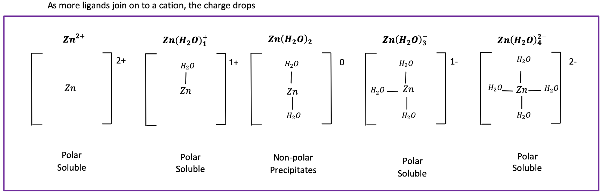
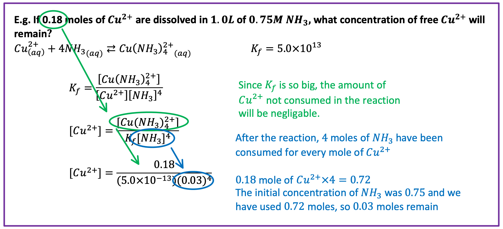
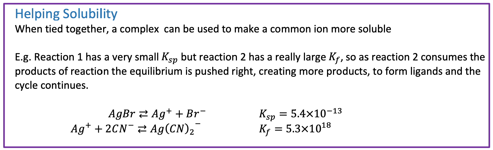
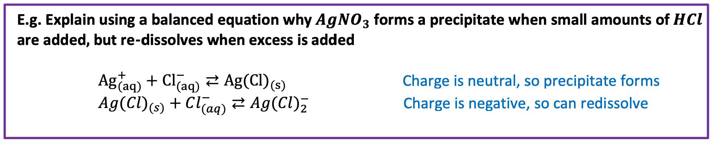

# Complex Ions

Complex ions contain a central metal cation bonded to one r more molecules or ions, called ligands

{: style="width: 100%;"}

## Formation

If the metal is in solution, it can form a complex solution through two reactions

1. Dissociation
$\hskip{1cm}\ce{Zn(NO3)2_{(s)} - >Zn_{(aq)}^{2+} + 2NO3−_{(aq)}}$
2. Forming a complex
$\hskip{1cm}\ce{Zn_{(aq)}^{2+} + 4H2O -> Zn(H2O)4^{2+}_{(aq)}}$

## Equilibria

An equilibrium equation can be written for the formation of the complex, known as $K_f$
A large $K_f$ corresponds to a stable complex

$\hskip{1cm}\ce{Co_{(aq)}^{2+} + 4Cl_{(aq)}− <-> CoCl4^{2−}_{(aq)}}$

$\hskip{1cm}\ce{K_f=\frac{[CoCl4^{2−}]}{[Co^{2+}][cl− ]^4}}$

## The Maths!

{: style="width: 100%;"}

{: style="width: 100%;"}

## Causing Precipitation

If a complex reaches a neutral charge, a precipitate will form

{: style="width: 100%;"}