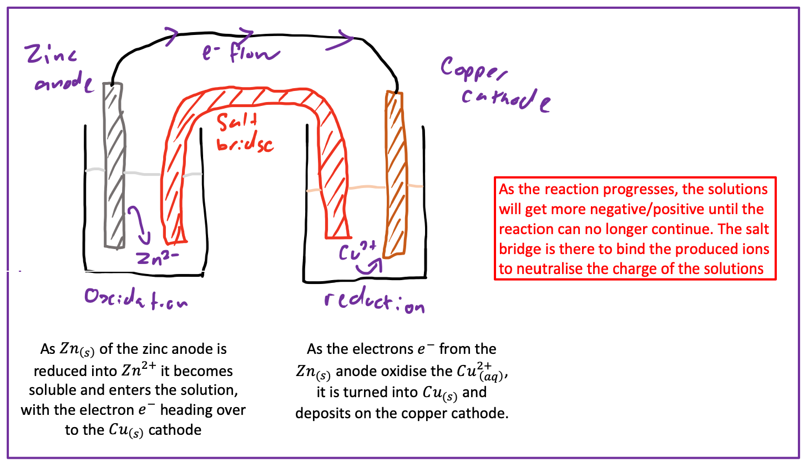
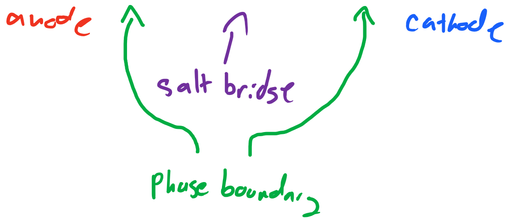

# Galvanic Cells - Standard Conditions

In galvanic cells, a redox reduction is used to create an electrical current.

$$
\ce{Zn_{(s)} + Cu_{(aq)}^{2+} <=> Cu_{(S)} + Zn_{(aq)}^{2+}}
$$

Here, Zn is being reduced in an oxidation reaction and $Cu^{2+}$ is being oxidised in a reduction reaction.

* Electrons are moving from the zinc to the copper.

We can make these electrons flow through a wire to produce a current
{: style="width: 100%;" class="center"}

This process can be written as:

$$
\ce{Zn_{(s)} | Zn^{2+} (1 M) || Cu^{2+} (1 M) | Cu_{(s)}}
$$

{: style="width:460px; padding-left: 16px;" class="center"}

## Standards

The measured potential energy of the reaction (E°_cell) is the potential energy of the two half reaction combined. This potential is based on comparison to the standard of:

$$
\ce{2e− + 2H+ (1M) - >H2 (1 atm)}
$$

## Calculating Potential

The equation for the potential calculation is:

$$
E^\circ_{cell}=E^\circ_{reduction}−E^\circ_{oxidation}
$$

These $E^\circ$ values can be found in refernce tables and refer to the **reduction** potential of the half reaction at standard conitions (25°C, 1 atm, 1 M)

* The formula above accounts for this by inverting (−) the oxidation reaction.
* Lower $E^\circ$ values are more likely to reduce (be involved in oxidation)

E.g. 

$\hskip{1cm} \ce{Cu^{2+}} + 2e− \ce{-> Cu_{(s)}} \hskip{1cm} E^\circ = +0.34\:V \hskip{1cm} \text{Reduction}$

$\hskip{1cm}\ce{Zn^{2+}} + \ce{2e− <-Zn_{(s)}} \hskip{1cm} E^\circ = −0.76 \: V \hskip{1cm} \text{Oxidation}$
	
$$
\begin{align}
E^\circ_{cell}&=E^\circ_{reduction}−E^\circ_{oxidation}\\
E^\circ_{cell}&=+0.34−(−0.76)\\
E^\circ_{cell}&=+1.10V
\end{align}
$$

## Spontaneous Reactions

For a spontaneous reactions to occur you need three things:

1. An oxidant (to undergo reduction and give away electrons)
2. A reductant (to undergo oxidation and take electrons)
3. An $E^\circ_{cell}$ value $>0$