# Organic Synthesis

??? "abstract "Contents"
	
	* [Useful Carbocations](#useful-carbocations)
	* [Grignard](#grignard)
	* [Aldol](#aldol)
	* [Nitration](#nitration)
	* [Halogenation](#halogenation)
	* [Friedel-Crafts Alkylation](#friedel-crafts-alkylation)
	* [Alkynyl Ion Formation](#alkynyl-ion-formation)
	* [Wittig (Ylide)](#wittig-ylide)
	* [Diels Alder](#diels-alder)
	* [Introduction of Carboxylic Acid by FGI](#introduction-of-carboxylic-acid-by-fgi)
	* [FGI of Alkenes](#fgi-of-alkenes)
	* [FGI of Acid Chlorides](#fgi-of-acid-chlorides)
	* [FGI of Carboxylic Acids](#fgi-of-carboxylic-acids)
	* [FGI of Alkyl Halides](#fgi-of-alkyl-halides)
	* [Diazonium Synthesis](#diazonium-synthesis)

## Useful Carbocations

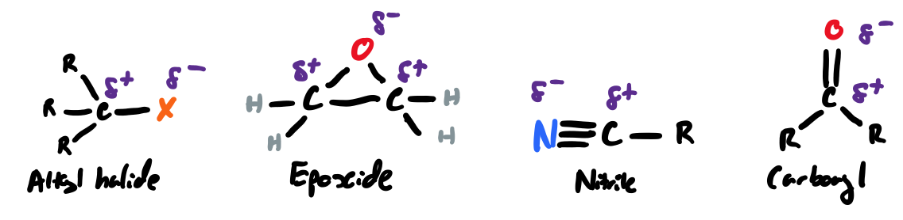{: style="width: 70%;" class="center"}

## Grignard

* Formation of carbon - carbon bonds
* The magnesium changes the oxidation state of the carbon, making it a carbanion
	

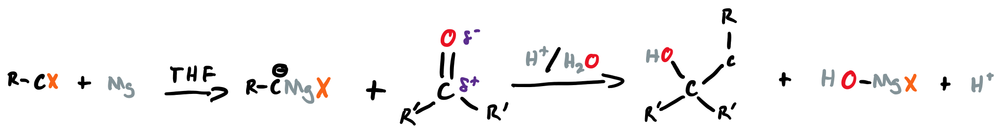

## Aldol

* Formation of carbon - carbon bonds through keto/enol tautomerism 

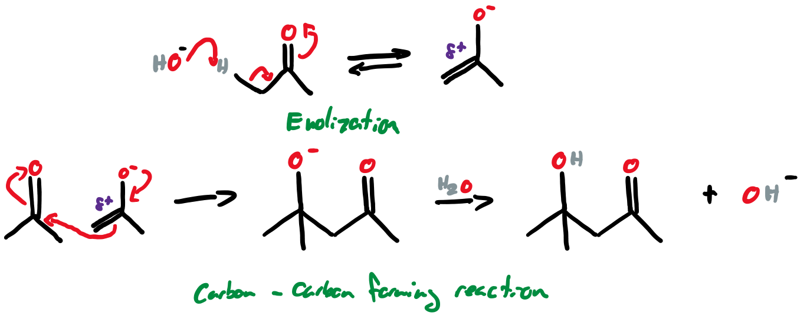{: style="width: 70%;" class="center"}

## Nitration

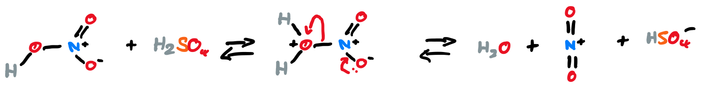

## Halogenation

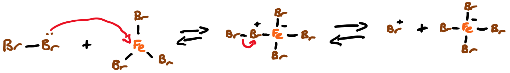

## Friedel-Crafts Alkylation

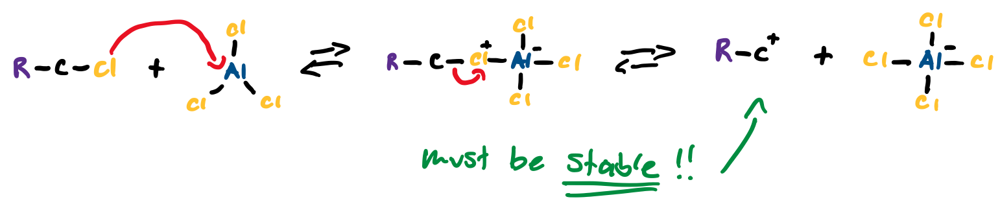

## Alkynyl Ion Formation

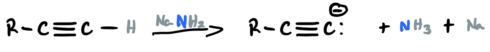{: style="width: 70%;" class="center"}

## Wittig (Ylide)

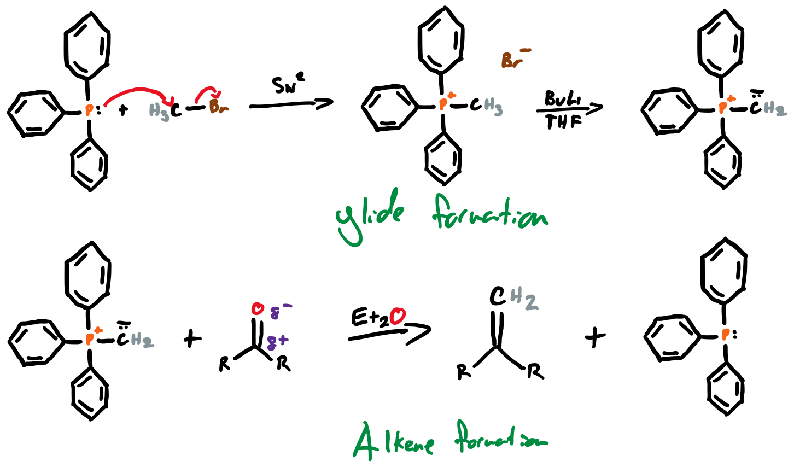{: style="width: 90%;" class="center"}

## Diels Alder

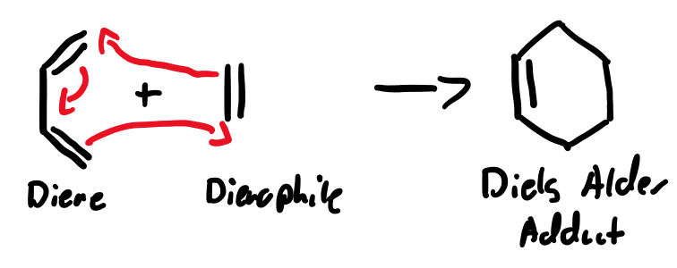{: style="width: 50%;" class="center"}

## Introduction of Carboxylic Acid by FGI

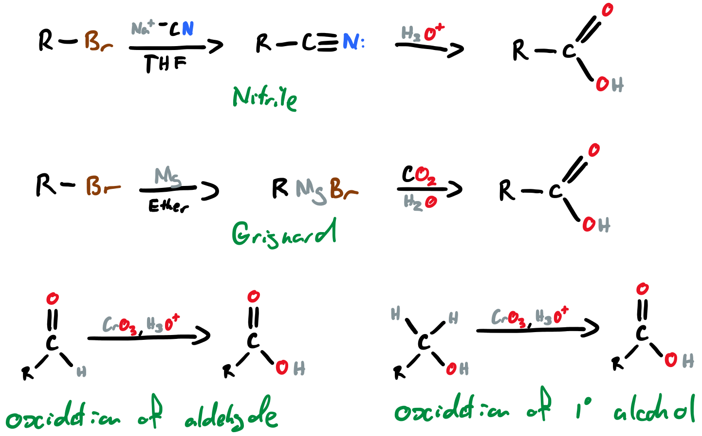{: style="width: 90%;" class="center"}

## FGI of Alkenes

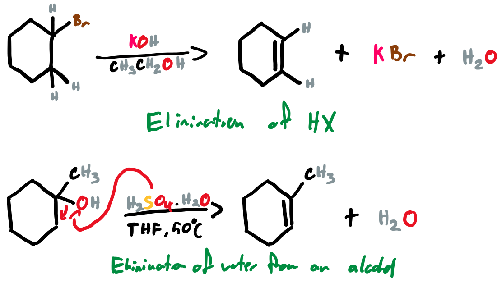{: style="width: 60%;" class="center"}

## FGI of Acid Chlorides

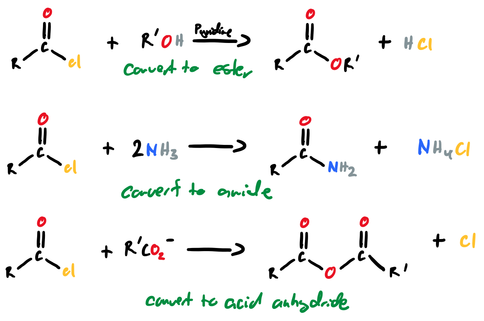{: style="width: 80%;" class="center"}

## FGI of Carboxylic Acids

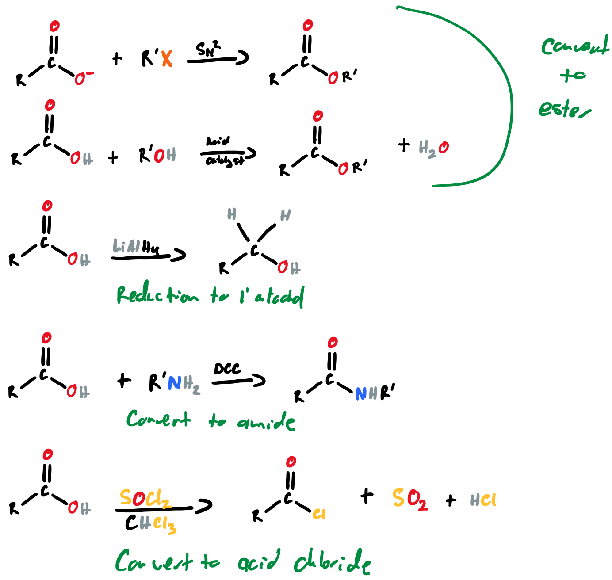{: style="width: 80%;" class="center"}

## FGI of Alkyl Halides

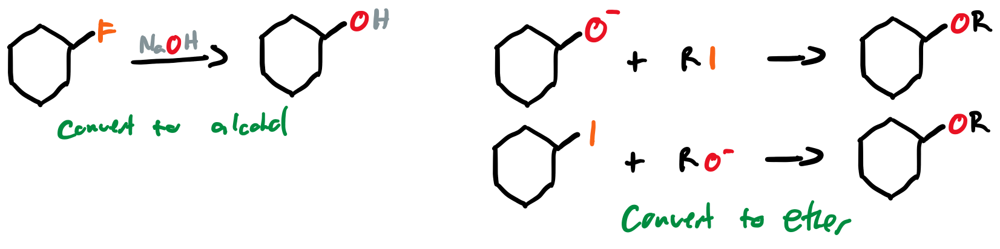{: style="width: 80%;" class="center"}
