#  Functional Groups of Interest

## Nonpolar

| Alkane| Alkene| Alkyne|Benzene|
|:---:|:---:|:---:|:---:|
|$pK_a=50$|$pK_a=44$|$pK_a=25$||
| {: style="height:35px;"} | {: style="height:35px;"} | 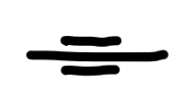{: style="height:35px;"} |{: style="height:55px;"}|

## Polar - Benzene

|Phenol| Aniline|Toluene|
|:---:|:---:|:---:|
|$pK_a=9.98$|$pK_b=9.37$||
| 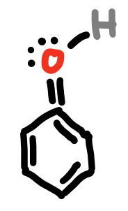{: style="height:100px;"} | {: style="height:100px;"} | 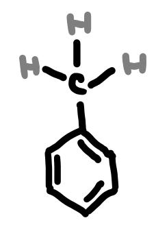{: style="height:100px;"} |

## Polar - OX

| |Alcohol|Ether|Ketone|Aldehyde|Carboxylic Acid|Acid Anhydride|Ester|Acyl Halide|
|:---:|:---:|:---:|:---:|:---:|:---:|:---:|:---:|:---:|
||$pK_a=16$|	  |      |        |		 pK_a=4.8   |              |     |           |
|$1^\circ$|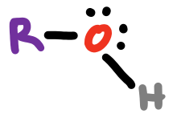{: style="max-width:85px;"} | {: style="max-width:100px;"} | 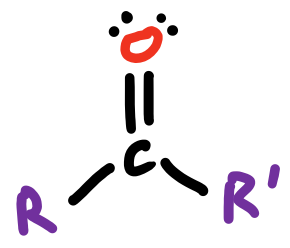{: style="max-width:85px;"} |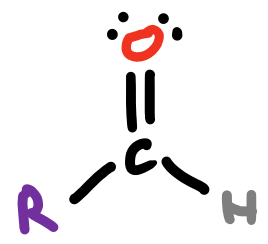{: style="max-width:85px;"} | 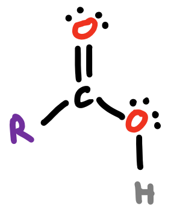{: style="max-width:85px;"} | 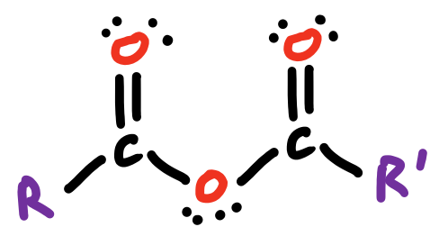{: style="max-width:120px;"} | 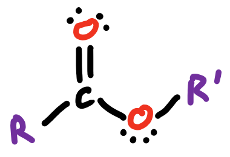{: style="max-width:100px;"} | 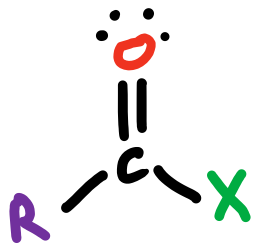 |
|$2^\circ$|{: style="max-width:85px;"}| | | | | | | |
|$3^\circ$| 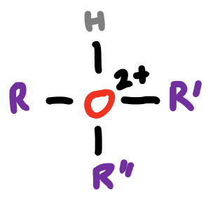{: style="max-width:85px;"} | | | | | | | |

## Polar - N

| |Amine | 	Azo Compound|
|:-:|:----:|:-----:|
|$pK_a=38$ | | |
|$1^\circ$|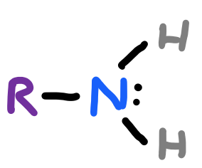{: style="max-width:85px;"} | 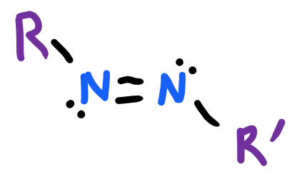{: style="max-width:110px;"} |
|$2^\circ$|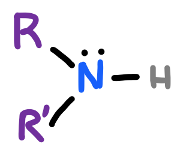{: style="max-width:85px;"} | |
|$3^\circ$|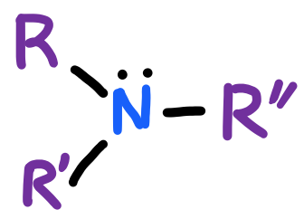{: style="max-width:85px;"} | |
|$4^\circ$|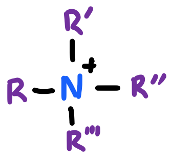{: style="max-width:85px;"} | |

## Polar - O/N

| Amide | Nitro | Imide | Isocyanate |
|:-------:|:-------:|:-------:|:----:|
| 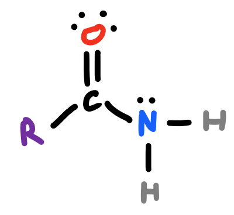{: style="max-width:110px;"} | 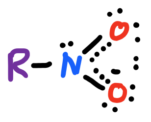{: style="max-width:90px;"} | 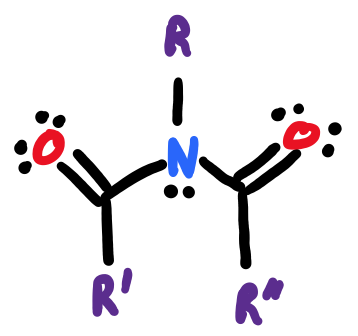{: style="max-width:110px;"} | 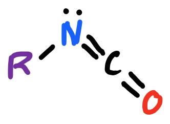{: style="max-width:90px;"} |

## Polar - Other

| Alkyl Halide | Sulfhydryl/Thiol | Disulfide |
|:-------:|:-------:|:-------:|
|$pK_a=−7$|$pK_a=7$| |
|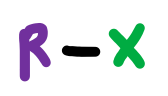{: style="max-width:60px;"} | {: style="max-width:90px;"} | 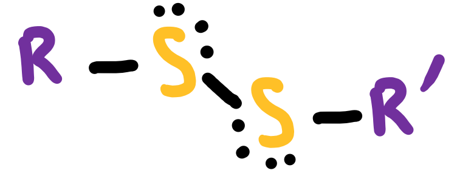{: style="max-width:110px;"} |

