# Carbonyl Chemistry

## Properties

* The carbon and oxygen are both $sp^2$ hybridised 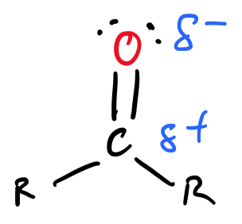{: style="width: 20%;" class="right"}
* The bonds between the oxygen and carbon are one $\sigma$ and one unhybridised p orbital resulting in a $\pi$ bond 
* The oxygen lone pair electrons are held in the two remaining $sp^2$ orbitals
* The whole structure is planar 
* They are formed by the oxidation of alcohols
  * A primary alcohol can form a carboxylic acid or aldehyde
  * Secondary alcohols can only form ketones
* A strong dipole is formed, with the electron density being pulled away from carbon, causing it to become electrophilic, with a nucleophilic oxygen.

## Acid Activation

The reactivity of carbonyl groups can be increased by adding an acid. The protonation of the oxygen will give it a formal positive charge, making it more electronegative and causing a larger dipole to form between it and the carbonyl carbon. This makes it even more reactive to a nucleophilic attack.

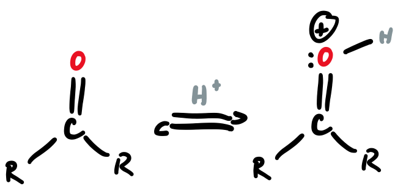{: style="width: 30%;" class="center"}

## Reactions:

There are four primary reactions of carbonyl groups as listed below.
	
* Nucleophilic Addition
* Nucleophilic Acyl Substitution
* α-Substitution
* Carbonyl Condensation

## Nucleophilic Addition

#### General Mechanism

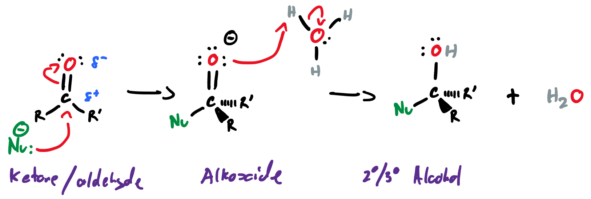{: style="width: 60%;" class="center"}

#### Grignards
* Grignard allow for the nucleophile to be a carbanion, allowing for carbon-carbon bond formation.
* See Grignards in [Organic Synthesis](../02.%20Organic%20Synthesis/#grignard)

#### Reducing Agents

* Reducing agents can be used to convert ketones and aldehydes into alcohols or alkenes, with varying products
* Some of these agents are:

|Water|Hydroxide|Alcohols|Alkoxides|Cyanide ($\ce{NaCN, HCN}$|$\ce{NaBH4}$|$\ce{LiAlH4}$|
|:-----------:|:---------:|:--------:|:--------:|:--------:|:--------:|:--------:|
| 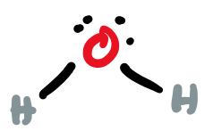{: style="height:40px;max-width:300px;"} | 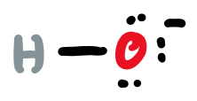{: style="height:30px;max-width:300px;"} | 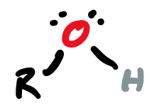{: style="height:40px;max-width:300px;"} | 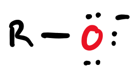{: style="height:30px;max-width:300px;"} | 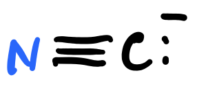{: style="height:30px;max-width:300px;"} | 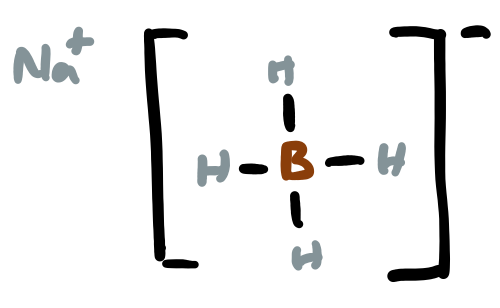{: style="height:80px;max-width:300px;"} | 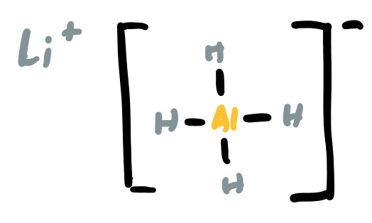{: style="height:80px;max-width:300px;"} |

## Aldehydes/Ketones to alcohol + substituents

Depending on the nucleophile, a different alcohol product can be formed

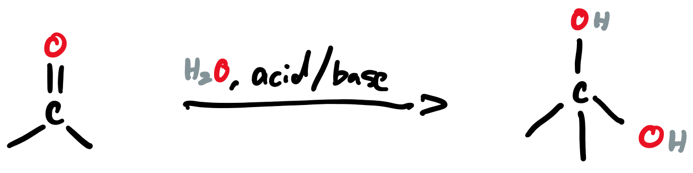{: style="width: 50%;" class="right"}

* Addition of water	
* Germinal diol formation
* Acid or base catalysed
		
		

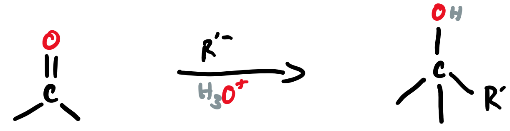{: style="width: 50%;" class="right"}

* Addition of alkyl group	
* Alcohol formation
* Acid catalysed
		

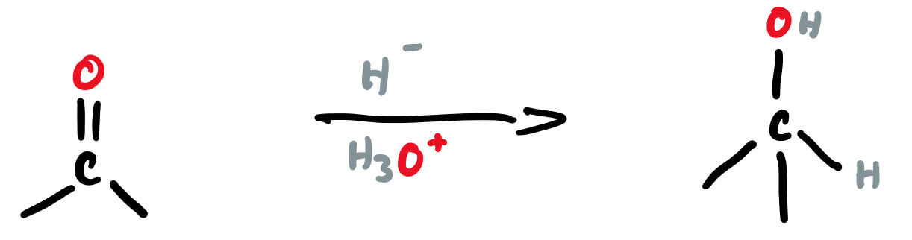{: style="width: 50%;" class="right"}

* Addition of hydride	
* Alcohol formation
* Acid catalysed
		
		

## Aldehydes/Ketones to imine

#### 
Addition of a $1^\circ$  amine to corbonyl group gives an imine

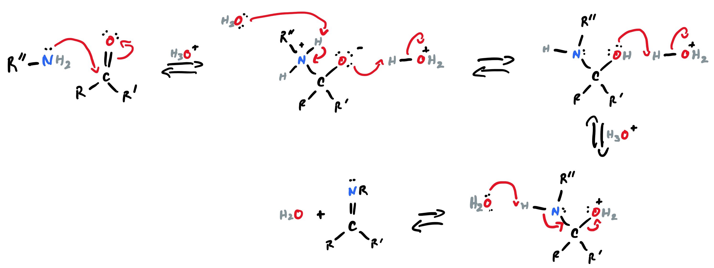{: style="width: 100%;" class="center"}

#### ~~Hemiacetal Formation~~

THIS IS WRONG

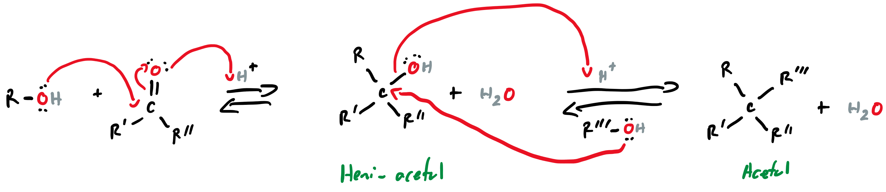{: style="width: 100%;" class="center"}

#### Nucleophilic Acyl Substitution

**Comparative Reactivity of Carboxylic Acid Derivatives**

|Amide|Ester|Thioster|Anhydride|Acid Chloride|
|:-----------:|:---------:|:--------:|:--------:|:--------:|
| 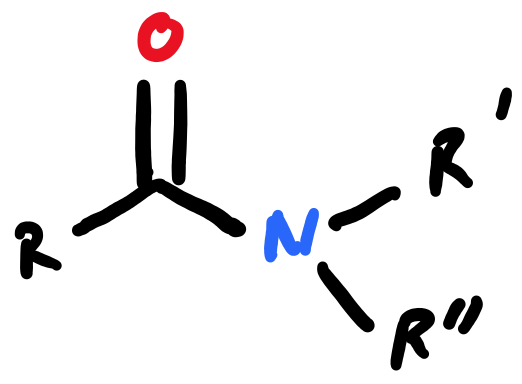{: style="max-width:200%;height:60px;"} | 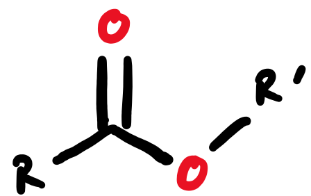{: style="max-width:200%;height:60px;"} | 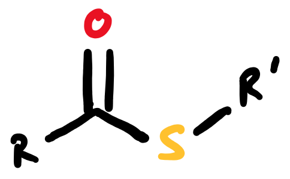{: style="max-width:200%;height:60px;"} | 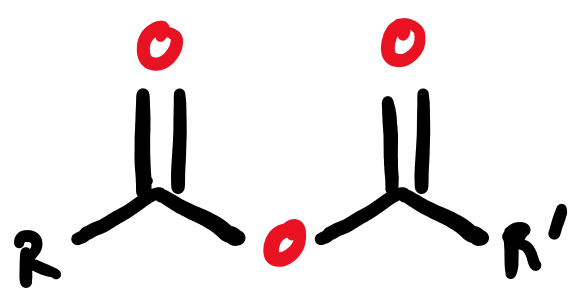{: style="max-width:200%;height:60px;"} | 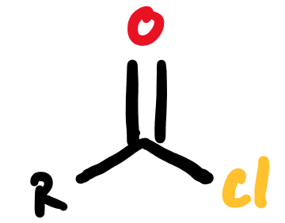{: style="max-width:200%;height:60px;"} |
| Least Reactive | | | | Most Reactive|

#### Leaving Groups

Since nucleophilic aryl substitution is a nucleophilic substitution, the suitability of the leaving group in an important factor to consider. Leaving groups also provide stability to the molecule by withdrawing electron density from the carbonyl carbon, causing it to be more electrophilic.

|Carboxylic Acid|Acid Chloride|Ester|Amide|Anhydride|Thioester|Acyl Phosphate|
|:-----------:|:---------:|:--------:|:--------:|:--------:|:--------:|:--------:|
| 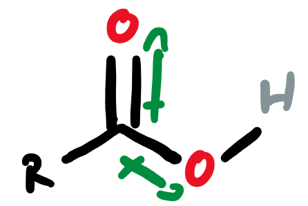{: style="height:60px;max-width:300px;"} | 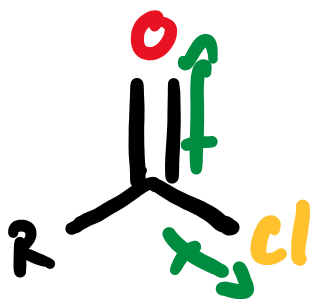{: style="height:60px;max-width:300px;"} | 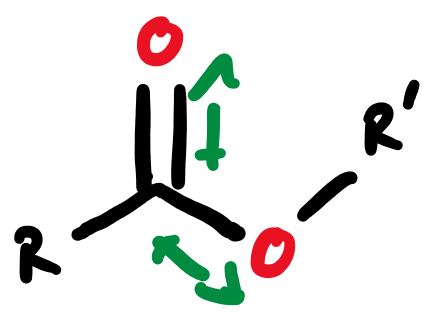{: style="height:60px;max-width:300px;"} | 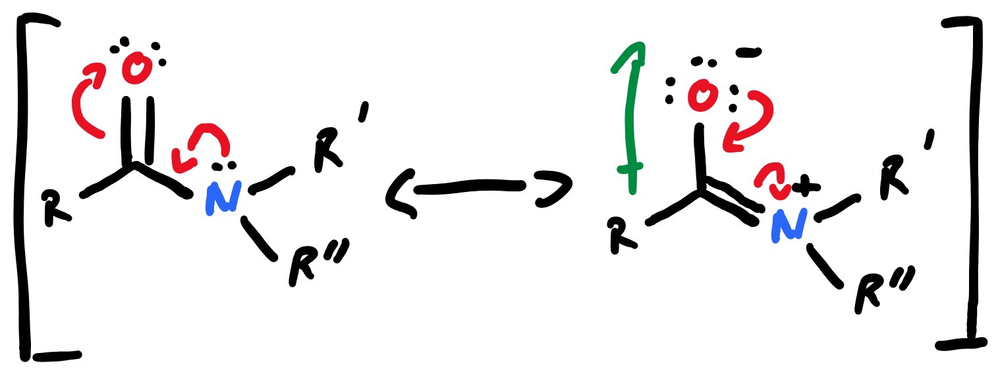{: style="height:100px;max-width:300px;"} | 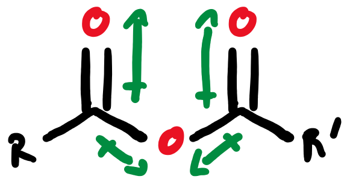{: style="height:60px;max-width:300px;"} | 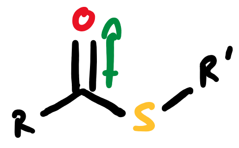{: style="height:60px;max-width:300px;"} | 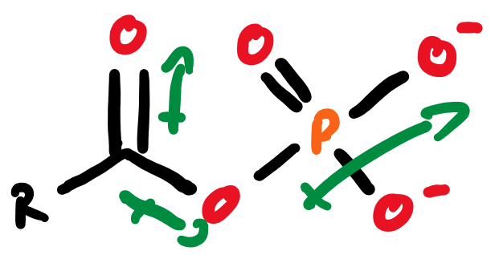{: style="height:60px;max-width:300px;"} |

This is further facilitated by conjugation mechanisms, due to the oxygen’s higher electronegativity. This can form even more negative charges on the oxygen and even more positive charges on the carbonyl carbon, activating it even further.

Steric hindrance also plays a vital role in the reaction, just like with the SN1 reaction

#### General Mechanism

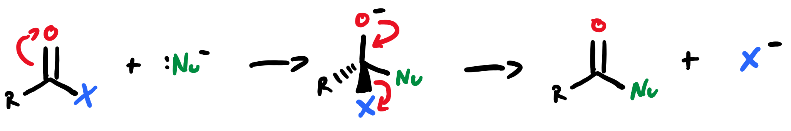{: style="width: 70%;" class="center"}

#### Acid Chlorides

The carboxylic acid is usually converted to the more reactive acid chloride before being reacted further

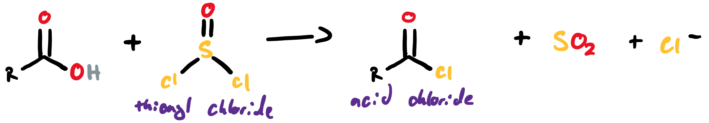{: style="width: 70%;" class="center"}

**Addition of a $1^\circ$  or $2^\circ$  amine**

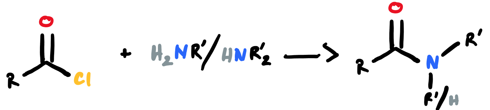{: style="width: 50%;" class="center"}

**Addition of a $1^\circ$  alcohol**

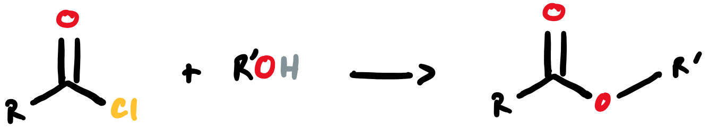{: style="width: 50%;" class="center"}

**Addition of carboxylic acid**

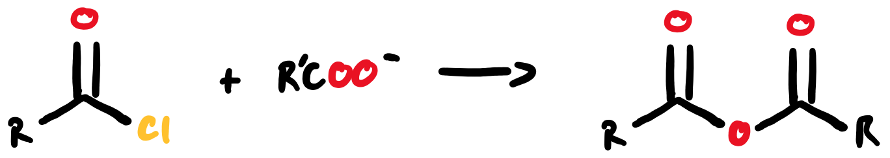{: style="width: 50%;" class="center"}

## INCOMPLETE NOTES!
