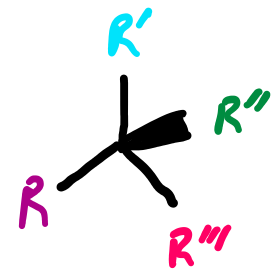
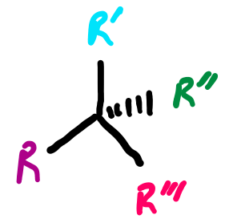
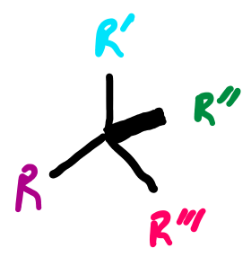
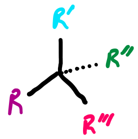
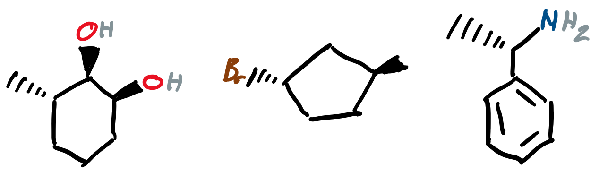
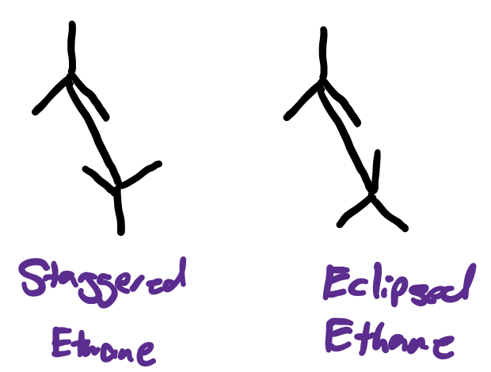
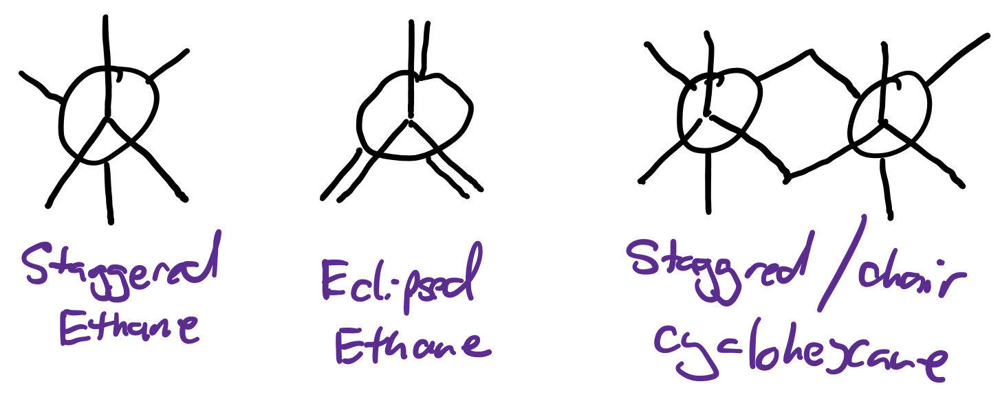
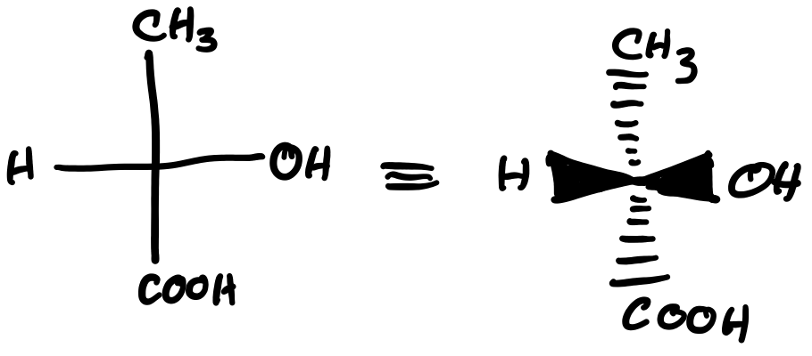
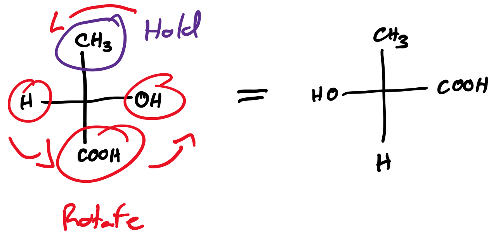

# Stereochemistry Representations

## Representations

#### Flying Wedge

|Above the plane |Below the plane |Either direction|
|:-------------:|:---------------:|:--------------:|
| {: style="height:60px;max-width:300px;"} | {: style="height:60px;max-width:300px;"} | {: style="height:60px;max-width:300px;"} |
| {: style="height:60px;max-width:300px;"} | {: style="height:60px;max-width:300px;"} ||

Useful for cis/trans isomers of cycloalkanes and tetrahedral geometry

{: style="width:50%;" class="center"}

#### Sawhorse Representation - for denoting rotamers

{: style="width:30%;" class="center"}

#### Newman Projections - showing eclipsed structures or conformational stress

* The two atoms of interest are in line
* The back atom is denoted as a circle
* The front atom is denoted as a dot
* Back substituents are slightly staggered for visibility

{: style="width:70%;" class="center"}

#### Fischer Projections

The vertical lines go in the page, while the horizontal lines come out of it

{: style="width:40%;" class="center"}

**Rotating Fischer Projections**

If you hold one substituent still, you can rotate all the other components in the fisher projection and it will remain the same molecule

{: style="width:50%;" class="center"}