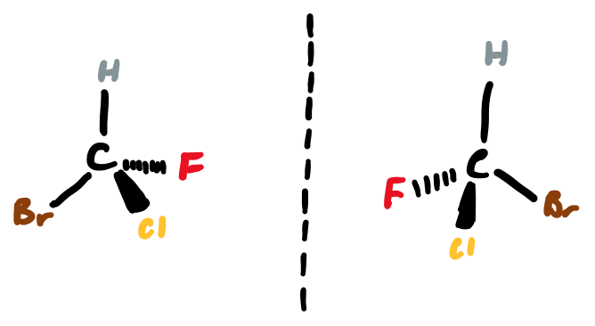
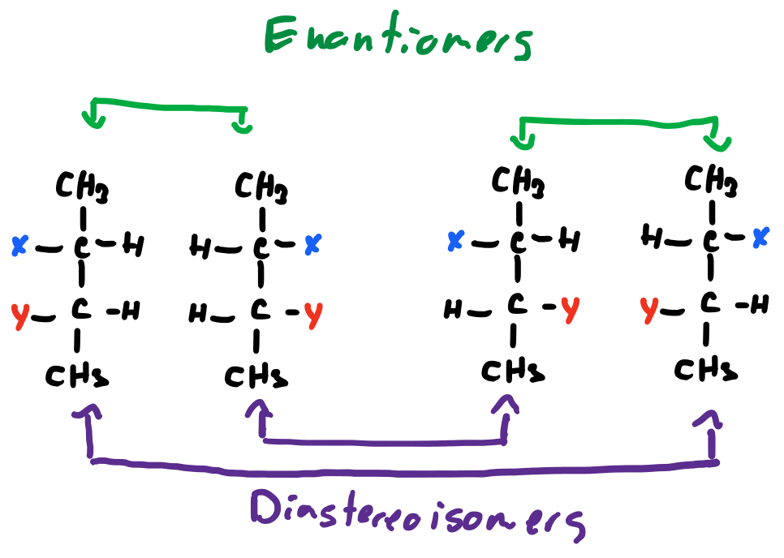
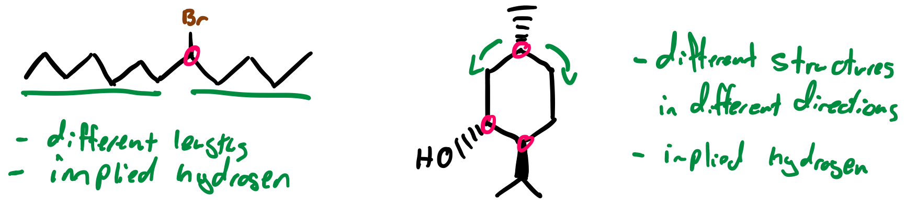
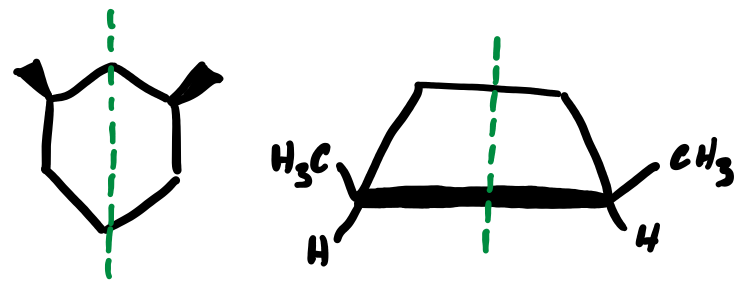

# Stereoisomers

* Enantiomers are chiral molecules that are mirror images of each other
  * The requirements of this are four substituents attached to a carbon atom in tetrahedral geometry, that is $sp^3$ hybridized

{: style="width:40%;" class="center"}

* When they are mirror images, they have the same chemical makeup, the same chemical formula, but cannot be rotated to fit in the same space. we call these two molecules enantiomers
* In the case of larger molecules, Enantiomers have all their chiral centres inverted, while diastereoisomers have some but NOT inverted.
* Enantiomers are complete mirror images

{: style="width:50%;" class="center"}

* Epimers are a special class of diastereoisomer that differ at only one chiral centre

## Identifying Chiral Centres

Identifying chiral centres is about looking for differences in the geometry

1. does the carbon atom have four different substituents attached?
  * Don't forget hydrogen
2. If the carbon is in a cyclic structure, is the structure different in one direction compared to the other?

{: style="width:70%;" class="center"}

## Number of Stereoisomers

* The number of possible chiral centres is calculated as $2^n$, where $n=$ the number of chiral centres
* In the above example, we have 3 different chiral centres so following the rule, there must be $2^3=8$ potential stereoisomers

## Meso Compounds

Sometimes, a molecule can have multiple chiral centres but is not chiral. There are called meso compounds and are usually formed due to their geometry being symmetrical, including the chiral centres:

{: style="width:40%;" class="center"}