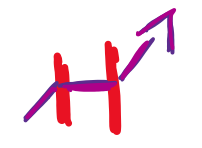
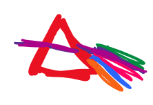
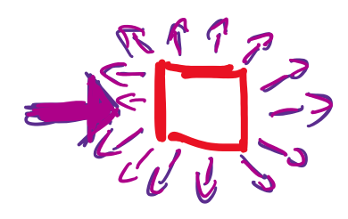
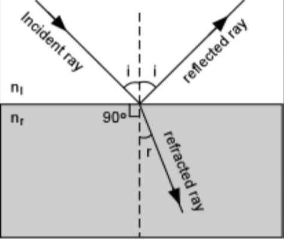
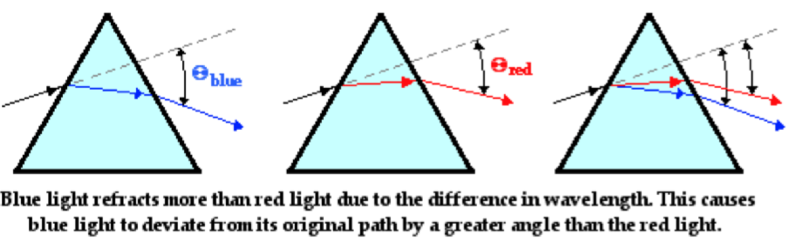
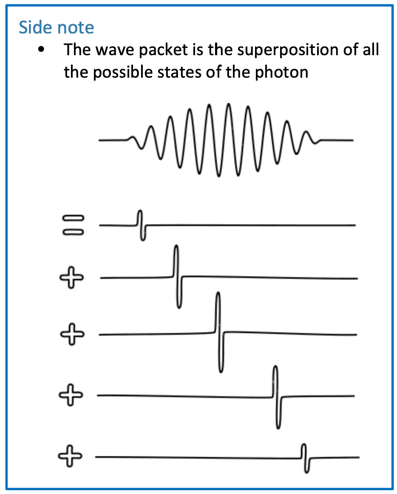
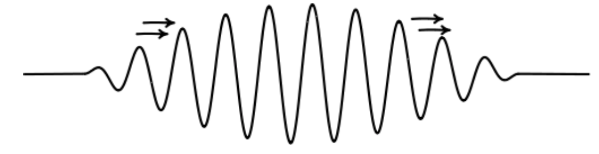

# Interaction of Light with Matter

## Speed and Refraction

As light passes through a medium, it constantly interacts with atoms which causes them to absorb and re-emit them in the same direction.

* As a result, the more dense the medium, the slower light travels through it.

| Medium  | Speed  (m/s)      | Refractive  Index      |
| ------- | ------------------| -----------------------|
| Vacuum  | $3\times10^8$ | - |
| Air     | $2.99\times10^8$ | 1.00028 |
| Water   | $2.25\times10^8$ | 1.33 |
| Glass   | $1.99\times10^8$ | 1.5 |
| Diamond | $1.25\times10^8$ | 2.4 |

## Analysis of Light

Many properties of light can be used for analysis

* Emission
* Blackbody radiation
* The change in wavelength resulting from doppler shifts
  * The amount of shift is dependent on the wavelength being emitted and the relative speed of the light
  * Motion away from the observer causes a redshift (wavelength gets longer)

## Properties of light

* Reflection {: style="height: 50px;" class="right"}
  * No light is absorbed, all the light hits the object and bounces off

* Refraction {: style="height: 50px;" class="right"}
  * Some radiation interacts, and as a result, the light is slowed down

* Dispersion {: style="height: 50px;" class="right"}
  * Light is refracted at different rates depending on the wavelength and the medium
	
* Interference {: style="height: 50px;" class="right"}
  * Peaks of the waves interact destructively or constructively

* Diffraction {: style="height: 50px;" class="right"}
  * The wave like properties of light cause them to spread out when passing through a narrow aperture. Also causes interference

* Scattering {: style="height: 50px;" class="right"}
  * All the radiation is absorbed, and is released in all directions

* Polarisation
  * Light waves can travel on any rotational plane

## Reflection and Refraction {: style="width: 30%;" class="right"}

* When light hits the interface between two different substances with different refractive indexes, two things occur
  1. Some light is reflected
    * The light does not interact with the medium at all
  2. Some light is refracted
    * The higher the refractive index of the second medium, the closer the light will be to perpendicular the interface

## Dispersion {: style="width: 30%;" class="right"}

* Materials with higher refractive indices  tend to hold onto absorbed light for longer before reemitting it.
* Since refractive indices are $\nu$ dependent, the lower $\nu$ (higher energy), the higher the refractive index.
	

## Wave-Particle Duality {: style="width: 30%;" class="right"}

See the dual slit experiment

* What are particles?
  * Have well defined positions
  * Are indivisible
  * Quantised in structure. Defined edges
* What are waves?
  * Waves are patterns
  * Don't have boundaries or edges
  * Don't come in packages
  * Have $\nu$, $\lambda$ and $E$
* What is light?
  * Comes in quantised packages called photons
    * Each photon has $\nu$, $\lambda$ and $E$
    * Photons only come in integer values (no half photons) {: style="width: 30%;" class="right"}
  * The wave is the permutation in the electromagnetic field which exists only in quantised states
    * The photon is the wave packet of the resultant waveform
		
## Speed of Light

* All light travels at the same speed through a vacuum ($3\times10^8\:m/s$)

$$
E=h\nu=\frac{hc}{\lambda}
$$

* If h and c are constant, than only $\nu$ and $\lambda$ can vary the energy