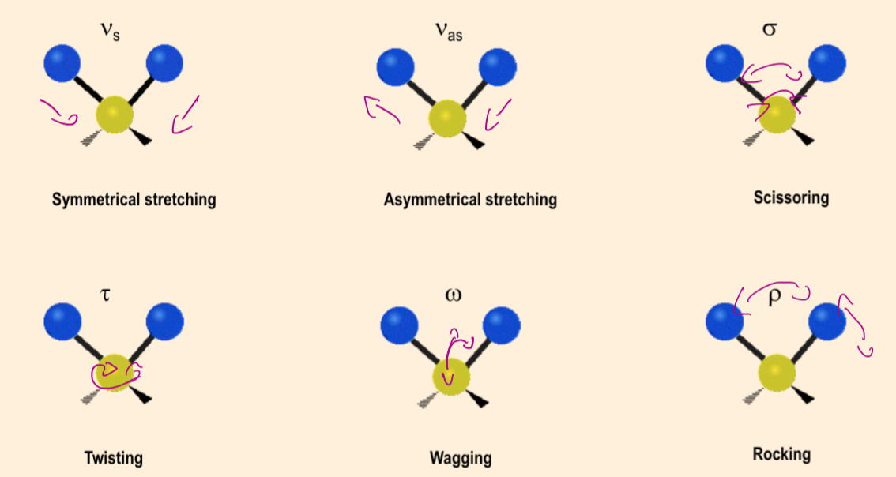
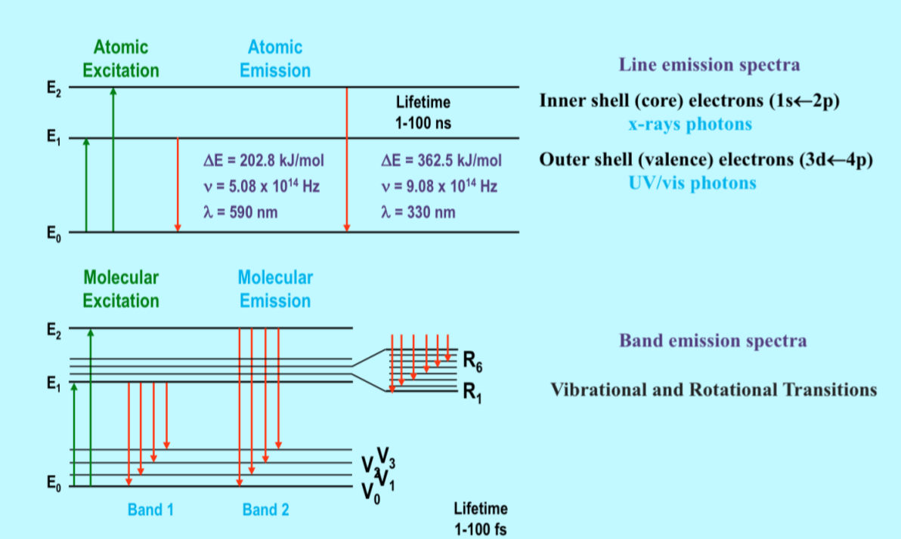

# Molecular Spectra

While energy for electron states is quantised, energy for rotational and vibrational states can also be quantised

* These steps tend to be much smaller than those between electron levels
* The energy is converted into kinetic motion rather than being re-emitted as a photon
* This process  occurs in lower energy levels, typically corresponding to IR wavelengths

{: style="width: 50%;" class="center"}

## Motion

* The excitations and emissions made by bonds are much more fine and close together than with electron orbitals, so the result is not discreet bands of motion, but instead we end up with spectra curves where the molecular motions are not so well defined.
Increases in resolution may present more discreet energy levels, however this is not practically observed.

{: style="width: 50%;" class="center"}