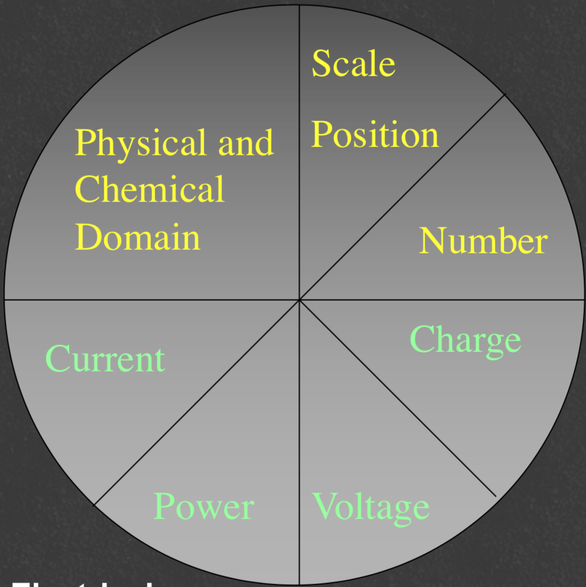

# The Analytical Process

All instrumental analysis follows the same process of **stimulus** and **response**

* To do this, they must transfer information across data domains through conversions.

 

## Data Domains

* Data domains can either be Electrical or non electrical
* Within the electrical domain, the can be stored as:
* Time - frequency, pulse width, phase
  * Analog signals - current, voltage, charge
  * Digital media - count, serial, parallel, number

{: style="width: 50%;" class="center"}

## Data Conversion

* Relies on three primary types of devices:
* Detectors - indicates change in the environment
  * Sensors - converts chemical data to electrical
  * Transducers - converts non-electrical data to electrical
  * Also contain a sensor
    * Contain a signal conditioning unit that will make it strong enough for further processing  and turn the signal into useful information. E.g. may include amplification.

 

## Domain Conversion

To get from a non-useful to useful data type, the information must be converted. This can be     intra-domain or inter-domain.

E.g. process - the Thermocouple

1. Physical, temperature information is read by transducer that amplifies the electrical signal into something useful
2. The voltage is converted into a current
3. The current is read on an ammeter
4. The scale position is read by a human and converted into a number value

This is:

1. Physical $\ce{->}$ Voltage (inter-domain)
2. Voltage $\ce{->}$ Current (intra-domain)
3. Current $\ce{->}$ Scale position (inter-domain)
4. Scale position $\ce{->}$ Number (intra-domain)
