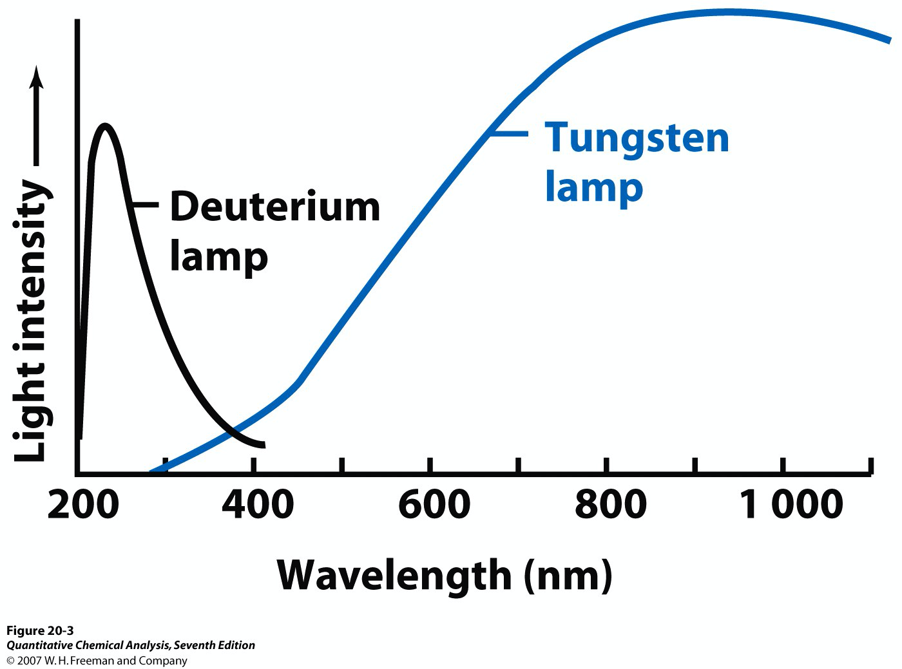
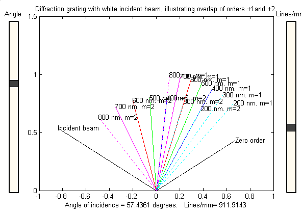
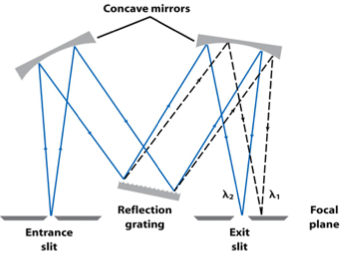
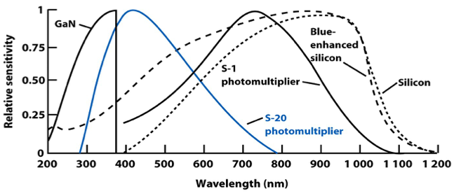
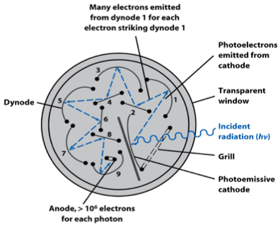
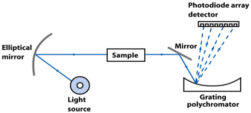

# Components of a Spectrophotometer

## Light Source

* Must be able to produce light within the range that will be used to excite the sample
	

#### Continuous Sources 
* Produce light in a wide range of wavelengths using blackbody radiation
* Each wavelength will have a different relative intensity that must be accounted for in reading the background
* Multiple lamps may be used to get complete coverage of the range to be studied
  * E.g. Tungsten lamp (Vis) + Deuterium lamp (UV)
	

{: style="width: 50%;" class="center"}

#### Line Sources 

* Excitation of a specific element without blackbody will produce a line spectra
* The spectra emitted must match the sample to be analysed
  * E.g. Ca lamp to analyse Ca content 
	
#### Lasers

* Produce directional light within a specific range of wavelengths
* High power
* Very expensive to fine tune a laser to desired specifications

## Sample Holder

* Must be transparent to the light being analysed
* Must be chemically inert so as to not react with the sample
* Must be mechanically strong, so as to ensure a long life
  * Expensive and weak is unsustainable
	

## Monochromator

#### Prisms

* Split light based on the varying refractive indexes of different wavelengths
* Must be transparent in the wavelength to be used
	

{: style="width: 50%;" class="center"}
	
#### Diffraction gratings

* Implement many fine scratches on a surface to diffract light of different wavelengths at different angles
* Much cheaper and ore reliable than prisms
* The width of the grooves determines the wavelengths diffracted
  * 50$\mu$m apart for Far IR
  * 166nm apart for UV-Vis
* Can be made of plastic to reduce cost further

{: style="width: 50%;" class="center"}
	
#### Controlling the light source

* The light needs to be collimated (made parallel) and focused appropriately to select for individual wavelengths
* The Reflection grating will scatter the light, and the light will be focused again by a concave mirror
* The exit slit will determine the selected wavelength
  * The narrower the exit slit, the greater the precision of the instrument, however the less light will be passed through the sample
  * A Larger slit will result in a higher SNR 

## Photodetectors 

* Use two principles:
  1. External photoelectric effect: electrons become free from the metal surface by energy absorption obtained by streams of incident photons 
  2. Internal photoelectric effect: free charge carriers are generated by absorption of incident photons in semiconductor junctions 
* Choice off photodetector depends on the wavelengths being studied
		

{: style="width: 50%;" class="center"}

#### Photomultiplier

* Light falls on a photosensitive alloy which causes electrons to be fired towards secondary electrodes called dynodes
* This causes them to gain more energy and release more electrons (4-50 per dynode)
* There is a cascade of dynodes so the process is amplified to create a much larger signal than a single photon would otherwise produce
* The signal is then detected by an anode and sent to a computer to plot the results

{: style="width: 50%;" class="center"}
	
#### Photodiode Array
* Consist of an array of silicon based photodetectors
* As light hits the substrate, electrons are released, which cause a change in current required to power the substrate. The change in current is detected and plotted
* The array is set up in a way that each diode will detect for a specific wavelength range 
* Much cheaper to produce yet are less accurate
* Have lower resolution that photomultipliers but can measure multiple wavelengths at the same time
* Contains no moving parts, which makes them more durable

{: style="width: 50%;" class="center"}
