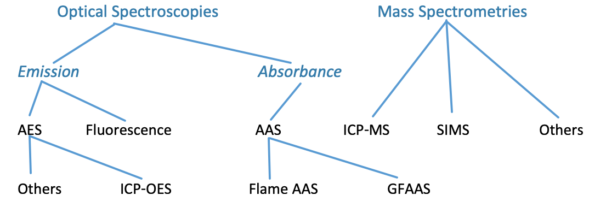
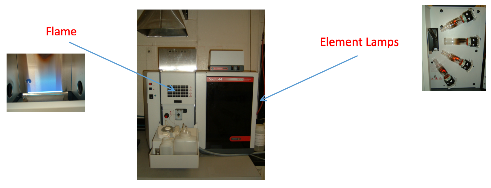
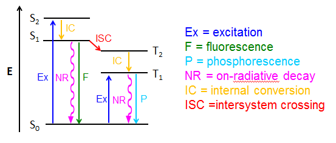
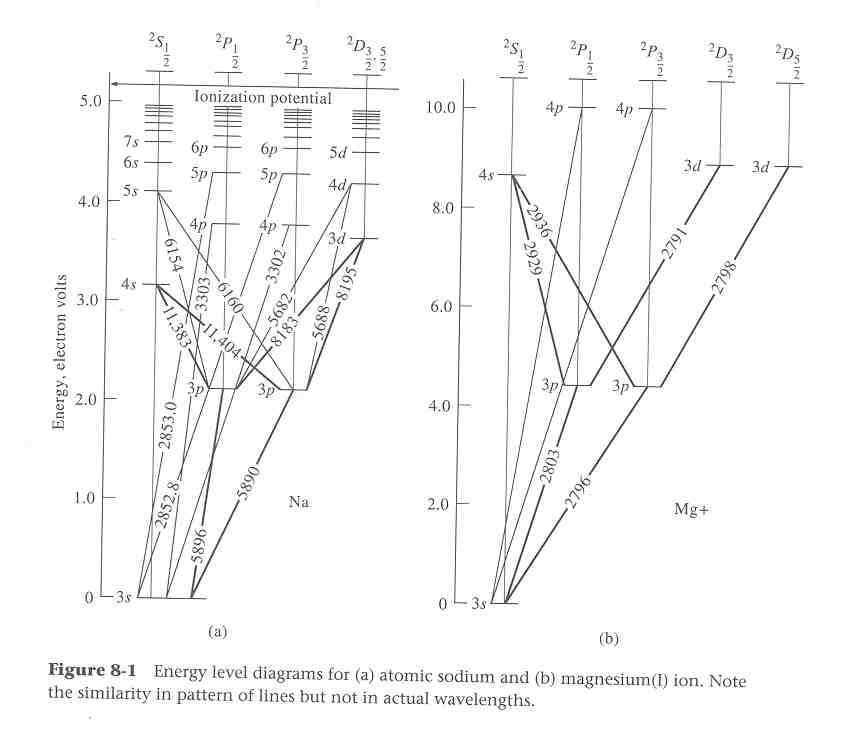
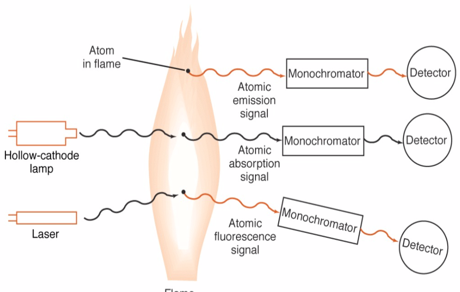
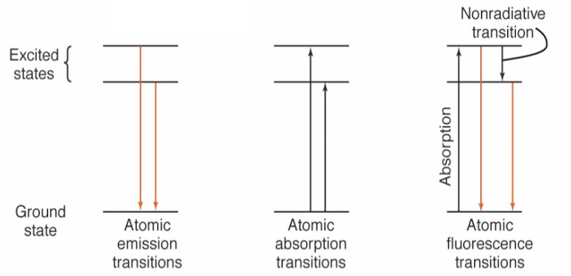
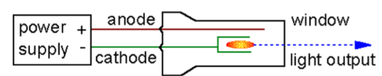

# Flame Spectroscopy AA-AES

## Classification of Atomic Spectroscopies

{: style="width: 70%;" class="center"}

## The Instrument 

{: style="width: 100%;" class="center"}

* The instrument consists of a 10cm oxyacetylene flame, which reduces the atomised solution into uncharged atoms to for AES
* Ions will not have the same emission spectra as their uncharged counterparts
* The process works just like any other spectrometry, utilising the Beer-Lambert law to compare absorbance over a distance
  * Standards must be measured, just like any other spectroscopy
* The light source is selected by utilising an element lamp. The light produced by the lamp must be the same as the light absorbed by the atoms.

## The process

1. Nebulisation - The initial solution is nebulized, that is, it's turned into a fine mist
2. Desolvation - The nebulised sample is then removed of the solvent
3. Vaporisation - The solid, nebulised sample is then vaporised, producing individual ions of the elements
4. Atomisation - The ions are reduced into atoms
5. Excitation  or Absorption - via heat or light, the atoms are put into an excited state
6. Emission - The excited atoms drop back down to the ground state, emitting photons to be measured
7. Detections - Either the photons emitted, or the light transmitted is detected and quantified

## Types of AAS/AES

* Flame AAS - uses element lamps to detect the absorbance of single elements at a time
* Graphite furnace AAS - also single element though uses a graphite furnace rather than a flame
* ICP-OES - multi element, uses plasma to excite the atoms.
  * The sample is nebulised and injected into the stream of the argon gas. The sample is sucked along with the gas flow

## Types of energetic relaxation (returning to the ground state)

### Nonradiative relaxation

* Movement - The relaxation of atomic species can cause collisional relaxations, where the sample jiggles the energy away
* Thermal - The jiggling can cause thermal increase

### Radiative relaxation (emission) 

{: style="width: 70%;" class="center"}

* Resonant fluorescence
  * Produces an emission at the same energy level to the absorbed energy
  * Typically occurs in atoms

* Non-resonant fluorescence
  * Produces emission at lower energy levels than the excitation 
	
* Phosphorescence
  * Emission is delayed. The molecule will remain in the excited state for an extended period of time before emission occurs

## Ions vs Atoms

* While it may be expected that an ion will have the same orbital energies of an atom with the same amount of electrons, it's important to consider the atomic forces, charge of the nucleus and shielding effects of the core electrons.
* $\ce{Na}$ and $\ce{Mg+}$ Are a perfect example

{: style="width: 70%;" class="center"}

## Types of atomic spectroscopy

* Emission - excites the sample and measures the emission of the atoms
* Absorbance - passes light through the sample and measures the difference in transmitted/absorbed light
* Fluorescence - excites the atom at a specific frequency but measures only off axis radiation, to capture only the emitted light

{: style="width: 41%;" class="left"}{: style="width: 55%;" class="right"}

## Flame Selection

* The optimum flame differs for each metal
  * It must be hot enough to form gaseous atoms, but not hot enough to ionise the 
* The lower the atomic number, the hotter the flame required to decompose the atoms (3150K)
  * Going down the rows of the periodic table, the atoms become more easily ionised (2200K)

## Atomic line widths

* Theoretically, the emission spectra of an element would be infinitely thin bands of light, but we observe a wider band
* The greater the width of the line, the lower the resolution of the spectra
* Major sources of band broadening are:
  * Heisenberg uncertainty principle - we cannot knowboth the **time of the transition state** and the **transmission times** accurately
    * We already know the time of the transition state, so the transmission time will be wider
    * Known as the "natural line width"
  * Doppler shift - measuring the emission of a moving particle will produce shifted results
  * Pressure effect
  * Electric or Magnetic Field Effect

## Boltzmann distribution

* The ratio of atoms in the excited state vs the ground state, where:
  * $N_1=$ number of atoms in the ground state with energy $=E_1$
  * $N_2=$ number of atoms in the excited state with energy $=E_2$
  * $K=1.3806505\times10^{−23}\:J\cdot K^{-1}$

$$
\frac{N_2}{N_1} =e^{\big(\frac{−(E_2−E_1)}{kT}\big)}
$$

## Element lamps

* Utilise a vacuum tube with an anode and cathode, where the cathode is coated in the element to be excited
  * As the current in passed through, the atoms get excited and produce light in the emission spectra of that atom

{: style="width: 50%;" class="center"}

## Analytical consideration

* The flame length is similar to the cell length in the Beer-Lambert law
* The detection limit differs for each spectroscopic line of each metal
  * This can be improved by reducing the noise
* Characteristic concertation is when:
  * $1\%$ of light is absorbed or $\%T=99$ and $A=0.0044$
* Concentrations are measured in units of μg per mL (ppm)

## Flame Structure

* Flames don't have the same combustion temperature throughout the entirety of their structure
* Different regions of the flame have different combustion properties, with the hottest being near the centre, at the top of the blue part of the flame.

## Elemental matters

* Different elements behave differently as well, with some oxidising quickly only having a short absorbance and others oxidising slowly and absorbing over a longer period of time.

## Laminar flow burners

* Rather than the sample being aerosolised and sprayed into the flame, the sample is placed in the fuel path and is pulled into the flame to be combusted
* The sample must be finely nebulised so as to not interfere with the combustion of the fuel itself

## Electrothermal AAS (ETAAS) or Graphite Furnace AAS (GFAAS)

The furnace heats up through a cycle of temperatures to prepare the sample 

1. Drying - just above 110$^\circ$C
2. Ashing - up to 1000$^\circ$C
3. Atomisation - 2000 - 3000$^\circ$C
4. Cleanout - 3500$^\circ$C with an Ar blast

The light source is passed through the chamber during the atomisation step and recorded over a few seconds
