# Reading FTIR

## Information to be obtained

*  IR is most useful for giving information about functional groups
*  it can provide a molecular fingerprint for comparison to a database
*  it doesn't provide detailed information about a structure

## Steps to identify a compound

*  Covalent bonds will typically show up around $\bar{\nu}=$600 to 4000
*  What functional groups are present? ($\bar{\nu}>$1400)
  *  Group frequency region
  *  Fairly constant appearance of peaks
  *  Use of correlation charts to provide and educated guess
*  Comparison to reference? ($\bar{\nu}<$1400)
  *  Small changes in the structure 
  *  Result in lots of complicated changes to peaks in this region
	

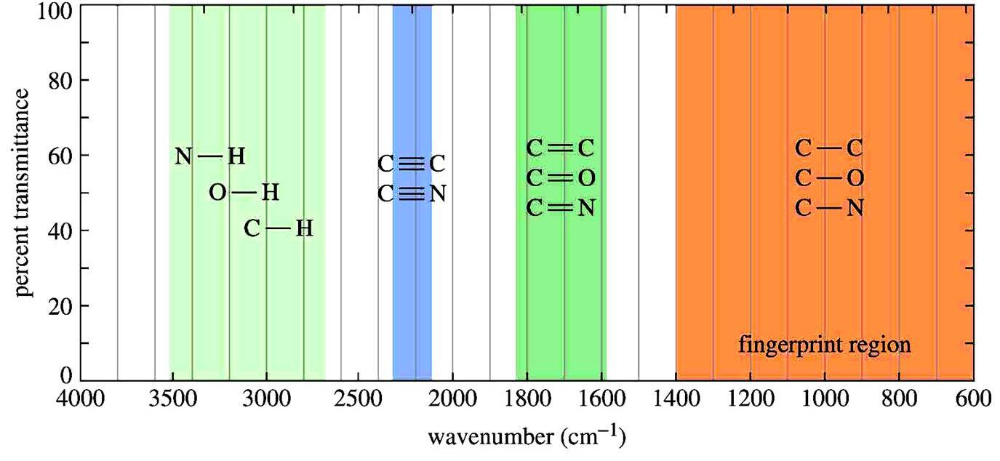{: style="width: 100%;" class="center"}

## Concepts and effecting factors
*  Stronger bond $=$ higher $\bar{\nu}$ 
*  Lighter atom $=$ higher  $\bar{\nu}$ 
*  Broadening in $\ce{O\bond{-}H}$ peak $=$ H bonding
*  EWG $=$ lower  $\bar{\nu}$ 
*  EDG $=$ higher  $\bar{\nu}$ 
*  Resonance will show both forms (Keto-Enol) 

## Types of Compounds

### Alkanes

Alkanes have no functional groups. Their IR spectrum displays only $\ce{C\bond{-}C}$ and $\ce{C\bond{-}H}$ bond vibrations. Of these the most useful are the $\ce{C\bond{-}H}$ bands, which appear around 3000 cm$^{-1}$. Since most organic molecules have such bonds, most organic molecules will display those bands in their spectrum. 

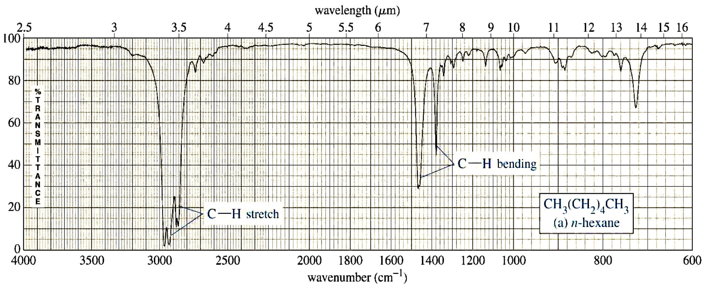{: style="width: 100%;" class="center"}

### Alkenes

Besides the presence of $\ce{C\bond{-}H}$ bonds, alkenes also show sharp, medium bands corresponding to the $\ce{C\bond{=}C}$ bond stretching vibration at about 1600-1700 cm$^{-1}$. Some alkenes might also show a band for the $\ce{\bond{=}C\bond{-}H}$ bond stretch, appearing around 3080 cm$^{-1}$ as shown below. However, this band could be obscured by the broader bands appearing around 3000 cm$^{-1}$.

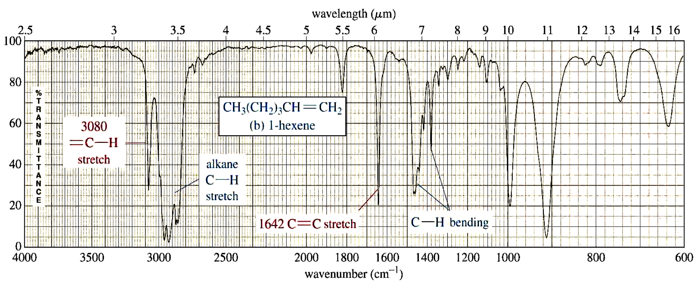{: style="width: 100%;" class="center"}

### Alkynes

The most prominent band in alkynes corresponds to the carbon-carbon triple bond. It shows as a sharp, weak band at about 2100 cm$^{-1}$. The reason it’s weak is because the triple bond is not very polar. In some cases, such as in highly symmetrical alkynes, it may not show at all due to the low polarity of the triple bond associated with those alkynes. 
Terminal alkynes, that is to say those where the triple bond is at the end of a carbon chain, have $\ce{C\bond{-}H}$ bonds involving the sp carbon (the carbon that forms part of the triple bond). Therefore they may also show a sharp, weak band at about 3300 cm$^{-1}$ corresponding to the $\ce{C\bond{-}H}$ stretch. 

Internal alkynes, that is those where the triple bond is in the middle of a carbon chain, do not have $\ce{C\bond{-}H}$ bonds to the sp carbon and therefore lack the aforementioned band. 

The following slide shows a comparison between an unsymmetrical terminal alkyne (1-octyne) and a symmetrical internal alkyne (4-octyne). 

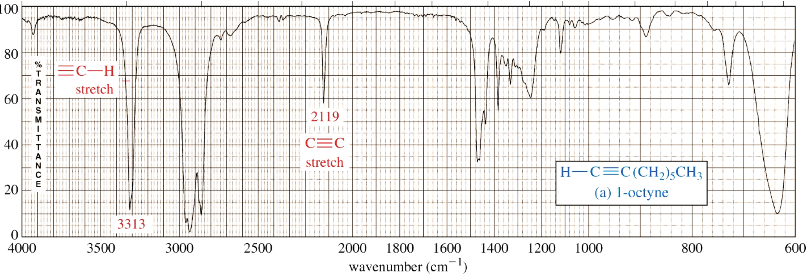{: style="width: 100%;" class="center"}
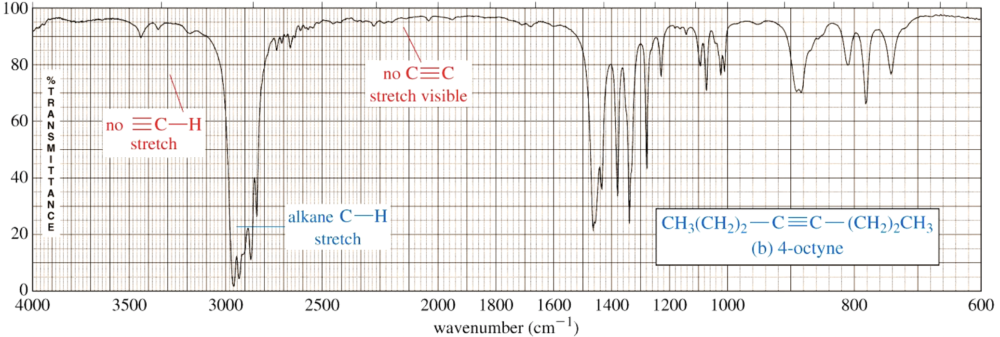{: style="width: 100%;" class="center"}

### Nitrile

In a manner very similar to alkynes, nitriles show a prominent band around 2250 cm$^{-1}$ caused by the $\ce{C\bond{#}N}$ bond. This band has a sharp, pointed shape just like the alkyne $\ce{C\bond{#}C}$ bond, but because the $\ce{C\bond{#}N}$ bond is more polar, this band is stronger than in alkynes. 

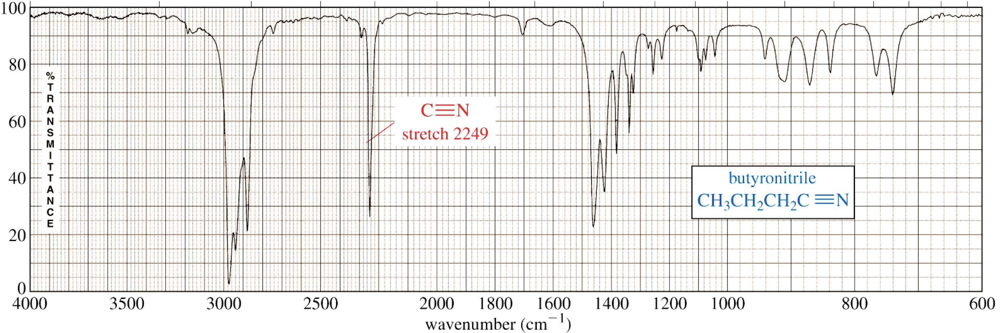{: style="width: 100%;" class="center"}

### Alcohol

The most prominent band in alcohols is due to the $\ce{O\bond{-}H}$ bond, and it appears as a strong, broad band covering the range of about 3000 - 3700 cm$^{-1}$. The sheer size and broad shape of the band dominate the IR spectrum and make it hard to miss. 

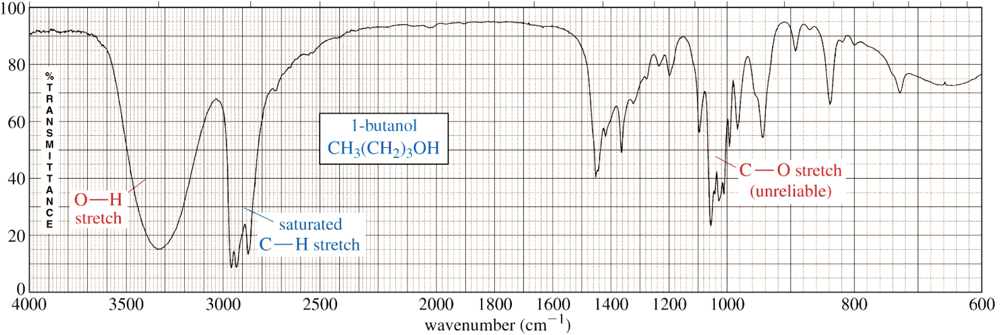{: style="width: 100%;" class="center"}

### Aldehydes and Ketones

Carbonyl compounds are those that contain the $\ce{C\bond{=}O}$ functional group. In aldehydes, this group is at the end of a carbon chain, whereas in ketones it’s in the middle of the chain. As a result, the carbon in the $\ce{C\bond{=}O}$ bond of aldehydes is also bonded to another carbon and a hydrogen, whereas the same carbon in a ketone is bonded to two other carbons. 

Aldehydes and ketones show a strong, prominent, stake-shaped band around 1710 - 1720 cm$^{-1}$ (right in the middle of the spectrum). This band is due to the highly polar $\ce{C\bond{=}O}$ bond. Because of its position, shape, and size, it is hard to miss. 

Because aldehydes also contain a $\ce{C\bond{-}H}$ bond to the $sp^2$ carbon of the $\ce{C\bond{=}O}$ bond, they also show a pair of medium strength bands positioned about 2700 and 2800 cm$^{-1}$. These bands are missing in the spectrum of a ketone because the $sp^2$ carbon of the ketone lacks the $\ce{C\bond{-}H}$ bond. 
The following slide shows a spectrum of an aldehyde and a ketone. Study the similarities and the differences so that you can distinguish between the two. 

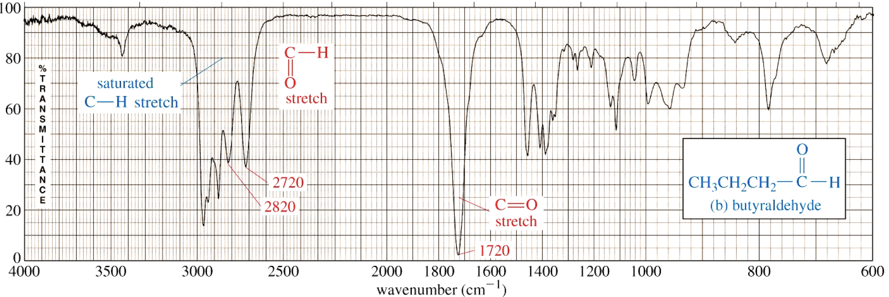{: style="width: 100%;" class="center"}

{: style="width: 100%;" class="center"}

### Carboxylic Acid

A carboxylic acid functional group combines the features of alcohols and ketones because it has both the $\ce{O\bond{-}H}$ bond and the $\ce{C\bond{=}O}$ bond. Therefore carboxylic acids show a very strong and broad band covering a wide range between 2800 and 3500 cm$^{-1}$ for the $\ce{O\bond{-}H}$ stretch. At the same time they also show the stake-shaped band in the middle of the spectrum around 1710 cm$^{-1}$ corresponding to the $\ce{C\bond{=}O}$ stretch. 

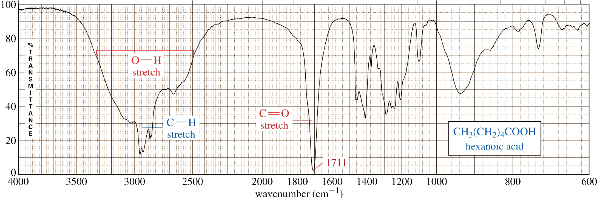{: style="width: 100%;" class="center"}

### Amines

The most characteristic band in amines is due to the $\ce{N\bond{-}H}$ bond stretch, and it appears as a weak to medium, somewhat broad band (but not as broad as the $\ce{O\bond{-}H}$ band of alcohols). This band is positioned at the left end of the spectrum, in the range of about 3200 - 3600 cm$^{-1}$. 

Primary amines have two $\ce{N\bond{-}H}$ bonds, therefore they typically show two spikes that make this band resemble a molar tooth. Secondary amines have only one $\ce{N\bond{-}H}$ bond, which makes them show only one spike, resembling a canine tooth. Finally, tertiary amines have no $\ce{N\bond{-}H}$ bonds, and therefore this band is absent from the IR spectrum altogether. The spectrum below shows a secondary amine. 

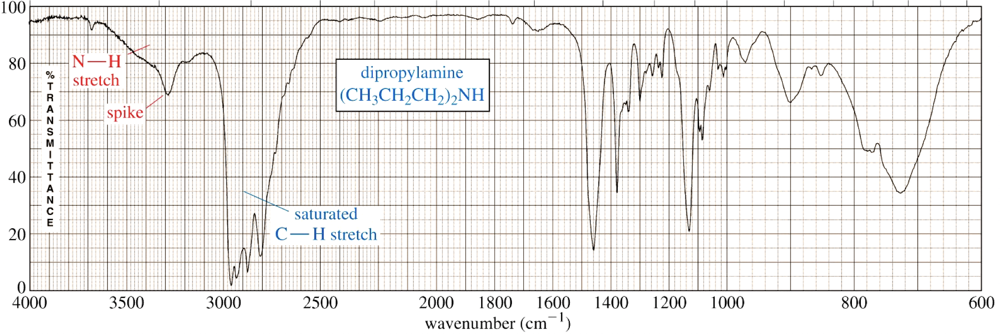{: style="width: 100%;" class="center"}

### Amides

The amide functional group combines the features of amines and ketones because it has both the $\ce{N\bond{-}H}$ bond and the $\ce{C\bond{=}O}$ bond. Therefore amides show a very strong, somewhat broad band at the left end of the spectrum, in the range between 3100 and 3500 cm$^{-1}$ for the $\ce{N\bond{-}H}$ stretch. At the same time they also show the stake-shaped band in the middle of the spectrum around 1710 cm$^{-1}$ for the $\ce{C\bond{=}O}$ stretch. As with amines, primary amides show two spikes, whereas secondary amides show only one spike. 

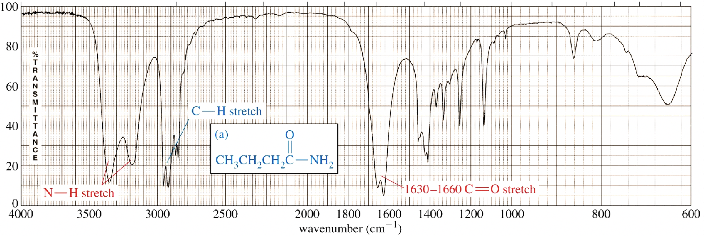{: style="width: 100%;" class="center"}