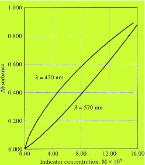
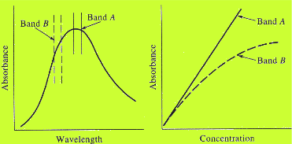
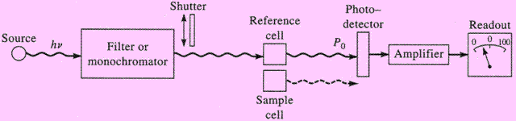
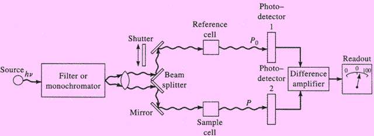
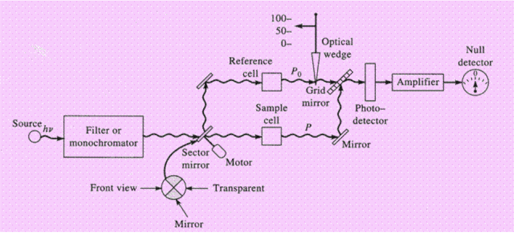
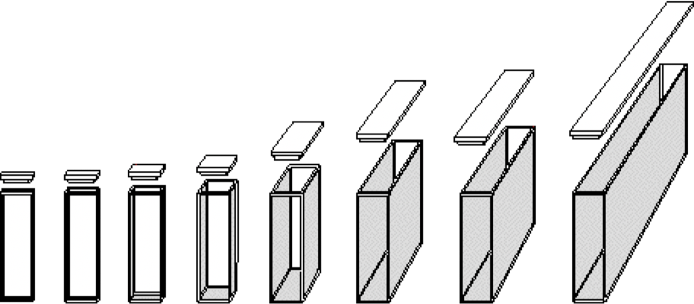

# UV-Vis Spectrophotometers

Like most spectroscopy, UV-Vis respects the beer lambert law and its limitations, Including:

* Linearity breaks down when a solution is too concentrated
  * As intermolecular distances decrease, the charge distribution of the molecule changes and so does $\varepsilon$
* Linearity can break down when a reaction is taking place {: style="width: 20%;" class="right"}
  * Something as simple as protonation/deprotonation of the analyte with the solvent can drastically change the linearity of the sample.
* As  discussed in Monochromator, it is practically impossible to select an individual wavelength of light from a broad source, so any {: style="width: 40%;" class="right"} reading of absorbance/transmittance will be the average over the provided range, drastically reducing the resolution
* While increasing the path length can negate a lower concentration solution, it can also increase scattering, causing a loss of linearity to occur

## The UV-Vis Spectrophotometer

There are four types of UV-Vis spectrophotometer:

#### Single-beam

* These are the most basic, 0% T is read with the shutter closed 100% with the shutter open and no sample
* The blank spectrum must be recorded first and is subtracted from the measure spectrum
* Can be slow to operate, requires more intervention

{: style="width: 70%;" class="center"}

#### Double-beam in space

* The monochromatic beam is split with a beam splitter and one beam passes through the sample while the other passes through the blank
* Two photodetectors are utilised and the difference between the two is compared

{: style="width: 70%;" class="center"}
		
#### Double-beam in time

* The double-beam in space has the disadvantage of using two different photodetectors, each with their own response curves and tolerances. It also assumes that the beam splitter will allow exactly 50% of the light in either direction
* The double-beam in time physically changes the beam to pass through the blank, then the sample with a certain periodicity using a rotating shutter
* The photodetector knows this periodicity and will take intermittent readings for the blank and sample individually

{: style="width: 70%;" class="center"}

#### Multi-channel

* Multi-channel instruments are Photodiode Array based and will measure the entire spectrum at once with whatever accuracy is provided by the array utilised

## The Lamps (see Light Source for more info)

The lamps usually consists of two types of bulbs

#### Tungsten

Provides full coverage of the visible band (350 - 800 nm)

#### $\ce{H2}$ or $\ce{D2}$

Used for the UV range (160 - 350 nm) 

An alternative for high intensity spectroscopy is to use a xenon lamp (200 - 1000 nm), however these are expensive and short-lived

## The sample holder

* Must be completely transparent to the wavelengths being measured, as such quartz is used rather than glass
* They can come in a variety of path lengths to accommodate various concentrations of solutions

## Photometers vs Spectrophotometers

* Photometers can only measure light at a single wavelength using filters, however are cheap and have a high energy throughput
* Spectrophotometers use a monochromator to scan through a range of wavelengths making them more versatile, and more expensive. Complex optics give them a lower S/N 

{: style="width: 60%;" class="center"}

## Modern Instruments

#### UV Photometers

* Use a mercury lamp and filter specifically for the 254 mm emission reading
* Useful for identification of organic molecules, since they absorb around this region

#### Probe type photometers

* Use fibre optics to transmit and receive the signal
* Removes the need for a sample cell
* Can be used for identification in solid-phase chemistry
