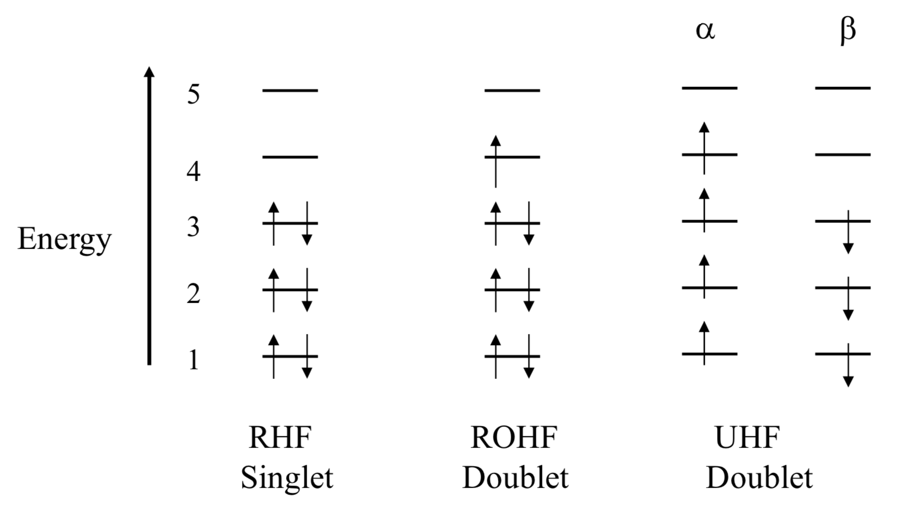
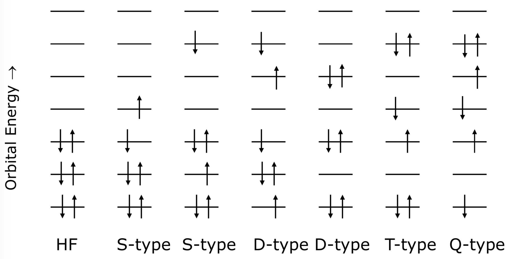
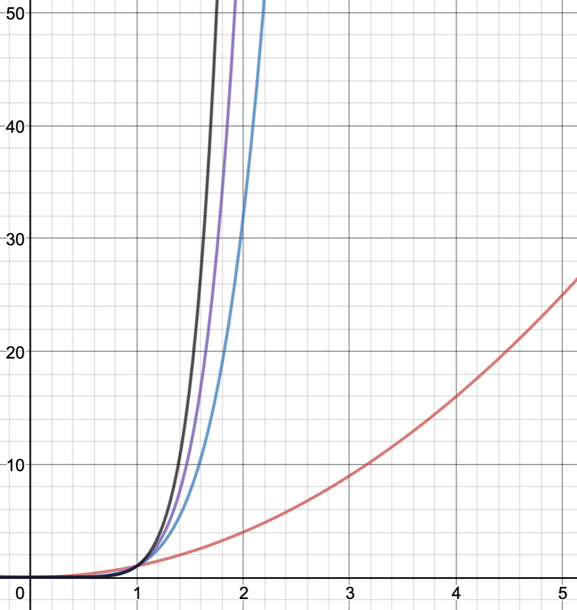

# Ab Initio
* Ab initio methods utilise the HF approximations
  * BO approximation - PES
  * HF approximation (mean field approximation) - SCF
  * LCAO

## HF Theory
* In HF Theory, the energy of a system is the sum of five different energy terms

$$
E_{HF}=E_T+E_v+E_J+E_K+E_C
$$

* $E_T$  is the electron kinetic energy
* $E_V$  is the coulombic nuclear-electron attraction energy
* $E_J$  is the coulombic electron-electron repulsion energy
* $E_K$  is the electron-electron exchange energy **(Energy released when electrons in degenerate orbitals exchange position)**
* $E_C$  is the correlation energy **(Results from the instantaneous interaction of electrons and is neglected by the HF approximation)**

!!! Note 
	From the BO approximation, the Hamiltonian term $\widehat{T_n}$  doesn’t exist (nuclear kinetic energy) and $\widehat{V_{nn}}$  can be reduced to a constant ($E_{NN}$)

## The Wavefunction

* LCAO is in effect

$$
\Phi_i=\sum{c_{\mu i}\chi_\mu}
$$

* $\Phi_i$= the molecular orbital
* $c_{\mu i}$= the molecular orbital coefficient - a weighted contribution of how much each basis function effects the final molecular orbital
* $\chi_\mu$= the basis function
  * The basis function here is $Ne^{−\zeta r^2}$  
  * $N$ in the basis set is a normalisation constant $C_i$ in this unit
  * $\zeta$ is the exponent, providing the width of the Gaussian function
  * $r$ is the spacial location of the orbital
  * The amount of zeta determines the amount of functions that can be optimised
    * E.g. Triple $\zeta$ would be  $\chi=(Ne^{−\zeta_1r^2})+(Ne^{−\zeta_2r^2})+(Ne^{−\zeta_3r^2})$
		

E.g.

$$
\Phi_1=(c_{1,1}\cdot \chi_1 )+(c_{2,1}\cdot \chi_2 )+(c_{3,1}\cdot \chi_3 )+(c_{4,1}\cdot \chi_4 )
$$

$$
\Phi_2=(c_{1,2}\cdot \chi_1 )+(c_{2,2}\cdot \chi_2 )+(c_{3,2}\cdot \chi_3 )+(c_{4,2}\cdot \chi_4 )
$$

## Electron Spin

* We also need to consider the spin of electrons ($\alpha$ and $\beta$)
* In closed shell systems (systems where all the electrons are paired in orbitals, $\alpha$ and $\beta$ electrons have the same spacial coordinates ($r$) for simplicity
* In open shell systems we need to be a bit more careful with this

## RHF/ROHF/UHF

* Restricted Hartree-Fock (RHF)
  * For closed shell systems all the spin up and spin down orbitals have the same spatial coordinates
<br><br>
* Restricted Open-Shell Hartree-Fock (ROHF)
  * All paired electrons are treated are RHF and any unpaired electrons have different functionals for the occupied component and the unoccupied virtual component
<br><br>
* Unrestricted Hartree-Fock (UHF)
  * All electrons are considered to have their own orbital, without considering paired and unpaired electrons in the same orbital

{: style="width: 70%;" class="center"}
## Advantages and Disadvantages of UHF

* Advantages
  * Accounts for the influence that unpaired electrons have on the paired electrons
    * They have a habit of changing spin densities
  * Provides qualitatively description of bond breaking/forming
  * Models open shell systems more accurately than RHF

* Disadvantages
  * Computationally more expensive
  * Can lead to spin contamination - where the wavefunction isn't always made of one spin up and one spin down electron. This leads to an improper wavefunction being formed
	

## Electron Correlation

* An inherent error within HF neglects a portion of the energy of the system. This is known as correlation error
* Of the three remaining Hamiltonian terms after the BO approximation, they are broken down as such

$$
\widehat{T}_e+\widehat{V} _{ne}=E_T+E_V
$$

$$
\widehat{V}_{ee}=E_J+E_K+E_C
$$

* Where:
  * $E_T$= electron kinetic energy
  * $E_V$= electron potential energy
  * $E_J$= coulombic repulsion energy
  * $E_K$= exchange energy
  * $E_C$= correlation energy
<br><br>
* Correlation energy is always negative as it's the process by which electrons minimise their energy
* Is sensitive to the amount of electron pairs and comes in two types
  * Dynamic Correlation - which is the dance that electrons make to try and avoid each other
  * Static Correlation - is the energy associated with electrons being able to change their configuration as needed to minimise their energy (accounted for in CI)
* Calculating this is the single most important thing in quantum chemistry

## Møller-Plesset

* Perturbation methods like MP theory assume that the problem we'd like to solve differs only slightly from a problem that we've already solved
* The energy is calculated to various orders  of approximation
  * MP2 - second order
  * MP3 - third order
  * Etc..
* The computational cost greatly increases with each successive order
* The series is not even guaranteed to converge.
	* The job may never finish and unlike SCF will not necessarily give you an error
* In general only MP2 is recommend
* MP2 approximately includes single and double excitations

## Configuration Interaction
* To account for this, the next generation of ab initio methods accounts for this and are called "post HF methods"
* One of the ways this works is to look at Configuration Interaction (CI)
  * This theory considers that the actual composition of a quantum system accounts for all the possible "configurations" (determinants). In this case, that means that a linear combination of all the possible configurations needs to be calculated to account for this process.

{: style="width: 70%" class="center"}

        Single           Double        Triple       Quadruple
This number is the amount of electrons that are excited in the process

## Coupled Cluster

Rather than using a linear combination of configurations like in CI, CC uses exponential expansion

In CI, we start with the HF determination of the wavefunction $\Phi$ and correct it with a linear combination of terms calculated from the different determinants (in CI, this operator is denoted C)

$$
\Psi_{CI}=(1+C_1+C_2+C_3+…) \Psi_{HF}
$$

In CC, a similar correction is applied but uses the Taylor  series to get there (in CC, this operator is denoted $T$)

$$
\Psi_{CC}=exp(1+\widehat{T}_1+\widehat{T}_2+\frac{1}{2!} \widehat{T}_1^2+\frac{1}{2!} \widehat{T}_2^2+\frac{1}{3!} \widehat{T}_1^3+\frac{1}{3!}\widehat{T}_2^3+…) \Psi_{HF}
$$

* The subscript on each operator is the amount of excited electrons
* In "Full CI" all electrons are distributed among all the orbitals as massive cost, so it is common to "truncate" the process and limit it to a certain number of excited electrons
	
## Frozen Core Approximation (FC)

* Since correlating electrons is such a costly and time consuming process, freezing the core electrons which have a mostly negligible impact on the bonding of a molecule can save a huge amount of time
* This is mostly applicable for first row elements atoms as the higher up, the more electrons there are and the more they can interact.
* Some processes rely on core electrons though, so it is really important to understand what you're doing

By default MP# calculations freeze the core, and to overcome this you need to add
```mp2(full)```

## Cost

As a comparison, here is a cost table of how computational time where $N=$ the number of basis functions

* DFT is similar to HF (~$N^3$)  {: style="width: 30%; "class="center"}

|Method  | Scaling Cost |
| -------|:-------------|
| HF	   | N^2          |
| MP2    | N^5          |
| CCSD   | N^6          |
|CCSD(T) | N^7          |

* While CISD is an approach that can be used, it has a few shortfalls that make it inefficient
  * QCISD fixes these issues but is more costly  than CCSD which is more accurate
  * "CISD is not sufficient, CISDTQ is too expensive "
	

## Semiempirical Methods (AM1, PM3, RM1, etc.)

* Make a fair few simplifications
  * Only look at the valence electrons, so as to minimise the amount of functions needed
  * Don’t look at long range interactions
    * Really important in protein modelling, as there is just far too much going on to account  for everything
  * Parameterise lots of properties using experimental results
    * Be aware that these are often trained, and thus may not account for systems outside of the training dataset
    * Also only limited to  ground state applications for the same reason
  * Use a minimal basis set, such as 3-21G
  * Employ a non iterative solution process, that is it won’t use guess and check methods such as with SCF
