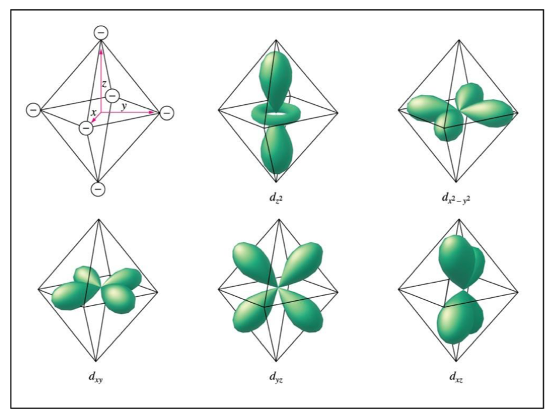
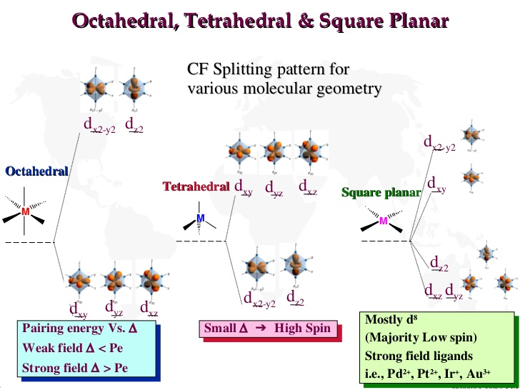
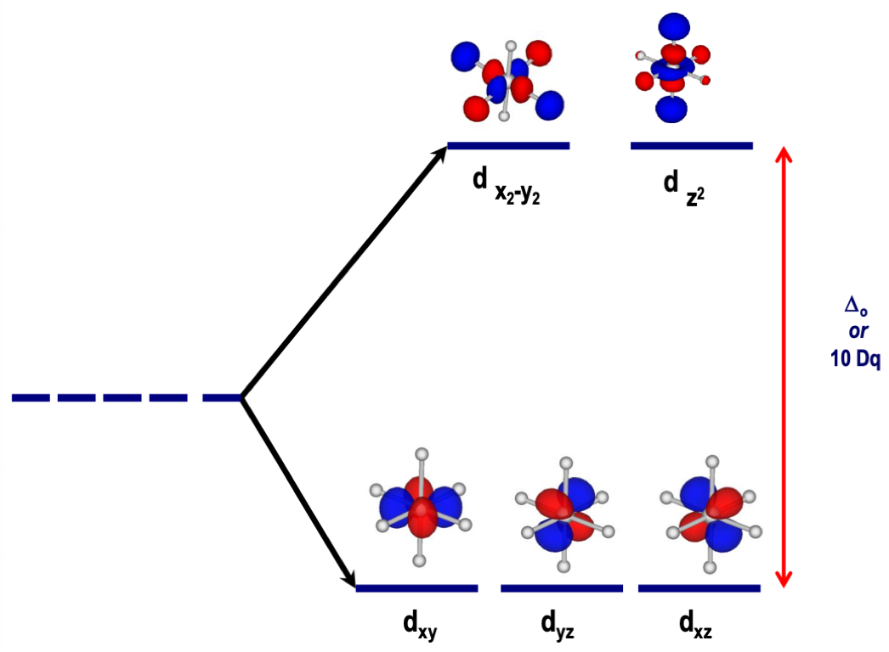
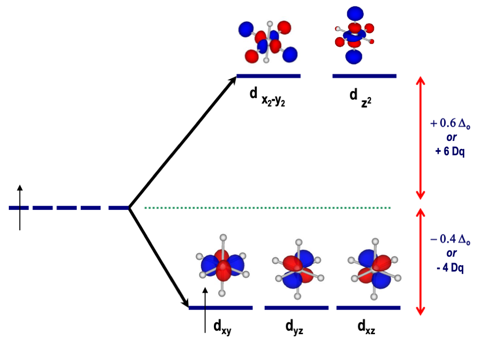
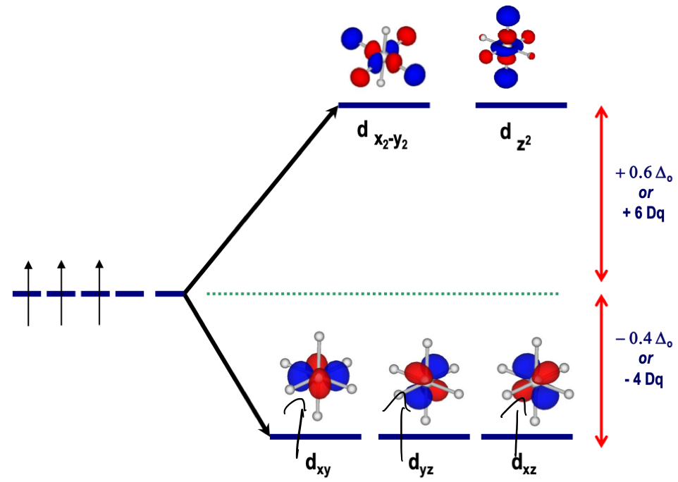
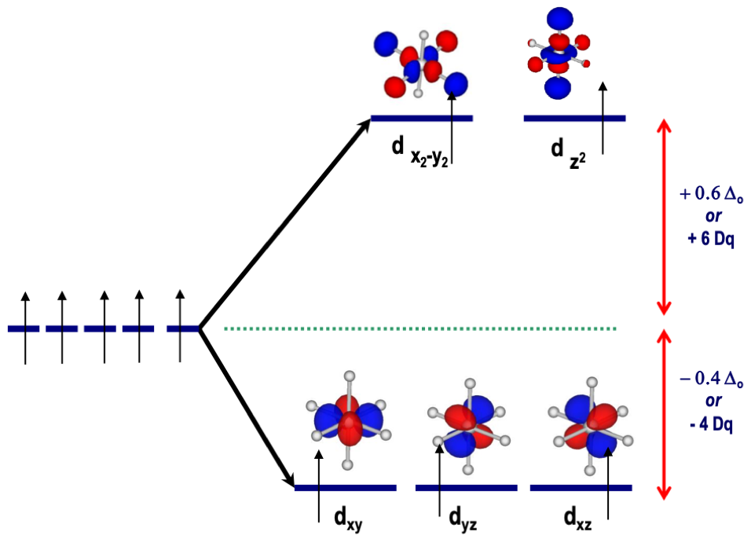
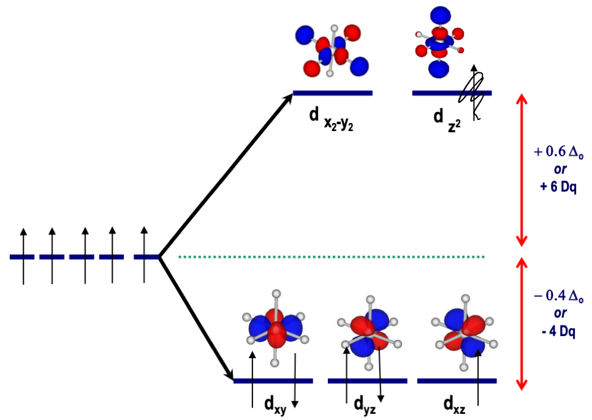
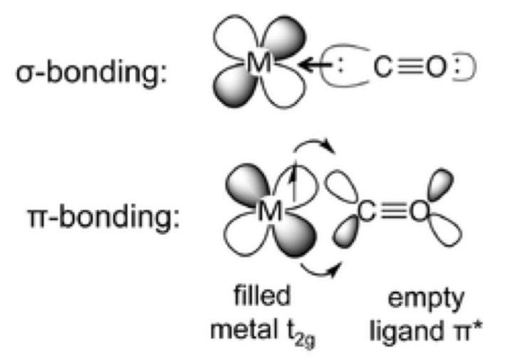
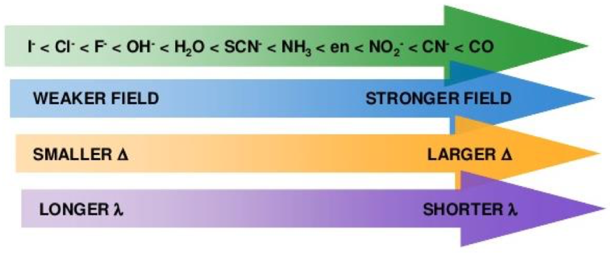

# Ligand/Crystal Field Theory

* LFT can be summed up as the effect that the "field" of ligand has on the orbital energy of the coordinated metal ion

## Assumptions

* Ligands are negative point charges
* Metal-Ligand bonding is entirely ionic

## The concept

* The best way to think about LFT is that ligands coordinate in specific configurations that will interact with the orbitals in specific ways
  * The orbitals in which the ligand overlaps are distorted, causing them to take on a higher energy and the  non interacting ones relax, causing them to lower
* An implication of this is that the splitting of the d-orbitals is entirely dependent on the geometry of the complex, with each geometry splitting the orbitals in a different manner

{: style="width: 47%; "class="left"}
{: style="width: 48%; "class="right"}

## The maths

* The energy distance between the split orbitals is $\Delta_O$ (change in ocrtahedral)
  * $\Delta_O=10 Dq$

{: style="width: 40%; "class="center"}

* This can be split into stabilisation and destabilisation energy
  * $−4\Delta_O$ and $+6\Delta_O$
  * In the below example,  there is one electron occupying the d-orbitals, so there is a total of $0.4\Delta_O$ of crystal field stabilisation energy (CFSE)

{: style="width: 40%; "class="center"}

* As we increase the occupation of the stabilising orbitals, the CFSE increases
  * CFSE$=3(0.4\Delta_O )=1.2\Delta_O$

{: style="width: 40%; "class="center"}

## Low Spin and High Spin

* Since the splitting of d-orbitals can be quite small, the energy required to pair electrons can be overcome, causing both high and low spin modes
* High spin is paramagnetic and low spin is diamagnetic
  * High spin CFSE$=3(0.4\Delta_O )−3(0.6\Delta_O )=0\Delta_O$
  * Low spin CFSE$=5(0.4\Delta_O )=2\Delta_O$

|                            High                             |                             Low                             |
| :---------------------------------------------------------: | :---------------------------------------------------------: |
| {: style="width: 100%; "class="center"} | {: style="width: 100%; "class="center"} |

* Since high spin happens when the d orbitals aren't split too far, it's a property of weak field ligands

## Bonding

* Ligands-metal bonds aren't entirely ionic and need to be though of in terms of $\sigma$, $\pi$ and $\Delta$ bonds
* The strength of the ligand field and the resulting energy associated with $\Delta_O$  is completely based on the ligand and it's relative field strenght
	
* The general rule :
  * $\ce{I− < S^{2}− < SCN− < Cl− < NO3− < N3− < F− < OH− < C2O4^{2−} < H2O < … < CN− < CO}$
	
* The magnitude of the ligand's charge is only half the story. We also need to consider the types of bond formed

{: style="width: 40%; "class="center"}

## Spectrochemical series
* The spectrochemical series directly links the strength of the ligand field and the resulting $\Delta_O$  to the colour of the light produced through HOMO-LUMO excitation

{: style="width: 60%; "class="center"}

* Going down a periodic group also results in a larger $\Delta$

## Limitations of CFT
* CFT is very powerful, however it only considers species to be  of point charges and calculates a resulting dipole
* It neglects to consider the shape of orbitals and thus can’t explain the properties of all the ligands

