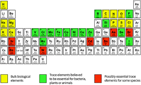
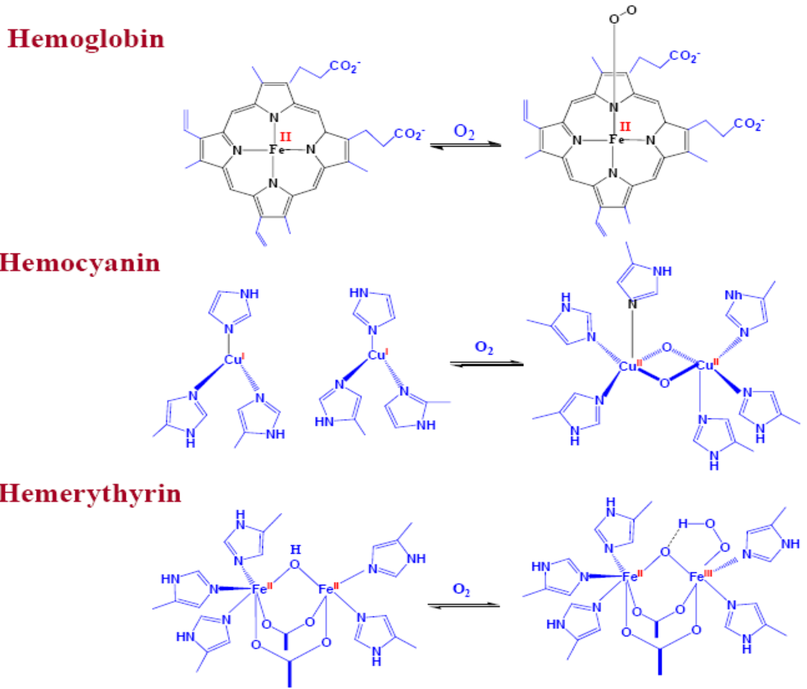
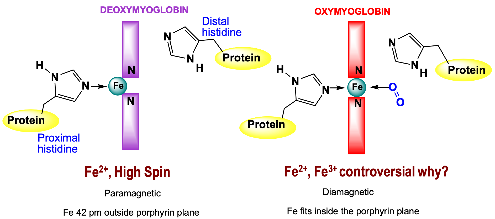
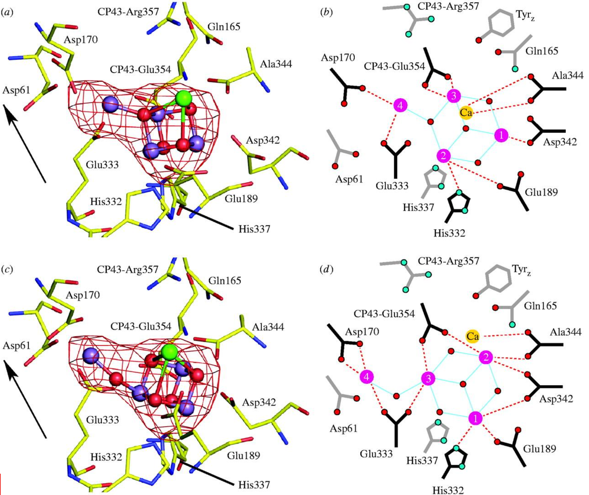
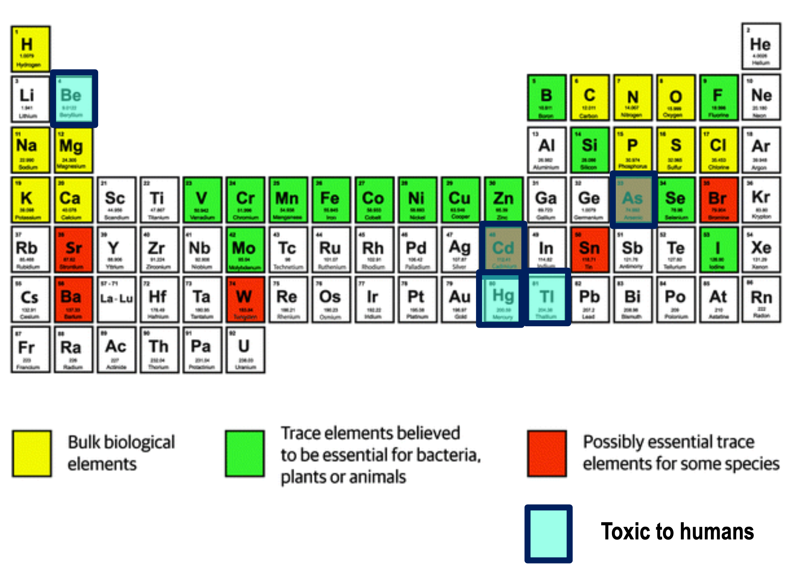
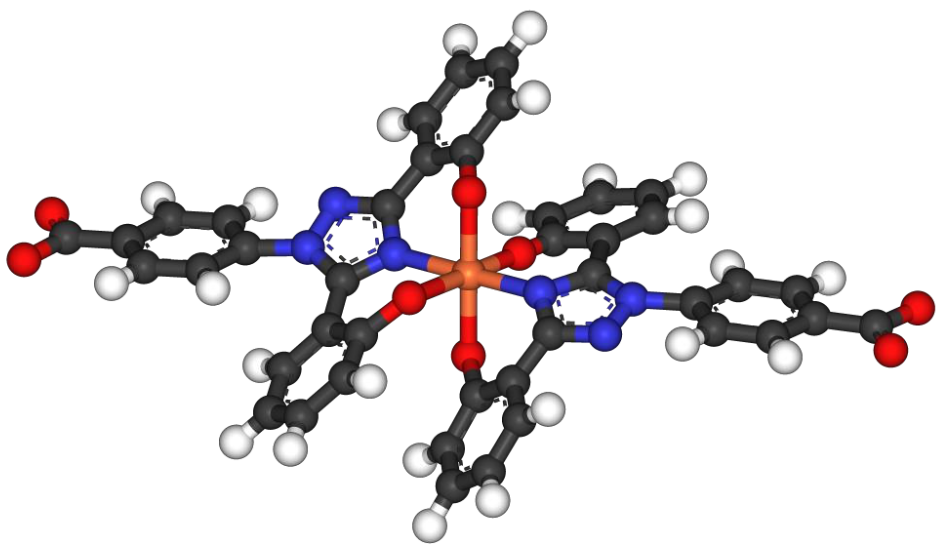
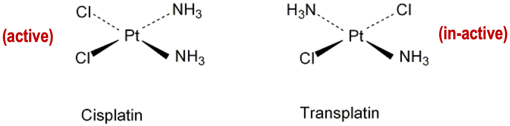

# Bioinorganic Chemistry

## What is bioinorganic chemistry?

* Discovery of how inorganic elements work within biological systems
* The introduction of inorganic components into biological systems to use as probes and drugs

## Elements used in biochemistry

* Primarily it is the organic elements used in biochemistry, however first row transitions metals are often used  within protein complexes at metal cores.
* The big  six elements  are:
  * C, H, N, O, P and S
* But the chemistry that these elements alone, can create is not enough to produce life.
  * An additional seven or eight are required by all life on the planet

## Metals in biology {: style="width: 50%; "class="right"}

#### Iron

* Primarily used for oxygen or electron transport
  * Haemoglobin
  * Myoglobin
  * Cytochromes
  * Ferredoxin

#### Cobalt

* Used as a catalyst - acts within a larger molecule as a coenzyme 
  * Vitamin B12

#### Copper

* Used in oxygen transport where iron is scarce (blue blood)
  * Hemocyanin
* Also used as catalysts within metalloenzymes

#### Zinc

* Acts as a catalyst within an enzyme itself
  * Carboxypeptidase - protease that breaks down peptides from the carboxylic acid end
  * Carbonic anhydrase - interconverts $\ce{CO2}$ to $\ce{H2CO3}$ (carbonic acid) to regulate pH in the cells
* Also has a structural element to it

#### Sodium/Potassium

* Used as a regulating solute 
  * Ion channels and action potentials

#### Calcium/Magnesium

* Used as a structural element
  * $\ce{Ca3(PO4)2}$

#### Nickel, Molybdenum, Tungsten

* Used as catalysts within metalloenzymes

## Oxygen Carrying 

* The structures on the right are structures that exist within protein complexes
  * The protein itself provides conformational catalysis to the metal core
* Haemoglobin consists of the porphyrin molecule heme bound within four subunits
* Each is found within a different form of life
  * Haemoglobin is found in vertebrates {: style="width: 50%; "class="right"}
  * Hemocyanin is found within molluscs
  * Hemerythrin is found within sea worms
* CO/CN/NO have stronger binding affinities to the complexes than oxygen
  * This causes them to inhibit respiratory processes

### Haemoglobin

* Consists of four subunit peptides bound to four heme coenzymes
  * $2\times\:\alpha$-chains $+2\times\:\beta$-chains for adults
  * $2\times\:\alpha$-chains $+2\times\:\delta$-chains for foetuses
* Three major types of Hb exist
  * Hb A which is present in adults
  * Hb F which is present in foetuses
    * Possibly to have a stronger oxygen affinity to the maternal Hb
    * All new cells after birth are produced with Hb A
        * Takes about 6 months to replace
  * Hs S which is present with the sickle cell mutation
    * Caused by a mutation in the $\beat}-chain, causing a build up of hydrophilic residues that aggregate (plaque)
        * Glutamic acid is replaced with valine
    * Helps to prevent malaria infections
    * Clogs blood vessels
    * Reduces oxygen carrying capacity

### Myoglobin

* Needs to be reversibly bound to oxygen, or it couldn't release the oxygen where needed
  * Deoxymyoglobin
    * When not bound, the iron centre sits outside of the porphyrin ring, an is in high spin, causing it to be more paramagnetic
    * This is the "relaxed" state of Mb, which has a higher binding affinity to oxygen
  * Oxymyoglobin 
    * When bound to oxygen, the iron enters a low spin state, is pulled into the porphyrin ring plane and pulls on the proximal histidine residue
    * This puts the Mb in a "tense" state which is more ready to release the oxygen
  * The states are also reinforced by pH
    * H+ is produced in metabolic cells but not in the lungs, making lungs have a lower pH.
    * The decrease in pH of the metabolic cells stabilises the tense state (oxymyoglobin), allowing the oxygen to be released more easily and vice versa in the lungs

{: style="width: 60%; "class="center"}

## Synthetic Hb
* The synthetic Hb, called the "picket fence" porphyrin was an attempt at making a synthetic haemoglobin
* It failed, due to the lack of a protein structure around it, helping it to behave better in a biological environment

## Photosynthesis

* $\ce{6CO2 + 6H2O -> C6H12O6 + 6O2}$  simple schematic reactions
  
  * Reduces $\ce{CO2}$ to glucose while oxidising $\ce{H2O}$ to $\ce{O2}$
* This can be attempted by applying a reduction potential to the reactants, but there is no specificity in the products produced and requires a lot of energy to do so
* Photosystem II was an attempt at atficial photosynthesis, but it had very low yields 

{: style="width: 50%; "class="center"}
	
	
## Stability constants

* Going back to chem 1, stability constants describe where the equilibrium of a reaction lies:

$$
\ce{[M]^{x+} + nL -> [ML]^{x+}}
$$

$$
\ce{K_{st}=\frac{[ML]}{[M][L]n}}
$$

* If K_st  is really small, the equilibrium favours the products, it it’s really big, it favours the reactants

## Denticity of ligands

Refer back to the [Macrocycle effect](../01.%20Coordination/#cyclic-chelates-macrocycle-effect).

* The macrocycle effect shows that:
  1. The stability ($K_st$) of the ligand increases as its denticity does
  2. A cyclic ligand will have a massive increase in stability
  * This is very useful for stabilising radioisotopes for medical imaging

## Enterobactin

* Iron in water is particularly insoluble as it very quickly turns to rust.
* Enterobactin, which is released as a bioligand for iron has a significantly stronger stability with iron, than it does with hydroxide. This allows it  to convert insoluble rust into bioavailable iron

$$
\begin{gather}
\ce{Fe^{3+} + enterobactin <=> [Fe(enterobactin)]^{3+},  K_{stab}=10^52}\\
\ce{[Fe(H2O)6]^{3+} + H2O <-> [Fe(H2O)5OH]^{2+} + H3O+, pK_{s1}=2.2}\\
\ce{[Fe(H2O)5(OH)]^{2+} + H2O <-> [Fe(H2O)4(OH)2]+ + H3O+, pK_{s2}=3.5}\\
\ce{[Fe(H2O)4(OH)2]+ + H2O <-> [Fe(H2O)3(OH)3](=Fe(OH)3.aq) + H3O+, pK_{s3}=6.0}
\end{gather}
$$

* Each of these rust forming reactions significantly favours the products over the reactants to produce insoluble rust

## Heavy metal poisoning

* The vast majority of heavy metal poisoning happens as a result of heavy metals mimicking the behaviours of their biologically needed relatives
  * Cadmium likes to mimic zinc - is a big issue in battery manufacturing regions
  * Arsenic likes to mimic phosphorus - can be found in ground water
  * Beryllium likes to mimic magnesium and calcium
* For a general trend, look up and down the period of the periodic table to see what biologically important element it might mimic

{: style="width: 50%; "class="center"}

## Chelation therapy

* Works by binding stable ligands to the heavy metal to stop it from being used by the biological system it's contaminated
* E.g. two Desferox (commercial) molecules binding to an iron atom 

{: style="width: 50%; "class="center"}

## Cisplatin

* Is a common chemotherapy drug, which binds to rabidly dividing DNA, preventing transcription proteins from accessing that portion of the genetic material
* The chlorine ligands bind to adjacent guanine residues on the DNA which causes a DNA repair which inevitably fails due to the strongly bound platinum
* Discovered serendipitously when Rosenberg tested a hypothesis of magnetic cell division by putting platinum in a growth media with an electric field
* When the electric current was turned on, the cells stopped growing, as the platinum was converted into cisplatin.

{: style="width: 50%; "class="center"}

The chloride ions are weakly bound to the platinum and will preferentially be exchanged with the amine groups on the guanine bases, causing the DNA to kink and be unreadable

