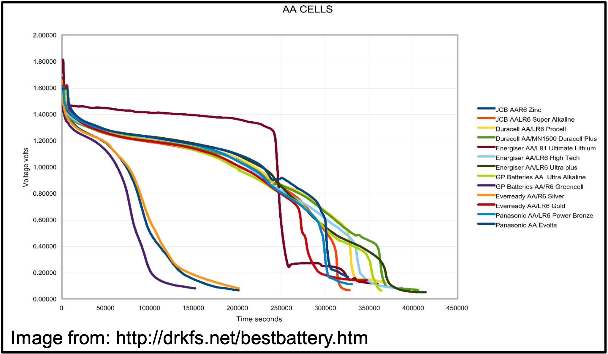

# Batteries

* Batteries are devices which consist of one or more electrochemical cells
  * These produce electrical energy from chemical energy
* To prevent waste, we use rechargeable batteries that can be reversibly oxidised and reduced
* Based on the basic principles of the Galvanic Cell
  * Since the cell only has a limited potential, we can chain multiple cells together to create a higher voltage battery
  * $E^\circ$  is the maximum potential output, reality is always lower
    * Based at 1M STP, so as concentrations drop, so too will the output voltage

## Region

* Consist of three distinct regions:
  1. The anode (positive) terminal - oxidation occurs
  2. The cathode (negative) terminal - reduction occurs
  3. Electrolyte - a weak barrier that allows for electrons to be transferred from the anode to the cathode
    * Often just cardboard, soaked in an ion or ionic liquid
    * Can be a conductive polymer (Li ion)

## Comparison

1. Cell voltage - the combination of the two half reactions $E\circ_{cell}=E\circ_{reduction}−E\circ_{oxidation}$
2. Battery capacity - the amount of energy the battery can release at the specified voltage for a period of time (Ah - amp hours)
3. Energy density - energy per unit mass (Ah/kg)
4. Cut-off voltage - the lowest voltage that the battery can safely be discharged to (permanent damage may result is exceeded)
5. Depth of discharge - the amount of energy that can be taken from the battery without resulting in loss of efficiency over time

## Charging and Discharging {: style="width: 30%; "class="right"}

* Changes in battery voltage results as it discharges. Can be used as a metric of battery state
* The reactions are temperature dependent, so changes in temperature will effect the cell
* Capacity tends to decrease as the charging rate increases
  * The chemistry is quite slow, so it can take time to take place
  * Forcing more electricity in will make it heat up, reducing the reaction effectiveness
* Different battery chemistries require different charging profiles - different $E^\circ$

## Battery Types

#### Lead Acid

* Very heavy, low density, but effective and cheap. Useful where weight is not the issue
* Anode $\hskip{1cm}E^\circ=1.685\:V$

$$
\ce{PbSO4_{(S)} + 5H2O_{(l)} <=> PbO2_{(s)} + 3H3O_{(aq)}+ + HSO4_{(aq)}− + 2e−}
$$

* Cathode $\hskip{1cm}E^\circ=−0.356\:V$

$$
\ce{PbSO4_{(S)} + 3H3O_{(aq)}+ + 2e− <=> Pb_{(s)} + HSO4_{(aq)}− + H2O_{(l)}}
$$

$$
1.685−(−0.356)=2.04\:V∗6 \text{cells}
$$

#### Dry-Cell Batteries

* Manganese is a cheap and relatively non toxic material
* Anode $\hskip{1cm}E^\circ=1.225\:V$

$$
\ce{MnO2_{(s)} + 2e− + 4H+ <=> Mn_{(aq)}^{2} + 2H2O}
$$

* Cathode $\hskip{1cm}E^\circ=−0.763\:V$

$$
\ce{Zn_{(aq)}^{2+} + 2e− <=> Zn_{(s)}}
$$

$$
1.225−(−0.763)=1.988\:V
$$

#### Li ion

* Lithium is really useful because it has the highest oxidation potential
* Anode

$$
\ce{xLiC6+ <=> xLi+ + xe− + xC6}
$$

* Cathode

$$
\ce{Li_{1−x} CoO2 + xLi+ + xe− <=> LiCoO2}
$$

* Overcharging - up to 5.3V leads to a secondary reaction happening synthesising Co(IV) oxide
  * Cannot easily be reversed

$$
\ce{LiCoO2 <=> Li+ + CoO2 + e−}
$$

* Over-discharging - saturates the lithium cobalt oxide

$$
\ce{Li + e− + LiCoO2 <=> Li2O + CoO}
$$

#### NiCd

* Were a very popular rechargeable battery in the 80s/90s
  * Less popular now due to less toxic alternatives, particularly, NiMH and Li ion 
  * Cd is very toxic to humans
* Anode

$$
\ce{Cd + 2OH− <=> Cd(OH)2 + 2e−}
$$

* Cathode

$$
\ce{2NiO(OH) + 2H2O + 2e− <=> 2Ni(OH)2 + 2OH−}
$$

#### NiMH

* Similar to NiCd but uses a metal alloy (less toxic) instead of Cd
  * 3x the energy of an equivalent size $\ce{NiCd}$
* Anode

$$
\ce{Ni(OH)2 + OH− <=> NiO(OH) + H2O + e−}
$$

* Cathode

$$
\ce{H2O + M + e− <=> OH− + MH}
$$

## Electrolytes

* Exclude oxygen from the reaction, preventing build up of stable metal oxides
* Allow for better mixing of the components of the cell
* Non conducting solids become conducting when molten

#### Ionic Liquids
* A salt in it's liquid molten state

#### Polymer Electrolytes

* Most polymers are used as insulators, however modern developments have resulted in conductive ones
* New polymers also allow for the movement of ions through the matrix
* Commonly used in Li ion batteries since they have good stability

