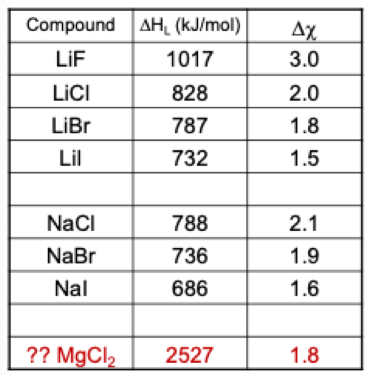

# Lattice Energy

* Allows for estimation of the chemical/physical properties of the solid {: style="width: 30%; "class="right"}
  * The greater the $\Delta H^\circ _L$, the greater the melting point and the more solvation energy required to pull apart the crystal
  * Can be used as a predictor of thermodynamic stability
  * Lattice energy increases as the charges increase, as you would expect of any coulombic interaction, however this is also explained by the increased ionisation energy and electron affinity as you strip off more and more electrons

!!! note
	
	Ionisation energy increases as you dig deeper into the $e^−$ configuration, so the resulting lattice will be stronger
	
	$$
	\begin{gather}
	\ce{Mg->Mg+ + e−}\hskip{2cm}\Delta H^\circ=738\:kJ\cdot mol^{−1)}\\
	\ce{Mg->Mg2+ + 2e−}\hskip{1.5cm}\Delta H^\circ=1450\:kJ\cdot mol^{−1)}
	\end{gather}
	$$

* Is defined as the  change in energy that occurs when an ionic solid is separated into gas-phase ions
  * E.g. $\ce{NaCl_{(s)}->Na_{(g)}+ + Cl_{(g)}−}$
  * This is because the binding forces of atoms are only completely diminished when they are in gas phase
* It cannot be directly measured, but instead can be calculated, using the following methods:
* There is a strong correlation between $\Delta\chi$ and $\Delta H^\circ _L$

## Coulomb's Law

* Uses the forces of two interacting point charges
* Written as:

$$
v=\frac{e^2}{4\pi\varepsilon_0}\frac{z_+z_−}{r}
$$

Where:

* $v=$ Energy
* $e=1.6022\times10^{−19} C$
* $4\pi\varepsilon_0=1.112\times10^{−10} C\cdot (J m)^{−1}$
* $z_+$  and $z_−=$ integer charge of the anion
* $r=$ distance between the atomic nuclei ($\ce{NaCl}=102\:pm+181\:pm$) based on atomic radii

## Born-Lande Equation

* Accounts for some other chemical factors and is a true theoretical estimate for $\Delta H^\circ _L$
* Written as:

$$
E=\frac{N_AMz^+z^−e^2}{4\pi\varepsilon_0r_0}\bigg(1−\frac{1}{n}\bigg)
$$

Where:

* $E=$ Energy
* $N_A=6.022\times10^{−23}$
* $M=$ Madelung constant (geometry of the crystal)
* $e=1.6022\times10^{−19} C$
* $4\pi\varepsilon_0=1.112\times10^{−10} C\cdot (J m)^{−1}$
* $z_+$  and $z_−=$ integer charge of the anion
* $r=$ distance between the atomic nuclei ($\ce{NaCl}=102\:pm+181\:pm$) based on atomic radii
* $n=$ born exponent (integer between 5-12)

## Kapustinskii Equation

* Used as an approximation to the Born-Lande equation
* Written as:

$$
V=−K\frac{v|z^+||z^−|}{r_++r_−}\bigg(1−\frac{d}{r_++r_−}\bigg)
$$

Where:

* $V=$ Energy
* $v=$ number of ions in the empirical formula ($v=2$ for $\ce{NaCl}$)
* $K=1.2025\times10^{−4}  J\cdot m\cdot mol^{−1}$
* $d=3.45\times10^{−1})  m$
* $z_+$  and $z_−=$ integer charge of the anion
* $r_+$ and $r_−$= atomic radii of the ions

## Born Haber Cycle

* You can also use Hess' Law to calculate $\Delta H^\circ _L$  by building the thermochemical equation from other equations
* Each step in the cycle refers back to a known property, such as electron affinity
E.g.

|                    Vaporising the lithium                    | $\ce{Li_{(s)}->Li_{(g)}}$ | $\Delta H_1^\circ=115.2 \:kJ\cdot mol^{−1}$ |
| :----------------------------------------------------------: | ------------------------------------------------------------ | ------------------------------------------------------------ |
|  Dissociate the fluorine to produce non bonded fluorine gas  | $\ce{1/2 F2_{(g)}->F_{(g)}}$  | $\Delta H_2^\circ=75.3 \:kJ\cdot mol^{−1}$ |
| Ionise the lithium gas to create the lithium cation (Ionisation  energy) | $\ce{Li_{(g)}->Li_{(g)}+ + e−}$  | $\Delta H_1^\circ=520.0 \:kJ\cdot mol^{−1}$ |
| Ionise the fluorine gas to create the fluoride anion (electron  Affinity) | $\ce{F_{(g)} + e− -> F_{(g)}−}$ | $\Delta H_1^\circ=-328\:kJ\cdot mol^{−1}$ |
|                       Form the lattice                       | $\ce{Li_{(g)}+ + F_{(g)}− -> LiF_{(s)} }$ | $\Delta H_1^\circ=-976.6\: kJ\cdot mol^{−1}$ |
|                        Total equation                        | $\ce{Li_{(s)} + 1/2F2_{(g)} -> LiF_{(s)}}$  | $\Delta H_1^\circ=-594.1\: kJ\cdot mol^{−1}$ |

### Method 1: Form the solid and rearrange
$$
\begin{gather}
\ce{Li_{(s)} + 1/2F2_{(g)} + Li_{(g)} + F_{(g)} + e- + Li_{(g)}+ + F_{(g)}- ->\\ Li_{(g)} + F_{(g)} + Li_{(g)}+ + e− + F_{(g)}− + LiF_{(s)}}
\end{gather}
$$

$$
\begin{align}
\Delta H_1^\circ+\Delta H_2^\circ+\Delta H_3^\circ+\Delta H_4^\circ+\Delta H_5^\circ &=\Delta H_{total}^\circ\\
$\Delta H_1^\circ+\Delta H_2^\circ+\Delta H_3^\circ+\Delta H_4^\circ−\Delta H_{total}^\circ &=−\Delta H_5^\circ\\
115.2+75.3+520.0−328+594.1&=−x\\
x&=−976.6
\end{align}
$$

### Method 2: Calculate the lattice energy by building the equation:

$$
\begin{gather}
\ce{F_{(g)}− + F_{(g)} + Li_{(g)}+ + e− + Li_{(g)} + Li_{(s)} + 1/2F2_{(g)} ->\\ LiF_{(s)} + Li_{(s) } + Li_{(g)} + 1/2F2_{(g)} + F_{(g)} + e−}
\end{gather}
$$

$$
\begin{align}
\Delta H_{total}^\circ−\Delta H_1^\circ−\Delta H_2^\circ−\Delta H_3^\circ−\Delta H_4^\circ &= \Delta H_5^\circ\\
−594.1−115.2−75.3−520.0+328&=−976.6
\end{align}
$$