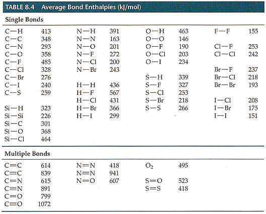
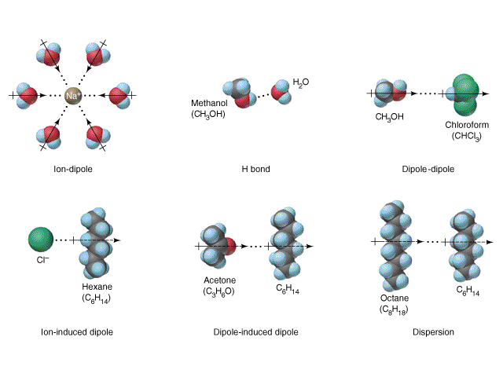
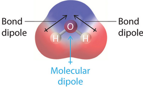
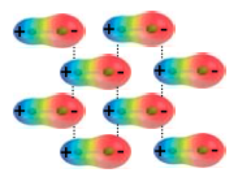

# Covalent Bonding

* Is a bond in which bonding atoms share $\ce{e−}$, rather than transferring them
  * One $\ce{e−}$  from each bonding atom is contributed, with more $\ce{e−}$  changing the properties/bond number/BO
* AOs are distorted into a shape which will allow them to contribute to both nuclei
* Can be defined by $\Delta\chi>2$, however this has the same issues as ionic bonding in that bonding character is not binary
* Covalent compounds (molecules) are held together by intramolecular forces
* Typically a bond that occurs between non-metals
  
  * H can both ionically and covalently bond

## Bond Enthalpy ($\Delta H^\circ$)

* The energy required to break a particular bond in 1 mol of **gaseous molecules**
  * The molecules have to already be in a gaseous state, otherwise intermolecular forces will contribute to stabilising the bond, increasing the energy {: style="width: 30%; "class="right"}

* Bond energies can be directly measured for diatomic molecules, as it can be related to the thermal decomposition of the molecule itself
* The more bonds (double, triple), the stronger the bond energy
Can also be effected by the size/$\Delta\chi$ of the atoms involved

## Reactions

* When a reaction occurs:

$$
\Delta E=\sum \text{ bonds broken }−\sum\text{ bonds formed}
$$
						
* E.g. $\hskip{1cm}\ce{2H2_{(g)} + O2_{(g)} -> 2H2O{(l)}}\hskip{2cm}\Delta H=−483.6\:kJ\cdot mol^{−1}$
  * In this reaction, the bonds of 2 moles of $\ce{H2}$  and 1 mole of $\ce{O2}$  are broken
  * However two H-O bonds are formed
  * The excess of energy released causes the exothermic reaction
  * Using the standard bond enthalpies table, this is estimated at $\sim−450\:kJ\cdot mol^{−1}$

## Types of covalent bonds

* Covalent bonds can either be polar or none polar
* Non polar bonds equally share their electrons between the two atoms and only really happens in homodiatomic molecules
* Polar bonds do not share electrons equally, which is typically based on $\Delta\chi$

## Types of intermolecular forces

{: style="width: 50%; "class="center"}

| **Bond Type**          | **Energy ($kJ\cdot mol^{-1}$)** |
| ---------------------- | ------------------------------- |
| Dispersion             | 0.05-40                         |
| Dipole-induced  dipole | 2-10                            |
| Ion-induced  dipole    | 3-15                            |
| Dipole-dipole          | 5-25                            |
| H-Bond                 | 10-40                           |
| Ion-Dipole             | 40-600                          |
|                        |                                 |
| **For Comparison**     |                                 |
| Covalent  bond         | 150-1100                        |
| Ionic  bond            | 400-4000                        |

## Dipole Moment (unit: Debye) 

* A dipole moment is a charge difference, based on the distribution of an electron cloud{: style="width: 30%; "class="right"}
* It  consists of two point charges and is a vector quantity (both magnitude and direction)
* This  can be over the entire molecule, or just between individual bonds

## Dipole-dipole forces 

* Are simple electrostatic forces between molecules that help them stick together {: style="width: 30%; "class="right"}

## Induced dipoles

* Since dipoles have a charge, they can interact with $\ce{e−}$  of non polar compounds
* This can distort their $\ce{e−}$ distribution enough to form a temporary dipole of their own
* This can also happen with ions, causing a stronger dipole to be formed, since an ionic charge is a full, formal charge, instead of a partial dipole charge

## H-bonds

* Are just particularly strong dipoles and occur when a particularly electronegative atom with lone pairs interacts with a hydrogen atom

## Dispersion forces

* Dispersion forces are the weakest of all the bonding forces, but can be the only thing keeping a nonpolar species intact (pentane, liquid gasses)
* Since atoms are not uniformly charged, even non charged, inert species can influence the $\ce{e−}$ distibution around them. This minute, momentary interaction can cause a tiny dipole to exist, that can create a tiny dipole in surrounding atoms that will allow for intermolecular attraction to exist
* They exist between all particles, but are almost always overshadowed by other forces
* The presence of dispersion forces can be effected by:
  * The polarizability  of the compound (how easily the electrons can move around)
    * Increases with molecular weight and atomic radii
  * The size of the molecule (larger molecules allow electrons to move more freely, allowing them to build up on one side of the molecule)