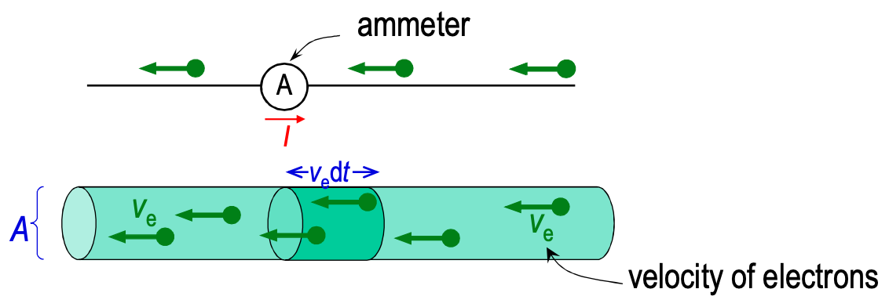
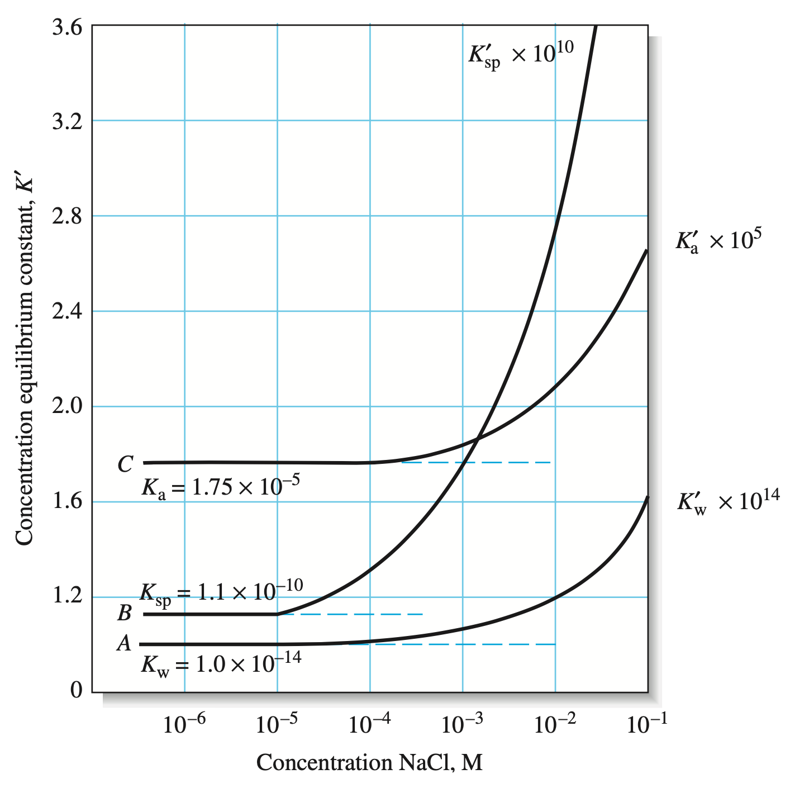
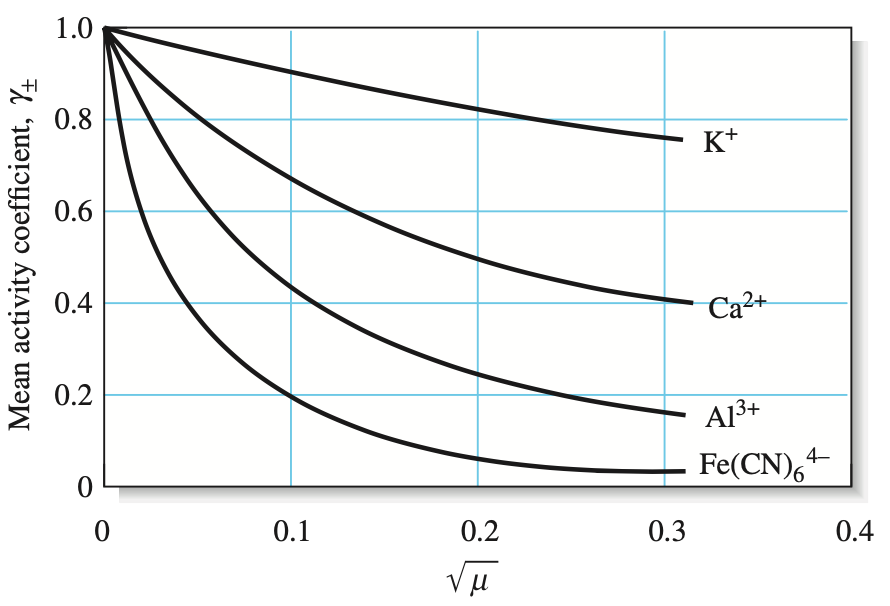
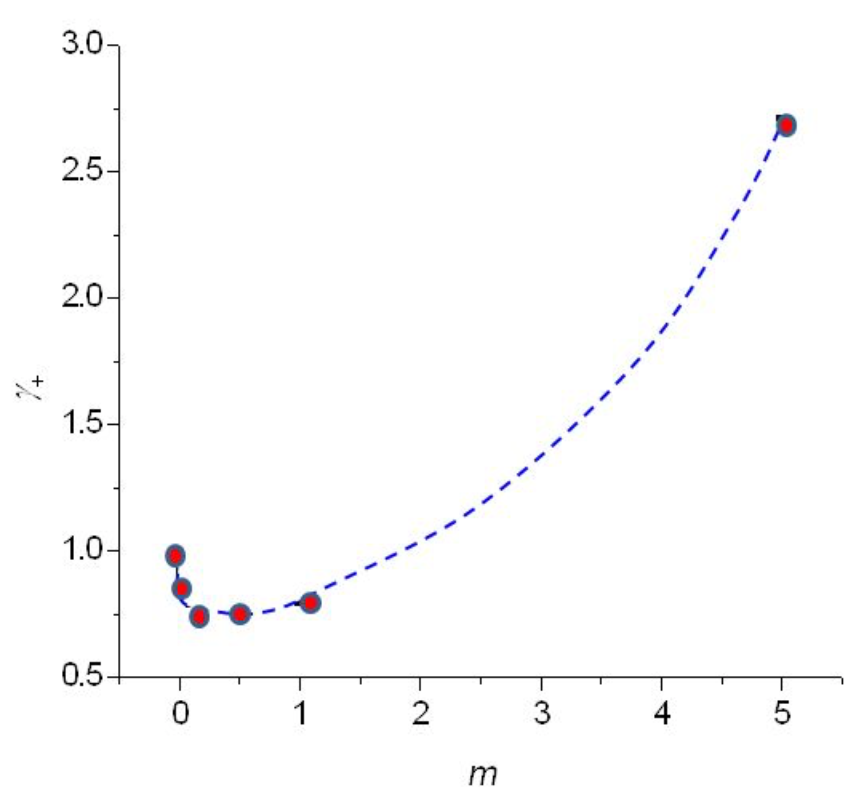

#  Electrochemistry

Electrochemistry is the study of the interaction of matter and electricity. This primarily revolves around electron transfer .

## Electricity

Is created by the flow of charged particles in a conductor. The quantity of electricity that is being conducted is known as the charge ($Q$) and is measured on coulombs ($c$)

Matter can be divided into three distinct categories:

* Fixed charge - Insulators
  * E.g. most plastics, glass and porcelain 
* Mobile electrons - electronic conductors
  * E.g. metals, graphite, semiconductors, $\ce{PbO2}$, polypyrrole
* Mobile ions - ionic conductors
  * E.g. Water ($\ce{H3O+, OH-}$), Seawater ($\ce{Na+, SO4^{2-}}$), $\ce{ZrO2}$ ($\ce{O2-}$)

There can also be a combination of both electrons and ions conducted in the one system, such as plasmas, $\ce{Na+_{(NH3)}/e-_{(NH3)}}$ and $\ce{H^+_{(Pd)}/e-_{(Pd)}}$

### Current

The flow rate of the charge $(I)$ is measured as current, with the units amperes ($c\cdot s^{-1}$)  and will be the same at all points in the circuit

### Potential

The flow of charge occurs due to an energy difference between two points in a conductor. While it is impossible to know the absolute charge any a point in the system, we can measure the difference over the distance. The difference  is measured in volts ($v$).

When measuring the voltage across various distances in a uniform conductor, we find that:

$$
\frac{\Delta\phi}{x}=constant
$$

And as the distance $\to0$:

$$
x\to0, \frac{\Delta\phi}{x}\to\frac{d\phi}{dx}
$$

This derivative gives us the "electric field strength" in units $V\cdot m^{-1}$

## Conductance

$$
I=\frac{dQ}{dt}=(N_Ac_i)(A)(Q_i)(V_i)
$$

* $I=$ current
* $N_AC_i=$ number of charge carriers (Concentration) per unit volume
* $A=$ cross sectional Area
* $Q_i=$ charge per carrier (atomic charge [$1.6022\times10^{-19}\:C$] $\times Z$ )
* $v_i=$ average carrier speed (voltage)

{: style="width: 60%; "class="center"}

 The current and electrons move in opposite directions

This can be simplified to:

$$
I=-AF|Z_i|u_ic_i\frac{d\phi}{dx}
$$

* $I=$ current
* $A=$ cross sectional Area
* $F=$ Faraday's constant ($96485\:C\cdot mol^{-1}$)
* $|Z|=$ magnitude of the charge on the carrier
* $u_i=$ mobility of the charge ($m^2\cdot(V\cdot s)^{-1}$)
* $C_i=$ concentration

For an ionic solution with multiple charge carriers, we can sum each one individually, noting that since we're taking the magnitude of the charge, they will all be positive terms.

$$
I=-AF\frac{d\phi}{dx}\sum_i|Z_i|u_ic_i
$$

While cations and anions will flow in opposite directions to each other, the current will flow in the direction of the cations. In metals, this means that current current flows in the opposite direction to the electrons.

### Mobility

We can measure ionic mobilities (For reference, the mobility of electrons in sliver is $0.0067\:m^2\cdot(V\cdot s)^{-1}$):

| Cation      | $\times 10^{9}(m^2\cdot(V\cdot s)^{-1})$ | Anion      | $\times 10^{9}(m^2\cdot(V\cdot s)^{-1})$ |
| ----------- | :--------------------------------------: | ---------- | :--------------------------------------: |
| $\ce{H3O+}$ | 363                                      | $\ce{OH-}$ | 205                                      |
| $\ce{K+}$   | 76                                       | $\ce{Br-}$ | 81                                       |
| $\ce{Na+}$  | 52                                       | $\ce{Cl-}$      | 79 |
| $\ce{Li+}$ | 40 | $\ce{NO3-}$ | 74 |
| $\ce{NH4+}$ | 76 | $\ce{CO3^{2-}}$ | 72 |
| $\ce{Cu^{2+}}$ | 59 | $\ce{ClO4-}$ | 70 |
| $\ce{Zn^{2+}}$ | 55 | $\ce{HCO3-}$ | 46 |
| $\ce{(C4H9)4N+}$ | 20 | $\ce{C6H4COO-}$ | 34 |

A few observations:

* $\ce{Li+}$ as a hard ion, binds to water with a much higher affinity, leading to a slower velocity
* $\ce{C6H4COO-}$ is particularly slow because it's incredibly bulky
* $\ce{H3O+}$ and $\ce{OH-}$ have such a high mobility, because the protons themselves jump, rather than the ions themselves mobilising through the solvent.

### Ohm's Law

When electricity flows through a conductor, the current density (current per unit area) is proportional to the electric field strength, through a proportionality known as the conductivity ($\kappa$)

$$
\frac{I}{A}=\kappa\frac{d\phi}{dx}
$$

In a uniform conductor, where there is a potential difference ($\Delta\phi$), we can simplify this, Where $G$ is known as the conductance, with the unit Siemens:

$$
I=G\Delta\phi
$$

| Material                  | $\kappa\text{ in } S\cdot m^{-1}$ | Charge  carrier      |
| ------------------------- | :-------------------------------: | -------------------- |
| superconductors           | $\infty$ (low temp)               | electron pair        |
| $\ce{Cu}$                 | $6.0\times10^7$                   | $\ce{e-}$            |
| $\ce{Hg}$                 | $1.0\times10^6$                   | $\ce{e-}$            |
| Graphite                  | $4.0\times10^4$                   | $\pi$-electrons      |
| Molten $KCl$              | 220 (1043 K)                      | $\ce{K+ \& Cl-}$     |
| Battery Acid              | 80                                | $\ce{H3O+ \& HSO4-}$ |
| Sea Water                 | 5.2                               | Salts                |
| $\ce{Ge}$                 | 2.2                               | Electrons and holes  |
| $0.1\:M\:\ce{KCl}_{(aq)}$ | 1.3                               | $\ce{K+ \& Cl-}$     |
| $\ce{H2O}$                | $6.0\times10^{-6}$                | $\ce{H3O+ \& OH-}$   |
| Glass                     | $3.0\times10^{-10}$               | Univalent cations    |
| PTFE                      | $1.0\times10^{-15}$               | Impurities           |
| Vacuum/Gasses             | 0                                 | None                 |

### Resistivity

Resistivity ($\rho$) is the recirocal of the conductivity:

$$
\rho\frac{1}{\kappa}
$$

Resistance ($\Omega$) is the reciprocal of the conductance:

$$
\Delta\phi=IR
$$

### Capacitance 

When a conducting path is interrupted by two conducting plates close to each other, there is an equal but opposite build up of charge on each plate. The amount of charge that is stored ($Q$) is proportional to the potential difference ($\Delta E$ and the proportionality constant is known as the capacitance ($C$) in units of Farads ($C\cdot V^{-1}$)

$$
Q=C\Delta E
$$

The permittivity ($\varepsilon$) is a measure of an insulator's ability to separate charge:

$$
C=\frac{\varepsilon A}{L}
$$

* $C=$ capacitance ($F$)
* $\varepsilon=$ permittivity of the substance ($F\cdot m^{-1}$)
* $A=$ the area of the plate ($m^2$)
* $L=$ The distance between the plates ($m$)

The dielectric constant is a ratio of the permittivity of substance, compared to the permittivity of a vacuum:

$$
D=\frac{\varepsilon}{\varepsilon_0}
$$

| Material                                      | $\varepsilon(pF\cdot m^{-1})$ | Dielectric constant |
| --------------------------------------------- | :---------------------------: | :-----------------: |
| Vacuum ($\varepsilon_0$)                      |             8.85              | 1                   |
| Air                                           |             8.86              | 1.001               |
| Mylar                                         |              28               | 3.16                |
| Glass                                         |              44               | 4.97                |
| 1,2-dichloride ethane ($\ce{ClC2H4Cl_{(l)}}$) |              92               | 10.4                |
| $\ce{H2O_{(l)}}$                              |              695              | 78.5                |
| Formamide ($\ce{HCONH2_{(l)}}$)               |              933              | 112                 |
| $\ce{BaIiO3_{(s)}}$                           |         up to 110,000         | 12,400              |

## Ionic Solutions

An electrolyte is a substance that produces ions when dissolved in solution. These increase the conductivity of the solution.

Electrolytes can be strong (fully ionise - $\ce{NaCl}$) or weak (only partially ionise - $\ce{NH3}$)

The electronuetrality principle states that it's not possible to have uneven numbers of cations and anions in solution, so the net solution charge will always be neutral. This applies to bulk solutions/continuum, but not on the scale of individual structures within the bulk.

## Electrolyte Effect (Salt Effect)

The addition of a spectator electrolyte to a solution can influence the position of equilibria within the solution. At  low concentrations, the equilibrium is constant and will behave as the thermodynamic limit would suggest.

In the figure below, we can see that as we add $\ce{NaCl}$ to various solutions, the equilibrium constant $K_x$ increases causing greater dissociation of the species in question. In the example below we have:

!!! Info
	This happens because as the concentration of spectator salts increases, there is an aggregation of counterions around the ions in our equilibria. Since the ion is shielded, the effective charge is reduced and thus less capable of recombining back into its salt, pushing the equilibria forward, and making the salt effectively more soluble.

* A - $K_w$ - Dissociation constant of water into $\ce{H+}\text{ and }\ce{OH-}$
* B - $K_{sp}$ - Dissociation of $\ce{BaSO4}$ into $\ce{Ba^{2+}}\text{ and }\ce{SO4^{2-}}$
* C - $K_{a}$ - Dissociation of acetic acid ($\ce{H3CCOOH}$) into $\ce{H3CCOO-}\text{ and }\ce{H+}$

{: style="width: 50%; "class="center"}

## Ionic Strength

Extensive studies have shown that the ability for a salt to increase equilibria constants is entirely based on the magnitude of the charge, so it is important to calculate how much charge there is in a certain amount of salt. We call this property the ionic strength ($\mu$)

We can calculate this pretty simply by adding up all the molecules, multiplying them by their charge and halving them:

$$
\mu=\frac{1}{2}\sum_iC_iZ_i^2
$$

* $C_i=$ concentration of the species
* $Z_i=$ the ionic charge of the species

This will give us a concentration ($M$) of the charges in solution.

!!! info "Example 1"
	

	$$
	1\:M\:\ce{K3PO4}: \:\mu =\frac{1}{2}[(1\:M*3)(+1)^2] + [(1\:M)(-3)^2]=6\:M
	$$

## Activity

As a result of this, we can calculate the effective concentration, called the *activity* ($a_x$), using  a conversion factor called the *activity coefficient* ($\gamma_x$)

$$
a_x=[x]\cdot\gamma_x
$$

We can use this relationship to calculate the equilibrium constant based on the active concentration ($K'_{sp}$):

$$
K_{sp}=[x][y]\cdot\gamma_x\cdot\gamma_y=K'_{sp}\cdot\gamma_x\cdot\gamma_y
$$

$K_{sp}$ must remain constant for a particular species, so all that $\gamma_i$ are doing is scaling the thermodynamic $K_{sp}$. For this reason, a $\gamma_i$ of 1 represents the thermodynamic equilibrium.

What this means is that:

$$
\begin{align}
\text{As }\mu&\to0,\\
\gamma_x&\to1\\
a_x&\to[x]\\
\text{and }K'_{sp}&\to K_{sp}
\end{align}
$$

### Calculating Activity Coefficients

The Debye-Hückel Equation is as such:

$$
-log\gamma_x=\frac{0.51z_x^2\sqrt{\mu}}{1+3.3\alpha_x\sqrt{\mu}}
$$

* $\alpha_x=$ effective diameter of the hydrated ion ($nm$)
* $z_x=$ ionic charge
* $\mu=$ ionic strength

When $\mu<0.01\:M$, this can be simplified further to:

$$
-log\gamma_x=0.51z_x^2\sqrt{\mu}
$$

We can see from this equation that the only variables in our calculation are the ionic charge, ionic strength and diameter of the hydrated atom. In practice though, the activity coefficient of a species is almost entirely dependent on the charge of the ion.

{: style="width: 50%; "class="center"}

### Mean Activity Coefficients

Due to the electronuetrality principle, it's not possible to measure individual activity coefficients, instead we have to measure the mean activity ($\gamma_\pm$) of the equilibrium process

$$
\gamma_\pm=\big(\gamma_A^m\cdot\gamma_B^n\big)^{\frac{1}{m+n}}\\
K_{sp}=[A]^m[B]^n\cdot\gamma_A^m\cdot\gamma_B^n=[A]^m[B]^n\cdot\gamma_\pm^{m+n}
$$

## At High Ionic Strength

is the ion strength ($\mu$) gets stronger, it becomes much harder to predict what the activity coefficient will do. It's possible to get a $\mu>1$, as there's just not enough water molecules to properly hydrate the ions, causing them to be effectively less shielded than standard hydrated ions.

The region at the beginning of the curve is known as the Debye-Hückel region.

{: style="width: 50%; "class="center"}