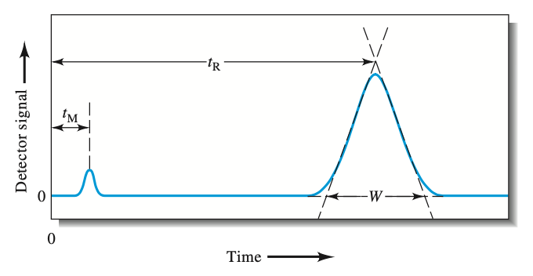
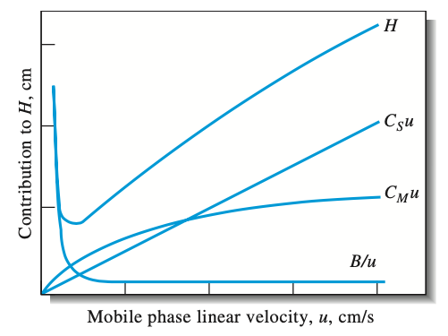
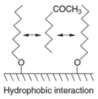
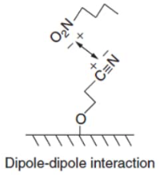
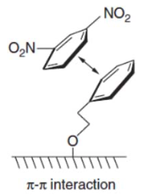
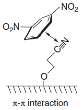
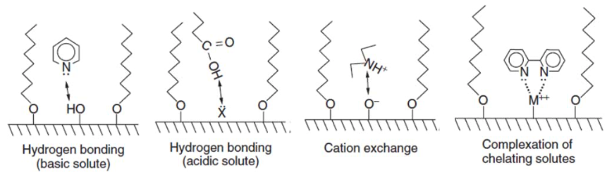
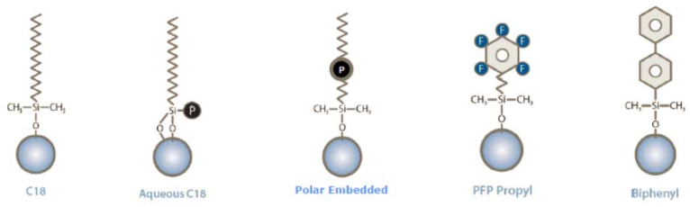
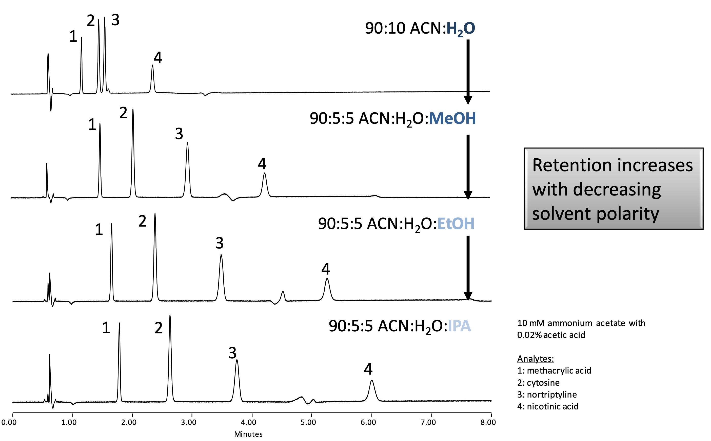
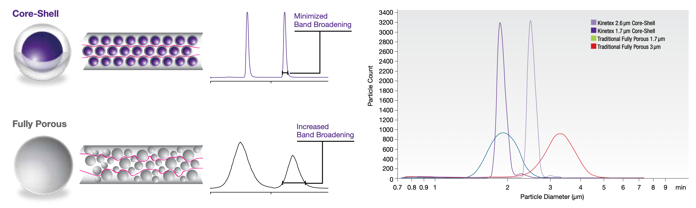

#  Advanced Chromatographic Techniques

## Recap From CHE20006

Variables:

* $t_r=$ retention time of the species
* $t_m=$ dead time before anyhthing is eluted
* $w=$ peak width

{: style="width: 40%; "class="center"}

### Retention Factor ($k$)

Is a value that can be pratically measured form a chromatogram to describe the affinity a species has to the column, based on a conditions it was measured in.
$$
k=\frac{t_r-t_m}{t_m}
$$

### Selectivity Factor ($\alpha$)

Is a comparison of retention times between peaks. It practically measures the avility of the column to separate two species and is by its nature always $>1$.

$$
\alpha=\frac{k_B}{k_A}=\frac{t_{r,B}-t_m}{t_{r,A}-t_m}
$$

### Resolution ($R$)

Is a quantitative measure of separation that not only measures the separation of the two peaks, but will measure how they are resolved to the baseline. A value of 1.5 means complete separation.
$$
R=\frac{t_{r,B}-t_{r,A}}{0.5(w_A+w_B)}=\frac{2\Delta t_r}{w_A+w_B}
$$

### Optimising Chromatographic Separation

Rearranging the resolution equation we get:
$$
R=\bigg(\frac{\sqrt{N_B}}{4}\bigg)\bigg(\frac{\alpha-1}{\alpha}\bigg)\bigg(\frac{k_B}{1+k_B}\bigg)
$$

This has the effect of separating the resolution into three different components which will be optimised in different ways

### Band Broadening - Van Deetmer Equation

A generalised equation that tries to explain why the peaks may broaden.
$$
H=\frac{B}{u}+C_Mu+C_su
$$
Where:

* $H=$ height of a theoretical plate (measure of efficiency)
* $B/u=$ longitudinal diffusion process
* $C_Mu=$ mass transfer within the mobile phase
* $C_Su=$ mass transfer between the mobile and stationary phases
* $u=$ flow rate of the mobile phase

### Efficiency vs Flow Rate

This plots each of the Van Deetmer contributions individually as well as $H$ and we can see that there is an optimal flow rate where the broadening will be the least 

{: style="width: 40%; "class="center"}

## Optimising for Selectivity Factor ($\alpha$)

To this year's chromatography, we can also modify the column to improve the selectivity of the analytes of interest. if $\alpha\approx1$ the the retention times of the two solutes are incredibly similar and modifying the other parameters might not be enough to achieve separation. We may need to consider secondary processes in the moibile phase, such as modifying the pH of ion pairing, but more simply, we might need to use a different column

### Hydrophobic Interactions

Hydrophobic interactions can be used to give nonpolar molecules a higher affinity for the column. There are two schools of thought about how this happens, one is that the molecule will interact more strongly with the surface, the other is that the solvent tries to exclude the molecule , meaning the surface is the only place the molecule can go.

{: style="width: 20%; "class="center"}

### Dipole-Dipole Interactions

Basic electrostatic attraction, important to take into account that water will be attracted as well

{: style="width: 20%; "class="center"}

### π-π Interactions

$\pi$-$\pi$ bonds stacking can be more attractive than other forces, so it can be a good way to selectively remove aromatic and double bonded components . This applicable for both aromatic solid phases and double/triple bonded phases. Naturally, acetonitrile couldn't be used with a nitrile solid phase, as the analyte wouldn't need to interact with the solid phase 

|     Aromatic     |   Non-aromatic   |
| :--------------: | :--------------: |
|  |  |

### Nonspecific Interactions

Steric hinderance on a non-polar medium is a pretty simple way of excluding larger molecules and retain smaller organic ones. These interactions can be made more specific with other surface functionality.

{: style="width: 70%; "class="center"}

### Surface Chemistry

Some typical surface compositions include:

* C18 - general purpose
* Aqueous C18 - Balanced retention with slight shape selectivity
* Polar Embedded - increased retention for acids and has symmetry for bases
* Pentafluorophenol (PFP) Propyl - increased retention for protonated bases
* Biphenyl - increased retention for hydrophilic aromatics and for conjugated compounds

{: style="width: 70%; "class="center"}

### Selectivity Factors

| Bonded phase | Hydrophobic | H-Bonding         | Dipolar  | π-π             | Steric         | Ion Exchange |
| ------------ | ----------- | ----------------- | -------- | --------------- | -------------- | ------------ |
| C18          | Very strong | Weak              | No       | No              | No             | Weak         |
| C8           | Strong      | Weak              | No       | No              | No             | Weak         |
| Amide        | Strong      | Strong acceptor   | Moderate | Weak            | Weak           | Very weak    |
| Phenyl       | Strong      | Weak Acceptor     | Weak     | Strong donor    | Strong (rigid) | Weak         |
| Cyano        | Moderate    | Weak Acceptor     | Strong   | Weak            | No             | Weak         |
| PFP (F5)     | Moderate    | Moderate Acceptor | Strong   | Strong Acceptor | Strong (rigid) | Strong       |

## Hydrophobic Interaction Liquid Chromatography (HILIC)

While it's the opposite of reversed phase (the elution order), its not normal phase. It's useful for polar or hydrophilic solutions that aren't easily separated under reversed phase conditions (if the RP phases are too non-polar for the solutes to be interested). It's similar to normal phase because it has a polar stationary phase, but it uses solvents that are common to reversed phase HPLC (typically 40-97% ACN in water). It can be chained on to an MS detector.

{: style="width: 60%; "class="center"}

The surface structure is designed such hat the a water-enriched liquid layer is formed within the stationary phase (hence the ACN never being 100%) to allow for partitioning of the hydrophilic compounds

{: style="width: 60%; "class="center"}

A good way to identify whether on HILIC will be suitable is to consider the Log P values of the molecules in question. It really is only for the most polar solutes.

{: style="width: 60%; "class="center"}

By changing the "polar modifier", the selectivity and retention of the solutes can be separated for even better.

{: style="width: 60%; "class="center"}

HILIC fills a space in the HPLC space that allows for MS to be used in a more sensitive manner

## Particle engineering

Creating particles that only have pores that are on the surface level prevents there from being a size-exclusion style increase in the path length of each solute, which would increase the band broadening. 

{: style="width: 100%; "class="center"}

Same particle size as regular HPLC means that these columns can be used with pre-existing hardware.