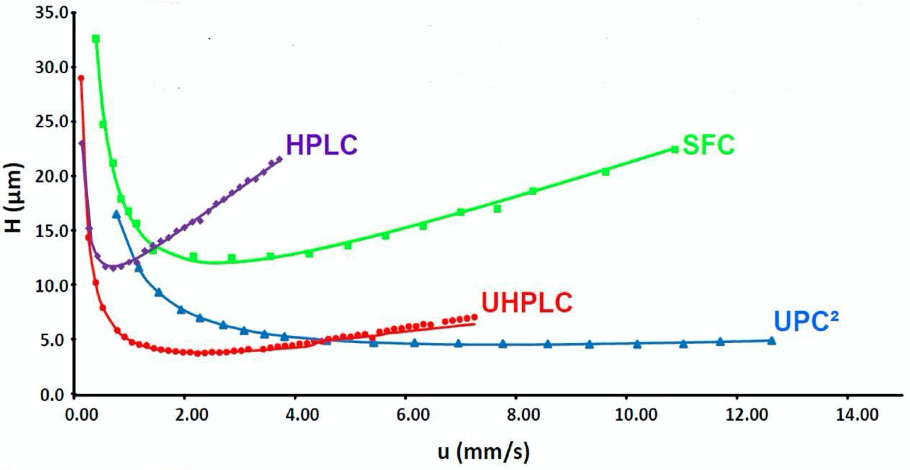
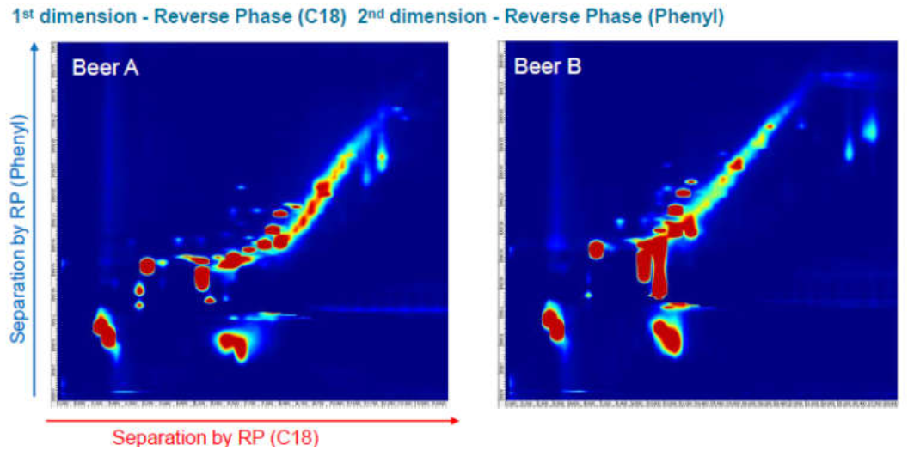
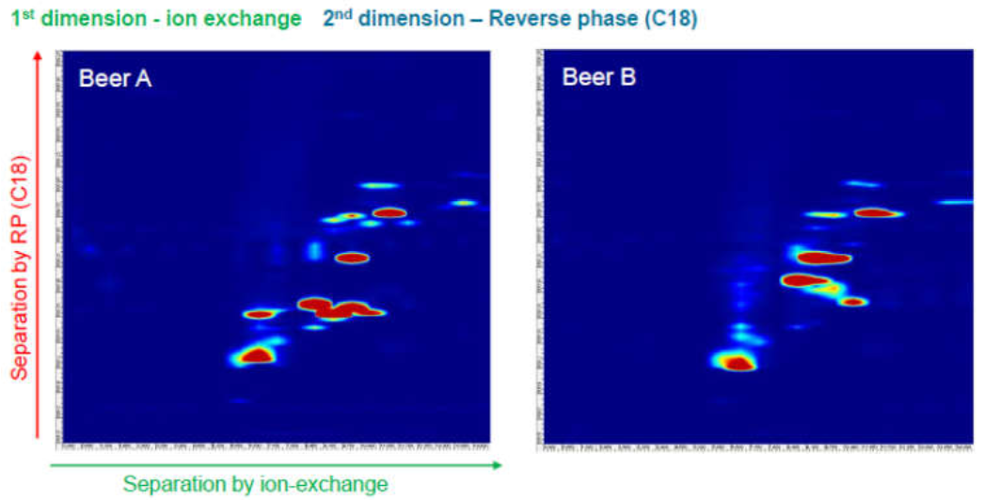
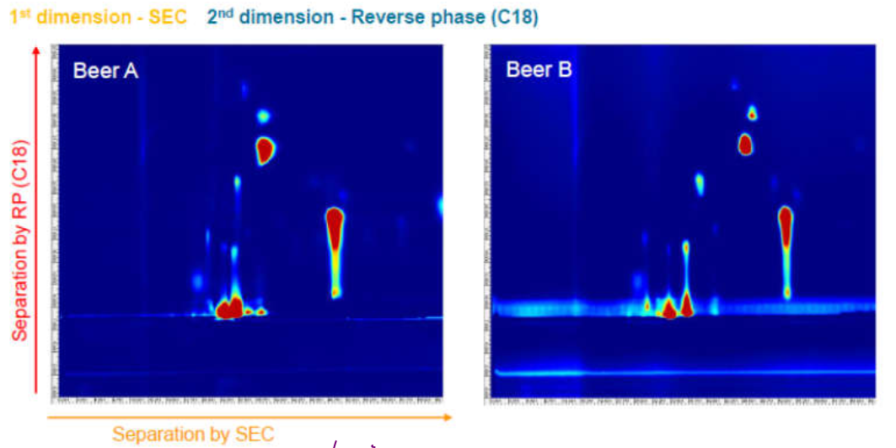
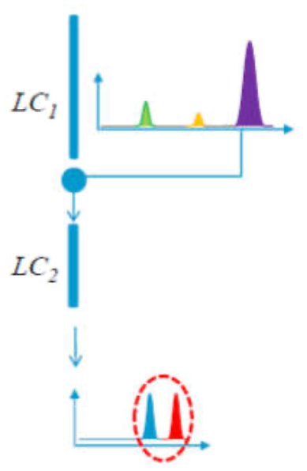
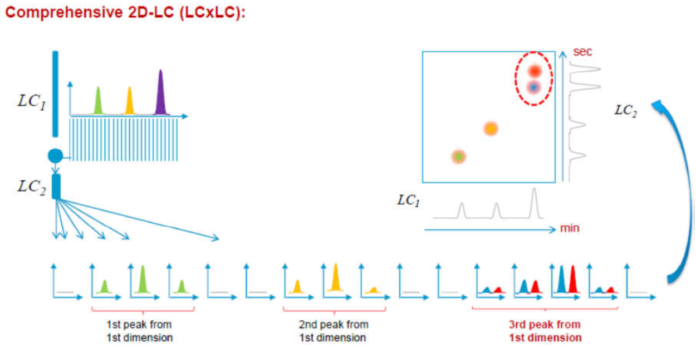
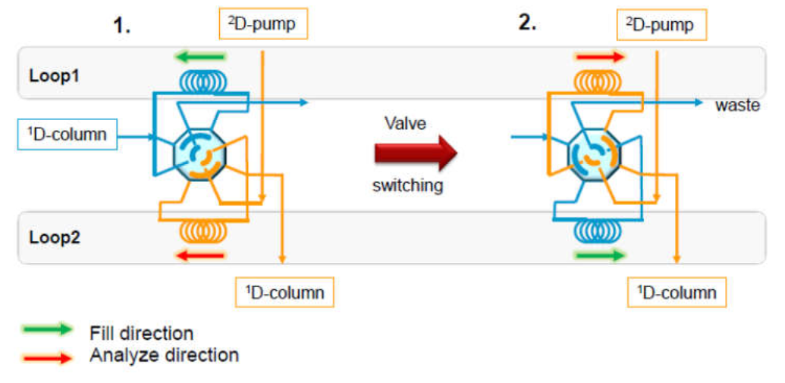
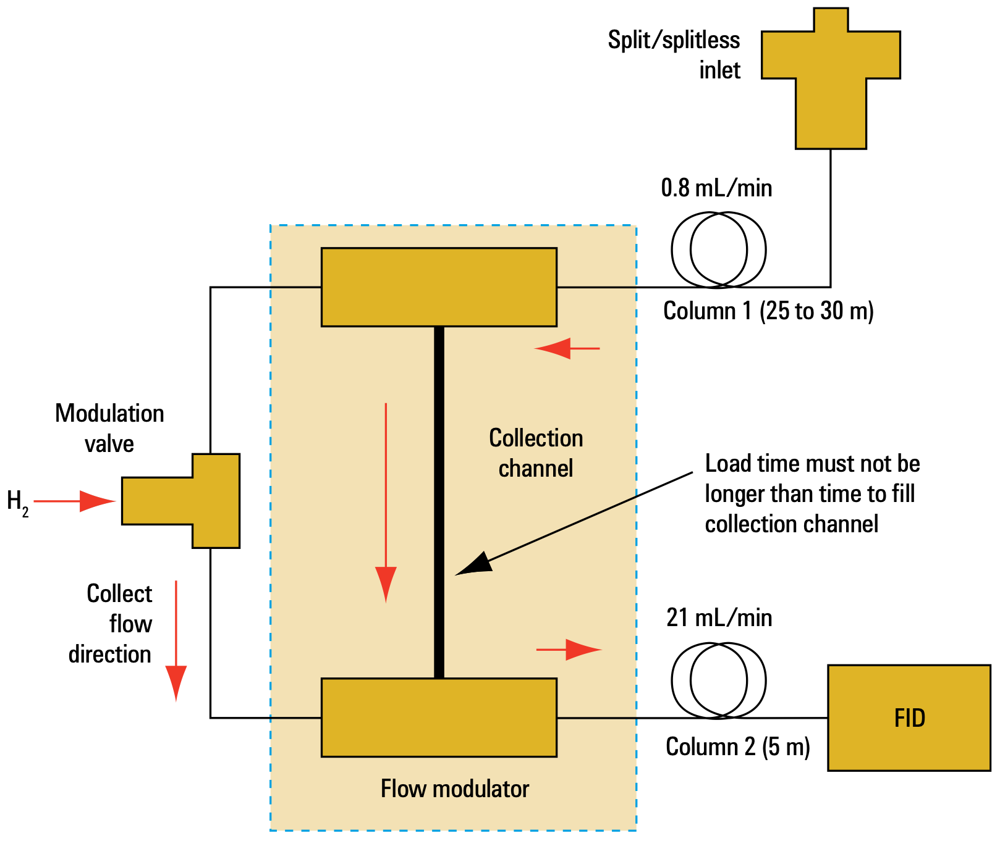
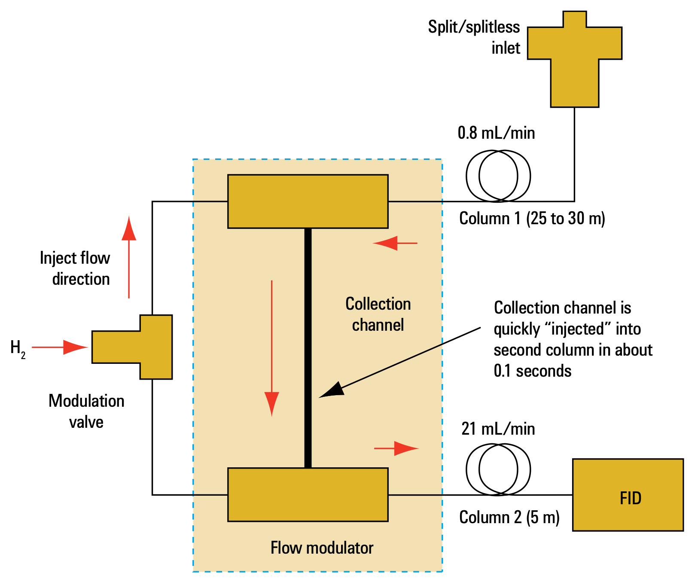
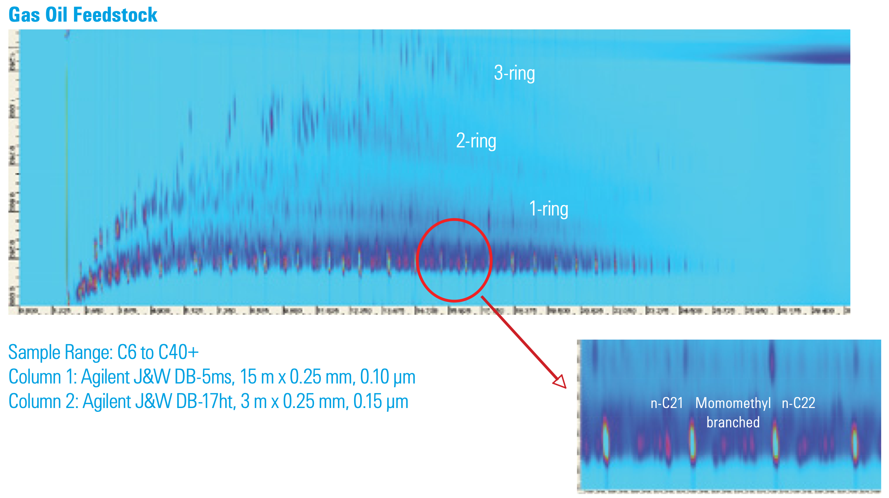

# Further Chromatographic Developments

## Ultra Performance Liquid Chromatography (UPLC)

Using the [Van Deetmer](../11a/#efficiency-vs-flow-rate) equation ($HEPT=H$ in the figure below), we can see that as the particle size decreases, the length of the plot gets flattened out and if we decrease the particle size to $<2\:\mu m$, we can effectively increase the optimum flow rate by 6-7 over standard $10\:\mu m$ HPLC and increase the efficiency (decrease $H$). This is known as UPLC.

{: style="width: 60%; "class="center"}

|                          |                   HPLC                   |                  UPLC                  |
| ------------------------ | :--------------------------------------: | :------------------------------------: |
| Invention Date           |                  1970s                   |                  2004                  |
| Particle size ($\mu m$)  |                $10/5/3.5$                |                 $1.7$                  |
| Column formats ($mm$)    | $4.6\times200/2.1\times150/1.0\times100$ | $2.1\times150/2.1\times50/1.0\times50$ |
| Pressures ($psi$)        |         $1000-3000$ ($6000$ max)         |       $2000-14000$ ($15000$ max)       |
| Gradient runtime ($min$) |                    45                    |                  4.5                   |

This has the advantage of being MUCH faster (~x10), with a much higher efficiency and as a result uses ~x10 less solvent . in the figure below we can see that the chromatogram is almost identical to HPLC, it's just significantly contracted.

{: style="width: 60%; "class="center"}

### Disadvantage

Using the equation below, we can see that as the flow rate $F$ increases and $d$ decreases, there will be a massive increase in $\Delta P$

$$
\Delta P\propto\frac{\eta FL}{r^2d^2_p}
$$

This essentially means that you need better pumps and often time a better mechine in general to be able to use a UPLC column.

## Multi-Dimensional Chromatography

Since fields such as proteomics[^1] and metabolomics[^2] require the identification of all the components in a sample, a single HPLC run may not actually be enough to resolve all of the peaks. What we can do then is to run HPLC in two dimensions to create a 2D Chromatogram heat-map. This is best implemented when the two axes are performed using different columns, though it could be as drastic as a complete phase inversion (with compatible mobile phase).

The chromatograms are similar in effect to 2D COSY, in that any peaks that appear on the diagonal are separated with equal efficiency by the two columns.

[^1]:The study of the structure and function of proteins
[^2]:The systematic study of metabolites generated or consumed in a metabolic process

{: style="width: 60%; "class="center"}

{: style="width: 60%; "class="center"}

{: style="width: 60%; "class="center"}

### Comparison of the two Columns

The first dimension should have a longer run time and should provide maximum separation of the solutes. The second dimension should be completed within the run time of the first dimension.

The Initial sample concentration needs to be quite high and the detector must be highly sensitive, as large dilution will occur throughout the process. The mobile phases of the two dimensions  must be compatible with each other

### Sampling Methods

### Heart Cutting Method

This is the most simple method and essentially just picks a time at which a sample is taken at a single point in the first run and is run through a second column. This doesn't produce a full 2D spectrum, but instead just separates a single peak into multiple peaks. It requires you to know the retention time of the peak that you're trying to analyse further.

{: style="width: 20%; "class="center"}

### Comprehensive Method

This method is far more complex and essentially takes samples (fractions) from the output of the first dimension and runs each one through the second dimension. As such, the time of the second dimension MUST be shorter than the first.

{: style="width: 70%; "class="center"}

### Switch

To prevent the entire contents from the first column going through the second column, a multi port valve that allows the contents of the loop to be transferred using the pumps of the respective columns. Buy changing the flow direction of the looop during the swiching process, band broadening can be reduced.

{: style="width: 60%; "class="center"}

### Multi-Dimensional GC

We can use 2D chromatography for GC as well, quite often with even more simple setups. Since GC is also much faster than HPLC, it's easy to ensure that the second column has a sufficient flow rate.

There are a few different switching mechanisms that are used. This one collects the sample in a collection tube than when the valve is flipped, can be injected into the second column before being detected.

|        Load        |        Elute         |
| :----------------: | :------------------: |
|  |  |

As you can see in the image below, the second dimension gives us much higher resolution, and allows us to be able to separate complex solutions that would otherwise be nearly impossible to separate.

{: style="width: 60%; "class="center"}

## Evaporative Light Scattering Detector (ELSD)

For universal analyte detection, refractive index used to be the go-to method for detection, though it's since been superseded by ELSD, as it's not dependent on the spectral properties of the solutes and is significantly more sensitive (x10-x100).

{: style="width: 60%; "class="center"}

It's uses a three step process to identify solutes:

#### 1. Nebulising the Eluent

The eluent form the chromatography column is sprayed into the tube with $\ce{N2}$ to generate an aerosol. Small droplets are light enough to travel into the evaporation chamber, while larger droplets sink and are transferred to waste.

{: style="width: 50%; "class="center"}

#### 2. Evaporation of the droplets

The aerosol is heated to $30-60^\circ$ to evaporate the solvent and leave a solid aerosol of the solutes. The small droplet sizes allow for the solvent to be evaporated at low temperature and prevent the thermal decomposition of the solutes.

{: style="width: 50%; "class="center"}

#### 3. Detection of the solutes

The sample is detected by focusing the flow of the solid aerosol through a light beam and measuring how much of the light is scattered. This will be directly proportional to the amount of solid that passes through the beam.

{: style="width: 50%; "class="center"}