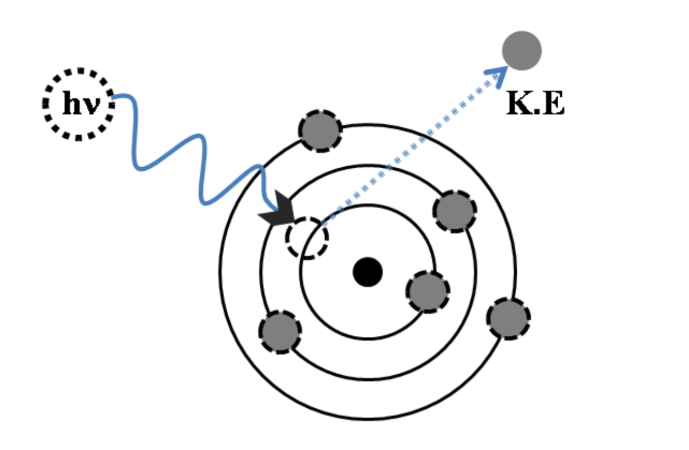
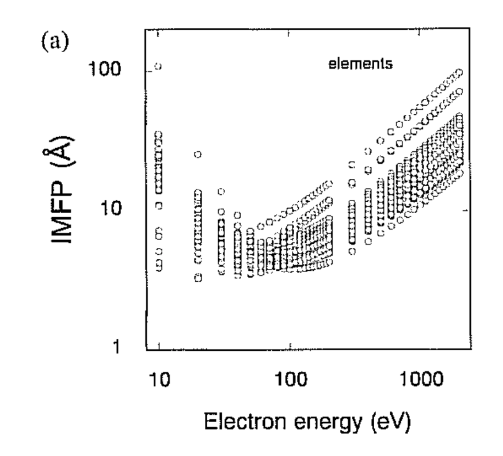
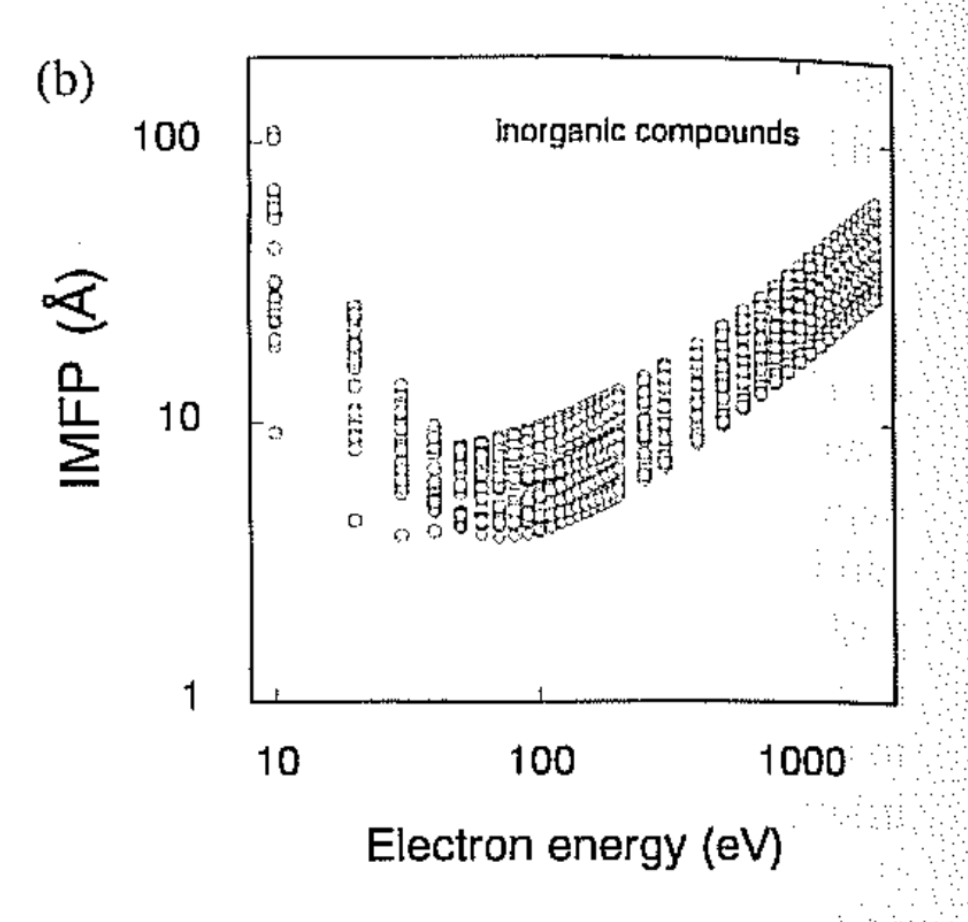
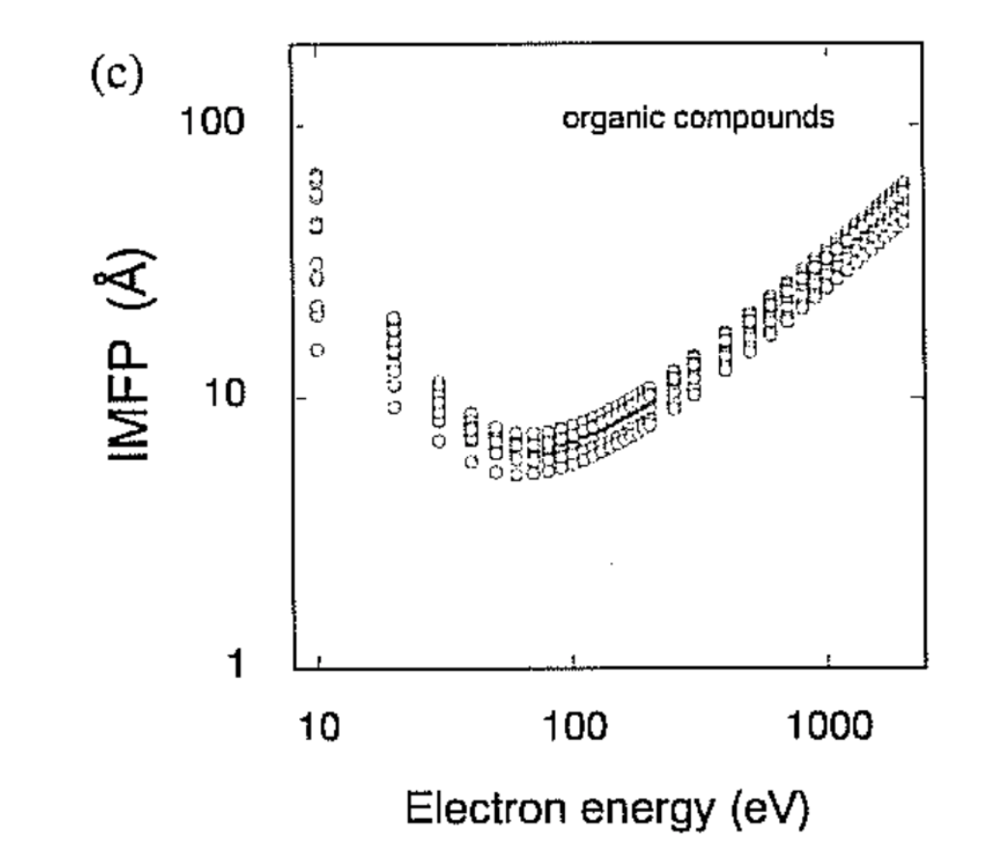
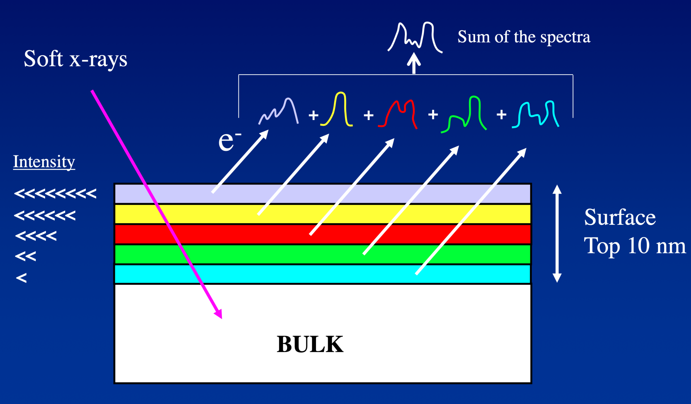
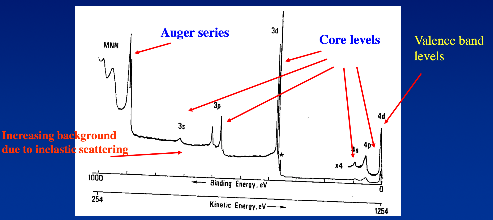
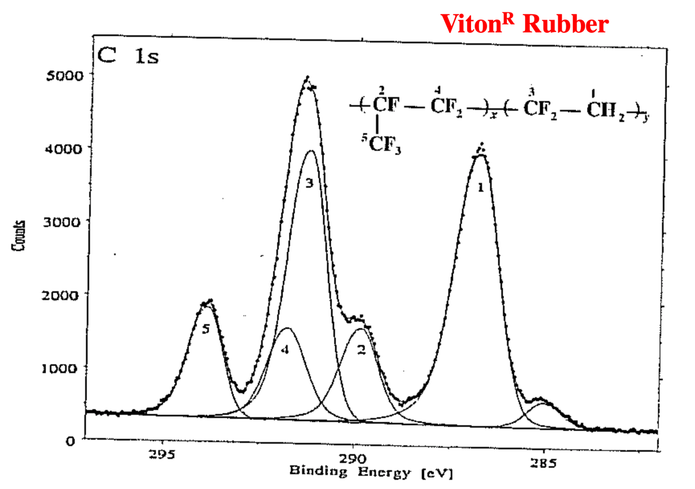
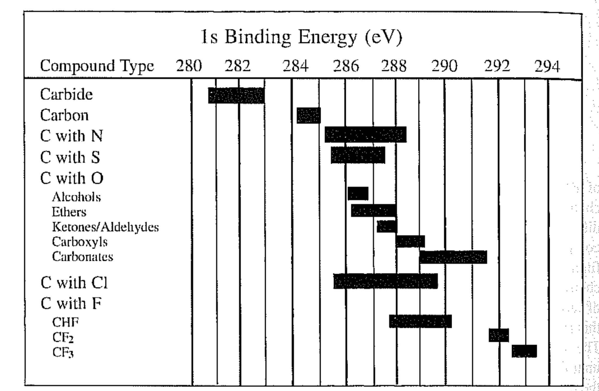
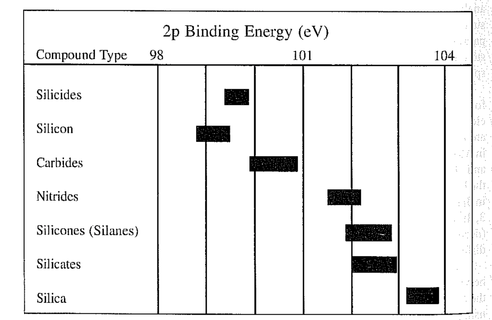

# X-ray Photoelectron Spectroscopy (XPS)

XPS is a useful tool that can tell us a whole lot about the properties within the top $100\:\AA (10\:nm)$ of the surface, such as:

* Identification of all elements (except hydrogen and helium)
* Surface concentrations of elements
* Bonding state (molecular environment/oxidation state) of most atoms in the surface 
* The incident angle can be changed to change the depth that the technique will sample to
* The surface can be scanned with XPS to obtain the composition as a 2D image
* For organic surfaces, a laser can be pulsed (to vaporise the top layers) and readings taken, to profile the depth of the surface
* Surface derivitisation can be used to further differentiate between specific, similar functionalities

## The Principles (Photoelectric)
{: style="width:30%; "class="center"}

The surface of a sample is bombarded with soft x-rays (low energy) which will penetrate many microns into the sample, causing electrons to be knocked out of their orbital and to have a resulting kinetic energy relative to their orbital energy (photoemission). This kinetic energy it's what left from the incoming x-ray energy, as shown in the equation:
$$
E_K=h\nu-E_B^F-\phi_{sp}
$$

Where:

* $E_K=$ measured kinetic energy of the emitted electron (ejected)
* $h\nu=$ energy of the exciting x-ray photon (source)
* $E_B^F=$  elctron binding energy (BE) of the samples, relative to the fermi level (defined as $E_F=0$)
* $\phi_{sp}=$ work function of the spectrometer (typically $4.5\:eV$)

As a result, we want to know the binding energy, as it will be specific to the electron in the specific orbital, in the specific atom, as with spectroscopy. 

## XPS Schematic

{: style="width:50%; "class="center"}

## Elemental Analysis and Quantification

In a simple case, the relative atomic concentrations of an element is given by:

$$
C_A=\frac{\frac{I_A}{S_A}}{\sum_n\bigg(\frac{I_n}{S_n}\bigg)}
$$

Where:

* $C_A=$ the atomic percentage
* $\frac{I_A}{S_A}=$ intensity of A (number of electrons coming from A) over the sensitivity of A (Read below about $S_n$)
* $\sum_n\bigg(\frac{I_n}{S_n}\bigg)=$ sum of the intensities of each atom over the sensitivities of each atom

$S_n$ is directly related to the photoemission cross-section ($\sigma$) and can vary by a factor of 100 across the periodic table. Detection limits are typically $0.1$ atom $\%$

## Surface Sensitivity of XPS

Due to the low probability that electrons generated below the surface will leave the sample and be detectable, there is a certain surface sensitivity, that was initially thought to obey the beer lambert law (inelastic scattering)

$$
\begin{align}
I_z&=I_0\exp\bigg(\frac{-z}{\lambda\sin\theta}\bigg)\\
\lambda&=\frac{-z}{\sin\theta\ln\bigg(\frac{i_z}{I_0}\bigg)}
\end{align}
$$

Where:

* $z=$ depth of the atoms that are ejecting electrons
* $I_z=$ intensity of electrons emanating from depth $z$
* $I_0=$ intensity of the electrons from surface atoms
* $\sin\theta=$ electrons "take off" angle (with respect to the surface plane)
* $\lambda=$ electron inelastic mean free path (IMFP) - the average distance travelled between inelastic collisions for an electron

|   Elemental solids   | Inorganic compounds  |  Organic compounds   |
| :------------------: | :------------------: | :------------------: |
|  |  |  |

## XPS Escape Depth

The intensity of the signal decays exponentially as a function of depth and so the escape depth is defined as the depth which the intesntiy drops to $1/e\:(36.8\%)$ of its original depth. This translates to $95\%$ of the signal coming from within the escape depth.

For $\lambda_{AL}$ and take off angle $\theta$, the escape depth is
$$
d=\lambda_{AL}\sin\theta
$$
With a resulting "probe depth"of  $3d$

The IMFP also increases as the energy of the x-ray source increases, increasing the resulting escape and probe depth

{: style="width:60%; "class="center"}

## The XPS Spectrum

The XPS spectrum looks something like this, with each atom's core levels being ordered by their energy

{: style="width:70%; "class="center"}

The Auger peaks are created form a secondary process and can help with identifying your species, if there's overlap in the primary peaks.

## Chemical States in XPS

Different chemical environments around an atom result in BE differences or "chemical shifts". The simple "Charge potential" model relates BE to the atomic charge:

$$
E_i=E_i^0+kq_i+eV_i
$$

Where:

* $E_i=$ BE of atom $i$
* $E_i^0=$ a reference energy
* $k=$ constant
* $q_i=$ charge on atom $i$
* $V_i=\sum_{i \neq j}\frac{q_i}{r_{ij}}$ (sums the potential at atom $i$ due to the point charges on $j$)

For two atoms in different chemical environments:

$$
\Delta E_i=k\Delta q_i+e\Delta V_i
$$

$\Delta V_i$ is relatively small and electronegativity effects dominate $\Delta q_i$, so an increase in positive charge (deshielding) results in an increase in BE

## Chemical Shifts

This behaves very similarly to NMR, however we have to deconvolute the spectrum. Much like NMR, we can integrate the peaks to determine the amount of electrons that reside in that chemical environment, and we can compare the BE to tables to determine the specific functionality.

{: style="width:70%; "class="center"}

## Reference Table Examples

{: style="width:70%; "class="center"}

{: style="width:70%; "class="center"}