# XPS Continued

## Elemental Analysis

To perform elemental analysis, we first start with an overview spectrum

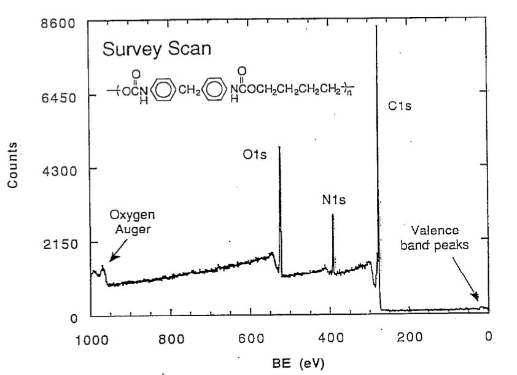{: style="width:50%;" class="center"}

We then use the [elemental analysis and quantification equation](../10b/#elemental-analysis-and-quantification) to calculate the relative abundance of each atomic species, integrating to get the electron count per peak (just like in NMR). For this we need to use $\sigma$ as scaling factor which accounts for the cross section of the orbital.

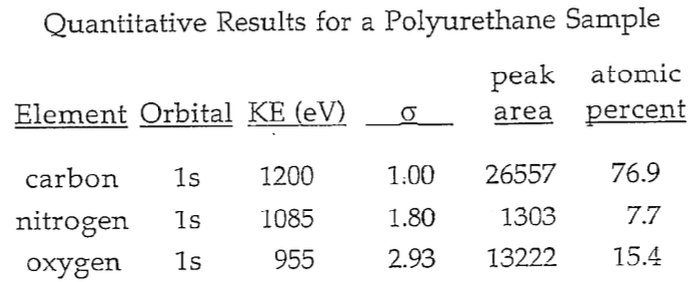{: style="width:40%;" class="center"}

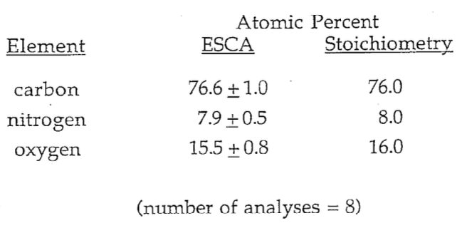{: style="width:40%;" class="center"}

When we zoom in on the peaks, we can see that there is one form of nitrogen

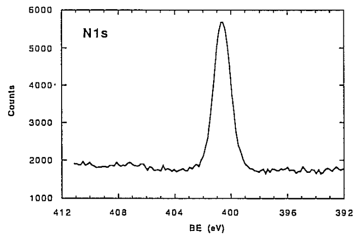{: style="width:40%;" class="center"}

Two forms of oxygen

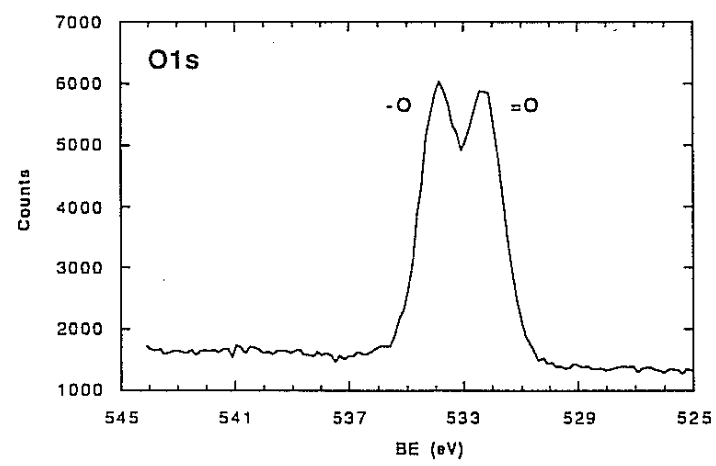{: style="width:40%;" class="center"}

And three forms of carbon, with a "shake up satellite" indicating a double bond. $\ce{C-O}$ and $\ce{C-N}$ tend to be indistinguishable without extremely high resolution XPS.

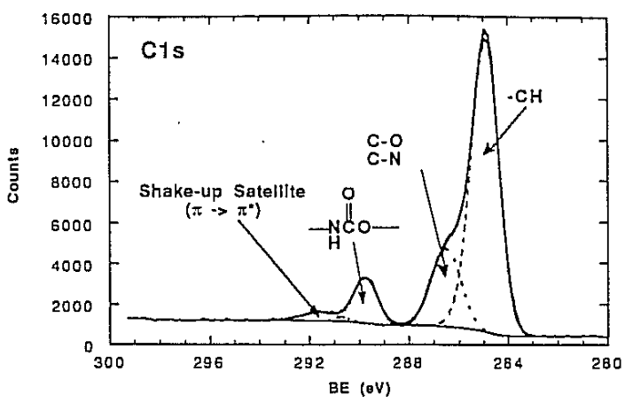{: style="width:40%;" class="center"}

## Case Study - Protein Adsorption Semi Quantitation

In this example, a thin film of a nitrogen was plasma polymer deposited on a Teflon surface. Since the probe depth is a finite value, as the concentration of the proteins in solution is increased, they adsorb in a thicker layer on the surface, leading to the probe depth comprising more of the nitrogen of the surface layer, (from the proteins) and less of the Teflon fluorine.

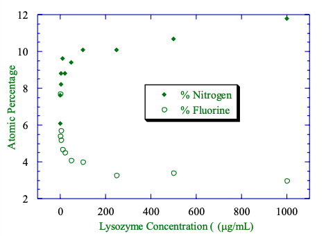{: style="width:50%;" class="center"}

## Determining the Layer Thickness

To determine how thick the layer is, we can use a derivation of the [sensitivity equation](../10b/#surface-sensitivity-of-xps), to measure the thickness of layer $A$ on top of bulk $B$:

$$
\begin{gather}
I_A=I_A^\infin\bigg[1-\exp\bigg(\frac{-d}{\lambda_A\sin\theta}\bigg)\bigg]\\
I_B=I_B^\infin\exp\bigg(\frac{-d}{\lambda_B\sin\theta}\bigg)
\end{gather}
$$

Where:

* $I_A$ and $I_B=$ measured intensities 
* $I_A^\infin$ and $I_B^\infin=$ intensities for bulk $A$ and $B$ under the same conditions
* $\lambda_A$ and $\lambda_B=$ IMFP for the core electrons of $A$ and $B$ travelling through $A$
* $d=$ thickness of the overlayer

The IMFP (or attenuation length - AL) is a function of the kinetic energy and are critical for using XPS quantitatively.

## Calculating the Thickness and Coverage of an Overlayer

!!! note
	For all of these equations, $\sin\theta$ and $\cos\theta$ are chosen based on the angle of detection to the sample. This value will be different for different ion sources.
$$
\begin{gather}
\frac{I}{I_\infin}=1-\exp\bigg(\frac{-d}{\lambda_B\sin\theta}\bigg)\\
-d=\lambda\cos\theta\ln\bigg(1-\frac{I}{I_\infin}\bigg)
\end{gather}
$$

Where:

* $I=$ intensity of the electrons coming from the overlayer
* $I_\infin=$ intensity of the electrons coming form an infinitely thick (bulk) sample of the overlayer
* $d=$ thickness of the overlayer
* $\theta=$ electron take off angle (with respect to the surface plane)
* $\lambda=$IMFP (average distance travelled between inelastic collisions for an electron)

!!! info "Example 1"
	Silicone oil (called poly(dimethylsiloxane)) is a common contaminant on surfaces. It contains carbon, oxygen, and silicon atoms in the ratio of 2:1:1. A PET bottle was found to have silicone contamination when analysed by XPS. The XPS elemental composition of the contaminated PET was determined to be 59%C, 22%O and 19% Si. Pure PET is 72% C, 28% O. The IMFP of Si 2p photoelectrons is 3nm and the sample was analysed at zero degrees to the normal. How thick is the layer of silicone contamination on the PET surface?
	

	$$
	\begin{align}
	-d&=\lambda\cos\theta\ln\bigg(1-\frac{I}{I_\infin}\bigg)\\
	&=(\color{blue}{3\:nm}\color{black})(\color{purple}{0^\circ}\color{black})\ln\bigg(1-\frac{\color{red}{19\:\%}}{\color{green}{25\:\%}}\bigg)\\
	&=-4.28\:nm\\
	d&=4.28\:nm
	\end{align}
	$$
	
	To get these is a little tricky, but the $3\:nm$ is stated, the $0^\circ$ is stated, and the $19$ and $25\%$ come from the composition of the oil.

## Angle Dependent XPS

Uses the natural limitation of the probe depth the alter the resolution over which the the surface can be analysed. this also allows you to compare readings at different angles to get an idea of where (depth wise) different elements lie.

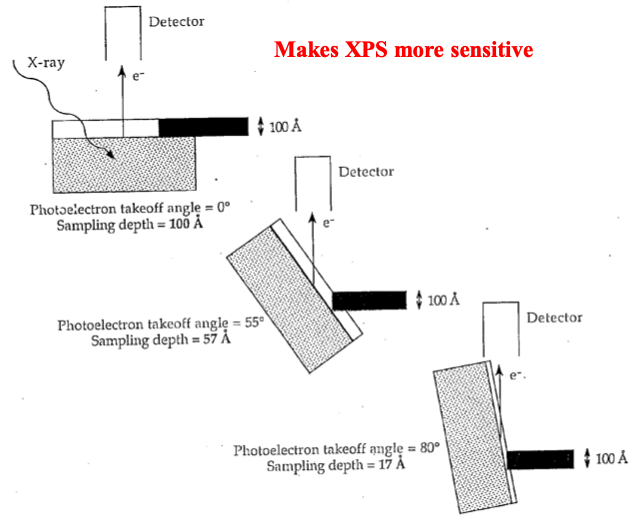{: style="width:50%;" class="center"}

From the table below, we can think back to out fundamental equation:
$$
E_K=h\nu-E_B^F-\phi_{sp}
$$
Within the table, by altering the x-ray source ($Mg\:K\alpha$ and $Al\:K\alpha$), we are changing $h\nu$ and we can see that the differences in composition between all of these (for the same angle) will be different, as each atom will have a different EMFP and thus a different probe depth.

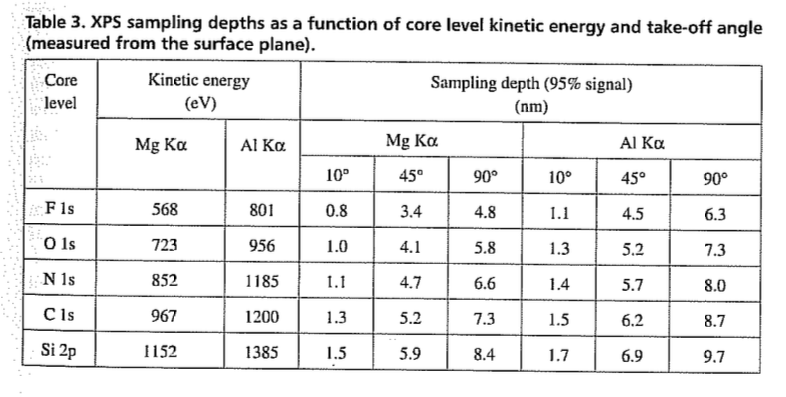{: style="width:40%;" class="center"}

This is demonstrated when looking at a cross section of the sample from Example 1. As the angle increases, we can see that the fluorine peak of the bulk disappears, showing us the cross section of the oil contaminant.

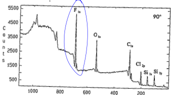{: style="width:40%;" class="center"}

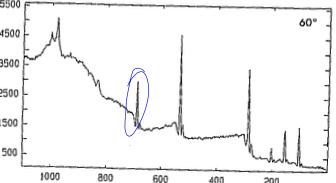{: style="width:40%;" class="center"}

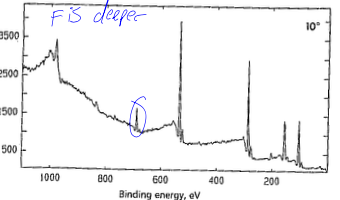{: style="width:40%;" class="center"}

## Oxidation of Polystyrene

It's a common practice to oxidise the surface of a material to make it more polar. We can see in the table below that before treatment there is only a single carbon peak present, though after, there's new oxygen peaks.

|         Before         |        After         |
| :--------------------: | :------------------: |
| 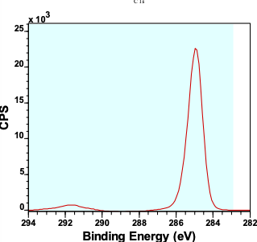 | 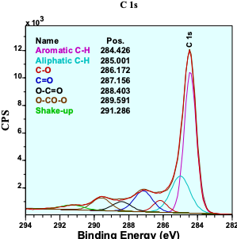 |

If we do an angle scan of the surface, we can see that the oxygen is primarily located on the surface of the sample

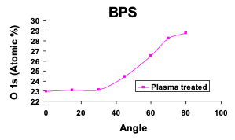{: style="width:40%;" class="center"}