# Time-of-Flight Secondary Ion Mass Spectrometry (ToF-SIMS)

While XPS is useful for telling us about the composition of a surface, ToF-SIMS can tell us about the structure of each of the molecules. Broadly speaking, SIMS works by firing primary ions ($\ce{Ar+, Cs+, Ga+, Xe+}$ or neutral, $\ce{Bi}$ cluster, $\ce{Ag}$ clusters) at the surface, which breaks bonds creating secondary ions that are extracted electromagnetically and are put through a ToF detector. The energy of the primary beam is $1-25\:keV$

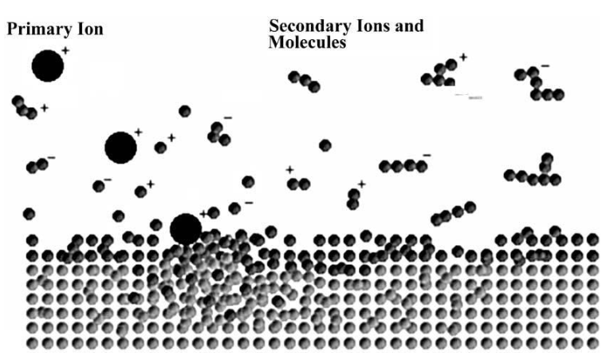{: style="width:50%;" class="center"}

While typical MS starts with gas phase molecules and ionises them, ToF-SIMS starts with a solid surface and pulls off ions.

## The Power of ToF-SIMS

The technique only has a shallow probe depth of $1-2\:nm$ and thus is only makes a mass spectrum of the surface of the material. It can be used in 2D mode and can result in much higher resolution than XPS (sub $100\:nm$ for conductors). Because it uses a ToF detector and because they don't have to be vaporised, very large fragments can be analysed, all the way up to $10,000\:Da$. They also can be either positive or negatively charged, depending on the charge of the accelerator. They can obtain a depth profile as well, just like XPS, using Dynamic SIMS

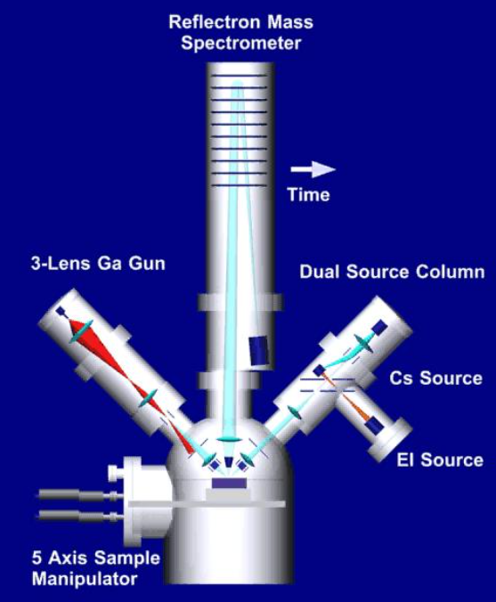{: style="width:50%;" class="center"}

## The Basic Static SIMS Equation

$$
I_m=I_pT_mS\alpha^+f
$$

Where:

* $I_m=$ detected ion current of element or species $m$
* $I_p=$ primary ion flux ($Atoms\cdot cm^{-2}$)
* $T_m=$ fractional concentration of $m$ in the surface layer
* $S=$ sputter yield (number of particles/number of impinging primary ions)
* $\alpha^+=$ ionisation probability of the emitted particle
* $f=$ spectrometer transmission function (number of detected particles/number of ejected particles)

## Monoatomic Primary Sources

| Type                                   | Spot size  (resolution) | Current density  ($Atoms\cdot cm^{-2}$) | Brightness  ($Atoms\cdot cm^{-2}\cdot Sr^{-2}$) | Energy  ($keV$) |
| -------------------------------------- | :--------------------------: | :------------------------------------------: | :--------------------------------------------------: | :------------------: |
| Electron ionisation of gasses (Ar, Xe) |       $50\:\mu m - nm$       |                  $<10^{-3}$                  |                      $10^{-2}$                       |        $5-10$        |
| Liquid metal ion gun (Ga, In, Bi)      |          $>30\:nm$           |                     $1$                      |                      $10^{-6}$                       |       $25-30$        |
| Surface ionisation (Cs)                |         $>1\:\mu m$          |                  $10^{-1}$                   |                        $500$                         |        $5-10$        |

## Static SIMS - Non Destructive

While the primary ion impact always results in the damage to the surface, the damage can be spread out to ensure that the surface is only ever hit by a single collision. Instead of getting a damage point, we get a damage cross section ($\sigma$). Ultimately, this means that less than 1% of the surface is actually removed.

Since the ion dose is so sparse ($<10^{13} ions\cdot cm^{-1}$) compared to the density of the monolayer ( $10^{15} atoms\cdot cm^{-1}$), under "static" conditions, the damage cross section ($\sigma$) is not allowed to overlap, and the technique is considered non destructive. This is known as the **static limit**.

## Life Time of a Single Molecular Layer (Static SIMS)

The equation we can use is:

$$
t_m=\frac{N_s}{Y\big(\frac{I_p}{e}\big)}
$$

Where:

* $t_m=$ lifetime ($s$)
* $N_s=$ number of atoms in $1\:cm^2$ of monolayer
* $I_p=$ primary ion flux ($Atoms\cdot cm^{-2}$)
* $e=$ fundamental charge ($1.5\e{-19}\:C\cdot particle^{-1}$)
* $Y=$ sputter yield ($\text{atoms removed}\cdot\text{ion}^{-1}$)

If we assume $1\:cm^s$ of sample has an atomic density of $N_s=10^{15}\:Atoms\cdot cm^{-2}$. We can asusme that one ion removes one atom ($Y=1$) and that the primary ion flux (the number of ions hitting the surface) is $I_p=1\:nAtom\cdot cm^2$, then the time is
$$
\begin{align}
t_m&=\frac{1\e{15}}{1\big(\frac{1\e{-9}}{1.5\e{-19}}\big)}\\
&=1.5\e{5}\:s\\
&=42\:h
\end{align}
$$

## Static vs Dynamic

Realistically, both methods are incredibly powerful, as static SIMS (low ion flux over short pulses) can be used specifically for surface analysis, and dynamic SIMS (higher ion flux over much longer timeframes) can be used for depth profiling of the surface layers.

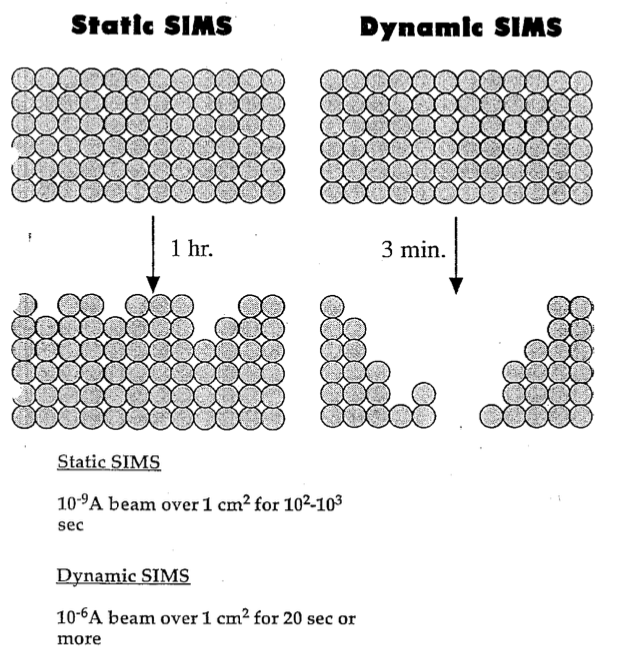{: style="width:50%;" class="center"}

## Time of Flight (ToF) Mass Spectrometry

Is an incredibly powerful technique that allows for sub-integer $m/z$ detection of atomic species. A good example of this is that ToF can distinguish between $\ce{^28Si}$ ($m=27.976\:Au$) and $\ce{N2}$ ($m=28.006\:Au$). This is beyond the resolution of many other detectors.

In the image below, the four chemical species all have a $m/z\approx43$, but the ToF detector can separate them all with a much higher granularity.

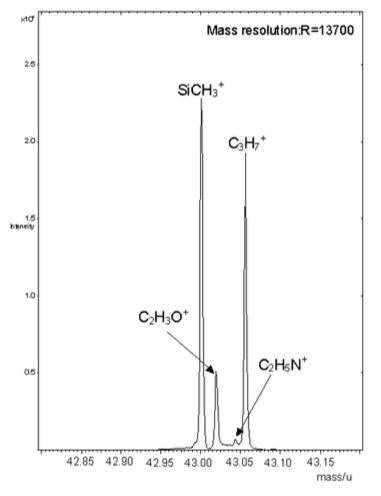{: style="width:40%;" class="center"}

### How ToF works

ToF ms is incredibly simple and works on the principle that under the same electric field, heavier species will take longer to accelerate than lighter species, leading to a difference in the time of flight.

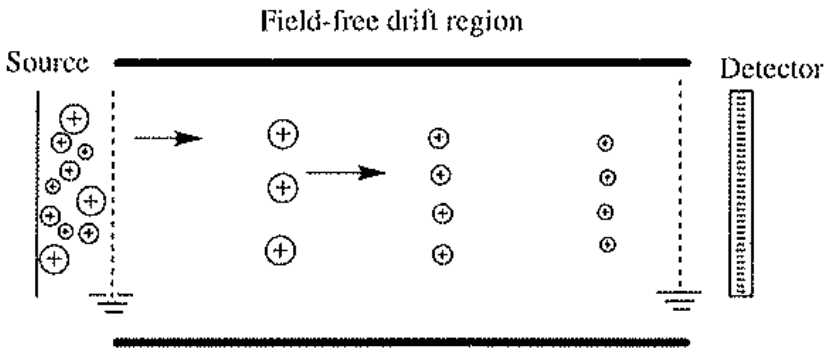{: style="width:50%;" class="center"}

This is governed by two fundamental equations:

$$
v=\sqrt{\frac{2qV}{m}}\hskip{2cm}t=\frac{L}{v}=L\sqrt{\frac{m}{2qV}}
$$
Where:

* $v=$ ion velocity
* $q=$ ion charge
* $m=$ ion mass
* $V=$ constant energy field
* $t=$ arrival time
* $L=$ length of flight tube (could be $1-2\:m$)

One big issue with this, however is that the initial kinetic energy of ions of the same mass will be different, as a result of the energy involved in the initial ionisation process. This leaves the ToF detector unable to distinguish between ions of similar mass

### Delayed Extraction

One solution is to let time take care of the kinetic energy and have a delayed extraction. This means that there is a period after the ionisation, in which the particles are let to diffuse some of their kinetic energy, before being accelerated, allowing slower ions to catch up.

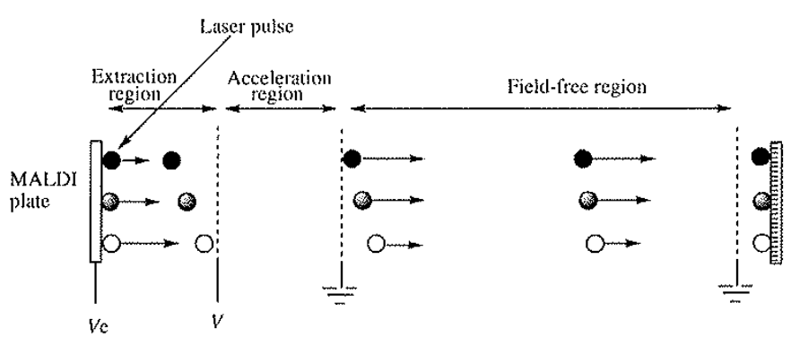{: style="width:50%;" class="center"}

This method is effective, but doesn't allow for the ultra high resolutions associated with ToF

### Reflectron ToF

In this method, the ions are reflected using another electric field that ultimately means that the faster the ions move, the longer their path will be around the reflector, giving the slower ions a chance to catch up.

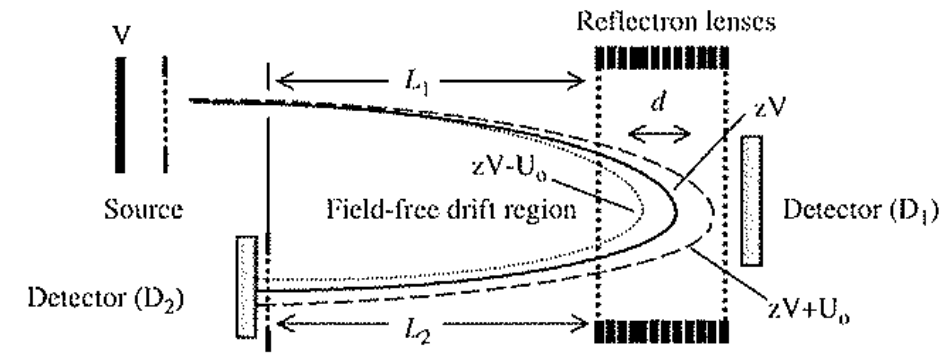{: style="width:50%;" class="center"}

## The Spectra

Since the ToF detector will have such a high resolution spectra, a large part of what it's useful is fingerprinting, as can be seen below.

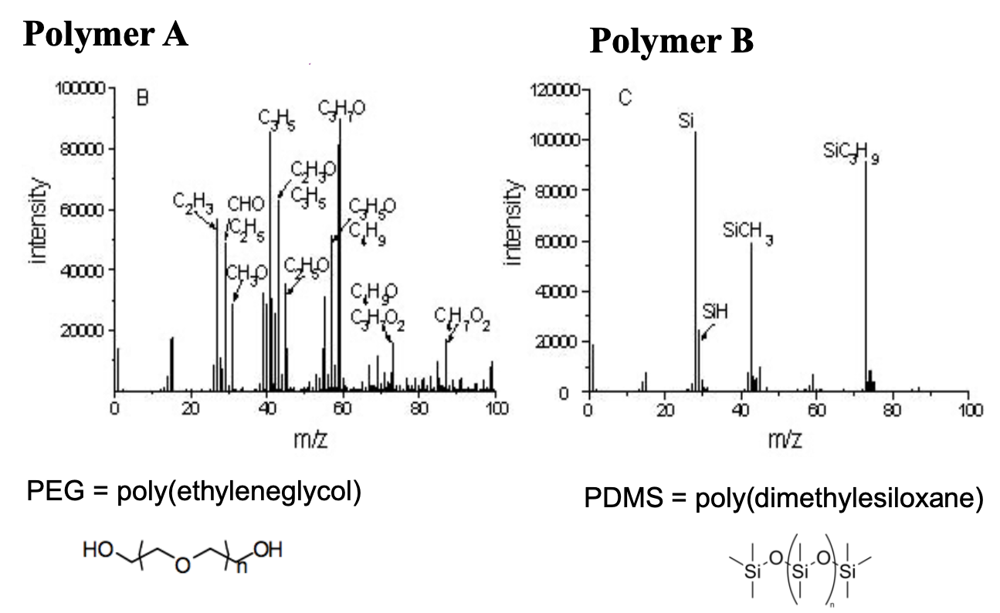{: style="width:70%;" class="center"}

As an example, this technique can be used for 2D analysis (just like XPS) to show things, like the distribution of additives on the surface on a polymer. In the example below, Tinuvin is a UV stabiliser.

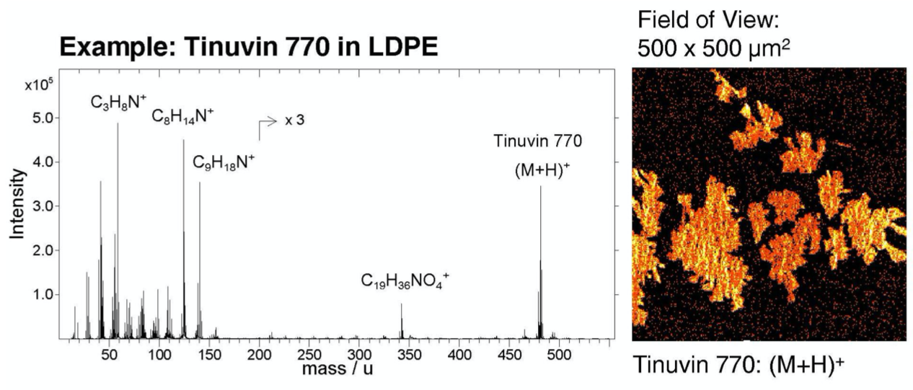{: style="width:60%;" class="center"}

## Polyatomic Clusters

Are often used, as they can give much higher ion yields than monoatomic clusters, as they will essentially shatter and create a spray of particles across the surface. Much like a shotgun, the energy of the parent is dissipated into all of its children, so polyatomic ions fragments have less energy than monoatomic ions. this also means that they will have a larger field of view than monoatomic clusters.

Common ion clusters include fullerenes ($\ce{C60+, C60^{2+}}$ ), gold clusters ($\ce{Au+, Au2+, Au3+}$), Bismuth clusters ($\ce{Bi+, Bi3+, Bi3++, Bi5+, Bi7+}$) and $\ce{SF5+}$, though the fluorine in $\ce{SF5+}$ is known to bind with organic fragments.

Below we can see a comparison of the same surface analysed using fullerenes as the ion source in comparison to monoatomic gallium.

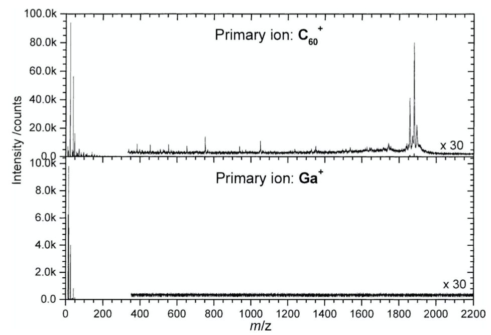{: style="width:60%;" class="center"}

**When dealing with organic surfaces, only cluster ions should be used**

## Sensitivity of SIMS

The difference in detection limits between elements comes from the difference in ionisation probability.

| Element      | Detection limit   ($atoms\cdot cm^{-2}$) | Element      | Detection limit   ($atoms\cdot cm^{-2}$) |
| ------------ | :-------------------------------------------: | ------------ | :-------------------------------------------: |
| $\ce{^7Li}$  |                   $1\e{-7}$                   | $\ce{^52Cr}$ |                   $1\e{-8}$                   |
| $\ce{^11B}$  |                   $5\e{-7}$                   | $\ce{^55Mn}$ |                   $1\e{-9}$                   |
| $\ce{Na}$    |                   $1\e{-7}$                   | $\ce{^56Fe}$ |                   $2\e{-8}$                   |
| $\ce{^24Mg}$ |                   $2\e{-7}$                   | $\ce{^58Ni}$ |                   $1\e{-9}$                   |
| $\ce{Al}$    |                   $2\e{-7}$                   | $\ce{Co}$    |                   $2\e{-8}$                   |
| $\ce{^39K}$  |                   $1\e{-7}$                   | $\ce{^63Cu}$ |                   $3\e{-8}$                   |
| $\ce{^50Ca}$ |                   $3\e{-7}$                   | $\ce{^69Ga}$ |                   $1\e{-9}$                   |
| $\ce{^48Ti}$ |                   $2\e{-8}$                   | $\ce{As}$    |                   $3\e{-9}$                   |
| $\ce{^51V}$  |                   $2\e{-8}$                   | $\ce{^98Mo}$ |                   $6\e{-9}$                   |

The sensitivity can be so great that insanely small concentrations of analyte can be detected. In the image below, the bottom right well had $18\:fmol$  of crystal violet, but in the top left, there was only $85\:amol$ of the dye and it was still detectable!

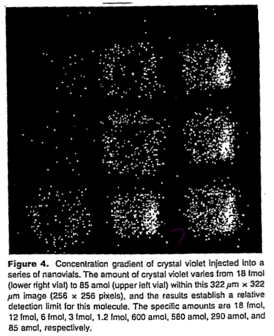{: style="width:40%;" class="center"}

## Enhancing Signals in SIMS

While ToF-SIMS is incredibly accurate in general, its efficiency decreases drastically for $m/z>200$. There are a few different ways to try and increase the sensitivity of the method, including:

### Cationisation

By adding highly detectable/ionisable ions to the compounds in question to make them more readily ionisable.

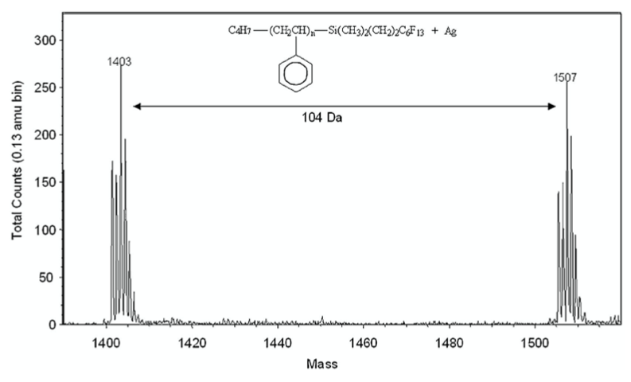{: style="width:60%;" class="center"}

This could also come from nanoparticles of the cationising agent.

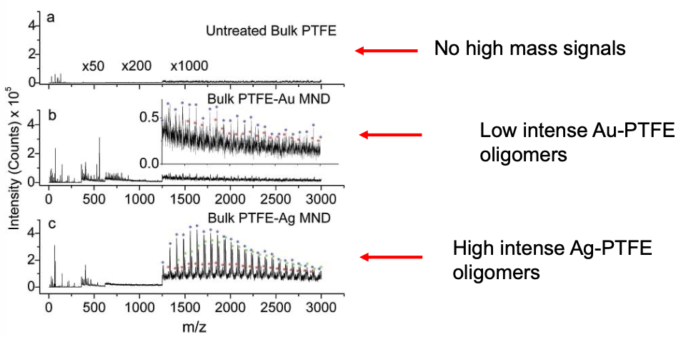{: style="width:60%;" class="center"}

### MALDI-SIMS

This technique uses [MALDI-TOF](../../../Sem%206.%20Surface%20and%20Colloids/Polymers%20and%20Proteins/06b/) to stabilise the compounds so that they can make it to the detector

### Secondary Neutral Mass Spectrometry

Since most of the fragments that are formed in the SIMS process will actually be neutral, it's possible to ionise them using a laser to make them detectable. These lasers are typically at wavelengths; 118nm, 157nm, 248nm, 266nm and 308nm.

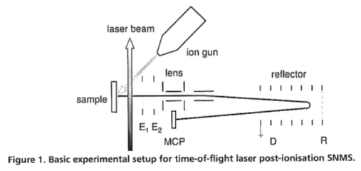{: style="width:60%;" class="center"}

This has the effect of not only increasing the amount of detectable ions, but by increasing the pulse width of the laser, it's possible to cause more fragmentation to occur. In the figure below, the top spectrum is from a 5ns pulse and the bottom spectrum is from a 250fs pulse. 

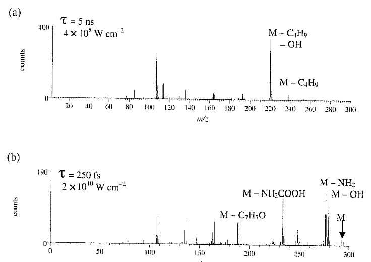{: style="width:60%;" class="center"}

## Imaging SIMS

When using a primary ion beam with a much lower number of ions per pulse, the surface can be rastered to produce a 2D spectra of the surface. The resolution of this is determined by the spot size of the ion, so typically gallium is used. For conductors, this results in an effective resolution of 50nm, though for insulators, it's typically 500nm-1μm. This is due to charge build up on insulators, just as with XPS.

To ensure that the imaging process is non-destructive, it's necessary to use significantly fewer ions per pulse (100 vs 2000), which can extend the static exposure time from 100 seconds to 30 minutes.

## Comparison of Au vs Bi Cluster Sources

In the image below, since the resolution doesn't need to be too high, an RGB (1:1:2) array is analysed using both gold and bismuth clusters on the blue and green channels. It's pretty clear to see that the bismuth is significantly more effective, even at much lower timeframes than the gold.

 {: style="width:70%;" class="center"}

## Polymer Blend Analysis

In this example, (left two) ToF-SIMS is used to analyse a blend of polymers to see how homogeneously they've mixed and (right) in a different set of polymers we can actually see that the polymers have formed rings of different phases.

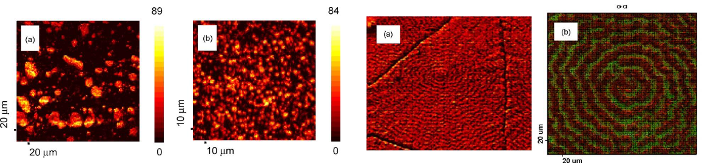{: style="width:70%;" class="center"}

This technique can be used at much higher (sub μm) resolutions to see how the polymers are interfacing on a more fine level.

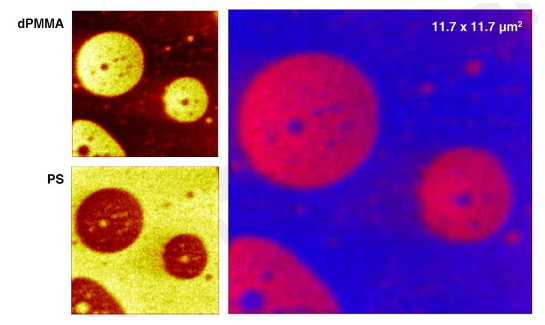{: style="width:60%;" class="center"}

## Phase Separation of Lipids

Using $\ce{Bi3+}$ clusters, this combination of organic lipids was imaged to identify how the amphipathic phospholipids integrated with the aliphatic cholesterol.

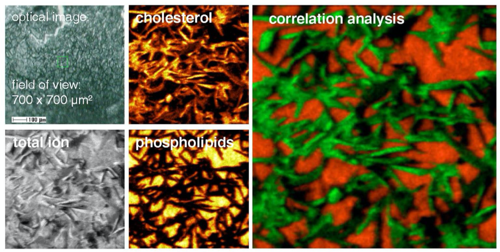{: style="width:60%;" class="center"}

## High Spacial Resolution Imaging

In this example, a conductor is imaged using $\ce{Bi3++}$ as the primary ion source and we can see an insanely high resolution.

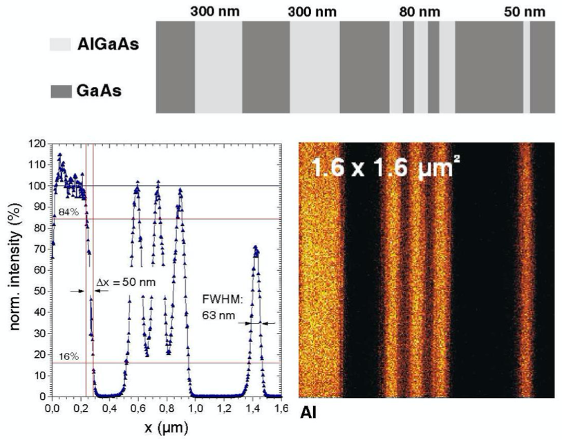{: style="width:60%;" class="center"}

## Commercially Available ToF-SIMS instruments

The kinds of instruments that you can buy will typically be able to image the outer 1-2 nm of surface, will have Bi, Cs, Au, fullerene, oxygen and Ar ion sources and will be able to do chemical mapping with a resolution of $<100\:nm$ with $\ce{Bi5++}$.