# Micronutrients and Calories

## Minerals and Trace Elements

Within the category of micronutrients we can classify things further into:

* Minerals - are elemental nutritional components that we require in quantities of $>100\:mg/day$
  * These are either structural elements or large components of biochemical processing 
  * e.g. Na, K, Ca, Mg, Cl, P, S
* Trace elements - elemental nutritional components that we require in quantities $<100\:mg/day$
  * These are typically required for hormonal and metabolic function and are quite often, involved in enzymatic processes
  * e.g. Fe, I, F, Zn, Se, Cu, Mn, Cr, Mo, Co, Ni

Their deficiency leads to very specific symptoms:

|   Trace Element     |    Deficiency Symptom                                                          |
| :----: | ------------------------------------------------------------ |
| Fe | Unusual tiredness, paleness, brittle nails                  |
| I  | Swollen neck, unexpected weight gain, weakness, hair loss, heavy or irregular periods |
| F  | Tooth decay                                                 |
| Zn | Wounds that won’t heal, open sores on the skin, lack of alertness |
| Se | Muscle weakness, mental fog, weakened immune system         |
| Cu | Weakness, difficulties walking, vision loss                 |
| Mn | Skeletal defects, slow or impaired growth, abnormal metabolism of carbohydrate and fat |
| Cr | Inhibition of protein synthesis, impaired insulin function, elevated cholesterol levels, anxiety and fatigue |
| Mo | Developmental delays, visual alterations and neurological changes |
| Co | Numbness, fatigue and tingling sensations in hand and feet  |
| Ni | Changes in skin colour, hair becomes coarser                |

## Detection and Quantification - Minerals and Trace Elements

There are two primary methods used for the determination/quantification of elemental micronutrients, these typically involve ICP-EOS, which is a type of [Atomic Excitation Spectroscopy (AES)](../../Sem%204.%20Spectroscopy/09.%20Flame%20Spectroscopy%20AA-AES/#flame-spectroscopy-aa-aes) and through the process of ashing.

### Dry Ashing

This is the process of heating the sample to high temperatures ($500-600^\circ C$) to drive off moisture and oxidise the elements for quantification. A benefit is that there is no need for the use of blanks, however more volatile elements such as Hg and Ni may be lost. There may also be chemical interaction between the oxides formed and the crucible that's used for the ashing.

### Wet Ashing

Rather than heat being using to oxidise the samples, they are chemically oxidised using acids, peroxides, etc. Since there is no volatilisation, there is no loss through this method, however it requires more attention and is harder to automate.

It is possible to accelerate both methods with the addition of microwave reactors.

## Vitamins

### Fat Soluble

| Name                | Structure       | Food Source                                               | Function                                                   | RDI (daily)                  |
| :-----------------: | :-------------: | --------------------------------------------------------- | ---------------------------------------------------------- | ---------------------------- |
| A class | 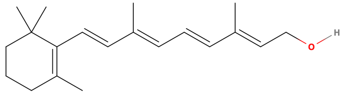    | Liver, butter, egg yolk, carrots, spinach, sweet potatoes | Vision, healing eye and skin injuries                      | $800-1500\:\mu g$            |
| D class | 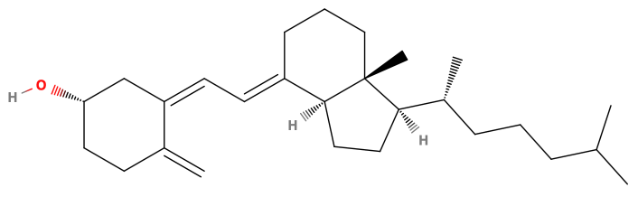    | Salmon, sardines, cod liver oil, cheese, milk, eggs       | Promotes calcium and phosphate absorption and mobilisation | $5-10\:\mu g$ (and sunlight) |
| E class | 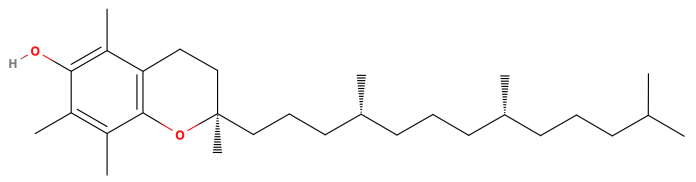     | Vegetable oils, nuts, potato chips, spinach | Antioxidant | $8-10\:mg$ |
| K class     | 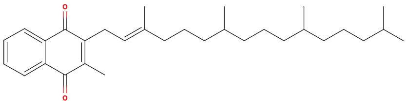     | Spinach, potatoes, cauliflower, beef liver | Blood clotting | $65-80\:\mu g$ |

### Water Soluble

| Name                | Structure       | Food Source                                               | Function                                                   | RDI (daily)                  |
| :-----------------: | :-------------: | --------------------------------------------------------- | ---------------------------------------------------------- | ---------------------------- |
| B1 Thiamine | 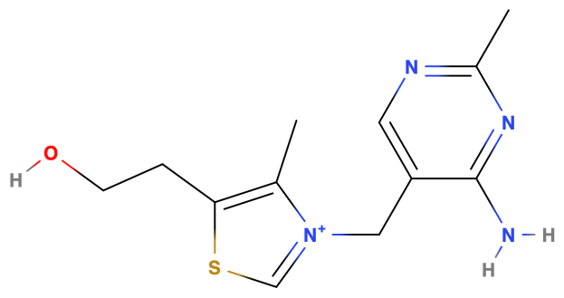   | Beans, soybeans, cereals, ham, liver | Coenzyme (oxidative decarboxylation) | $1.1\:mg$ |
| B2 Riboflavin | 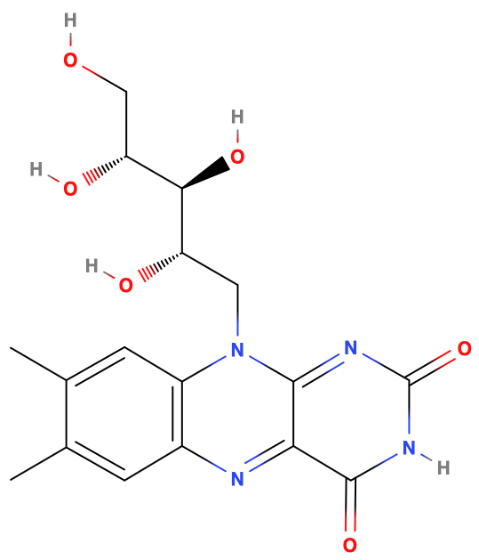   | Kidney, liver, yeast, almonds, mushrooms, beans | Coenzyme of oxidative processes | $1.4\:mg$ |
| B3 Niacin   | 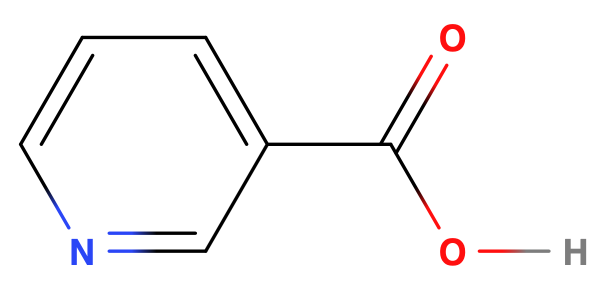   | Chickpeas, lentils, prunes, peaches, avocados, figs, fish, meat, mushrooms, peanuts, bread, rice, beans, berries | Coenzyme of oxidative processes | $15-18\:mg$ |
| B5 Pantothenic acid | 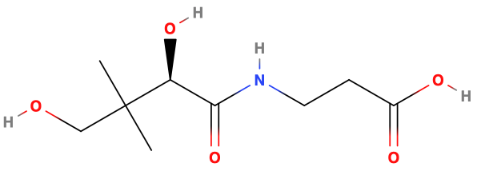   | Peanuts, buckwheat, soybeans, broccoli, lima beans, liver, kidney, brain, heart | Part of CoA; fat and carbohydrate metabolism                 | $4-7\:mg$       |
| B6 Pyridoxal | 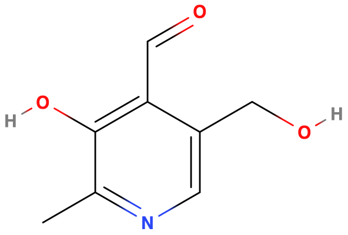   | Meat, fish, nuts, oats, wheat germ, potato chips | Coenzyme in transamination; heme synthesis | $1.6-2.2\:mg$ |
| B9 Folic Acid | 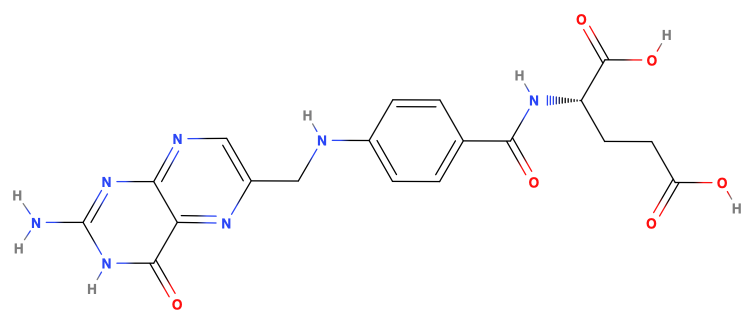   | Liver, kidney, eggs, spinach, beets, orange juice, avocados, rockmellon | Coenzyme in methylation and DNA synthesis | $400\:\mu g$ |
| B12 cobalamin | 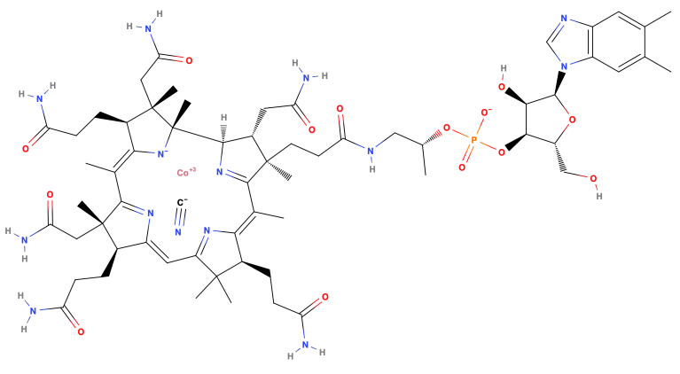 | Oysters, salmon, liver, kidney | Part of methyl removing enzyme in folate metabolism | $1-3\:\mu g$ |
| H Biotin    |      | Yeast, liver, kidney, nuts, egg yolk | Synthesis of fatty acids | $30-100\:\mu g$ |
| C Ascorbic acid | 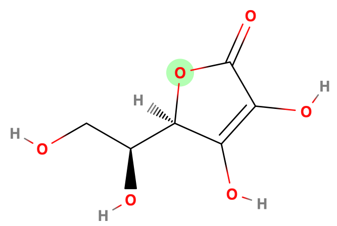     | Citrus fruit, berries, broccoli, cabbage, capsicum, tomato | Hydroxylation of collagen; wound healing; bond formation; antioxidant | $60\:mg$ |

## Detection and Quantification - Vitamins

Due to the variety and size of vitamins, the simplest and most effective way to identify them is to use HPLC.

Reverse Phase HPLC can be used for fat soluble vitamins and regular phase of water soluble ones. A strong solvent gradient can be used to separate out a combination of both, such as from a multivitamin

## Calorific Value

Can be measured using a calorimeter, though the amount of energy released form burning will not be indicative of how much is available through digestion, so tables tend to be used instead, though these are rough values and the specific calorific content will be dependent on the food product.

| Macronutrient | $kcal/g$ | $kj/g$ |
| ------------- | -------- | ------ |
| Protein       | 4        | 16.7   |
| Carbohydrate  | 4        | 16.7   |
| Fat           | 9        | 37.7   |
| Dietary Fibre | 4        | 16.7   |
| Alcohol       | 7        | 29.3   |

### Metabolisable Energy (ME)

Is the amount of "food energy available for heat production and body gains". These are based on the **Atwater Factors**, though they may not be truly indicative of all foods. This metric aims to consider only the nutritional value that can be actively utilise by the body to produce ATP.

#### The Atwater General Factor System

Is based on the heats of combustion of the macronutrients and corrects for losses i digestion, absorption and urinary excretion of urea.

#### The Extensive General Factor System

Is based on the Atwater system, however it makes a few modifications and refinements, such as accounting for dietary fibre separately from bulk carbohydrates

#### The Atwater Specific Factor System

Takes the system one step further by considering the food that these bulk nutrients come from

| Food Product        | Protein Factor ($kcal/g$) | Fat Factor ($kcal/g$) | Carbohydrate Factor ($kcal/g$) |
| ------------------- | :-----------------------: | :-------------------: | :----------------------------: |
| Meat, fish, poultry |           4.27            |         9.02          |                                |
| Eggs                |           4.36            |         9.02          |                                |
| Dairy products      |           4.27            |         8.79          |              3.87              |
| Animal fats         |                           |         8.93          |                                |
| Cereals             |           3.91            |         8.37          |              4.12              |
| Legumes and nuts    |           3.47            |         8.37          |              4.07              |
| Vegetables          |           2.62            |         8.37          |              3.90              |
| Fruits              |           3.36            |         8.37          |              3.60              |
| Sugars              |                           |                       |              3.87              |
| Vegetable Fats      |                           |         8.84          |                                |

