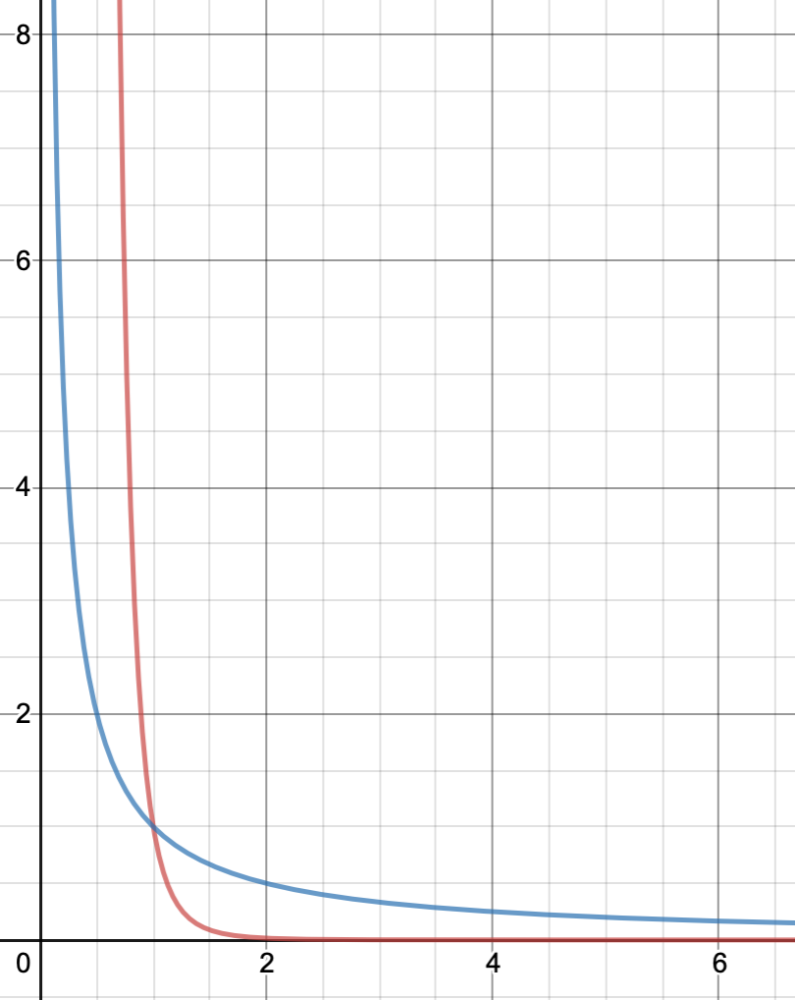
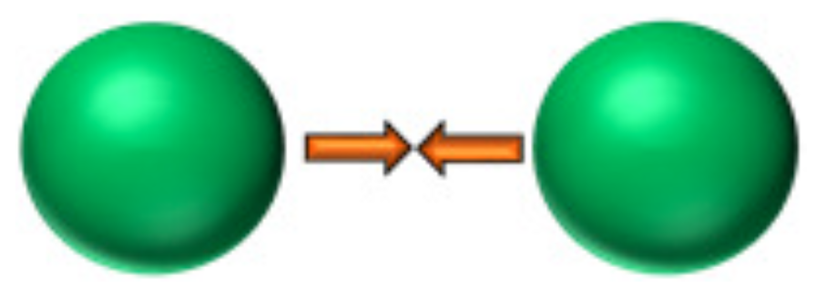
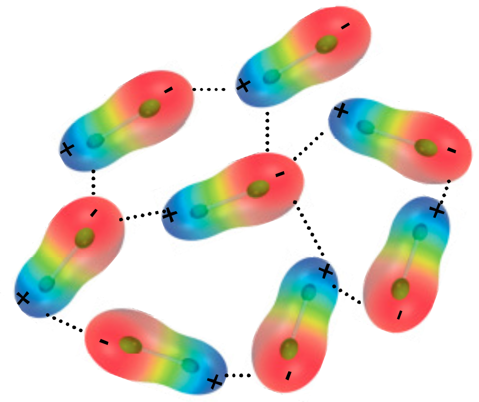
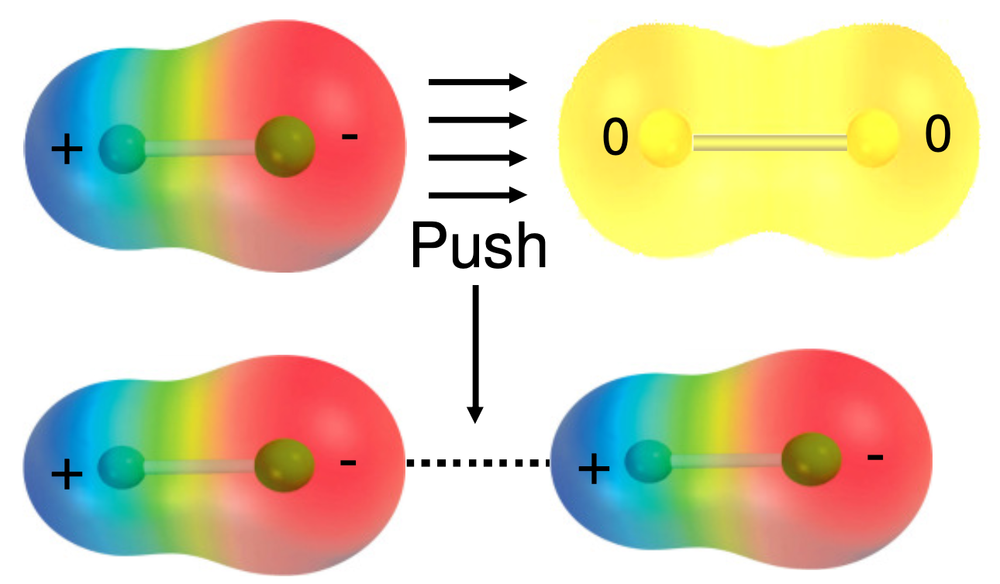
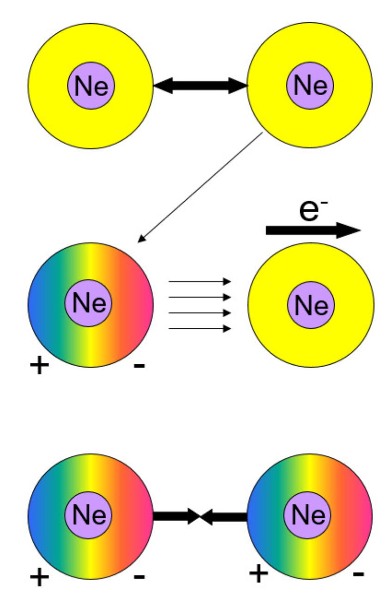
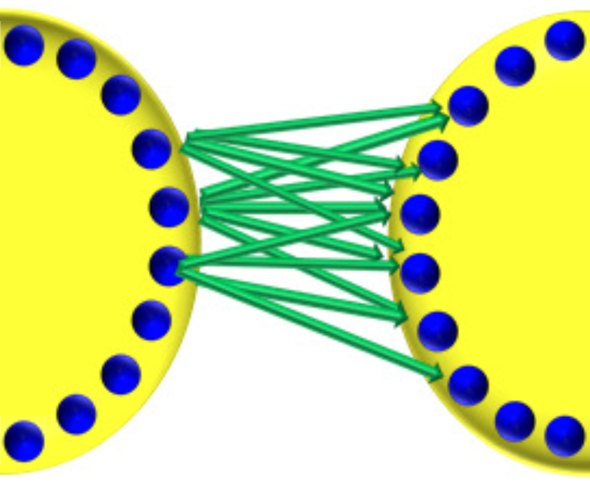
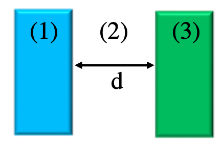
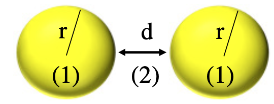
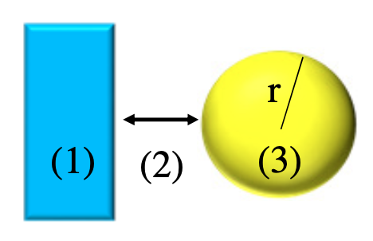

# Attractive Forces Between Colloids

For all forces, a negative quantity is an attractive force and a positive quantity is a repulsive force.

### Falloff

Note that a lot of the following forces fall off at a rate $V\propto\frac{1}{d^6}$ 

{: style="width: 20%; "class="center"}

Red: $y=\frac{1}{x^6}$ , blue: $y=\frac{1}{x}$
 

??? note "Think back to MD equations and the Leonard-Jones Potential"
	This particular falloff will show up in a lot of forces.

	$$
	U(r_{AB})=4\varepsilon_{AB}\bigg[\bigg(\frac{\sigma_{AB}}{r_{AB}}\bigg)^{12}-\bigg(\frac{\sigma_{AB}}{r_{AB}}\bigg)^6\bigg]
	$$

## Coulomb Force  (Electrostatic)

{: style="width: 10%; "class="center"}

The electrostatic force between two point charges ($q_1$ and $q_2$), separated by distance $d$. The first equation gives the force, the second gives the potential energy

$$
F_c=\frac{q_1q_2}{4\pi D\varepsilon_0d^2} \hskip{1cm}\text{or}\hskip{1cm}V_c=\frac{q_1q_2}{4\pi D\varepsilon_0d}
$$

## Keesom Force - Dipole-dipole (Electrostatic){: style="width: 20%; "class="right"}

Occurs when the molecules have permanent dipoles, and the molecules can freely rotate to align themselves in an energetically favourable way.

$$
V=-\frac{C_{Keesom}}{d^6}=-\frac{\mu_1^2\mu_2^2}{3(4\pi\varepsilon_0)^2k_BTd^6}
$$

## Debye Force - dipole-induced dipole (Induction){: style="width: 20%; "class="right"}

These interactions are randomly oriented

$$
V=-\frac{C_{Debye}}{d^6}=-\frac{\mu^2\alpha}{(4\pi\varepsilon_0)^2d^6}
$$

### Polarisability{: style="width: 15%; "class="right"}

The strength of the induced dipole depends on how polarisable the electrons, that is, how readily the shape of the electron cloud is distorted, or how strongly bound the electrons are to a particular location on the molecule.

The polarisability of a molecule is dependent on:

* Number of electrons
* Distance of electrons from the nucleus (how strongly bound they are)
* Molecular orientation (geometry can influence polarisability) with respect to the electric field (the permanent dipole)

## London (Dispersion) Force induced dipole-induced dipole

Interactions between non polar molecules, occurs when the electron clouds get close enough to distort each other and cause temporary, small dipoles to pop in and out of existence. This is also a polarisability driven force.

$$
V=-\frac{C_{dispersion}}{d^6}=-\frac{3}{4}\frac{h\nu\alpha^2}{(4\pi\varepsilon_0)^2d^6}
$$

## van der Waals (vdW) Forces

The total vdW force is the sum of the Keesom, Debye and London forces. They drop of at a rate of $V\propto\frac{1}{d^6}$ which is rather close range.

### vdW Forces Between Surfaces{: style="width: 20%; "class="right"}

Since this unit is surface and colloids though, we don't care just about the interaction between individual molecules, we want to know about how these forces aggregate as surfaces interact.

One approach was made by Hamaker who said that the total interaction across the surface is going to be the sum of all the individual molecular interactions.

## Hamaker

Hamaker's approach will vary based on the geometry of the interacting surfaces such as two planes:

$$
V_{plane/plane}=-\frac{A_h}{12\pi d^2}
$$

$A_H=$ Hamaker constant for these two specific surfaces and is defined as $A_H=\pi^2C_{AB}\rho_A\rho_B$

* $C_{AB}=$ Attractive energy constant
* $\rho_A/\rho_B=$ Number density of interacting atoms

## Lifshitz Theory

While Hamaker accounts for only pairwise interactions between molecules on different surfaces, Lifshitz accounted for the influence of neighbouring molecules as well. It is however much more complex:

$$
A_H\approx\frac{3}{4}k_bT\cdot\bigg(\frac{\varepsilon_1-\varepsilon_3}{\varepsilon_1+\varepsilon_3}\bigg)\cdot\bigg(\frac{\varepsilon_2-\varepsilon_3}{\varepsilon_2+\varepsilon_3}\bigg)+\frac{3h\nu_e}{8\sqrt{2}}\cdot\frac{\big(n_1^2-n_3^2\big)\cdot\big(n_2^2-n_3^2\big)}{\sqrt{\big(n_1^2+n_3^2\big)}\cdot\sqrt{\big(n_2^2+n_3^2\big)}\cdot\bigg(\sqrt{\big(n_1^2+n_3^2\big)}+\sqrt{\big(n_2^2+n_3^2\big)}\bigg)}
$$

Hamaker constants are described as surface A, continuum, surface B

E.g.

| System                         | Hamaker constant, A ($10^{-20}\:J$) |
| ------------------------------ | :---------------------------------: |
| water/vacuum/water             | 3.7                                 |
| dodecane/vacuum/dodecane       | 5.0                                 |
| pentane/vacuum/pentane         | 3.8                                 |
| polystyrene/vacuum/polystyrene | 7.9                                 |
| quartz/vacuum/quartz           | 8.8                                 |
| silver/vacuum/silver           | 40                                  |
| ethanol/vacuum/ethanol         | 4.2                                 |
| water/air/water                | 3.7                                 |
| dodecane/water/dodecane        | 0.5                                 |
| quartz/water/quartz            | 1.7                                 |
| polystyrene/water/polystyrene  | 1.3                                 |
| silver/water/silver            | 30                                  |

## vdW Energy

#### The form of the equation is dependent on the geometries interacting

| {: style="width: 100%; "class="center"}  | {: style="width: 100%; "class="center"}  | {: style="width: 100%; "class="center"}  |
| ------------------------------------------------------------ | ------------------------------------------------------------ | ------------------------------------------------------------ |
| 
$V_{123}^{flat}=\frac{-A_{123}}{12\pi d^2}$
 | 
$V_{123}^{flat}=\frac{-A_{123}r}{12d}$
 | 
$V_{123}^{flat}=\frac{-A_{123}r}{6d}$
 |

!!! info "Example 1 - Calculate the attractive energy between 2 spheres with a radius of $0.750\:\mu m$ and a Hamaker constant of $4.0\times10^{-20}$, separated by $100\:nm$."
	
	Express your answer in units of $J$ and of $kT$ ($1\:kT = 4.115\times10^{-21}\:J \text{ at } 25^\circ C$)

$$
\begin{align}
	V_{121}^{sphere}&=\frac{-A_{121}r}{12d}\\V_{121}^{sphere}&=\frac{(4.0\times10^{-20})(750\:nm)}{12(100\:nm)}\\
	V_{121}^{sphere}&=-2.5\times10^{-20}\:J\\
	-6.07kT&=\frac{-2.5\times10^{-20}\:J}{4.115\times10^{-21}\:J}\\
	\end{align}
$$

## Does it Work? - Calculating Surface Tension

The vdW can be used for calculating surface tension for systems where only vdW forces are involved

$$
V_{123}^{flat}=\frac{-A_{123}}{12\pi d^2}=2\gamma_{lv}
$$

!!! info "Example 2 - "Calculate the surface tension of dodecane, assuming that the molecules approach to $0.16\:nm$. The Hamaker constant for dodecane/air/dodecane is $5.0\times10^{-20}\:J$."
	
	$$
	\begin{align}
	2\gamma_{lv}&=\frac{-A_{121}}{12\pi d^2}\\
	2\gamma_{lv}&=\frac{-5.0\times10^{-20}\:J}{12\pi (0.16\times10^{-9}\:m)^2}\\
	\gamma_{lv}&=\frac{0.0518\:J\cdot m^{-2}}{2}\\
	\gamma_{lv}&=0.0259\:J\cdot m^{-2}\\
	\end{align}
	$$
	
	The theoretical value is $0.0259\:J\cdot m^{-2}$
	
	$0.0259\:J\cdot m^{-2}\approx 0.0259\:J\cdot m^{-2}$
	
	#### If we repeat this with water ($A_{121}=3.7\times10^{-20}\:J, r=0.15\:nm$), we get:
	
	$$
	\begin{align}
	2\gamma_{lv}&=\frac{-3.7\times10^{-20}\:J}{12\pi (0.15\times10^{-9}\:m)^2}\\
	\gamma_{lv}&=\frac{0.0436\:J\cdot m^{-2}}{2}\\
	\gamma_{lv}&=0.0218\:J\cdot m^{-2}\\
	\end{align}
	$$
	
	With a theoretical value of $0.0720\:J\cdot m^{-2}$
	
	$0.0218\:J\cdot m^{-2}\not\approx 0.0720\:J\cdot m^{-2}$

## Hydrogen Bonding

The missing link with water is hydrogen bonding, which can be described as $\ce{O-H, F-H}$ or $\ce{N-H}$ bonds with partial charges (dipoles) that bond in a Keesom like manner. 

In water, the $\delta+$ H atom is strongly attracted to the lone pair electrons on the adjacent $\delta-$ O atoms. Water molecules can bond with up to four other water molecules and each H-Bond  is $\sim10\%$ the strength of a covalent bond. This ultimately is much stronger than the effect of dispersion forces.