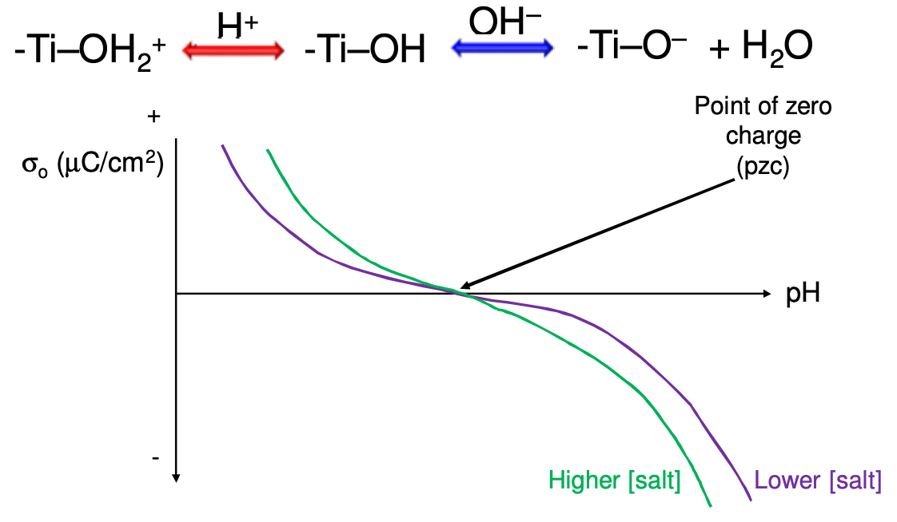
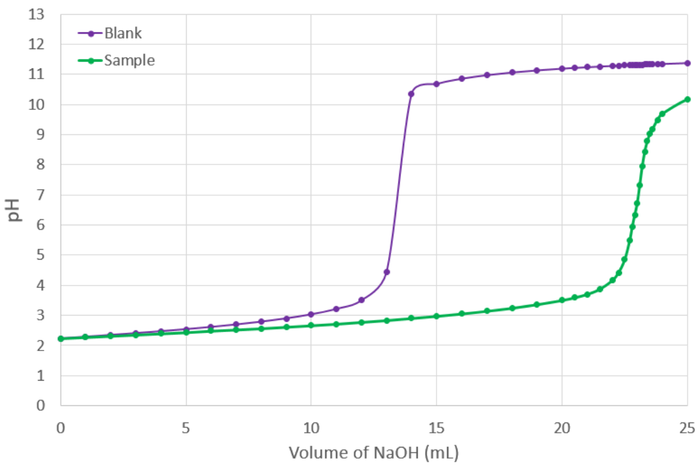

# Surface Charge ($\sigma_o$)

Surface charge is created in multiple ways:

* Isomorphous substitution
  * Changing the structure of the surface to increase charge
* Surface ionisation
  * Net chargeBased on the pH and ionisation of the surface functional groups
  * $\ce{-M-OH2+ <->[H+] -M-OH <->[OH-] -M-O- + H2O}$
* Ion adsorption
  * Adsorption of ions of the opposite charge to the particle surface
  * This can cause complete charge reversal
* Ion dissolution

Electro neutrality occurs because dissolved electrolytes approach the surface of the colloid. This shielding prevents the colloid from have a large electronic influence over a long distance, though close to the surface, the charges can be quite intense.

## Potential Determining Ions (PDI)

The ion s responsible for varying the charge on the surface of a colloid are called the PDI

!!! info "Example 1"
	
	$$
	\ce{XCOOH <-> XCOO- + H^+}
	$$
The PDI here is $\ce{H+}$ and $\ce{OH-}$ as changing the concentration of either of these will cause the surface of the particle to change charge.

!!! info "Example 2"
	
	{: style="width: 50%; "class="center"}
	
	The surface charge is typically measured by titration of the PDI (pH in this example)

This can be accomplished by comparing the concentration of the PDI with the colloid and without the colloid, using titrimetry.

If we add a known amount of PDI to solution and we can only detect a smaller amount, then we know by difference how much has adsorbed to the surface of the colloids in the solution.

!!! warn "To note"
	Each adsorbed charge contributes $1.6022\times10^{-19}\:C$ of charge.

{: style="width: 50%; "class="center"}

## The Maths

Because of all this, we know that; surface charge = positive charges adsorbed - negative charges adsorbed
$$
\sigma_o=F(\Gamma_{\ce{pdi+}}-\Gamma_{\ce{pdi-}})\:C\cdot m^{-2}
$$
* $F=$ Faraday's constant ($96,585\:C\cdot mol^{-1}$)

* $\Gamma=$ surface concentration, measured in $mol\cdot m^{-2}$

For a metal oxide, titrated with $\ce{H+}$ and $\ce{OH-}$
$$
\Gamma_{\ce{H+}} = \frac{n_{\ce{H+}}-n_{blank}}{\text{Surface Area}}, \Gamma_{\ce{OH-}} = \frac{n_{\ce{OH-}}-n_{blank}}{\text{Surface Area}}\:mol\cdot m^{-2}
$$
!!! info "Example 3"
	
	A $17.5\:g$ sample of $\ce{TiO2}$ (specific surface area $=50\:m^2 /g$) is suspended in $150\:mL$ of $0.01\:M\:\ce{KNO3}$ and the pH adjusted to $6.65$. The sample is titrated with $12.54\:mL$ of $0.100\:M\:\ce{KOH}$ and the pH increases to $9.45$.
	
	A blank (in the absence of $\ce{TiO2}$) requires $0.28\:mL$ of the same $\ce{KOH}$. Calculate the change in surface charge, in $\mu C\cdot cm^{-2}$

$$
\begin{align}\Gamma_{\ce{H+}}&=0\:mol\\
	\Gamma_{\ce{OH-}}&= \frac{n_{\ce{OH-}}-n_{blank}}{\text{Surface Area}}\:mol\cdot m^{-2}\\&=\frac{0.100\times\frac{(12.54-0.28)}{1000}}{17.5\times50}\\
	&=1.40\times10^{-6}\:mol\cdot m^{-2}\\\sigma_o&=96485(0-1.4\times10^{-6}\:mol\cdot m^{-2})\\
	&=-0.135\:C\cdot m^{-2}\\
	&=-13.5\:\mu C\cdot cm^{-2}
	\end{align}
$$

!!! info "Example 4"
	
	Calculate the volume of $0.150\:M\:\ce{NaOH}$ required to raise the pH of $350\:mL$ of distilled water from a pH of:
	
	a) 3.00 to 7.00
	
	b) 3.00 to 10.00
	
	$$
	\begin{align}n(\ce{OH-})_{3-7\text{ in 1}L}&=10^{-3}-10^{-7}\:mol\\
	&=9.999\times10^{-4}\:mol\\
	n(\ce{OH-})_{3-7\text{ in }350\:mL}&=0.350\times9.999\times10^{-4}\\
	&=3.49965\times10^{-4}\:mol\\
	V&=\frac{n}{c}\\
	&=\frac{3.49965\times10^{-4}\:mol}{0.15}\\
	&=2.3331\times10^{-3}\:L\\
	&=2.33\:mL\\ &\\
	n(\ce{OH-})_{3-10\text{ in 1}L}&=(10^{-3}-10^{-7})+(10^{-(14-10)}-10^{-7})\:mol\\&=1.0998\times10^{-3}\:mol\\
	n(\ce{OH-})_{3-7\text{ in }350\:mL}&=0.350\times1.0998\times10^{-3}\\&=3.8493\times10^{-4}\:mol\\
	V&=\frac{n}{c}\\
	&=\frac{3.8493\times10^{-4}\:mol}{0.15}\\
	&=2.5662\times10^{-3}\:L\\
	&=2.57\:mL\\ &\\
	\end{align}$$