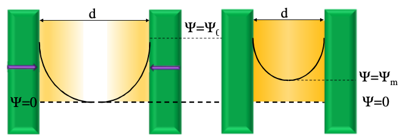
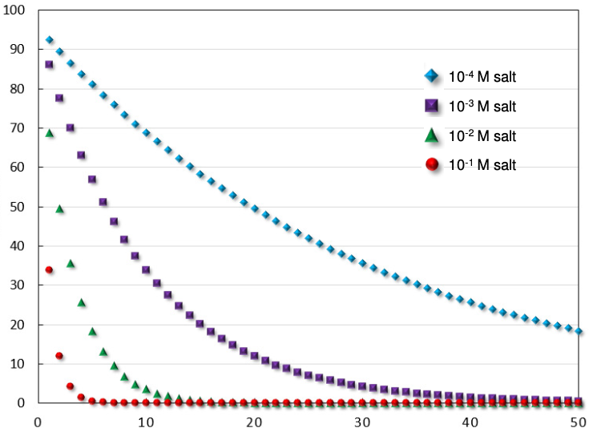

#          Repulsion Between Colloids

So we've figured out that there are ion double layers and that the ion density can be described by the [Poisson-Boltzmann equation](../02b/#poisson-boltzmann-equation), but we need to consider what happens when two colloidal particles get close enough to interact.

As the ion clouds approach, their concentration combines, causing an even larger concentration to form and a resulting concentration gradient to occur in the space between the particles, leading to an osmotic repulsive force that draws in lower concentration solvent.

Given that the concentration of ions will be dependent on the potential at that point, we need to figure out how to calculate the potential that exists between two colloidal particles

## Summing the potential

if we can calculate the potential at any distance $d$ by using $\Psi_d=\Psi_0\exp(-\kappa d)$, then we can calculate the potential at the midpoint as such, using the superposition principle, that the two potentials will just sum together:

$$
\Psi_m=2\Psi_0\exp(-\kappa \frac{d}{2})
$$

{: style="width: 50%; "class="center"}

## Osmotic repulsion

The osmotic pressure ($\Pi$) is given by the following equation, where $\rho=$ the solute concentration:

$$
\Pi=\rho kT
$$

The repulsive pressure is thus given by the difference between the osmotic pressure at the midpoint and in the bulk solution:

$$
\Pi_R=kT\sum_i(\rho_i^{mid}-\rho_i^{bulk})
$$

Since we know how the potential varies with the separation distance of the two colloids, we can use a Boltzmann distribution to calculate the concentration of each ion at the mid plane. When we assume low potentials, we get:

$$
\Pi_R=2\varepsilon_0D\kappa^2\Psi^2_0\exp(-\kappa d)
$$

Where the double-layer repulsive energy decays exponentially with the distance, based on the concentration of electrolytes and the surface potential

We can integrate this equation and add in a geometric factor to account for the geometry between two spheres and get the potential energy, rather than the force to get the equation:

$$
V^s\approxeq2\pi r\varepsilon_0D\Psi^2_0\exp(-\kappa d)
$$

### Alternative

An alternative repulsive force was suggested by Reerink and Overbeek that introduced a term $\gamma$:

$$
V_R=\frac{32\pi r\varepsilon_0Dk^2T^2\gamma^2}{e^2z^2}\exp(-\kappa d)
$$

Where:

$$
\gamma=\frac{\exp(ze\Psi_0/2kT)-1}{\exp(ze\Psi_0/2kT)+1}
$$

Overall, the osmotic repulsion looks like this:

{: style="width: 50%; "class="center"}

## Surface charge

Using the same theory, we can calculate the theoretical surface charge $\sigma_0$. Since the total double layer much be electroneutral, the surface charge must be equal and opposite to the net charge of the diffuse layer $\sigma_d$:

$$
\int_0^\infin\rho(x)dx=-\sigma_0
$$

Applying a Boltzmann distribution to find the ion population the equation becomes:

$$
\sigma_0=(8\varepsilon_0DkT\rho_{bulk})^{1/2}\sinh\bigg(\frac{q\Psi_0}{2kT}\bigg)
$$

Which at low potentials is reduced to:

$$
\sigma_0=\frac{D\varepsilon_0\Psi_0}{\kappa^{-1}}
$$

